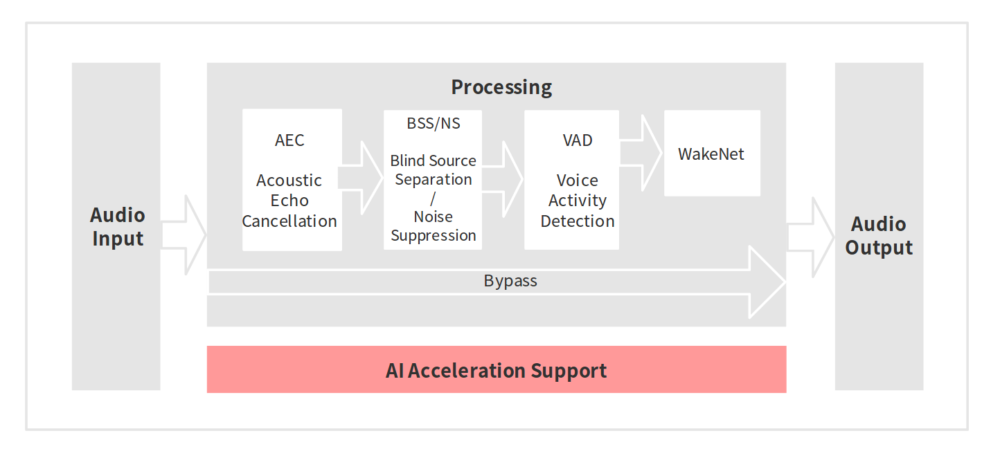
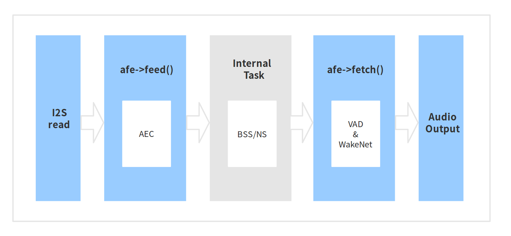

# Audio Front-end Framework[[English]](./README.md)

Espressif Audio Front-end(AFE) algorithmframe由Espressif AI Independently developed by the laboratory。The framework is based on ESP32 Series chips，Able to provide high-quality and stable audio data to the host。

---

## # Overview

The Espressif AFE framework performs voice front-end processing based on Espressif's ESP32 series chips in the most convenient way. Using the Espressif AFE framework, you can obtain high-quality and stable audio data, making it easier to build applications such as wake-up or speech recognition.

The functional support of Espressif Systems AFE is as follows:



The workflow of Espressif AFE is as follows:



Espressif AFE The workflow can be divided into 4 piece：

- AFE 的createand初始化
- AFE feed, input audio data, and the feed will be processed by the AEC algorithm first.
- internal：AFE BSS/NS Algorithmic processing
- AFE fetch，Returns the processed audio data and return value， fetch Will be done internally VAD deal with，If the user sets WakeNet for enable state，Wake word detection will also be performed

in `afe->feed()` and `afe->fetch()` Visible to users，`Internal BSS/NS Task` Invisible to user。

> AEC exist afe->feed() Run in function；  
> BSS/NS is processed by independent tasks within AFE;  
> The results of VAD and WakeNet are obtained through the afe->fetch() function.

### choose AFE handle

at present AFE 支持Single wheatandDouble wheat两种应用场景，Single mic sceneinternal Task for NS deal with，Inside the double microphone scene Task for BSS deal with。

- Single wheat

		esp_afe_sr_iface_t *afe_handle = &esp_afe_sr_1mic;

- Double wheat

		esp_afe_sr_iface_t *afe_handle = &esp_afe_sr_2mic;

### input audio

- AFE Single mic scene

	- input audio格式for 16KHz, 16bit, dual channel（1channels are mic data，The other channel is the reference loop）
	- The data frame length is 32ms, 用户可以use `afe->get_feed_chunksize` 来Get需要的采样点数目（The sampling point data type is int16）
 
 The data is arranged as follows:
 
   

- AFE double microphone scene

	- input audio格式for 16KHz, 16bit, Three channels
	- The data frame length is 32ms, 用户可以use `afe->get_feed_chunksize` To get the amount of data that needs to be filled

 The data is arranged as follows:
 
    

Notice：Converted into data size:：`afe->get_feed_chunksize * Number of channels * sizeof(short)` 

## ## AEC Introduction

The AEC (Acoustic Echo Cancellation) algorithm supports up to two-mic processing, which can effectively remove the self-playing sound from the mic input signal. This allows you to perform applications such as voice recognition while playing music yourself.

### NS Introduction

NS (Noise Suppression) Algorithm supports single channel processing，Ability to suppress non-vocal noise in single-channel audio，Especially for steady-state noise，Has a very good inhibitory effect。

### BSS Introduction

The BSS (Blind Source Separation) algorithm supports dual-channel processing, which can effectively blindly separate the target sound source and other interference sounds, thereby extracting useful audio signals and ensuring the quality of the subsequent speech.

## ## Introduction to VAD

VAD (Voice Activity Detection) The algorithm supports real-time output of the voice activity status of the current frame。

## ## WakeNet or Bypass Introduction

用户可以choose是否exist AFE Wake word recognition in。When the user calls `afe->disable_wakenet(afe_data)` back，then enter Bypass model，AFE 模piece不会进行唤醒词的识别。

## ## Output audio

AFE The output audio is single channel data，exist WakeNet When turned on，AFE Single-channel data with the target vocal will be output.。

---

## quick start

### 1. definition afe_handle

`afe_handle` 是用户back续调用 afe Interface function handle。用户需要根据Single wheatandDouble wheat场景choose对应的 `afe_handle`。

Single mic scene：

	esp_afe_sr_iface_t *afe_handle = &esp_afe_sr_1mic;

Double wheat scene:

	esp_afe_sr_iface_t *afe_handle = &esp_afe_sr_2mic;

## ## 2. Configure afe

Get afe 的Configuration：

	afe_config_t afe_config = AFE_CONFIG_DEFAULT();

Available in macro`AFE_CONFIG_DEFAULT()`中调整各algorithm模piece的使能及其相应参数: 

```
#define AFE_CONFIG_DEFAULT() { \
    .aec_init = true, \
    .se_init = true, \
    .vad_init = true, \
    .wakenet_init = true, \
    .vad_mode = 3, \
    .wakenet_model = &WAKENET_MODEL, \
    .wakenet_coeff = &WAKENET_COEFF, \
    .wakenet_mode = DET_MODE_2CH_90, \
    .afe_mode = SR_MODE_HIGH_PERF, \
    .afe_perferred_core = 0, \
    .afe_perferred_priority = 5, \
    .afe_ringbuf_size = 50, \
    .alloc_from_psram = 1, \
    .agc_mode = 2, \
}
```

- aec_init: AEC algorithmWhether to enable。

- se_init: Whether the BSS/NS algorithm is enabled.

- vad_init: whether VAD is enabled.

- wakenet_init: 唤醒Whether to enable。

- vad_mode: The operation mode of VAD detection, the larger the value, the more aggressive it is.

- wakenet_model/wakenet_coeff/wakenet_mode: use `make menuconfig` to select the corresponding wake-up model，See details：[WakeNet](https://github.com/espressif/esp-sr/tree/b9504e35485b60524977a8df9ff448ca89cd9d62/wake_word_engine)

- afe_mode: Espressif AFE Currently supported 2 working mode，respectively：SR_MODE_LOW_COST, SR_MODE_HIGH_PERF。See details afe_sr_mode_t enumerate。

	- SR_MODE_LOW_COST: Quantitative version，Occupies less resources。

	- SR_MODE_HIGH_PERF: non-quantified version，Taking up more resources。
	
        **ESP32 chip, only supports mode SR_MODE_HIGH_PERF;   
        ESP32S3 chip，Both modes are supported **

- afe_perferred_core: AFE internal BSS/NS algorithm, which CPU core it runs on.

- afe_ringbuf_size: internal ringbuf size configuration。

- alloc_from_psram: Whether to give priority to external psram distribute内存。Three values ​​configurable：

	- 0: from withinramdistribute。
	
	- 1: Partially allocated from external psram.
	
	- 2: 绝大partly from outsidepsramdistribute
	
- agc_mode: Level configuration for linear audio amplification ([0,3]), 0 means no amplification

### 3. create afe_data

用户use `afe_handle->create_from_config(&afe_config)` 函数来获得data句柄，这将会existafeinternaluse，The parameter passed in is the above2Configuration obtained in step。

```
/**
 * @brief Function to initialze a AFE_SR instance

 * @param afe_config        The config of AFE_SR
 * @returns Handle to the AFE_SR data
 */
typedef esp_afe_sr_data_t* (*esp_afe_sr_iface_op_create_from_config_t)(afe_config_t *afe_config);

```

## ## 4. feed audio data

in initialization AFE and WakeNet After completion，用户需要将audio datause `afe_handle->feed()` Function input to AFE processed in。

The input audio size and arrangement format can be referred to **input audio** this step。

```
/**
 * @brief Feed samples of an audio stream to the AFE_SR

 * @param afe   The AFE_SR data handle

 * @param in    The input microphone signal, only support signed 16-bit @ 16 KHZ. The frame size can be queried by the 
 *              `get_samp_chunksize`. The channel number can be queried `get_channel_num`.
 * @return      The size of input
 */
typedef int (*esp_afe_sr_iface_op_feed_t)(esp_afe_sr_data_t *afe, const int16_t* in);

```

Get音频Number of channels：

use `afe_handle->get_channel_num()` 函数可以Get需要传入 `afe_handle->feed()` Functional mic Number of data channels。（Does not include reference loop channel）

```
/**
 * @brief Get the channel number of samples that need to be passed to the fetch function

 * @param afe The AFE_SR object to query
 * @return The amount of channel number
 */
typedef int (*esp_afe_sr_iface_op_get_channel_num_t)(esp_afe_sr_data_t *afe);
```

## ## 5. fetch audio data

User call `afe_handle->fetch()` 函数可以Getdeal with完成的单通道音频。  

The number of data sampling points for fetch (sampling point data type is int16) can be obtained through `afe_handle->get_fetch_chunksize`.

```
/**
 * @brief Get the amount of each channel samples per frame that need to be passed to the function

 * Every speech enhancement AFE_SR processes a certain number of samples at the same time. This function
 * can be used to query that amount. Note that the returned amount is in 16-bit samples, not in bytes.

 * @param afe The AFE_SR object to query
 * @return The amount of samples to feed the fetch function
 */
typedef int (*esp_afe_sr_iface_op_get_samp_chunksize_t)(esp_afe_sr_data_t *afe);
```

Users need to pay attention `afe_handle->fetch()` return value：

- AFE_FETCH_CHANNEL_VERIFIED: Audio channel confirmation (single microphone wake-up, this value is not returned)
- AFE_FETCH_NOISE: Noise detected
- AFE_FETCH_SPEECH: Voice detected
- AFE_FETCH_WWE_DETECTED: wake word detected
- ...

```
/**
 * @brief fetch enhanced samples of an audio stream from the AFE_SR

 * @Warning  The output is single channel data, no matter how many channels the input is.

 * @param afe   The AFE_SR object to query
 * @param out   The output enhanced signal. The frame size can be queried by the `get_samp_chunksize`.
 * @return      The state of output, please refer to the definition of `afe_fetch_mode_t`
 */
typedef afe_fetch_mode_t (*esp_afe_sr_iface_op_fetch_t)(esp_afe_sr_data_t *afe, int16_t* out);
```

### 6. WakeNet use

当用户exist唤醒back需要进行其他操作，比如离线或exist线语音识别，You can pause at this time WakeNet of running，thereby alleviating CPU resource consumption。  

Users can call `afe_handle->disable_wakenet(afe_data)` 来stop WakeNet。 当back续应用结束back又可以调用 `afe_handle->enable_wakenet(afe_data)` to open WakeNet。

### 7. AEC use

AEC 的useand WakeNet resemblance，Users can stop or start according to their own needs AEC。

- Stop AEC

	afe->disable_aec(afe_data);
    
- Enable AEC

	afe->enable_aec(afe_data);