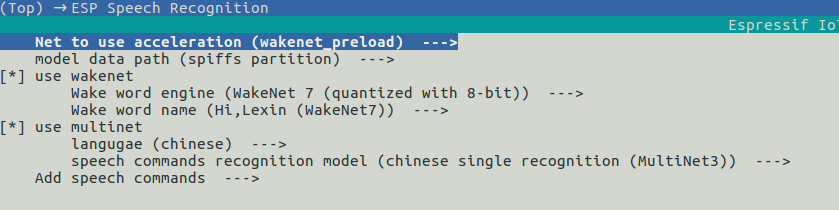

# 模型load方式[[English]](./README.md)

exist esp-sr middle，WakeNet and MultiNet A large amount of model data will be used，Model data is located in `ESP-SR_PATH/model/` middle。
at present esp-sr support以下模型load方式：

ESP32：

- from Flash middle直接load

ESP32S3：  

- from Flash spiffs Partitionload
- from outside SDCard load

from而exist ESP32S3 OK：

- Greatly reduce the size of user application APP BIN
- Convenient for users to carry out OTA
- Support from SD Card读取and更换模型，Modules that are more convenient and can reduce project usage Flash size
- 当用户进行开发hour，当修改不涉及模型hour，It can avoid burning model data every time，大大缩减烧录hour间，Improve development efficiency

## 1. Introduction to model configuration

run `idf.py menuconfig` Enter `ESP Speech Recognition`:



### 1.1 Net to use acceleration

This option can configure the acceleration method of the model. Users do not need to modify it. Please keep the default configuration.

### 1.2 model data path

该选项只exist ESP32S3 Available on，Represents the storage location of model data，Support choice `spiffs partition` or `SD Card`。

- `spiffs partition` Indicates that model data is stored in Flash spiffs Partitioning，Model data will be obtained from Flash spiffs Partitioningload
- `SD Card` Indicates that model data is stored in SD Cardmiddle，Model data will be obtained from SD Card middleload

### 1.3 use wakenet

This option is on by default，当用户只use AEC or者 BSS wait，无须run WakeNet or MultiNet hour，Please close this option，将会exist一些情况下减小工程固件的size。

- Wake word engine
 
 Wake up model engine selection。  

 ESP32 supports:
 
 - WakeNet 5 (quantized with 16-bit)
 
 ESP32S3 supports:
 
 - WakeNet 7 (quantized with 16-bit)
 - WakeNet 7 (quantized with 8-bit)
 - WakeNet 8 (quantized with 16-bit)

- Wake word name

 Wake word selection，The wake words supported by each wake engine vary，Users can choose。
 
For more details please refer to [WakeNet](../wake_word_engine/README.md) 。
 
### 1.4 use multinet

This option is on by default。当用户只use WakeNet or者其他算法模块hour，Please turn off this option，将会exist一些情况下减小工程固件的size。

- langugae

 Command word recognition language selection，ESP32 Only supports Chinese，ESP32S3 supportmiddle文or英文。
 
- speech commands recognition model

 Model selection for command word recognition.  
 ESP32 supports:
 
 - chinese single recognition (MultiNet2)
 
 ESP32S3 supports:
 
 - chinese single recognition (MultiNet3)
 - chinese continuous recognition (MultiNet3)
 - chinese single recognition (MultiNet4)

- Add speech commands

Users can add command words according to their needs，For details, please refer to [MultiNet](../speech_command_recognition/README.md) 。

## 2. 模型use

When the user completes the above configuration selections，Please refer to the application layer esp-skainet 进行initializationanduse。这里介绍一下模型数据loadexist用户工程middle的代码实现。

## ## 2.1 Using ESP32

当用户use ESP32 hour，由于只Support from Flash middle直接load模型数据，Therefore, the model data in the code will automatically follow the address from Flash Read the required data in。

### 2.2 use ESP32S3

#### 2.2.1 模型数据存储exist SPIFFS

When the user configures #1.2 The model data storage location is `spiffs partition` hour，user needs：

- Write partition table：

   ```
   model,  data, spiffs,         , SIZE,
   ```
   in SIZE 可以参考exist用户use 'idf.py build' 编译hour的推荐size，For example：
   
   ```
   Recommended model partition size: 500K
   ```
- initialization spiffs Partition
 
 **Directly call the provided API**：用户Can be called directly `srmodel_spiffs_init()` API 来initialization spiffs。  
 
 **Write it yourself**：当user needsexist spiffs Partition同hour存放其他文件，like web 网页hour，Can be written by oneself spiffs initializationfunction，need attention `esp_vfs_spiffs_conf`configuration：
 
 - base_path：Model storage `base_path` for `srmodel`，cannot be changed
 - partition_label：模型的Partition label for `model`，need and in the above partition table `Name` Be consistent
   
After completing the above configuration，模型会exist工程编译完成后自动生成 `model.bin`，And when the user is programming, it is programmed to spiffs Partition。  

**<font color=red>Note：When the user changes the model，Please be sure to do this before compiling again `idf.py clean`</font>**

#### 2.2.1 模型存储exist SD Card

When the user configures #1.2 The model data storage location is `SD Card` hour，user needs：

- Manually move model data

 Move the model to SDCard middle，After the user completes the above configuration，You can compile it first，After compilation is completed, the `ESP-SR_PATH/model/target/` Copy the files in the directory to SD Card的根目录。
 
- Custom path
 If users want to place the model in a specified folder, they can modify the `get_model_base_path()` function, located in `ESP-SR_PATH/model/model_path.c`.
 比like，Specify the folder as SD Card目录middle的 `espmodel`, 则可以修改该functionfor：
 
     ```
     char *get_model_base_path(void)
    {
        #if defined CONFIG_MODEL_IN_SDCARD
            return "sdcard/espmodel";
        #elif defined CONFIG_MODEL_IN_SPIFFS
            return "srmodel";
        #else
            return NULL;
        #endif
    }
    ```
 
- initialization SD Card

 user needsinitialization SD Card，to enable the system to record SD Card，like果用户use esp-skainet，Can be called directly `sd_card_mount("/sdcard")` 来initialization其support开发板的 SD Card。otherwise，Need to write it yourself。

After completing the above operations，You can then burn the project。