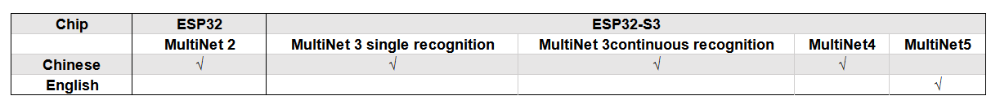
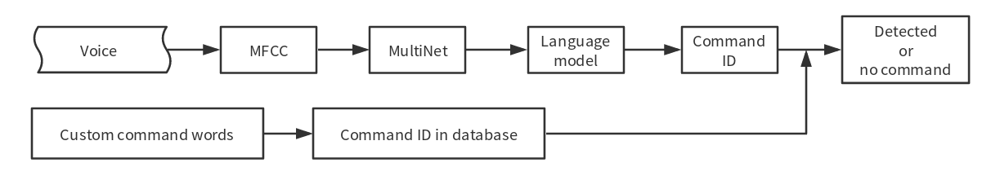

# MultiNet introduce [[English]](./README.md)

MultiNet is a lightweight model designed to implement multi-command word recognition on ESP32, based on the [CRNN](https://arxiv.org/pdf/1703.05390.pdf) network and [CTC](http://citeseerx.ist.psu.edu/viewdoc/download?doi=10.1.1.75.6306&rep=rep1&type=pdf). It currently supports 100 Recognition of custom command words within .

## # Overview

MultiNet Input is audio passed **MFCC** Processed eigenvalues，Output in Chinese/English“phoneme”Classification。By combining the output phonemes，but可by对应到相应的汉字或单词。  

by下表格展示在不同芯片上的模型支持：

# ## command words识别流程

1. Add custom command words
2. Enter the time length of one frame as 30ms audio（16KHz, 16bit, mono）
3. Get the input audio **MFCC** Eigenvalue
4. Input the feature value into MultiNet and output the identified **phoneme** corresponding to the frame.
5. Send the recognized phonemes to the language model to output the final recognition result
6. Compare the recognition results with the stored command word queue，Output the corresponding command words ID

in 3-6 All steps are completed within the interface，No need for users to handle it themselves。

可byrefer toby下Command word recognition process：

## # User Guide

## ## command words

at present，Users can use `make menuconfig` command to add custom command words。可by通过 `menuconfig -> ESP Speech Recognition->Add speech commands` Add command words，Already added 20 indivualChinesecommand word和 7 indivualEnglishcommand word，As shown in the table below：

**Chinese**  

|Command ID|Command word|Command ID|Command word|Command ID|command word|Command ID|command word|
|:---:|:---:|:---:|:---:|:---:|:---:|:---:|:---:|
|0|Turn on the air conditioner|5|Lower one degree|10| Dehumidification mode|15| play song
|1|Turn off the air conditioner|6|制热model|11| health model|16| Pause playback
|2|Increase wind speed|7|cooling mode|12| sleep mode|17| Timed for one hour
|3|Reduce wind speed|8|Air supply mode|13| Turn on Bluetooth|18| turn on the light
|4| one degree higher|9|节能model|10| Turn off Bluetooth|19| Turn off the lights

**English**

|Command ID|Command word|Command ID|Command word|
|:---:|:---:|:---:|:---:|
|0|turn on the light|4|red mode|
|1|turn off the light|5|blue mode|
|2|lighting mode|6|yellow mode|
|3|reading mode|

Network supports custom command words，用户可by将自己想要的设置的command word加入 MultiNet，Note意新添加的command word需要有其的对应 Command ID already convenient MultiNet output after time。

## ## command words识别model

Command word recognition supports two basic modes：
- SINGLE_RECOGNITION mode

 That is, single recognition mode，when using该model时，When the user performs command word recognition，必须将单独的单indivualcommand word短语音频送入 MultiNet。  
 For example, after waking up, say: turn on the light. Then MultiNet will recognize it successfully and return the corresponding Command ID. If the recognition fails, you must wait for sample_length to expire before the next recognition can be performed.  
 When used with wake-up, if the user only needs to identify a keyword to return after wake-up, it is recommended to use this mode.  
 
- CONTINUOUS_RECOGNITION mode

 That is, continuous recognition mode，when using该model时，Users can enter multiple command words consecutively MultiNet。  
 For example, after waking up，可by说出turn on the light，wait MultiNet 识别成功返回后可by在 sample_length Continue to say the next command word within，for example Turn off the lights。  
 When used with wake-up，如果用户在唤醒后需要连续识别多indivualcommand word，It is recommended to use this mode。  
 
Users can switch between the above two modes through `menuconfig -> ESP Speech Recognition -> speech commands recognition mode after wake up`. The default is SINGLE_RECOGNITION mode.

Note：CONTINUOUS_RECOGNITION The recognition rate of single words in mode is slightly lower than SINGLE_RECOGNITION model下的单indivual词识别率。

### Language selection

Currently, MultiNet supports Chinese and English. Currently, English only supports SINGLE_RECOGNITION mode.  
Users can pass `menuconfig -> ESP Speech Recognition -> langugae` Make a selection。

## ## Add custom command words
at present，MultiNet Some command words have been predefined in the model。Users can pass `menuconfig -> ESP Speech Recognition -> Add speech commands` and `The number of speech commands`to define your own voice command words and number of voice commands。

##### Chinesecommand word识别

Pinyin should be used when filling in command words, and there should be a space between the pinyin spellings of each word. For example, "turn on the air conditioner" should be filled in with "da kai kong tiao".

##### English command word recognition

Specific phonetic symbols should be used when filling in command words，Please use skainet root directory `tools` under the directory `general_label_EN/general_label_en.py` The script generates the phonetic symbols corresponding to the command words，具体使用方法请refer to [Phonetic symbol generation method](https://github.com/espressif/esp-skainet/tree/master/tools/general_label_EN/README.md) .

**Note意：**
- one Commnad ID 可by对应多indivualcommand phrase
- Most supported 100 indivual Command ID or command phrase
- same one Command ID 对应的几条command phrase之间应该由 "," separate

## ## Basic configuration
Before using the command word recognition model, you first need to define the following variables：  

1. Model version

 model version可by需要在 `menuconfig` Preselect in，please选择后在代码里添加如下的代码  
		static const esp_mn_iface_t *multinet = &MULTINET_MODEL;  
        
2. Generate model handle  

 Supported languages ​​and model availability are determined by model parameters，现在只支持Chinese命令。please `menuconfig` Medium configuration `MULTINET_COEFF` Options，并在代码中添加by下行byGenerate model handle。 sample_length 是语音识别audio长度，by ms as unit，when using sample_length The range is 0~6000。  
		model_iface_data_t *model_data = multinet->create(&MULTINET_COEFF, sample_length);

### API refer to

#### header file
- esp_mn_iface.h
- esp_mn_models.h

#### function

- `typedef model_iface_data_t* (*esp_mn_iface_op_create_t)(const model_coeff_getter_t *coeff, int sample_length);`  

  **Definition**  
   
 	Easy function type to initialize a model instance with a coefficient.
    
  **Parameter**  
   
 	* coeff: The coefficient for speech commands recognition.  
 	* sample_length: Audio length for speech recognition, in ms. The range of sample_length is 0~6000.
    
  **Return**  
 	  
 	Handle to the model data.

- `typedef int (*esp_mn_iface_op_get_samp_chunksize_t)(model_iface_data_t *model);`

   **Definition**  
   
	 Callback function type to fetch the amount of samples that need to be passed to the detection function. Every speech recognition model processes a certain number of samples at the same time. This function can be used to query the amount. Note that the returned amount is in 16-bit samples, not in bytes.
       
  **Parameter**  
   
 	model: The model object to query.
  
  **Return**
  
    The amount of samples to feed the detection function.

- `typedef int (*esp_mn_iface_op_get_samp_chunknum_t)(model_iface_data_t *model);`

   **Definition**  
   
	 Callback function type to fetch the number of frames recognized by the speech command.
       
  **Parameter**  
   
 	model: The model object to query.
  
  **Return**
  
    The number of the frames recognized by the speech command.
    
- `typedef int (*esp_mn_iface_op_set_det_threshold_t)(model_iface_data_t *model, float det_threshold);`    
    
   **Definition**  
   
 	Set the detection threshold to manually abjust the probability.

   **Parameter**  
  
   * model: The model object to query.  
   * det_treshold The threshold to trigger speech commands, the range of det_threshold is 0.5~0.9999
    
- `typedef int (*esp_mn_iface_op_get_samp_rate_t)(model_iface_data_t *model);`

   **Definition**  
   
 	Get the sample rate of the samples to feed to the detection function.

  **Parameter**  
  
 	model: The model object to query.
 
  **Return**  
  
 	The sample rate, in Hz.

- `typedef float* (*esp_mn_iface_op_detect_t)(model_iface_data_t *model, int16_t *samples);`  

   **Definition**
 
    Easy function type to initialize a model instance with a coefficient.
    
  **Parameter**  

    coeff: The coefficient for speech commands recognition.  
    
  **Return**  
   
 	* The command id, if a matching command is found.
 	* -1, if no matching command is found.
 
- `typedef void (*esp_mn_iface_op_destroy_t)(model_iface_data_t *model);`  

   **Definition**  
  
   Destroy a voiceprint recognition model.
 
  **Parameters**  
  
  model: Model object to destroy.