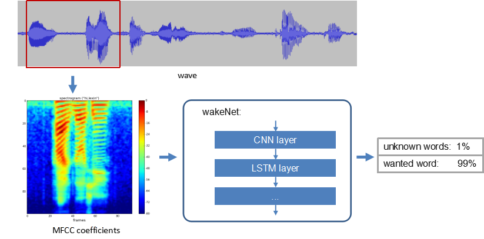
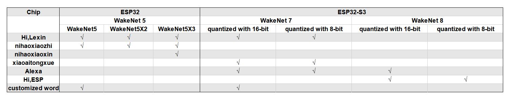
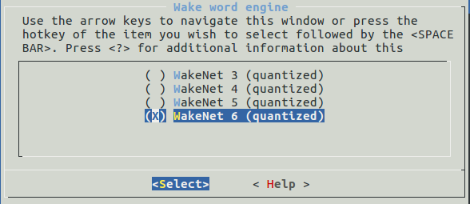
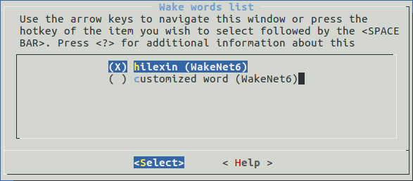

# WakeNet [[English]](./README.md)

WakeNet是一个based on神经网络，for low power embeddedMCUDesigned wake word model，Currently supported5Wake word recognition within。

## Overview

WakeNetThe flow chart is as follows：
<center>

</center>

- speech features：  
  我们use[MFCC](https://en.wikipedia.org/wiki/Mel-frequency_cepstrum)Method to extract speech spectrum features。The input audio file sample rate is16KHz，mono，The encoding method issigned 16-bit。每帧窗宽and步长均为30ms。    

- neural network：  
  Neural Network Architecture has been updated to version 6, which includes:  
  - wakeNet1andwakeNet2已经停止use。
  - wakeNet3andwakeNet4based on[CRNN](https://arxiv.org/abs/1703.05390)structure。
  - WakeNet5(WakeNet5X2,WakeNetX3) and WakeNet6 based on the [Dilated Convolution](https://arxiv.org/pdf/1609.03499.pdf) structure。
  
  Note意，WakeNet5,WakeNet5X2 and WakeNet5X3 The network structure is consistent，but WakeNet5X2 and WakeNet5X3 parameter ratio of WakeNet5 Want more。Please refer to [Performance testing](#Performance testing) to get more details。
         
- keyword trigger method：  
  to a continuous audio stream，To accurately determine the triggering of keywords，我们通过calculate若干帧内识别结果的平均值M，to determine the trigger。whenMGreater than the specified threshold，Issue a triggering command。

The following table shows model support on different chips：



## API introduction

- WakeNetModel selection  
  1. usemake menuconfig，chooseComponent config >> ESP Speech Recognition >> Wake Word Engine,As shown below  
  
   <center>
   
   </center>

  2. different fromWakeNet5，WakeNet6was split into twotask，task1calculatespeech features，task2calculateneural network model。task2use的ESP32core，can passComponent config >> ESP Speech Recognition >> ESP32 core to run WakeNet6choose，Used by defaultcore1。  

- 唤醒词choose  
  usemake menuconfig，chooseComponent config >> ESP Speech Recognition >> Wake word list进行choose，As shown below
  <center>
  
  </center>

   For custom wake words，请choose`customized wake word`，目前Wake word customization只支持WakeNet5andWakeNet6，WakeNet3andWakeNet4Only compatible with previous versions，For details, please refer to《Espressif's wake word customization process》。

- Threshold setting  
  1.The wake word model sets the trigger threshold，to adjust wake sensitivity,The threshold range is0~0.9999，For models with multiple wake words，The thresholds for each wake word are independent of each other。     
  2.When adjusting the threshold，When the threshold is reduced，The wake-up recognition rate increases and the risk of false triggering also increases.，On the contrary, the wake-up recognition rate is reduced，False triggering is also reduced。实际use需要根据具体应用场景choose合适的阈值。   
  3. Each wake-up word has two thresholds predefined inside the model, which are used during model initialization, where  
    ```
    typedef enum {
	    DET_MODE_90 = 0,  //Normal, response accuracy rate about 90%
	    DET_MODE_95       //Aggressive, response accuracy rate about 95%
    } det_mode_t;
    ```
  4.After initialization，可以use`set_det_threshold()`Reset different wake word thresholds。  

- Sampling rate and frame length
  Use function`get_samp_rate`Get the sample rate of audio data required for recognition
  Use the function `get_samp_chunksize` to obtain the required sampling points for each frame. The language encoding method is unsigned 16-bit int.

## #Performance test

### 1.Resource occupation  

|Model|Parameters|RAM|Average time consumption per frame|Duration per frame|
|:---:|:---:|:---:|:---:|:---:|
|Quantized WakeNet3|26 K|20 KB|29 ms|90 ms|
|Quantised WakeNet4|53 K|22 KB|48 ms|90 ms|
|Quantised WakeNet5|41 K|15 KB|5.5 ms|30 ms|
|Quantised WakeNet5X2|165 K|20 KB|10.5 ms|30 ms|
|Quantised WakeNet5X3|371 K|24 KB|18 ms|30 ms|
|Quantised WakeNet6|378 K|45 KB|4ms(task1)+25ms(task2)|30 ms|  

**Note**：Quantised WakeNet6was split into twotask，intask1用于calculatespeech features，anothertask2用于calculate神经网络。

## ## 2. Recognition performance  
|distance|Quiet environment|stationary noise(SNR=0~10dB)|speech noise(SNR=0~10dB)|AECinterrupt wakeup(-5~-15dB)|
|:---:|:---:|:---:|:---:|:---:|
|1 m|95%|88%|85%|89%|
|3 m|90%|80%|75%|80%|

False wake-up rate：1 Second-rate/ 12 Hour  
**Note**：The above test is based on WakeNet5X2(hilexin) Model，uselyrat-miniDevelopment board testing。This board picks up sound from a single microphone，若use多麦拾音的开发板，It is expected that there will be better recognition performance in far-field scenes.。

## Wake word customization

If you need to customize the wake-up word, please refer to [Espressif Express Voice Wake-up Word Customization Process] (Espressif Express Voice Wake-up Word Customization Process.md).