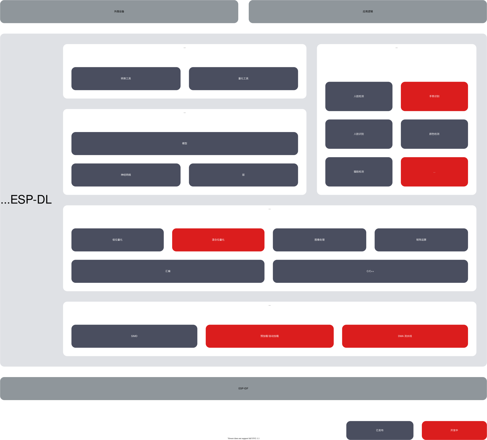

# ESP-DL [[English]](./README.md)

ESP-DL It is officially launched by Espressif for the Espressif series of chips. [ESP32](https://www.espressif.com/en/products/socs/esp32)、[ESP32-S2](https://www.espressif.com/en/products/socs/esp32-s2)、[ESP32-S3](https://www.espressif.com/en/products/socs/esp32-s3) and [ESP32-C3](https://www.espressif.com/en/products/socs/esp32-c3) 所supply的高性能深度学习开发库。

## # Overview

ESP-DL for**neural network推理**、**image processing**、**mathematical operations**and some**deep learning model**supply API，pass ESP-DL Able to quickly and easily use Espressif’s various chip products for artificial intelligence applications。

ESP-DL No need for any peripheral equipment，Therefore it can be used as a component of some projects，For example it can be used as **[ESP-WHO](https://github.com/espressif/esp-who)** a component of，This project contains several project-level image application examples。The picture below shows ESP-DL 的组成及作for组件时existproject中的位置。

     

## 入门guide

Install and get started ESP-DL，Please refer to[Quick start](./docs/en/get_started.md)。
> Please use ESP-IDF exist release/v4.4 on the branch[latest version](https://github.com/espressif/esp-idf/tree/release/v4.4)。

## Try a model from the model library

ESP-DL exist [Model library](./include/model_zoo) 中supply了一些模型的 API，Such as face detection、face recognition、Cat face detection, etc.。You can use the out-of-the-box models from the table below。

| Project | API Example |
| -------------------- | ------------------------------------------------------------ |
| Face detection | [ESP-DL/examples/human_face_detect](examples/human_face_detect) |
| Face recognition | [ESP-DL/examples/face_recognition](examples/face_recognition) |
| Cat face detection | [ESP-DL/examples/cat_face_detect](examples/cat_face_detect) |

## # Custom model

If you want to customize the model, please refer to [Step-by-step introduction to customizing the model](./tutorial). This instruction includes a runnable example that will help you quickly design the model.

阅读上述document时，You may use the following information：

- DL API
    * [Introduction to variables and constants](./docs/en/about_type_define.md)：其中supply的信息包括：
        - variable：Tensor
        - constant：filter、deviation、activation function
    * [Introduction to the steps of customizing layers](./docs/zh_CN/implement_custom_layer.md)：Describes how to customize layers。
    * [API document](./include)：about层、neural network、mathematics and tools API guide。

        > about API 的Instructions for use，Please check the header file comments for now。

- Platform conversion
    - Quantitative tools：Used to quantize floating point models, 并评估定点模型exist ESP SoCs performance on
      * Quantitative tools：Please refer to [Quantitative Toolkit](./tools/quantization_tool/README.md)
      * Quantitative tools API：Please refer to [Quantitative Toolkit API](./tools/quantization_tool/quantization_tool_api.md)

    - Conversion Tools: Tools and configuration files for floating point quantization of coefficient.npy.
      * config.json：Please refer to [config.json Configuration specifications](./tools/convert_tool/specification_of_config_json_cn.md)
      * convert.py：Please refer to [convert.py Instructions for use](./tools/convert_tool/README_cn.md)

         > convert.py 需exist Python 3.7 or higher version。

- Software and hardware acceleration
    * [Quantitative specifications](./docs/en/quantization_specification.md)：Floating point quantization rules

## feedback

Please refer to [Q&A](./docs/en/Q&A.md) for frequently asked questions.

如果您exist使用中发现了错误或者需要新的功能，Please submit relevant [issue](https://github.com/espressif/esp-dl/issues)，We will prioritize the most anticipated features。