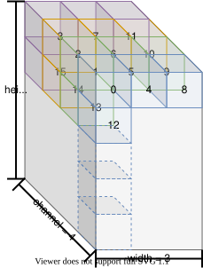

# Introduction to variables and constants [[English]](../en/about_type_define.md)

ESP-DL 有以下variableandconstant：

- **variable（value can change）**：[Tensor](../../include/typedef/dl_variable.hpp/#15)
- **constant（Value is fixed）**：[filter](../../include/typedef/dl_constant.hpp/#33)、[deviation](../../include/typedef/dl_constant.hpp/#55)and[activation function](../../include/typedef/dl_constant.hpp/#67)

## #Tensor

Tensor是矩阵向更高dimension度的泛化。That is to say，Tensor可以是：

- 0 dimension，expressed as a scalar
- 1 dimension，Represented as a vector
- 2 dimension，Represented as a matrix
- Unimaginable multi-dimensional structures

dimension数and每个dimension度的大小即为Tensor的形状。ESP-DL 的主要数据结构就是Tensor。All inputs and outputs of a layer are tensors。

### 二dimension操作中，Tensor的dimension度顺序

二dimension操作中，层的输入Tensorand输出Tensor均是三dimension。The dimension order of tensors is fixed，according to[high，width，aisle]Sort by order。

Assuming the shape of the tensor is [5, 3, 4], the elements in the tensor should be arranged as follows:

   

     
   

## filter、deviationandactivation function

Different from tensor，filter、deviationandactivation function无需填充。these three`element`The order is flexible，Adjustable for specific operations。

For more details, please refer to [`dl_constant.hpp`](../../include/typedef/dl_constant.hpp) or API documentation.