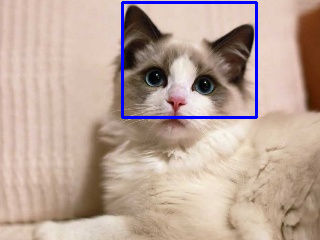

# Cat face detection [[English]](./README.md)

本项目为Cat face detection接口的示例。The input image of the cat face detection interface is a static image，The confidence score and coordinate values ​​of the detection results can be displayed in the terminal，检测结果的图片可通过tool显示在 PC on screen。

项目所在文件夹结构likeDown：

```shell
cat_face_detect/
├── CMakeLists.txt
├── image.jpg
├── main
│   ├── app_main.cpp
│   ├── CMakeLists.txt
│   └── image.hpp
├── README.md
├── README_cn.md
└── result.png
```

## Run the example

1. Open the terminal and enter the folder esp-dl/examples/cat_face_detect where the cat face detection example is located:

    ```shell
    cd ~/esp-dl/examples/cat_face_detect
    ```

2. Set the target chip:

    ```shell
    idf.py set-target [SoC]
    ```
    Will [SoC] 替换为您的目标chip，like esp32、esp32s2、esp32s3。

3. Burning program，run IDF The monitor obtains the score value and coordinate value of the detection result：

   ```shell
   idf.py flash monitor
   
   ... ...
   
   [0] score: 1.709961, box: [122, 2, 256, 117]
   ```

4. stored in [examples/tool/](../tool/) 目录Down的显示tool `display_image.py`，Pictures that allow you to view test results more intuitively。according to[tool](../tool/README_cn.md)introduceuse显示tool，runlikeDown命令：

   ```shell
   python display_image.py -i ../cat_face_detect/image.jpg -b "(122, 2, 256, 117)"
   ```
   PC A picture of the current sample test result will be displayed on the screen.，likeDown图所示：

   <p align="center">
     
   </p>

## Custom input image

In the example [./main/image.hpp](./main/image.hpp) Is the default input image。您可according to[tool](../tool/README_cn.md)introduce，usestored in [example/tool/](../tool/) 目录Down的转换tool `convert_to_u8.py`，Convert custom image to C/C++ form，Replace default image。

1. Store the custom image in the ./examples/cat_face_detect directory and use [examples/tool/convert_to_u8.py](../tool/convert_to_u8.py) to convert the image to hpp format:

   ```shell
   # Assume you are still in the directory cat_face_detect Down

   python ../tool/convert_to_u8.py -i ./image.jpg -o ./main/image.hpp
   ```

2. Refer to the steps in [Run Example](#Run Example) to burn the firmware, print the confidence score and coordinate value of the detection result, and display the picture of the detection result.

## Delay

| Chip | Time consuming |
| :------: | ---------: |
|  ESP32   | 149,765 us |
| ESP32-S2 | 416,590 us |
| ESP32-S3 |  18,909 us |

> The above data is based on the default configuration of the example.