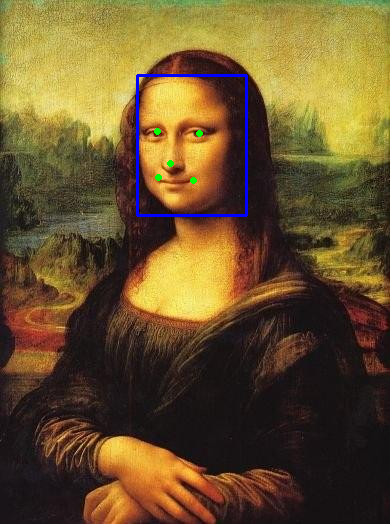

# Face detection [[English]](./README.md)

This project is an example of face detection interface。The input image of the face recognition interface is a static image，The confidence score and coordinate values ​​of the detection results can be displayed in the terminal，Pictures of test results can be displayed in the tool PC on screen。

项目所在文件夹结构likeDown：

```shell
human_face_detect/
├── CMakeLists.txt
├── image.jpg
├── main
│   ├── app_main.cpp
│   ├── CMakeLists.txt
│   └── image.hpp
├── partitions.csv
├── README.md
├── README_cn.md
└── result.png
```

## Run the example

1. Open the terminal and enter the folder esp-dl/examples/human_face_detect where the face detection example is located:

    ```shell
    cd ~/esp-dl/examples/human_face_detect
    ```

2. Set the target chip:

    ```shell
    idf.py set-target [SoC]
    ```
    Will [SoC] 替换为您的目标chip，like esp32、esp32s2、esp32s3。

3. Burn the firmware and print the score and coordinate values ​​of the detection results:

   ```shell
   idf.py flash monitor
   
   ... ...
   
   [0] score: 0.987580, box: [137, 75, 246, 215]
       left eye: (157, 131), right eye: (199, 133)
        nose: (170, 163)
        mouth left: (158, 177), mouth right: (193, 180)
   ```

4. stored in [example/tool/](../tool/) Display tools in the directory `display_image.py`，Pictures that allow you to view test results more intuitively。according to[tool](../tool/README_cn.md)introduceuse显示tool，运行likeDown命令：

   ```shell
   python display_image.py -i ../human_face_detect/image.jpg -b "(137, 75, 246, 215)" -k "(157, 131, 199, 133, 170, 163, 158, 177, 193, 180)"
   ```
   PC A picture of the current sample test result will be displayed on the screen.，likeDown图所示：
   
    <p align="center">
     
    </p>

## # Other settings

The macro definition `TWO_STAGE` at the beginning of [./main/app_main.cpp](./main/app_main.cpp) can define the target detection algorithm. As the comments say:

- `TWO_STAGE` = 1：The detector is two-stage（two stages），Test results are more accurate（Support facial key points），but slower。
- `TWO_STAGE` = 0：The detector is one-stage（single stage），Detection results are slightly less accurate（Does not support face key points），but faster。

You can experience the difference yourself。

## # Custom input image

In the example [./main/image.hpp](./main/image.hpp) is the default input image. You can follow the introduction of [Tools](../tool/README_cn.md) and use the conversion tool `convert_to_u8.py` stored in the [example/tool/](../tool/) directory to convert custom images into C/C++ form and replace the default images.

1. Save custom image to ./examples/human_face_detect under directory，use [examples/tool/convert_to_u8.py](../tool/convert_to_u8.py) Convert image to hpp Format：

   ```shell
   # Assume you are still in the directory human_face_detect Down

   python ../tool/convert_to_u8.py -i ./image.jpg -o ./main/image.hpp
   ```

2. Refer to the steps in [Run Example](#Run Example) to burn the firmware, print the confidence score and coordinate value of the detection result, and display the picture of the detection result.

## # Delay situation

| Chip | `TWO_STAGE` = 1 | `TWO_STAGE` = 0 |
| :------: | --------------: | --------------: |
|  ESP32   |      415,246 us |      154,687 us |
| ESP32-S2 |    1,052,363 us |      309,159 us |
| ESP32-S3 |       56,303 us |       16,614 us |

> The above data is based on the default configuration of the example.