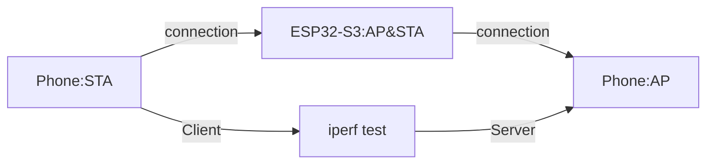

* [English version](README.md)

# USB CDC 4G Module

This sample program can implement ESP32-S2，ESP32-S3 series SoC as USB host driver 4G Cat.1 module PPP dial-up，Can be turned on at the same time ESP32-SX Wi-Fi AP Function，分享互联网给物联网设备or手持设备，achieve low cost “middle高速” Internet access。同时配有Router management interface，Router configuration and connected device information can be configured online。

**Features implemented:**

* USB CDC host interface communication
* Compatible with mainstream 4G module AT instruction
* PPP dial-up Internet access
* Wi-Fi hotspot sharing
* 4G module status management
* Router management interface
* status indicator light


* [Demo video](https://b23.tv/8flUAS)

## Hardware preparation

**Already supported ESP Chip model：** 

* ESP32-S2
* ESP32-S3

> It is recommended to use integration 4MB and above Flash，2MB and above PSRAM of ESP moduleor芯片。示例程序default不开启 PSRAM，用户可自行Add to测试，In theory, increasing the buffer size can improve the average data throughput rate

**Already supported 4G Cat.1 module型号：** 

|      Name       |   PPP   | Secondary AT Port |
| :-------------: | :-----: | :---------------: |
| ML302-DNLM/CNLM | Support |    No-Support     |
|  Air724UG-NFM   | Support |      unknown      |
| EC600N-CNLA-N05 | Support |      unknown      |
| EC600N-CNLC-N06 | Support |      unknown      |
| SIMCom A7600C1  | Support |      unknown      |
|     BG95_M3     | Support |      unknown      |
|     BG96_MA     | Support |      unknown      |
|    MC610_EU     | Support |      Support      |

> Be in charge modem Interface entry ppp After network status，Secondary AT Port can be used for AT interaction。

> 以上module有different子型号，different型号支持of通信制式可能略有区别，different制式支持of运营商different，Uplink and downlink rates are also different。For example LTE-FDD 5(UL)/10(DL), LTE-TDD 1(UL)/8(DL)

**Hardware Wiring**

default GPIO The configuration is as follows：

|           Function           |  GPIO   |        illustrate         |
| :----------------------: | :-----: | :-----------------: |
| **USB D+ (green)** | **20** | **Required** |
| **USB D- (white)** | **19** | **Required** |
| **GND (black)** | **GND** | **Required** |
|      **+5V (red)**       | **+5V** |      **necessary**       |
|   Modem Power Control    |   12    | 4G module自动开机模式 |
| **Modem Reset Control** | **13** | **Required** |
| System Status LED (red) | 15 | Optional |
| Wi-Fi Status LED (blue)  |   17    |       Not necessary        |
| Modem Status LED (green) |   16    |       Not necessary        |

> Users can also `menuconfig -> 4G Modem Configuration -> gpio config` middle配置 GPIO

## useillustrate

**Wi-Fi Name and Password:**

Available at `menuconfig` of `4G Modem Configuration → WiFi soft AP ` middle修改 Wi-Fi Configuration information

1. default Wi-Fi named `esp_4g_router`
2. defaultpassword为 `12345678`

**Indicator light description:**

|        indicator light         | flashing |              illustrate              |
| :-------------------: | :--: | :----------------------------: |
|  **System indicator light (red)**  | go out |               none               |
|                       | flash mob |         Restart Modem middle          |
|                       | constant | Internal error (Check, please SIM 卡后Restart) |
| **Wi-Fi indicator light (blue)** | go out |               none               |
|                       | slow flash |          Wait for device to connect          |
|                       | Always on |           Device is connected           |
| **Modem indicator light (green)** | go out |               none               |
|                       | slow flash |         Wait for internet connection         |
|                       | constant |          Internet is connected          |

**Router management interface**

Available at`menuconfig` of `4G Modem Configuration → Web router config `Configure whether to open the router management interface，And modify the login account and password of the router management interface。

1. The default login account is `esp32`
2. defaultpassword为 `12345678`
3. Search the web page for `192.168.4.1` to enter the router background.
4. Currently supported functions:
    * Support account login verification
    * Support modifying hotspot name，password，Whether to be invisible，channel，bandwidth，safe mode
    * Supports viewing current connected device information，Note host name，Kick out devices with one click
    * Support device networking status，联网时间of查看

## # Compile sample code

> You can also download and try our compiled firmware，Just burn it directly，固件address：https://esp32.com/viewtopic.php?f=22&t=24468

1. confirm `ESP-IDF` The environment was successfully established，and switch to `release/v4.4` branch

2. confirm已经完整download `ESP-IOT-SOLUTION` storehouse，and switch to `usb/add_usb_solutions` branch

    ```bash
    git clone -b usb/add_usb_solutions --recursive https://github.com/espressif/esp-iot-solution
    ```

3. Add to `ESP-IDF` environment variables，Linux The method is as follows，other平台请查阅 [Set up the environment variables](https://docs.espressif.com/projects/esp-idf/en/latest/esp32/get-started/index.html#step-4-set-up-the-environment-variables)

    ```bash
    . $HOME/esp/esp-idf/export.sh
    ```

4. Add the `ESP-IOT-SOLUTION` environment variable. The Linux method is as follows:

    ```bash
    export IOT_SOLUTION_PATH=$HOME/esp/esp-iot-solution
    ```

5. Set the compilation target to `esp32s2` or `esp32s3`

    ```bash
    idf.py set-target esp32s2
    ```

6. choose Cat.1 module型号 `Menuconfig → Component config → ESP-MODEM → Choose Modem Board`，If the selected model is not in the list，Please refer to `other 4G Cat.1 module适配方法`，自行配置module端点信息进行适配

    

7. compile、download、View output

    ```bash
    idf.py build flash monitor
    ```

**Log**

```
I (9634) ESP_USBH: Set Device Configuration = 1
I (9639) ESP_USBH: Set Device Configuration Done
I (9644) ESP_USBH: Pipe init succeed, addr: 81
I (9649) ESP_USBH: Pipe init succeed, addr: 01
I (9654) USB_HCDC: CDC Device Connected
I (9659) esp-modem: --------- Modem PreDefined Info ------------------
I (9666) esp-modem: Model: ML302-DNLM/CNLM
I (9671) esp-modem: Modem itf: IN Addr:0x81, OUT Addr:0x01
I (9677) esp-modem: ----------------------------------------------------
I (9684) gpio: GPIO[12]| InputEn: 0| OutputEn: 1| OpenDrain: 0| Pullup: 0| Pulldown: 0| Intr:0 
I (9694) gpio: GPIO[13]| InputEn: 0| OutputEn: 1| OpenDrain: 0| Pullup: 0| Pulldown: 0| Intr:0 
W (9704) USB_HCDC: rx0 flush -0 = 0
W (9707) modem_board: DTE reconnect, reconnecting ...

W (10713) modem_board: reconnect after 5s...
W (11713) modem_board: reconnect after 4s...
W (12713) modem_board: reconnect after 3s...
W (13713) modem_board: reconnect after 2s...
W (14713) modem_board: reconnect after 1s...
I (14713) modem_board: Modem state STAGE_SYNC, Start
W (14824) modem_board: Network Auto reconnecting ...
I (14824) modem_board: Modem state STAGE_SYNC, Success!
I (14924) modem_board: Modem state STAGE_CHECK_SIM, Start
I (14958) modem_board: SIM Card Ready
I (14958) modem_board: Modem state STAGE_CHECK_SIM, Success!
I (15058) modem_board: Modem state STAGE_CHECK_SIGNAL, Start
I (15081) modem_board: Signal quality: rssi=25, ber=99
I (15081) modem_board: Modem state STAGE_CHECK_SIGNAL, Success!
I (15182) modem_board: Modem state STAGE_CHECK_REGIST, Start
I (15205) modem_board: Network registed, Operator: "46000"
I (15205) modem_board: Modem state STAGE_CHECK_REGIST, Success!
I (15306) modem_board: Modem state STAGE_START_PPP, Start
I (15715) modem_board: Modem state STAGE_START_PPP, Success!
W (15716) modem_board: Modem event! 0
I (15727) esp-netif_lwip-ppp: Connected
I (15727) esp-netif_lwip-ppp: Name Server1: 211.136.150.86
I (15727) esp-netif_lwip-ppp: Name Server2: 0.0.0.0
I (15732) modem_board: IP event! 6
I (15736) modem_board: Modem Connected to PPP Server
I (15742) modem_board: ppp ip: 10.84.162.74, mask: 255.255.255.255, gw: 192.168.0.1
I (15750) modem_board: Main DNS: 211.136.150.86
I (15755) modem_board: Backup DNS: 0.0.0.0
I (15761) pp: pp rom version: e7ae62f
I (15765) net80211: net80211 rom version: e7ae62f
I (15771) wifi:wifi driver task: 3fcb04d8, prio:23, stack:6656, core=0
I (15776) system_api: Base MAC address is not set
I (15781) system_api: read default base MAC address from EFUSE
I (15798) wifi:wifi firmware version: 133d2ca
I (15798) wifi:wifi certification version: v7.0
I (15799) wifi:config NVS flash: enabled
I (15800) wifi:config nano formating: disabled
I (15804) wifi:Init data frame dynamic rx buffer num: 32
I (15809) wifi:Init management frame dynamic rx buffer num: 32
I (15815) wifi:Init management short buffer num: 32
I (15815) modem_board: Modem state STAGE_WAIT_IP, Start
I (15819) wifi:Init dynamic tx buffer num: 32
I (15825) modem_board: Modem state STAGE_WAIT_IP, Success!
I (15829) wifi:Init static tx FG buffer num: 2
I (15840) wifi:Init static rx buffer size: 1600
I (15844) wifi:Init static rx buffer num: 10
I (15848) wifi:Init dynamic rx buffer num: 32
I (15852) wifi_init: tcpip mbox: 32
I (15856) wifi_init: udp mbox: 6
I (15860) wifi_init: tcp mbox: 6
I (15864) wifi_init: tcp tx win: 5744
I (15868) wifi_init: tcp rx win: 5744
I (15873) wifi_init: tcp mss: 1440
I (15877) wifi_init: WiFi IRAM OP enabled
I (15881) wifi_init: WiFi RX IRAM OP enabled
I (15886) wifi_init: LWIP IRAM OP enabled
I (15892) phy_init: phy_version 503,13653eb,Jun  1 2022,17:47:08
I (15931) wifi:mode : softAP (7c:df:a1:e0:91:01)
I (15934) wifi:Total power save buffer number: 16
I (15934) wifi:Init max length of beacon: 752/752
I (15934) wifi:Init max length of beacon: 752/752
I (15939) modem_wifi: Wi-Fi AP started
I (15947) wifi:Total power save buffer number: 16
I (15948) modem_wifi: softap ssid: esp_4g_router password: 12345678
I (15954) modem_wifi: NAT is enabled
```

## other 4G Cat.1 module适配方法

1. confirm 4G module是否支持 USB Fullspeed communication mode
2. confirm 4G module是否支持 USB PPP dial-up；
3. confirm 4G SIM Card is active，and turn on了上网Function；
4. Confirm that the necessary signal lines have been connected according to **Hardware Wiring**;
5. confirm 4G module USB PPP Interface input endpoint （IN）and output endpoint（OUT） address，并在 `menuconfig` Modify the following options in： 

   * choose自定义 4G Modem Development board：
   ```
   Component config → ESP-MODEM → Choose Modem Board → User Defined
                                
   ```
   * Configure customization 4G Modem Development board端点address：
   ```
   Component config → ESP-MODEM → USB CDC endpoint address config
                                        → Modem USB CDC IN endpoint address
                                        → Modem USB CDC OUT endpoint address
   ```

6. console output log，confirm `AT` The command can be executed；

> different Cat.1 芯片平台支持of AT The basic instructions are roughly the same，However, there may be some special instructions，Need self-support

## Code debugging

**1. Debug mode**

   Available at `menuconfig` Open `4G Modem Configuration -> Dump system task status` Options print task Details，Can also be opened `Component config → USB Host CDC ->Trace internal memory status ` Options print usb internal buffer Usage information。

	```
    I (79530) main: Task dump
    I (79531) main: Load    Stack left      Name    PRI
    I (79531) main: 3.24    1080    main    1
    I (79532) main: 95.25   1248    IDLE    0
    I (79536) main: 0.03    1508    bulk-out        6
    I (79541) main: 0.03    1540    port    9
    I (79546) main: 0.01    1752    Tmr Svc         1
    I (79550) main: 0.04    2696    tiT     18
    I (79554) main: 1.21    1352    usb_event       4
    I (79559) main: 0.01    1532    bulk-in         5
    I (79564) main: 0.05    3540    esp_timer       22
    I (79569) main: 0.13    4632    wifi    23
    I (79573) main: 0.00    1532    dflt    8
    I (79577) main: 0.00    1092    sys_evt         20
    I (79582) main: Free heap=37088 bigst=16384, internal=36968 bigst=16384
    I (79589) main: ..............
    
    I (79593) USB_HCDC: USBH CDC Transfer Buffer Dump:
    I (79599) USB_HCDC: usb transfer Buffer size, out = 3000, in = 1500
    I (79606) USB_HCDC: usb transfer Max packet size, out = 46, in = 48
    
    I (79613) USB_HCDC: USBH CDC Ringbuffer Dump:
    I (79618) USB_HCDC: usb ringbuffer size, out = 15360, in = 15360
    I (79625) USB_HCDC: usb ringbuffer High water mark, out = 46, in = 48
	```

**2. Performance optimization**

1. 检查moduleand运营商支持情况，If there are requirements for throughput，请choose `FDD` 制式moduleand运营商；
2. Will `APN` Modify the name given to the operator `menuconfig -> 4G Modem Configuration -> Set Modem APN`， For example，当usemiddle国移动普通 4G The card can be changed to `cmnet`；
3. Will ESP32-Sx CPU configured as 240MHz（`Component config → ESP32S2-specific → CPU frequency`），If dual-core is supported, please enable dual-core at the same time.；
4. ESP32-Sx adds and enables PSRAM (`Component config → ESP32S2-specific → Support for external`), and increases the PSRAM clock frequency (`Component config → ESP32S2-specific → Support for external → SPI RAM config → Set RAM clock speed`) to select 80MHz. And open `Try to allocate memories of WiFi and LWIP in SPIRAM firstly.` in this directory;
5. Will FreeRTOS Tick frequency `Component config → FreeRTOS → Tick rate` Raise to `1000 Hz`；
6. Other application layer optimization.

## #Performance parameters

**test environment：**

* ESP32-S2 ，CPU 240Mhz
* 4MB flash, no PSRAM
* ML302-DNLM moduleDevelopment board
*China Mobile 4G Internet Card
* Normal office environment

**Test results：**

| Test item | Peak | Average |
| :----: | :------: | :------: |
|  download  |  6.4 Mbps  |  4 Mbps  |
|  upload  | 5 Mbps | 2 Mbps |

> **4G Cat.1 理论peakdownload速率 10 Mbps，peakupload速率 5 Mbps**
> The actual communication rate is affected by the operator's network、test software、Wi-Fi interference situation、终端连接数影响，以实际use为准

## # ESP32-S3 4G Internet speed test

### testing tools
* tripod
* A mobile phone
* ESP32-S3-DevKitC-1 development board
* A power bank
* WiFi Magic Box Speed ​​Test Software
* Cat.1 module

### beta version

* IDF v4.4

## ## Test environment

Open outdoor environment in the park

## ## Test method

* Development board固定在tripod上，Vertical ground upward，Height above ground is approx. 1.2m

* Development board connection Cat.1 module，use手机连接Development board热点

* The tester stood 2m away from the tripod and used speed measurement software to test the up and down speeds

### Test results
| Chip model | distance |    Test resultsMbits/s    |
| :------: | :--: | :-------------------: |
| ESP32-S3 | 2m | Downlink: 8.15 Uplink: 4.12 |

## ## ESP32-S3 NAPT rate test

### testing tools

* tripod
* Two mobile phones
* Two ESP32-S3-DevKitC-1 development boards
* A power bank
* WiFi魔盒test software

### beta version

* IDF v4.4

## ## Test environment

Open outdoor environment in the park

## ## Test method



* Development board固定在tripod上，Vertical ground upward，Height above ground is approx. 1.2m

* two mobile phones，A mobile phone turns on the hotspot as server，use ESP32-S3 Development board connection该手机热点，and turn onAPDo it for another phone client

* 两名测试者站在distancetripod 2m at，useWiFi魔盒test softwaremiddleof iperf testing tools测试two mobile phones之间of上Downward速度两次，取两次测试ofaverage值为Test results

### Test results
| Chip model | distance |    Test resultsMbits/s    |
| :------: | :--: | :-------------------: |
| ESP32-S3 | 2m | Downlink: 4.48 Uplink: 4.56 |