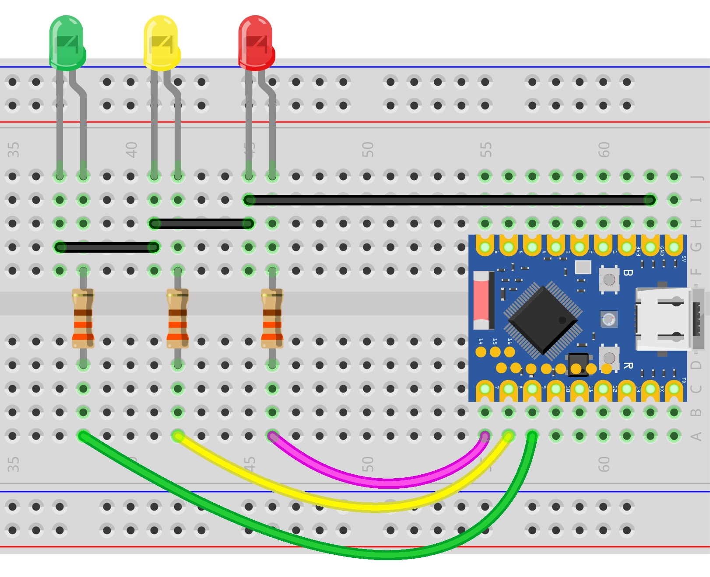

On this page

# Traffic Light

Important Note: About Board Compatibility

The core logic of this tutorial applies to all ESP32 development boards, but all operation steps are based on  as an example. If you are using another model of Development Board, please modify the corresponding settings according to your actual situation.

## Project Introduction

This project demonstrates a Traffic Light simulation program that controls three LEDs through the ESP32's GPIO pins to simulate the red, yellow, and green light switching process of a traffic light.

## Hardware Connection

Components needed:

- LED * 3
- 330Ω resistor * 3
- Breadboard * 1
- Jumper wires
- ESP32 Development Boards

Connect the circuit according to the wiring diagram below:

ESP32-S3-Zero Pinout


 

## Code Implementation

```
/*
  Traffic Light Simulation
  Simulate a Traffic Light system with red, green lights and a flashing yellow light.
  The current status will be printed via the serial monitor.
  Circuit connection:
  - Red LED connected to pin 7
  - Yellow LED connected to pin 8
  - Green LED connected to pin 9
  Wulu (Waveshare Team)
*/
// Pin definitions
const int redPin = 7;
const int yellowPin = 8;
const int greenPin = 9;
// Time parameter definitions (unit: milliseconds)
const unsigned long redDuration = 10000;    // Red light duration
const unsigned long greenDuration = 8000;   // Green light duration
const unsigned long yellowDuration = 3000;  // Yellow light total duration
const unsigned long blinkInterval = 500;    // Blink interval
void setup() {
  // Initialize serial communication
  Serial.begin(115200);
  Serial.println("Traffic Light simulation program started...");
  Serial.print("Current config: Red light=");
  Serial.print(redDuration / 1000);
  Serial.print("seconds, Green light=");
  Serial.print(greenDuration / 1000);
  Serial.print("seconds, Yellow light=");
  Serial.println(yellowDuration / 1000);
  // Configure LED pins as output mode
  pinMode(redPin, OUTPUT);
  pinMode(yellowPin, OUTPUT);
  pinMode(greenPin, OUTPUT);
}
// Helper function: Turn off all lights
void allLightsOff() {
  digitalWrite(redPin, LOW);
  digitalWrite(yellowPin, LOW);
  digitalWrite(greenPin, LOW);
}
void loop() {
  // --- Green light phase ---
  Serial.println("Status: Green light on");
  allLightsOff();                // Ensure starting from a clean state
  digitalWrite(greenPin, HIGH);
  delay(greenDuration);
  // --- Yellow light blinking phase ---
  Serial.println("Status: Yellow light blinking");
  digitalWrite(greenPin, LOW);
  // Calculate blink count
  // A complete cycle includes "on" and "off", with a duration of blinkInterval * 2
  int numBlinks = yellowDuration / (blinkInterval * 2);
  // Ensure at least one blink even if time is very short
  if (numBlinks == 0) {
    numBlinks = 1;
  }
  for (int i = 0; i < numBlinks; i++) {
    digitalWrite(yellowPin, HIGH);
    delay(blinkInterval);
    digitalWrite(yellowPin, LOW);
    delay(blinkInterval);
  }
  // --- Red light phase ---
  Serial.println("Status: Red light on");
  // Yellow and green lights are off at this point, directly turn on red light
  digitalWrite(redPin, HIGH);
  delay(redDuration);
}
```

## Code Explanation

-

**Constant Definitions**:

`redDuration`, `redDuration`, `redDuration`: Defines the GPIO pin numbers for the connected LEDs.
- `redDuration`, `redDuration`, `redDuration`: Defines the duration of each light (unit: milliseconds).
- `redDuration`: Defines the yellow light blinking interval.

-

**Initialization (`redDuration`)**:

`redDuration`: Initialize serial communication with baud rate 115200, used to view program running status in the serial monitor.
- `redDuration`: Configure the LED-connected pins as output mode to control the LED on/off.

-

**Helper function (`redDuration`)**:

This is a custom function used to set all LED pins to `redDuration`(low level), thus turning off all lights. This helps ensure no residual lit lights before switching states.

-

**Main loop (`redDuration`)**:

**Green Light Phase**: First call `redDuration` Turn off all lights, then turn on green light (`redDuration`) and hold `redDuration` milliseconds.
- **Yellow Light Blinking Phase**:

Turn off green light.
- Calculate blink count:`redDuration`。
- Use `redDuration` Loop to control yellow light alternating on/off (`redDuration` -> `redDuration` -> `redDuration` -> `redDuration`)。

- **Red Light Phase**: Turn on red light (`redDuration`) and hold `redDuration` milliseconds.

## Reference Links

- [Section 3: GPIO Digital Output/Input](../ESP32-Arduino-Tutorials/Digital-IO.md)
