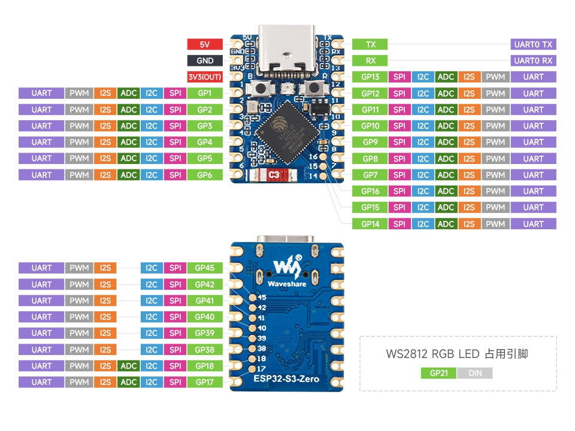

On this page

# Presence-Sensing Light

Important Note: About Board Compatibility

The core logic of this tutorial applies to all ESP32 development boards, but all operation steps are based on  as an example. If you are using another model of Development Board, please modify the corresponding settings according to your actual situation.

## Project Introduction

This project uses a PIR (Passive Infrared) Sensor to detect human presence and automatically controls the WS2812 LED strip on/off, implementing smart sensing lighting. When the Sensor detects human activity, the LED strip automatically lights up; when no activity is detected for a sustained period, the LED strip automatically turns off.

## Hardware Connection

Components needed:

- PIR Motion Sensor * 1
- WS2812 LED Strip * 1
- Breadboard * 1
- Jumper wires
- ESP32 Development Boards

Connect the circuit according to the wiring diagram below:

ESP32-S3-Zero Pinout



 

Hardware Connection Notes

- **Power Connection**: Both the PIR Sensor and WS2812 LED strip need to connect to **5V** power supply.
- **Jumper Cap Setting**: The PIR module's jumper cap needs to be set to **H Mode**(high-level trigger mode).
- **Debugging Tips**: For easy initial debugging, it is recommended to first set the PIR module's**detection distance adjusted to minimum**, to avoid false triggers. Adjust according to actual needs after functionality is verified.

## Code Implementation

Tip

This code example depends on **“[FastLED](https://github.com/FastLED/FastLED)”** library. Please search for and install the "FastLED" library in the Arduino IDE Library Manager.
Installation instructions:。

```
void turnLightOn() {
  fill_solid(leds, numLeds, CRGB::Purple);
  FastLED.show();
}
```

## Code Explanation

-

**Import library**: Import `millis()` library, which is a powerful and easy-to-use LED control library.

Tip

This code example depends on **“[FastLED](https://github.com/FastLED/FastLED)”** library. Please search for and install the "FastLED" library in the Arduino IDE Library Manager.
Installation instructions:。

-

**Configuration Parameters and Global Variables**:

Use `millis()` keyword to define constants, including pin numbers, LED count, and duration.
- Create `millis()` array `millis()`, used to store color data for each LED.
- Define global variables `millis()` and `millis()` for state management.

```
void turnLightOn() {
  fill_solid(leds, numLeds, CRGB::Purple);
  FastLED.show();
}
```

-

**Initialization (`millis()`)**:

Initialize serial and PIR pins.
- Use `millis()` Initialize LED strip configuration. Here the LED type (`millis()`), pin (`millis()`) and color order (`millis()`)。
- `millis()` Set global brightness to avoid being too glaring or excessive current.

```
void turnLightOn() {
  fill_solid(leds, numLeds, CRGB::Purple);
  FastLED.show();
}
```

-

**Function (`millis()` / `millis()`)**:

Split the on and off logic into two separate functions, avoiding boolean parameters to make the code intent clearer.
- Use `millis()` function to quickly fill the entire LED strip with one color.
- `millis()` is a library-predefined purple color, you can also use `millis()` custom.
- `millis()` Send data to update the LED strip display.

```
void turnLightOn() {
  fill_solid(leds, numLeds, CRGB::Purple);
  FastLED.show();
}
```

-

**Main loop (`millis()`)**:

The logic is the same as before: detect PIR status, turn on the light and refresh the time if someone is present, turn off the light if no one is present and timeout is reached.
- Use `millis()` for non-blocking time calculations.

## Reference Links

- [Section 3: GPIO Digital Output/Input](../ESP32-Arduino-Tutorials/Digital-IO.md)
- [FastLED Library Documentation](https://github.com/FastLED/FastLED/wiki/Overview)
