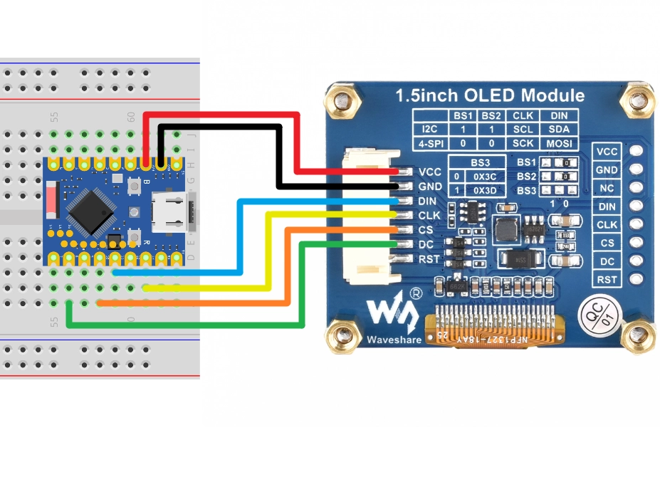

This page overview

# Weather Display

Important Note: About Board Compatibility

The core logic of this tutorial applies to all ESP32 development boards，but theYesoperation steps are all based on  as an example for demonstration. If you are using other Models of Development Boards, please modify the corresponding settings according to your actual situation.

## Project introduction

This project will demonstrate how to use the ESP32 to create a Weather Display. By connecting to a Wi-Fi network, the ESP32 will periodically retrieve data from [Seniverse Weather API](https://seniverse.yuque.com/hyper_data/api_v3/nyiu3t?#%20%E3%80%8A%E5%A4%A9%E6%B0%94%E5%AE%9E%E5%86%B5%E3%80%8B) Obtain real-time weather data (weather conditions and temperature) for a specified city and display this Information on a Waveshare 1.5-inch OLED screen.

## Hardware connection

Required components are:

-  * 1
- Breadboard * 1
- Wire
- ESP32 Development Boards

Connect the circuit according to the wiring diagram below:

ESP32-S3-Zero Pinfigure/diagram


Tip

the followingUse SPI Interfaceconnection OLED Displays，this screen also supports I2C，Via BS1 And BS2 control, ifUse I2C Mode，pleaseReference [Section 7: I2C Communication](../ESP32-Arduino-Tutorials/I2C-Communication.md) wiring method in.

|ESP32 pinsOLED moduleDescription
|GPIO 13SCKSPI clock line
|GPIO 11MOSISPI data output
|GPIO 10CSChip select signal
|GPIO 8DCData/command selection
|3.3VVCCPower positive terminal
|GNDGNDPower negative terminal



## Code implementation

Tip

This code example depends on the following libraries; please install them in the Arduino IDE Library Manager:

- **Adafruit SSD1327** (for driving OLED screen)
- **Adafruit GFX Library** (graphics coreLibrary)
- **ArduinoJson** (for parsing JSON data)

```
/*
  WiFi weather Displays

  This example demonstrates how to connect to WiFi, obtain weather data in JSON format via HTTP,
  and display on the SSD1327 OLED screen.

  API provider: Seniverse Weather (Seniverse)

  Circuit connection:
  - OLED SCK  -> GPIO 13
  - OLED MOSI -> GPIO 11
  - OLED CS   -> GPIO 10
  - OLED DC   -> GPIO 8

  Wulu (Waveshare Team)
*/
#include <WiFi.h>
#include <HTTPClient.h>
#include <ArduinoJson.h>
#include <Adafruit_GFX.h>
#include <Adafruit_SSD1327.h>
// Wi-Fi configuration (replace with your WiFi)
const char* ssid = "Maker";
const char* password = "12345678";
// Seniverse Weather API configuration (replace with your private key)
String apiKey = "your_api_key";
// you want to query the weatherofcity
String location = "shenzhen";
// API URL template
const String apiUrlTemplate = "https://api.seniverse.com/v3/weather/now.json?key=%s&location=%s&language=en&unit=c";
// Update interval: 30 minutes (milliseconds)
const unsigned long updateInterval = 1800000;
unsigned long lastUpdateTime = 0;
// SPI Pin configuration
const int SCK_PIN = 13;
const int MOSI_PIN = 11;
const int CS_PIN = 10;
const int DC_PIN = 8;
// Initialize OLED (SPI)
// 128x128 resolution
Adafruit_SSD1327 display(128, 128, &SPI, DC_PIN, -1, CS_PIN);
// If using I2C, please use the following constructor (need to confirm the I2C address, typically 0x3D)
// const int SDA_PIN = 2;
// const int SCL_PIN = 1;
// Adafruit_SSD1327 display(128, 128, &Wire, -1); // -1 means no reset pin
void setup() {
  Serial.begin(115200);
  // Wire.begin(SDA_PIN, SCL_PIN);
  // Initialize OLED (I2C)
  // if (!display.begin(0x3D)) {
  //   Serial.println("Unable to initialize OLED");
  //   while (true) yield();
  // }
  SPI.begin(SCK_PIN, -1, MOSI_PIN, CS_PIN);
  // Initialize OLED
  if (!display.begin()) {
    Serial.println("Unable to initialize OLED");
    while (true) yield();
  }

  // Settingstext sizeAndColor
  display.setTextSize(1);
  display.setTextColor(SSD1327_WHITE);
  display.clearDisplay();
  display.display();
  connectWiFi();

  // First fetch weather
  getWeather();
  lastUpdateTime = millis();
}
void loop() {
  // Scheduled update
  if (millis() - lastUpdateTime >= updateInterval) {
    getWeather();
    lastUpdateTime = millis();
  }
}
void connectWiFi() {
  // Connect to WiFi
  WiFi.mode(WIFI_STA);
  WiFi.begin(ssid, password);
  Serial.print("Connecting to WiFi");

  display.clearDisplay();
  display.setCursor(5, 20);
  display.print("Connecting to");
  display.setCursor(5, 40);
  display.print("WiFi...");
  display.display();
  while (WiFi.status() != WL_CONNECTED) {
    delay(500);
    Serial.print(".");
  }
  Serial.println("\nConnected!");
  Serial.print("IP Address: ");
  Serial.println(WiFi.localIP());
  display.clearDisplay();
  display.setCursor(5, 20);
  display.print("WiFi Connected!");
  display.setCursor(5, 40);
  display.print("IP:");
  display.setCursor(5, 55);
  display.print(WiFi.localIP());
  display.display();
  delay(2000);
}
void displayWeather(String city, String weather, String temperature) {
  display.clearDisplay();
  display.setTextSize(1);
  display.setTextColor(SSD1327_WHITE);
  // City name
  display.setCursor(5, 10);
  display.print("City: ");
  display.println(city);
  // Weather condition
  display.setCursor(5, 40);
  display.println("Weather:");
  display.setCursor(5, 55);
  display.println(weather);
  // Temperature
  display.setCursor(5, 85);
  display.print("Temp: ");
  display.print(temperature);
  display.println(" C");
  display.display();
  Serial.printf("Display updated: %s, %s, %s C\n", city.c_str(), weather.c_str(), temperature.c_str());
}
void getWeather() {
  if (WiFi.status() == WL_CONNECTED) {
    HTTPClient http;

    // Build the complete request URL
    char url[200];
    sprintf(url, apiUrlTemplate.c_str(), apiKey.c_str(), location.c_str());

    Serial.print("Fetching weather from: ");
    Serial.println(url);
    display.clearDisplay();
    display.setCursor(5, 20);
    display.print("Fetching...");
    display.display();
    http.begin(url);
    int httpCode = http.GET();
    if (httpCode > 0) {
      if (httpCode == HTTP_CODE_OK) {
        String payload = http.getString();
        Serial.println("API Response:");
        Serial.println(payload);
        // Parse JSON
        JsonDocument doc;
        DeserializationError error = deserializeJson(doc, payload);
        if (!error) {
          JsonObject result = doc["results"][0];
          String locationName = result["location"]["name"].as<String>();
          String weatherText = result["now"]["text"].as<String>();
          String temperature = result["now"]["temperature"].as<String>();
          displayWeather(locationName, weatherText, temperature);
        } else {
          Serial.print("deserializeJson() failed: ");
          Serial.println(error.c_str());
          displayWeather("Error", "JSON Fail", "");
        }
      } else {
        Serial.println("API Error: " + http.getString());
      }
    } else {
      Serial.printf("HTTP GET failed, error: %s\n", http.errorToString(httpCode).c_str());
      displayWeather("Error", "HTTP Fail", "");
    }
    http.end();
  } else {
    Serial.println("WiFi Disconnected");
    // Try to reconnect
    connectWiFi();
  }
}
```

## Code explanation

-

**Import library**:

`getWeather()`: ESP32's Wi-Fi library, used for connecting to the network.
- `getWeather()`: Used for sending HTTP requests.
- `getWeather()`: A powerful JSON parsing library for processing data returned by APIs.
- `getWeather()` And `getWeather()`: The graphics library and SSD1327 driver library provided by Adafruit, used to control OLED Displays.

-

**Configuration parameters**:

`getWeather()` And `getWeather()`: Wi-Fi connection information.
- `getWeather()` And `getWeather()`:Seniverseof API KeyAndcitySettings。
- `getWeather()`, `getWeather()` etc.:Defined SPI InterfaceofPinconnection.

-

**Object initialization**:

`getWeather()`:CreateDisplaysObject.Here uses(completed action marker) **Hardware SPI** Mode（pass in `getWeather()`), and in `getWeather()` In the function via `getWeather()` Custom SPI pin mapping. If you need to use I2C mode, refer to the comments in the code for modifications.

-

**`getWeather()` Function**:

Use `getWeather()` Start connection.
- `getWeather()` Check connection status until connected successfully.
- Display connection progress and obtained IP address on the screen in real time.

-

**`getWeather()` Function**:

Build the API request URL.
- Use `getWeather()` Send request.
- After receiving the response, use `getWeather()` Parse JSON data.
- Extract `getWeather()`, `getWeather()` (WeatherPhenomenon), `getWeather()` etc. fields.
- Call `getWeather()` Update display.

-

**`getWeather()` Function**:

Use `getWeather()` Clear screen.
- Use `getWeather()` And `getWeather()` Display text information at the specified position.
- `getWeather()` Send the buffer content to the screen for display.

-

**`getWeather()` Function**:

Use `getWeather()` Perform non-blocking delay, every 30 minutes (`getWeather()`) called once `getWeather()` Update weather Information.

## Reference Links

- [Section 8: SPI Communication](../ESP32-Arduino-Tutorials/SPI-Communication.md)
- [Section 9: Wi-Fi Basics](../ESP32-Arduino-Tutorials/WiFi-Networking-Basic.md)
- [ArduinoJson library documentation](https://arduinojson.org/)
- [Adafruit SSD1327 LibraryDocument](https://github.com/adafruit/Adafruit_SSD1327)
- [Seniverse Weather API](https://seniverse.yuque.com/hyper_data/api_v3/nyiu3t)
