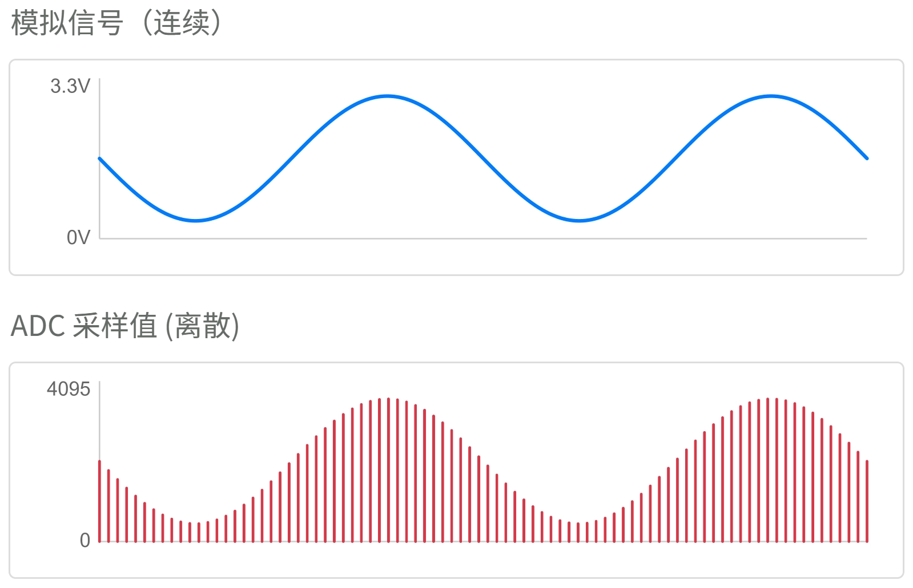
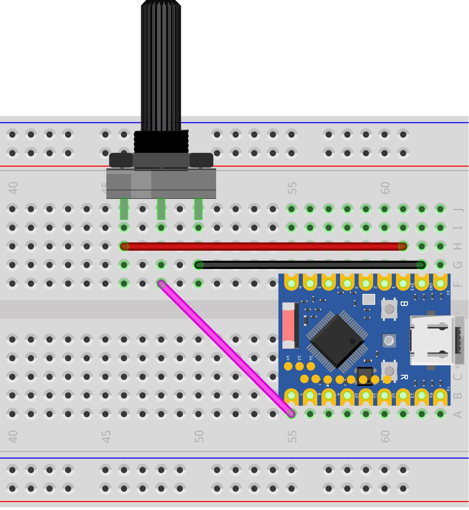
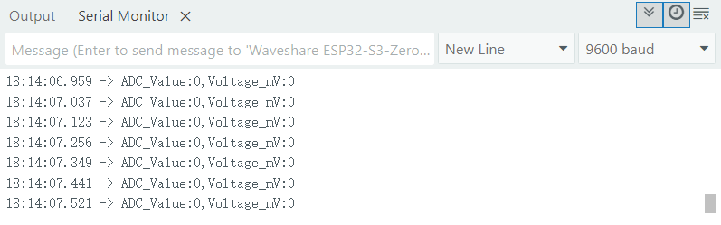
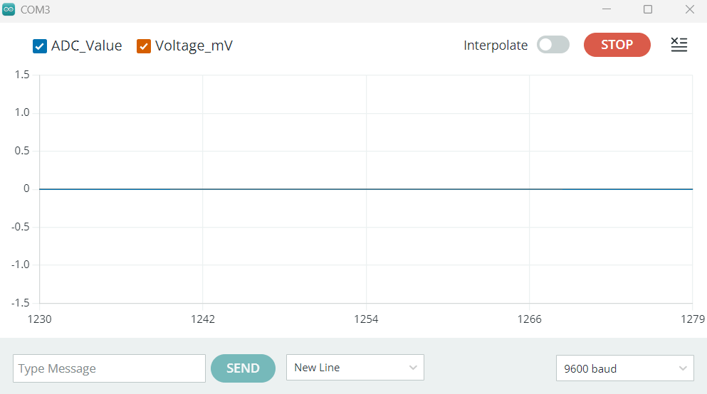
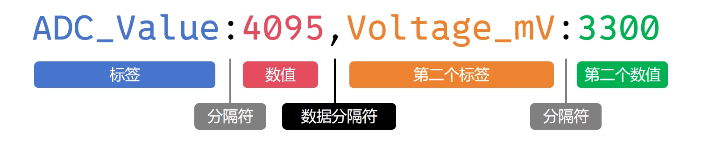
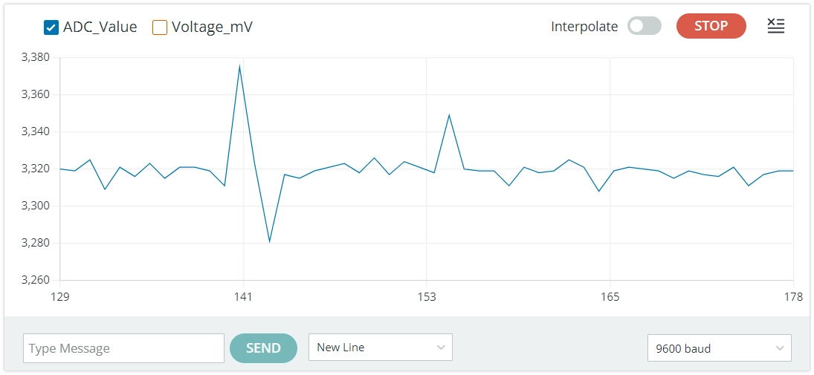

On this page

# Analog Input

Important Note: About Board Compatibility

The core logic of this tutorial applies to all ESP32 development boards, but all operation steps are based on  as an example. If you are using another model of Development Board, please modify the corresponding settings according to your actual situation.

## 1. Analog Signal

**Analog signal**is a device that can**Continuous change**signal.

such as a dimmer knob, can smoothlyGroundadjust lightofBrightness，FromcompletelyTurn offto the brightest,InbetweenYesNoneseveralBrightnesslevel. ThisBrightnessadjustofprocess is to simulateof。and/whileDigital signallike a normal light switch, onlyYes“on”And“off”.

In the real world, many physical quantities such as temperature, light intensity, and sound level are analog, and their changes are continuous and smooth.

For the ESP32, if you need to measure continuously varying signals (e.g., reading a potentiometer or Sensors values), using only `ADC_Value:2048,Voltage_mV:1650` or `ADC_Value:2048,Voltage_mV:1650` Two digital states cannot achieve this. At this point, you need to use **ADC**。

-

**ADC (Analog-to-Digital Converter)**: A device that can convert continuous analog voltage signals (e.g., 0V ~ 3.3V) into digital values that the ESP32 can process.

[SVG diagram]

simply put,ADC like a 0~3.3V betweenofvoltage divided into many “scales”ofruler, letsEachvoltage range allCorrespondinga specificofnumber.ADC how many subdivisions the voltage can be divided intoetc.level, this capability is called**Resolution**. The higher the resolution, the finer the voltage changes that can be detected.

The ESP32's ADC is typically **12-bit**, meaning it can be divided into a total of **2¹²（= 4096）** levels. Therefore, the ADC reading range is **0 ~ 4095**。

- Input voltage is **0V**, the ADC reading is approximately **0**。
- When the input voltage goes from **changes continuously from 0V to 3.3V** , the ADC reading will correspondingly**changes continuously from 0 to 4095**。

 

This way, the ESP32 program can use the `ADC_Value:2048,Voltage_mV:1650` to get an integer between 0~4095, this value directly corresponds to the voltage on the input pin.

## 2. ADC Pins

not allYes ESP32 pinsall supportAnalog Input。need to queryCorrespondingDevelopment BoardofPinfigure/diagramoror chipofmanual, look up the labelYes“ADC”ofPinas/workIsAnalog InputUse。

**It is recommended to prioritize ADC1 channel pins to avoid conflicts with other functions.**

|Chip ModelADC Channel 1 (recommended)ADC Channel 2Reference documentation
|**ESP32**GPIO32 - GPIO39GPIO0, 2, 4, 12-15, 25-27[ESP32 Technical Specification Section 2.2](https://documentation.espressif.com/esp32_datasheet_cn.html#%5B14,%22XYZ%22,56.69,70.87,null%5D)
|**ESP32-C3**GPIO0 - GPIO4GPIO5 (not available)[ESP32-C3 Technical Specification Section 2.3.2](https://documentation.espressif.com/esp32-c3_datasheet_cn.html#%5B21,%22XYZ%22,56.69,785.2,null%5D)
|**ESP32-C6**GPIO0 - GPIO6-[ESP32-C6 Technical Specification Section 2.3.3](https://documentation.espressif.com/esp32-c6_datasheet_cn.html#%5B22,%22XYZ%22,56.69,785.2,null%5D)
|**ESP32-C5**GPIO1 - GPIO6-[ESP32-C5 Technical Specification Section 2.3.3](https://documentation.espressif.com/esp32-c5_datasheet_cn.html#%5B22,%22XYZ%22,56.69,785.2,null%5D)
|**ESP32-S3**GPIO1 - GPIO10GPIO11 - GPIO20[ESP32-S3 Technical Specification Section 2.3.3](https://documentation.espressif.com/esp32-s3_datasheet_cn.html#%5B22,%22XYZ%22,56.69,349.77,null%5D)
|**ESP32-P4**GPIO16 - GPIO23GPIO49 - GPIO54[ESP32-P4 Technical Specification Section 2.3.3](https://documentation.espressif.com/esp32-p4_datasheet_cn.html#%5B22,%22XYZ%22,56.69,785.2,null%5D)
|**Others**--[Espressif Documentation Center (CDP)](https://documentation.espressif.com/zh/home)

## 3. Build the Circuit

Components needed:

- Potentiometer * 1
- Breadboard * 1
- Jumper wires
- ESP32 Development Boards

ESP32-S3-Zero Pinout


 

**Circuit analysis**

Let's understand how this analog signal reading circuit works:

-

**Potentiometer connection:**

**VCC pin**: Connected to ESP32's 3.3V, provides working voltage for the potentiometer
- **GND pin**: Connected to ESP32's GND, forms the circuit loop
- **Signal pin (middle)**: Connected to ESP32's GPIO7 (ADC pin), outputs analog voltage between 0V~3.3V

-

**Potentiometer working principle:**

Inside the potentiometer is a variable resistor, and the resistance can be changed by rotation
- When rotating the potentiometer knob, the output voltage of the signal pin will vary continuously between 0V and 3.3V
- Fully counterclockwise: output close to 0V
- Fully clockwise: output close to 3.3V

## 4. Code

```
// Print the first label and value
Serial.print("ADC_Value:");
Serial.print(analogValue);
// Print separator
Serial.print(",");
// Print the second label and value, and end with println()
Serial.print("Voltage_mV:");
Serial.println(analogVolts);
```

**Running result:**

After flashing the code to the ESP32 Development Boards, open the serial monitor to see continuously displayed values. When you rotate the potentiometer, the value will change accordingly: when the potentiometer is turned to one end, the value is 0; when turned to the other end, the value is 4095.

-

Serial Monitor:

 

-

Serial Plotter:

 

Going deeper: Why doesn't the maximum reading correspond exactly to 3.3V?

You may find that when the input voltage has not yet reached 3.3V,`ADC_Value:2048,Voltage_mV:1650` reading has already reached 4095.
This is a design characteristic of the ESP32 ADC. Its internal core circuit can directly handle a limited voltage range, so it uses an internal attenuator to extend the measurable voltage range.
In the Arduino environment, an attenuation option that can measure the highest voltage is enabled by default (`ADC_Value:2048,Voltage_mV:1650`). According to official documentation, under this setting **ESP32 S3** The ADC reliable measurement upper limit is approximately 3.1V. (Note: Different chips have different measurable input voltage ranges under different attenuation options. See [this table](https://docs.espressif.com/projects/arduino-esp32/en/latest/api/adc.html#analogsetattenuation)。）
Therefore, when the input voltage exceeds 3.1V, the reading will "saturate", i.e., remain at the maximum value of 4095.
For applications reading 0% to 100%, this default setting is sufficient. If you need to optimize accuracy for a specific voltage range, you can learn how to set different attenuation levels. See [Official documentation on analogSetAttenuation](https://docs.espressif.com/projects/arduino-esp32/en/latest/api/adc.html#analogsetattenuation)。
**Recommendation:** For more accurate voltage readings, it is recommended to directly use the `ADC_Value:2048,Voltage_mV:1650` function. This function internally uses factory calibration data (if the chip supports it) to convert raw ADC values to voltage (millivolts).

**Code Analysis**

-

`ADC_Value:2048,Voltage_mV:1650`

Reads the analog voltage value on the specified pin. Returns an integer between 0 ~ 4095, representing the position of the current wiper voltage within the 0V ~ 3.3V range.

Note

When calling `ADC_Value:2048,Voltage_mV:1650` , there is no need to use `ADC_Value:2048,Voltage_mV:1650` Define pin.

-

`ADC_Value:2048,Voltage_mV:1650`

This is an ESP32-specific function. It also reads the analog signal from the specified pin, but directly converts and returns it as a voltage value in millivolts (mV). Its internal implementation also includes calibration for more accurate readings.

-

Serial Output and Plotter Format

```
// Print the first label and value
Serial.print("ADC_Value:");
Serial.print(analogValue);
// Print separator
Serial.print(",");
// Print the second label and value, and end with println()
Serial.print("Voltage_mV:");
Serial.println(analogVolts);
```

This code is used to send collected data via serial port in a specific format.[This format](https://docs.arduino.cc/software/ide-v2/tutorials/ide-v2-serial-plotter/) Not only convenient in**Serial Monitor**, and more importantly, can be read by the Arduino IDE's**Serial Plotter**recognize and plot as curves.

Let's parse the structure of this format against the diagram below:



**Label and value**: Each data item consists of a label and a value, separated by a colon (:). This helps display names in the plotter's legend.

-

**Data separator**: Multiple data items are separated by a data separator (such as comma `ADC_Value:2048,Voltage_mV:1650` , space`ADC_Value:2048,Voltage_mV:1650`or tab character `ADC_Value:2048,Voltage_mV:1650`）Separated. This tells the plotter "one data ends, the next begins"ofkeySignal。

-

**Newline character**: Use `ADC_Value:2048,Voltage_mV:1650` Inso/theYesdataOutputafterAddNewline character。thisNewline characterIs "end of record"offlag, telling the plotter this point in timeofso/theYesData has been sent, drawing can proceedDone.

Ultimately, each line in the serial monitor will display something like `ADC_Value:2048,Voltage_mV:1650` format. In the serial plotter, you will see two curves representing the ADC raw value and voltage value respectively.

## 5. Extension: Reducing Noise

When you stop rotating the potentiometer, you may find that the ADC reading does not stabilize at a single value, but continuously fluctuates within a small range, sometimes even showing larger spikes.



This phenomenon is usually caused by noise. The ESP32's ADC is relatively sensitive to power supply noise and electromagnetic interference from the external environment.

To reduce the impact of noise, there are typically two methods:

-

**Hardware filtering**: Connect a small bypass capacitor (e.g., 100nF ceramic capacitor) in parallel between the ADC input pin and GND to effectively filter out high-frequency noise.

-

**Software filtering**: Take the average of multiple samples in code. For example, read the ADC value 10 times consecutively, then divide their sum by 10 to get a smoother, more stable result.

In most non-critical applications, slight fluctuation can be ignored. However, when you need high-precision readings, you can try the above methods.

## 6. Related Links

- [ADC | Arduino-ESP32 documentation](https://docs.espressif.com/projects/arduino-esp32/en/latest/api/adc.html)

- [analogRead() | Arduino Documentation](https://docs.arduino.cc/language-reference/en/functions/analog-io/analogRead/)

- [Using the Serial Plotter Tool | Arduino Documentation](https://docs.arduino.cc/software/ide-v2/tutorials/ide-v2-serial-plotter/)

- [Analog-to-Digital Converter (ADC) Calibration Driver - ESP32 - - ESP-IDF Programming Guide v5.5 Documentation](https://docs.espressif.com/projects/esp-idf/zh_CN/stable/esp32/api-reference/peripherals/adc_calibration.html#id9)

- [Comparing ADC Performance of Espressif SoCs | Developer Portal](https://developer.espressif.com/blog/2025/08/adc-performance)
