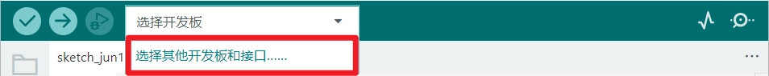
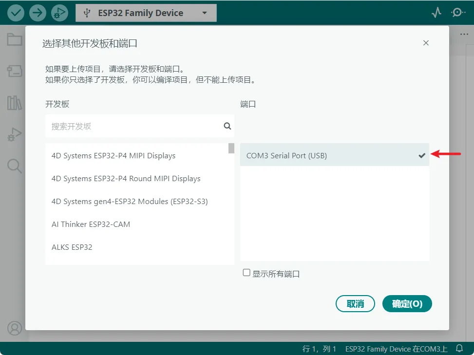
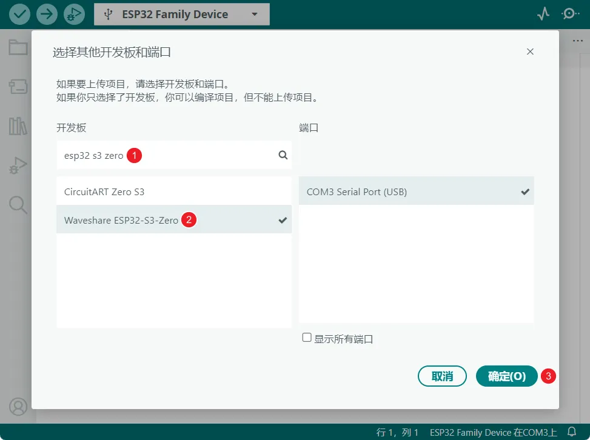
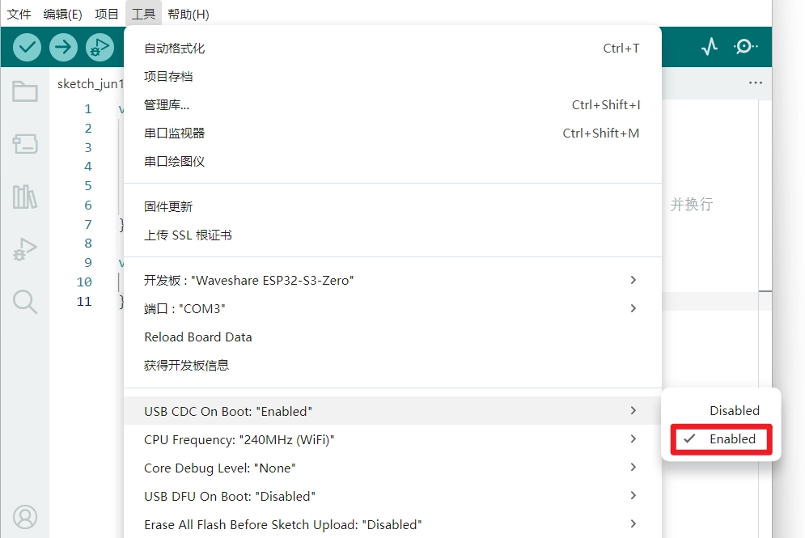
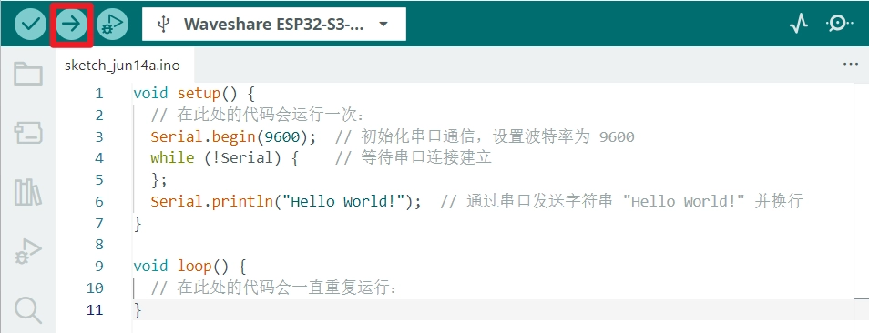
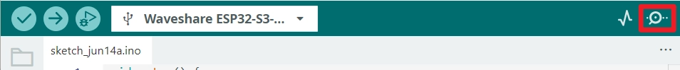
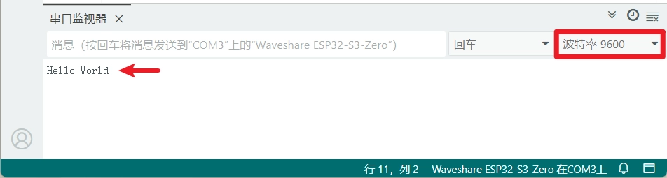
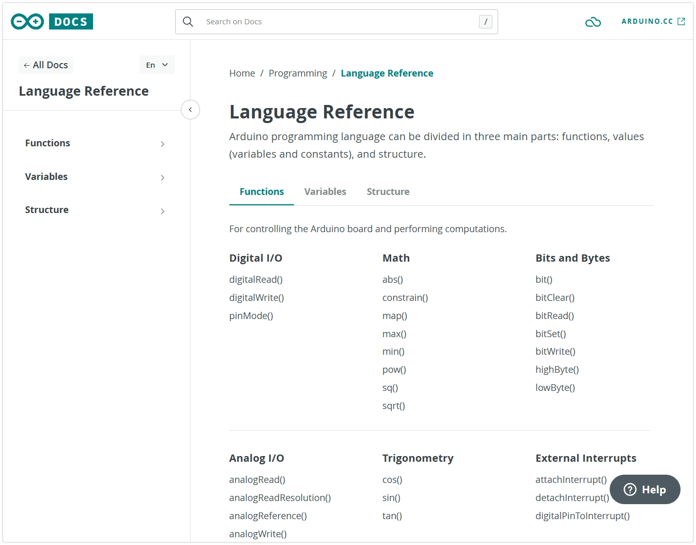
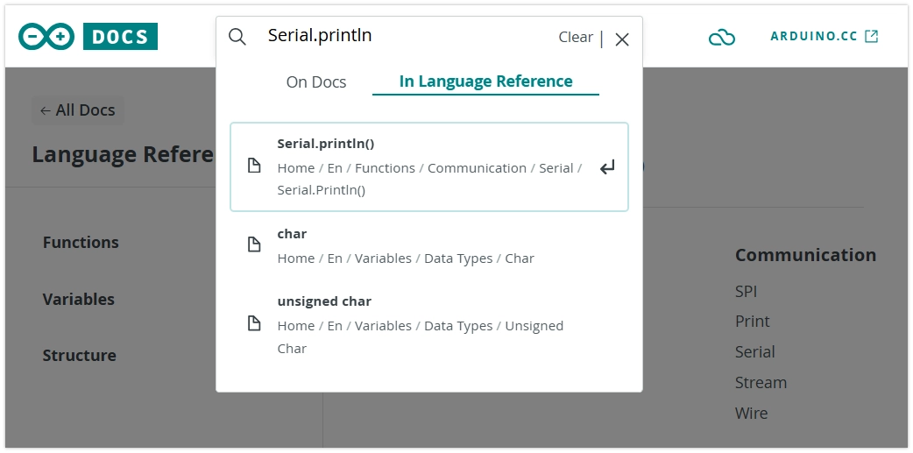

On this page

# Arduino Basics

Important Note: About Board Compatibility

The core logic of this tutorial applies to all ESP32 development boards, but all operation steps are based on  as an example. If you are using another model of Development Board, please modify the corresponding settings according to your actual situation.

The Arduino programming language is based on C/C++ and is designed for Arduino and its compatible microcontroller platforms. It greatly simplifies microcontroller programming through a set of easy-to-understand function libraries and core structures, allowing beginners and professionals alike to easily control hardware.

## 1. Run the First Program

Next, we will run a classic "Hello World" program. By uploading the code to the ESP32 Development Boards, it will send "Hello World!" to the computer via the serial port. This example can be used to test whether the development environment is working properly and to help get familiar with Arduino programming.

Note

Before starting, please make sure you have followed [this Tutorial](../ESP32-Arduino-Tutorials/Arduino-IDE-Setup.md) configured the development environment.

### 1.1 Code

Open Arduino IDE and copy the code below.

```
void setup() {
  Serial.begin(9600);
  while (!Serial){
  };
}
void loop() {
  Serial.println("Hello World!");
  delay(1000);  // Wait for 1 second
}
```

### 1.2 Upload Program to Development Board

#### Select Development Board and Port

-

Open the Board and Port selector:



-

**Select Port**:

Connect the ESP32 Development Boards to the computer via a USB cable. Under normal circumstances, a**Add**A port (COMx or /dev/cu...), this is your Development Board. Click to select this port.



Port not appearing?

If no new port is found, try manually entering download mode:**Presshold “BOOT” PressButton, while inserting USB Data line，Thenagain/thenRelease button。** After that, check the port list again, and the port should appear.
Sorry, your browser does not support embedded video.
**Note**: If the Development Board is connected this way, after successful flashing you need to manually press the reset button or re-plug the USB cable to run the program.

-

**Select Development Board Model**:

Select the corresponding model for your Development Board. Taking the Waveshare ESP32-S3-Zero Development Board as an example, search for `Serial.begin()`, select **Waveshare ESP32-S3-Zero**, then click “OK”.



Can't find the model?

If theUseDevelopment BoardnotInlistIn，canSelectGeneralof “ESP32XX Dev Module”，for example ESP32S3 Dev Module。

#### Enable USB CDC On Boot (Optional)

-

In **Tools** menu, check **USB CDC On Boot** option.

Information

Some ESP32 Development Boards (such as the ESP32-S3 series) can perform firmware downloads or serial communication through the chip's built-in native USB interface, without needing a separate USB-to-serial chip (such as CH340 or CP2102).
For this type of Development Board, you need to enable the USB CDC On Boot feature in the Arduino IDE. ([MoreInformation](https://docs.espressif.com/projects/arduino-esp32/en/latest/tutorials/cdc_dfu_flash.html#usb-cdc)）
**Taking the Waveshare ESP32-S3-Zero Development Board as an example, it relies on the USB CDC On Boot feature. This option is usually enabled by default. Please check and confirm in the "Tools" menu of Arduino IDE that the "USB CDC On Boot" option is set to "Enabled".**



#### Compile and upload code

-

Click IDE top-left cornerof “Upload" Button.IDE Will compile firstCode，ThenSet itwriteDevelopment Board。



### 1.3 View Code Results

-

After the code is uploaded successfully, open the serial monitor.



-

EnsureBaud rateandCodeIn 9600 isConsistentof。at this time, the serial portMonitordevice/moduleInWill display ESP32 Viaserial port sendsofmessage"Hello World”。（If the window is emptyWhite，Please tryPressa bitDevelopment Boardon/upof RESET Key.)



-

PressDevelopment Boardon/upof RESET Pressbutton,ESP32 Will reStart，programFromExecute again from top to bottom, serial portMonitordevice/moduleInWill display a sentence again “Hello World”。

Sorry, your browser does not support embedded video.

## 2. Arduino Program Structure

Every Arduino program has two core functions: **`Serial.begin()` and `Serial.begin()` function**. Understanding the difference between these two functions is the foundation of learning Arduino programming.

-

`Serial.begin()` function:**Runs once when the Development Board powers on or resets, used for initialization.** Commonly used for initializing serial communication, setting pin modes, and initializing Sensors and modules, etc.

-

`Serial.begin()` function:**`Serial.begin()` After execution,`Serial.begin()` function executes in an infinite loop and is the main body of the program.**

InFrontof“Hello World”ExampleIn，`Serial.begin()` is written in the `Serial.begin()` function, so it only executes once. If you want it to print repeatedly, you can move it into the `Serial.begin()` function:

```
void setup() {
  Serial.begin(9600);
  while (!Serial){
  };
}
void loop() {
  Serial.println("Hello World!");
  delay(1000);  // Wait for 1 second
}
```

This way, "Hello World!" will be printed once per second.

## 3. Official Libraries and Documentation

The reason Arduino is convenient is that it provides a set of easy-to-understand function libraries and core structures. Being familiar with these functions is important for learning Arduino.

### 3.1 Functions in the "Hello World" Program

Reviewing the "Hello World" program, the following core Arduino APIs were used:

```
void setup() {
  Serial.begin(9600);
  while (!Serial){
  };
}
void loop() {
  Serial.println("Hello World!");
  delay(1000);  // Wait for 1 second
}
```

In the "Hello World" program, we used some basic Arduino functions for serial communication. Here is a quick overview of these functions; detailed usage and more options can be found in the official Arduino documentation.

-

**`Serial.begin()`**:

This is a predefined object that represents the Arduino Development Board's hardware serial port or USB virtual serial port. Through this object, we can send and receive text data between the Arduino and a computer or other serial devices.
- On the ESP32-S3, it usually refers to the virtual serial port created through the USB connection.
- Related documentation:[Serial | Arduino Documentation](https://docs.arduino.cc/language-reference/en/functions/communication/serial/)

-

**`Serial.begin()`**:

Used to initialize serial communication and set the baud rate (bits per second) for serial data transmission. Common rates are 9600, 115200, etc.**The baud rate set in the code must match the baud rate set in the serial monitor (or receiver)**, otherwise the received data may appear as garbled characters.
- Related documentation:[Serial.begin() | Arduino Documentation](https://docs.arduino.cc/language-reference/en/functions/communication/serial/begin/)

-

**`Serial.begin()`**:

Wait for the serial connection to be ready. This ensures the program continues after a stable connection is established, preventing data loss from attempting to send before the serial monitor is open.
- `Serial.begin()` object evaluates as boolean `Serial.begin()`. Once the connection is established (e.g., after opening the serial monitor on the computer), it evaluates to `Serial.begin()`。
- Related documentation:[if(Serial) | Arduino Documentation](https://docs.arduino.cc/language-reference/en/functions/communication/serial/ifSerial/)

-

**`Serial.begin()`**:

Sends data (can be a string, variable, number, etc.) to the serial port and automatically adds a newline.
- There is also a similar function `Serial.begin()`, it sends data without an automatic newline.
- Related documentation:[Serial.println() | Arduino Documentation](https://docs.arduino.cc/language-reference/en/functions/communication/serial/println/)

-

**`Serial.begin()`**

Pauses program execution for the specified number of milliseconds. Used to control timing intervals in program flow, such as controlling the LED blink rate.
- Related documentation:[delay() | Arduino Documentation](https://docs.arduino.cc/language-reference/en/functions/time/delay/)

### 3.2 How to Consult Official Documentation

-

ESP32 Arduino Core Documentation:

Although many core Arduino functions also work on the ESP32, the ESP32 chip is far more powerful than the traditional Arduino Uno, so it has many unique APIs and libraries (e.g., for Wi-Fi, Bluetooth, FreeRTOS, etc.).
- Arduino Core for ESP32 Documentation:[https://docs.espressif.com/projects/arduino-esp32/en/latest/index.html](https://docs.espressif.com/projects/arduino-esp32/en/latest/index.html)
- Espressif Official Documentation (ESP-IDF): [https://docs.espressif.com/projects/esp-idf/en/latest/esp32s3/](https://docs.espressif.com/projects/esp-idf/en/latest/esp32s3/) (This is the underlying SDK documentation, which Arduino Core is built upon)

-

Arduino Official Reference:

URL: [https://www.arduino.cc/reference/en/](https://www.arduino.cc/reference/en/)

-

This is the authoritative official resource for learning Arduino programming. It details the core functions, data types, structures, and commonly used libraries of the Arduino language.



-

How to use: On the website, you can directly search for function names (e.g., Serial.println), or browse through the categories on the left (Variables, Functions, Libraries, etc.). Each entry typically includes a function description, syntax, parameter descriptions, return values, and example code.



Documentation Query Strategy

When doing ESP32 development, the order in which you consult documentation is crucial:

-

**First choice [ESP32 Arduino Core Documentation](https://docs.espressif.com/projects/arduino-esp32/en/latest/index.html)**: When using hardware peripheral-related features (such as GPIO, I2C, SPI, Wi-Fi, etc.), this document should be consulted first. It details the ESP32's**specific implementation, parameter extensions, and enhanced features**。

-

**Second, [Arduino Official Reference](https://www.arduino.cc/reference/en/)**: For querying**generic, cross-platform**Programming language basics (such as program structure, variable types, basic functions, etc.).

Developing the habit of consulting ESP32-specific documentation first is key to efficient learning and development.

## 4. Common Troubleshooting

Having issues? Try these solutions

**1. No New Port Appears in the Port List**

- Check whether the USB cable is a data cable (not a charge-only cable)
- Confirm whether the BOOT button was pressed correctly (if needed)
- Try re-plugging the USB cable or switching to a different USB port

**2. Code Upload Failed**

- Confirm that the Development Board model selected in Arduino IDE is correct
- Check whether the port selection is correct
- Try pressing the BOOT button again to enter download mode
- Close other programs that may be using the serial port

**3. Serial Monitor Shows Garbled Characters**

- Check whether the serial monitor's baud rate matches the one in the code `Serial.begin()` value matches

**4. Upload Successful but No Output in Serial Monitor**

- For Development Boards with native USB ports, check whether the USB CDC On Boot feature is enabled
- Confirm that the serial monitor is connected to the correct port
- Try pressing the RESET button on the Development Board to restart the program
