On this page

# Install and Configure Arduino IDE

Important Note: About Board Compatibility

The core logic of this tutorial applies to all ESP32 development boards, but all operation steps are based on  as an example. If you are using another model of Development Board, please modify the corresponding settings according to your actual situation.

Arduino IDE is an open-source development environment that, in addition to supporting Arduino microcontrollers, is compatible with various third-party Development Boards including ESP32, enabling developers to easily write and upload code to these powerful Wi-Fi and Bluetooth integrated chips for IoT projects. It has a rich collection of libraries and example codes, and is widely used in prototyping and education, making it the preferred platform for beginners. This series of Tutorials will use Arduino IDE as the development environment.

## 1. Download and Install Arduino IDE

-

Go to [Arduino Official Website](https://www.arduino.cc/en/software/) Download the Arduino IDE installer.

[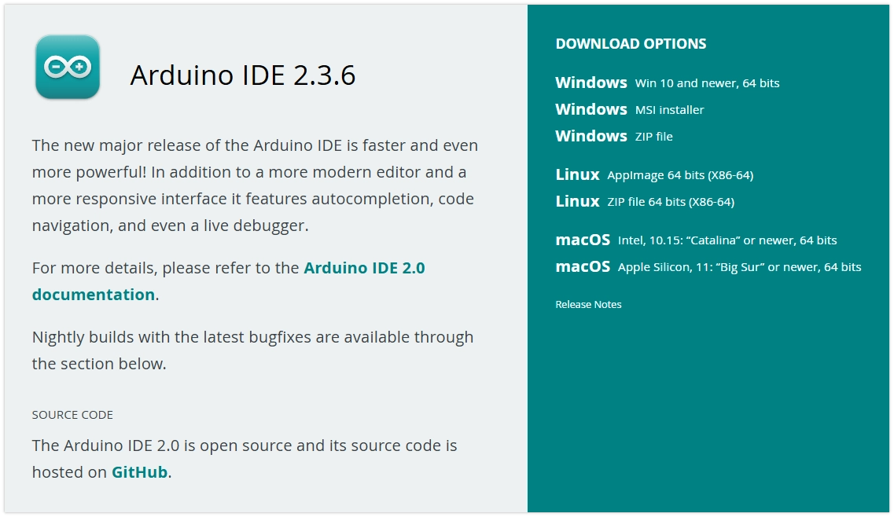](https://www.arduino.cc/en/software/)

Tip

If the download is slow or fails, you can visit [Arduino Chinese Community](https://arduino.me/download), use a cloud drive to download installation packages provided by the community.

-

Run the installer to install Arduino IDE. During installation, it is recommended to use the default settings and select**pure English path**to install.

Note

Having Chinese characters in the installation path may cause issues.

## 2. Configure Arduino IDE

-

After installation, launch Arduino IDE.

-

On first launch, the IDE may automatically download and install core library files and drivers. If the operating system prompts for driver installation or network security, it is recommended to allow it. The Information shown in the output window below is the installation process prompt Information, which is normal and requires no action.

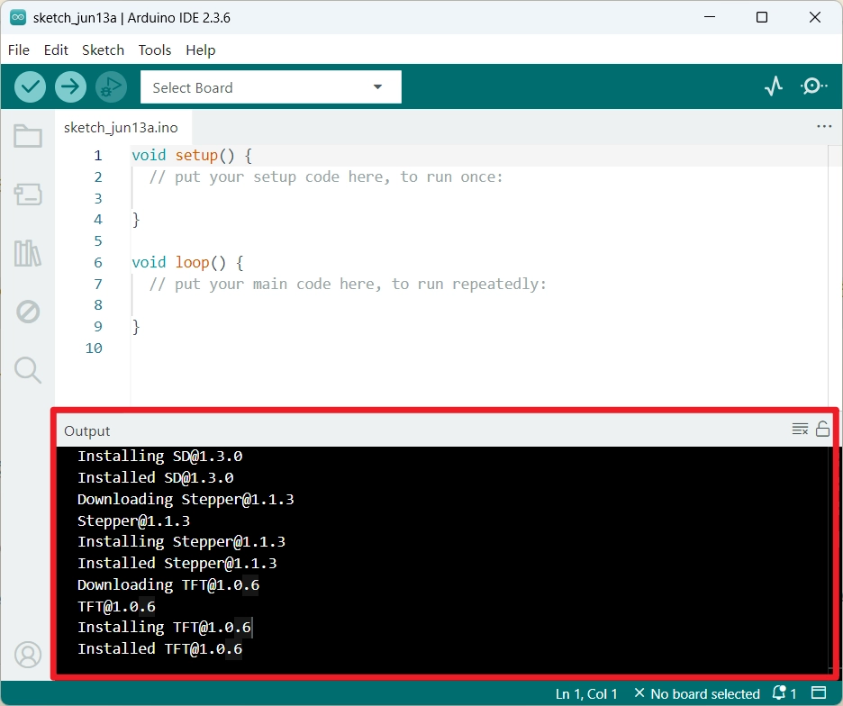

-

Arduino IDE displays an English interface by default, but supports switching to Chinese. Click "File - Preferences" to open settings.

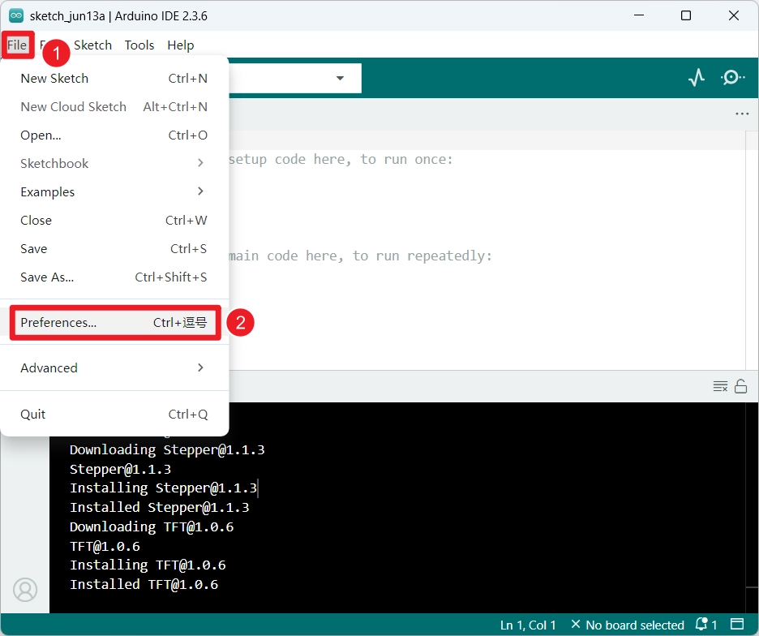

Find the "Language" option in the settings interface, select "Chinese", then click "OK". Arduino IDE will automatically restart and switch to the Chinese interface.

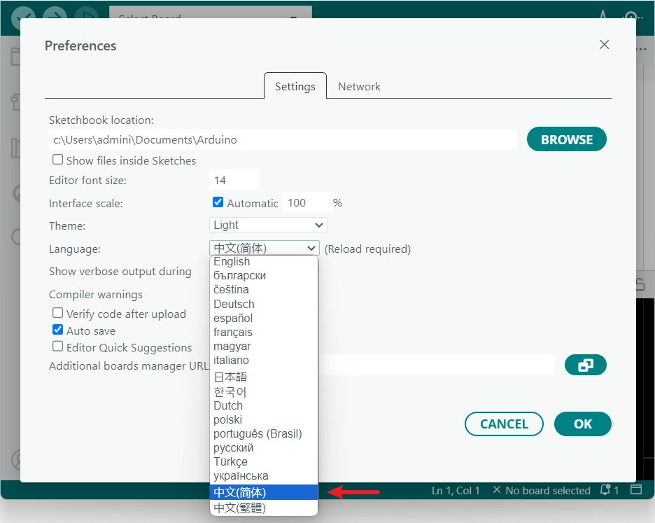

-

Additionally, in "Preferences" you can also adjust interface scaling, font size, theme style, and default project save location, etc.

## 3. Install ESP32 Development Boards Library

To use Arduino IDE for ESP32 development, you need to add ESP32 Development Boards related configurations and install the relevant libraries.

Tip

If you are unable to install through the Arduino IDE Board Manager online, you can try ****。

- Users in mainland ChinaManual installationUsers in other regions

Open "File" -> "Preferences", find "Additional Board Manager URLs" in the "Settings" interface, paste the following link and click OK:

Information

This is a domestic mirror provided by Espressif. See [this link](https://docs.espressif.com/projects/arduino-esp32/en/latest/installing.html#installing-using-arduino-ide) 。

```
https://espressif.github.io/arduino-esp32/package_esp32_index.json
```

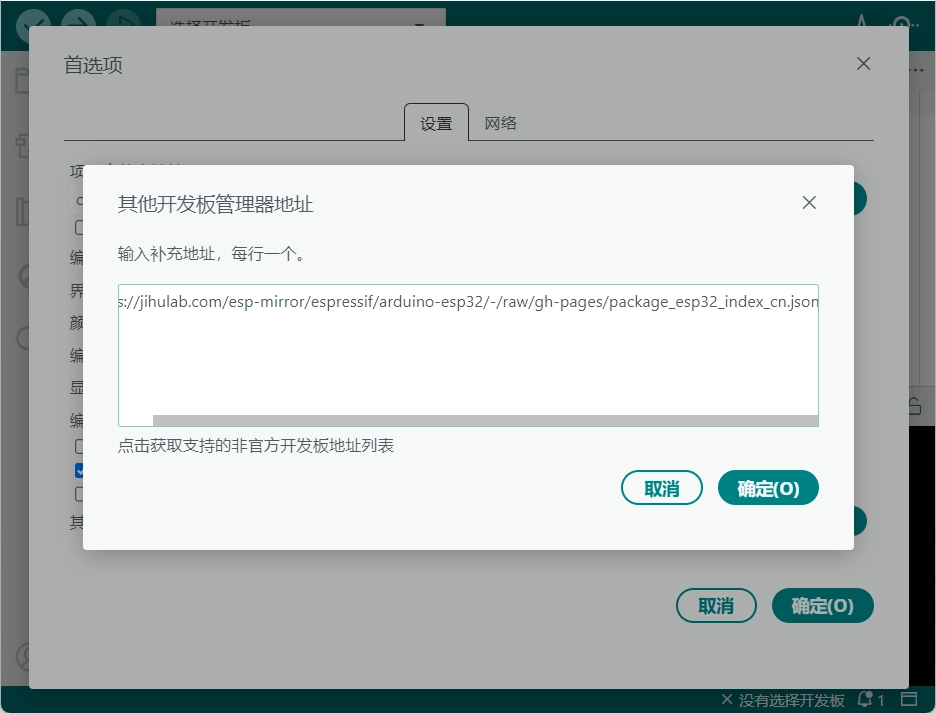

-

Open the "Board Manager",**Search for "esp32" and select the version with the "-cn" suffix to install**. After installation, restart Arduino IDE to use it

Tip

In mainland China,**Select the version with the "-cn" suffix to install**for more stable download speeds.
If installation fails, you can click install again to try reinstalling.

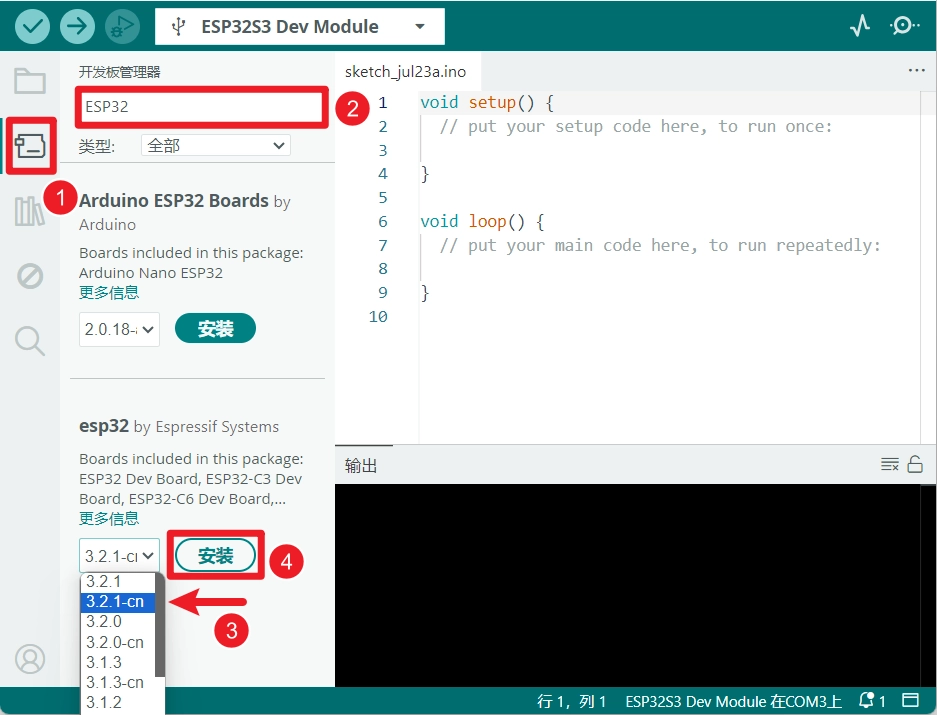

-

Open `.zip` folder, check whether there is a `.zip` folder, if it exists, delete it.

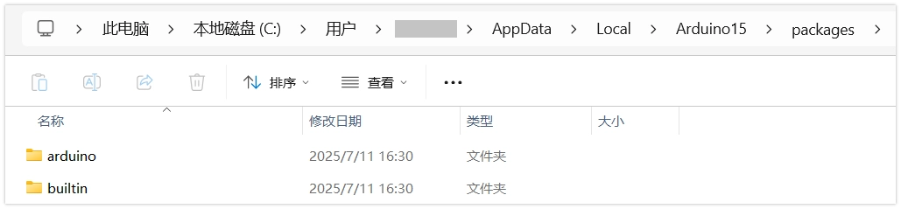

-

Open "File" -> "Preferences", find "Additional Board Manager URLs" in the "Settings" interface, paste the following link and click OK:

Information

This is a domestic mirror provided by Espressif. See [this link](https://docs.espressif.com/projects/arduino-esp32/en/latest/installing.html#installing-using-arduino-ide) 。

```
https://espressif.github.io/arduino-esp32/package_esp32_index.json
```


-

Download offline package

[ESP32_Arduino offline package download link](https://pan.baidu.com/s/1va753JphiM4d2DEJYSb13A?pwd=wxdz)

Download the corresponding version as needed,**It is recommended to download the latest version**。

Double-click to extract the file after downloading.

-

Copy the `.zip` folder, copy to `.zip` folder under the

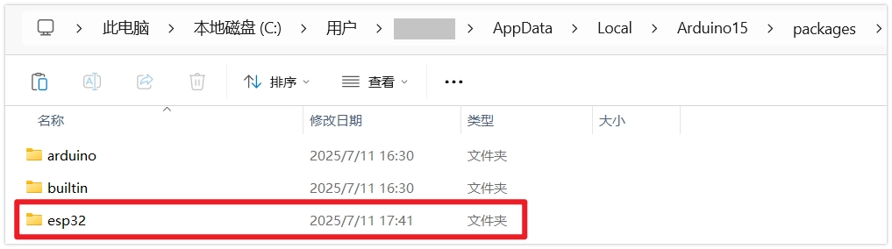

-

Reopen Arduino, and enter the Board Manager to confirm that the esp32 library is installed.

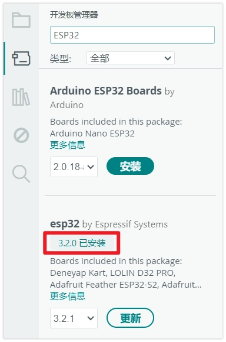

-

Open "File" -> "Preferences", find "Additional Board Manager URLs" in the "Settings" interface, paste the following link and click OK:

Information

This step can be skipped because Arduino IDE has already indexed ESP32 in the Board Manager, but updates may not be timely. Adding manually ensures you get the latest ESP32 libraries as soon as possible.

```
https://espressif.github.io/arduino-esp32/package_esp32_index.json
```

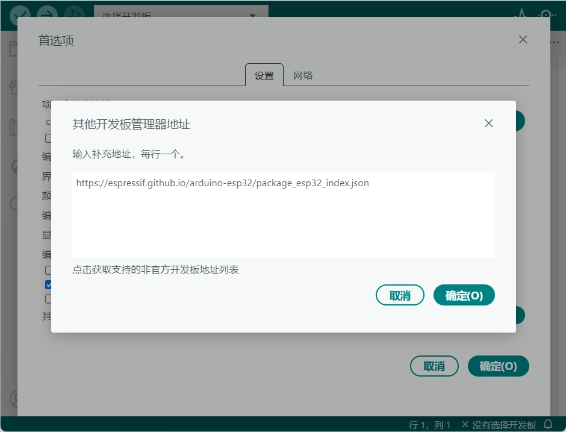

-

Open the "Board Manager", search for "esp32" and install. After installation, restart Arduino IDE to use it

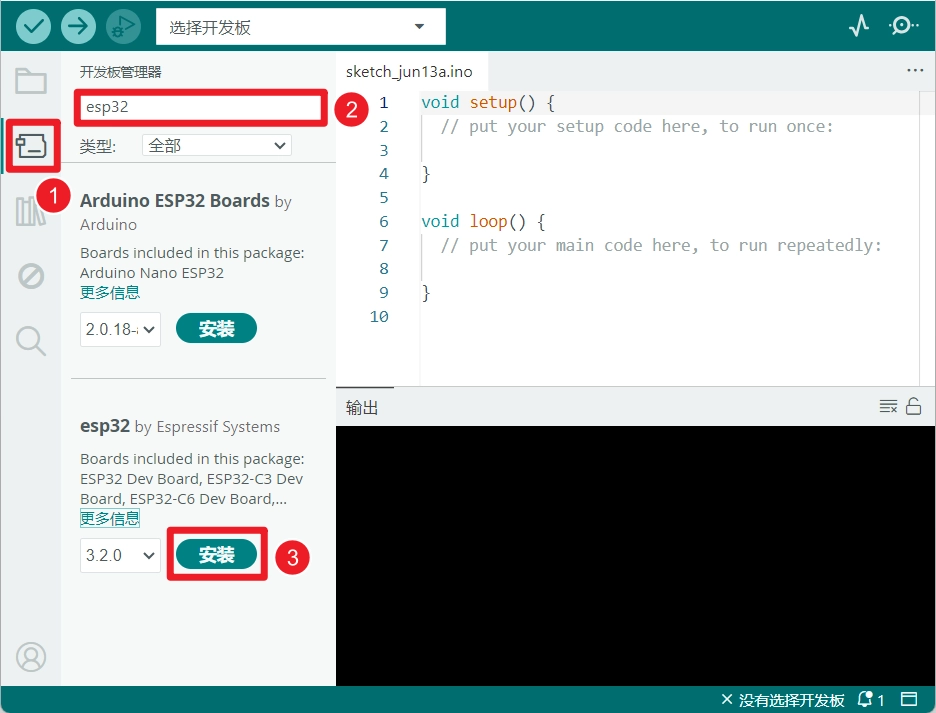

## 4. Install Libraries (As Needed)

In the Arduino ecosystem, a "Library" is a pre-written code package used to simplify programming for specific tasks, such as driving Sensors, controlling Displays, network connectivity, or data processing. Using libraries avoids writing code from scratch, allowing developers to focus on the core logic of the project and improve development efficiency.

Depending on the source and distribution method of the library, there are several common installation methods:

- Via Library ManagerManual installationInstall via .zip

Most libraries can be installed through the Arduino IDE Library Manager.

Select "**Tools > Manage Libraries...**", or click the sidebar **Library Manager icon**。

-

Enter the target library name in the search bar, and the search results will be displayed in alphabetical order. You can view the library's description and author Information. After finding the library you need, click "**Install**" button, the system installs the latest version by default.

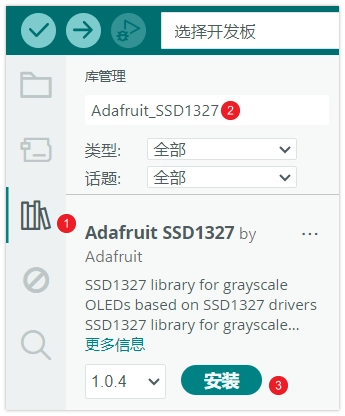

-

Wait for the installation to complete.

This method is suitable for installing one or more library folders provided with our product example packages at once. These libraries are typically versions that have been specially selected or adapted to ensure the examples run stably.

-

Find the product example package you downloaded and extracted. Typically, all necessary library files are stored together in a folder named `.zip` folder.

-

Copy the `.zip` under the **all subfolders**, completely copy it to the Arduino IDE library folder.

How to find the Arduino library folder?

The default path for the Arduino library folder is usually:`.zip`。
You can also do this in Arduino IDE through **File > Preferences**, view “**Project folder location**" to quickly locate it. The library folder (`.zip`) is located at that path. If the `.zip` folder does not exist, you can manually create one.

-

Restart Arduino IDE to ensure all newly installed libraries are properly loaded.

This is a semi-automatic manual installation method, suitable for downloading from the internet `.zip` format library file.

-

In the menu bar, select "Sketch > Include Library > Add .ZIP Library...".

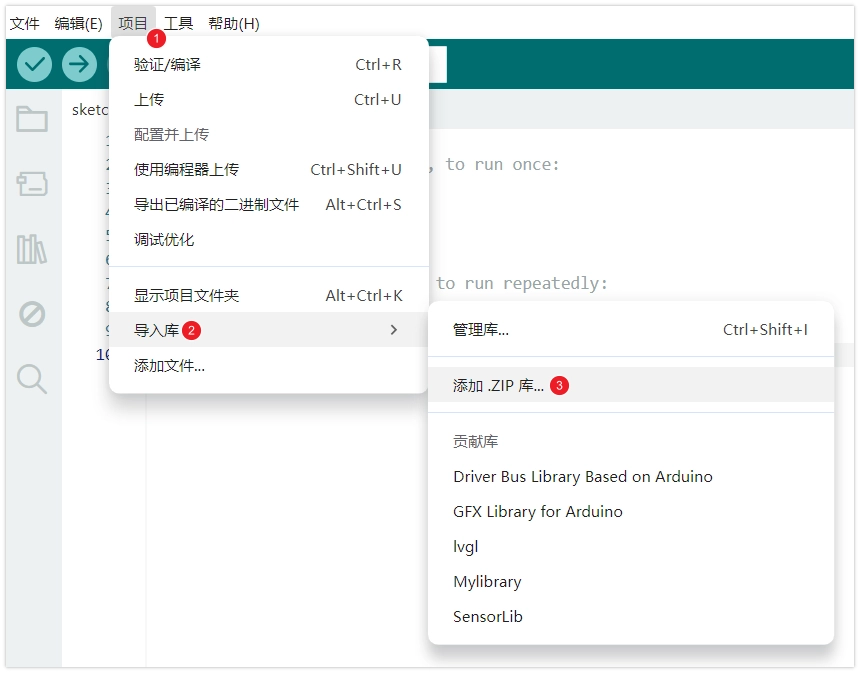

-

In the file selection dialog that pops up, find and select the downloaded `.zip` library file, then click "Open".

-

The IDE will automatically extract the file and place it in the correct library folder.

## 5. Arduino IDE Interface Overview

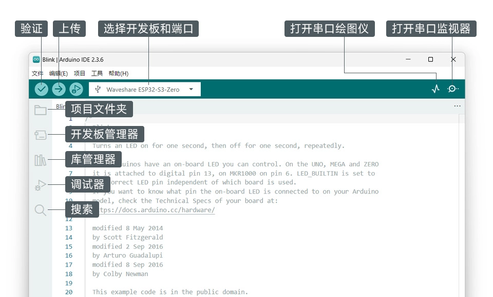
