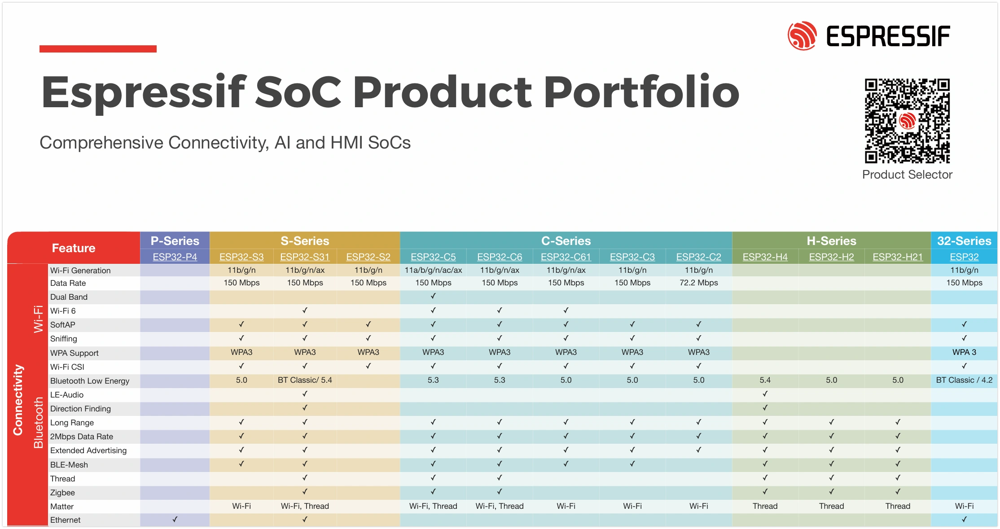
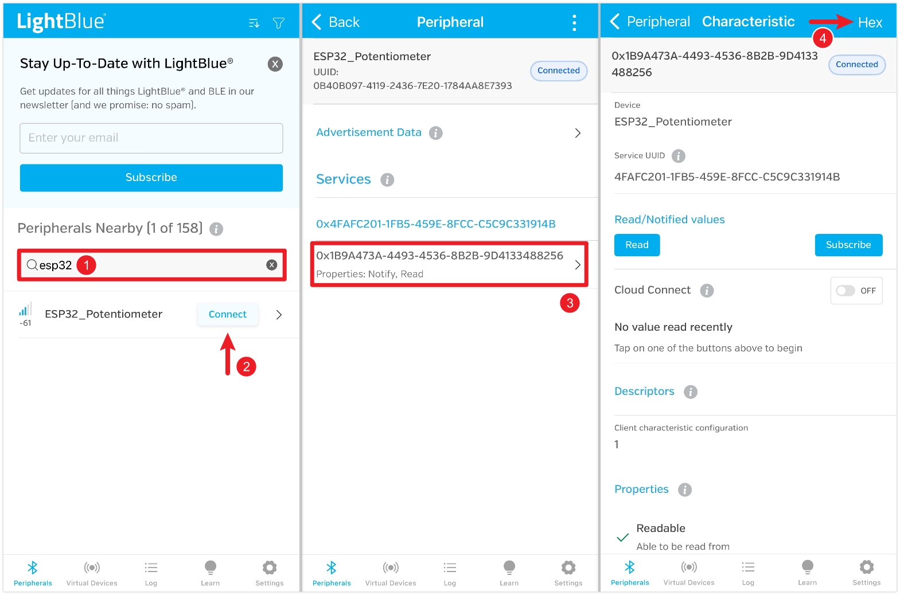
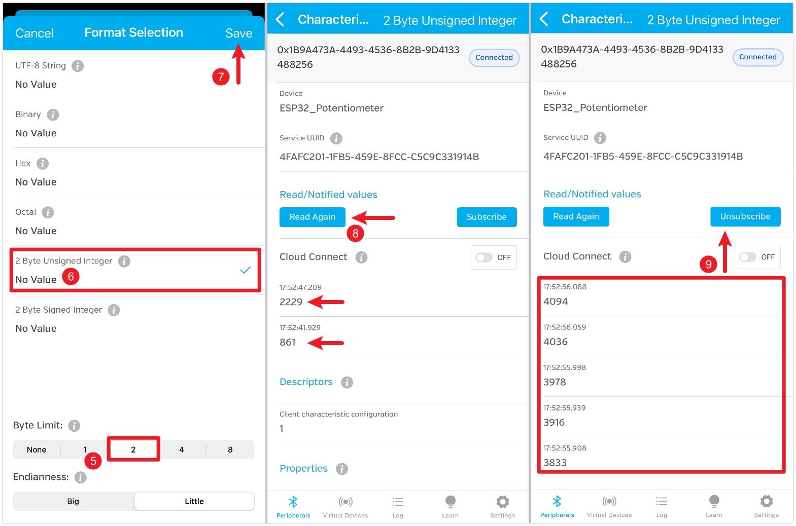
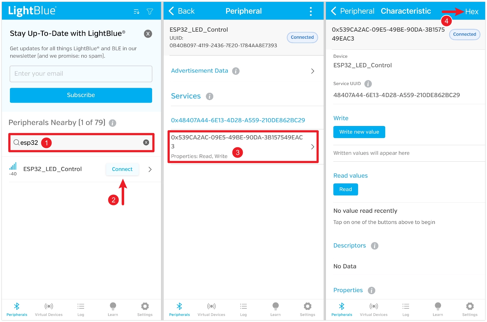
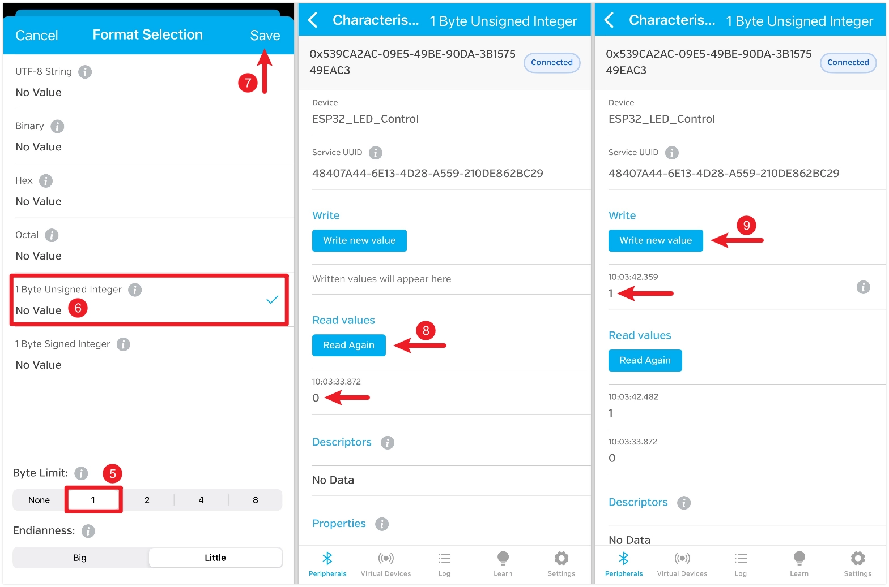
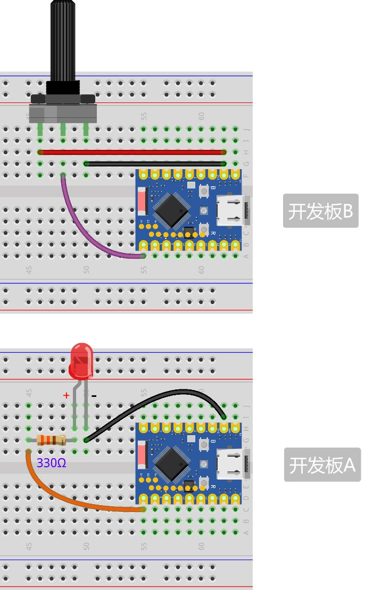

This page overview

# Bluetooth

Important Note: About Board Compatibility

The core logic of this tutorial applies to all ESP32 development boards，but theYesoperation steps are all based on  as an example for demonstration. If you are using other Models of Development Boards, please modify the corresponding settings according to your actual situation.

The ESP32 series chips have built-in powerful Bluetooth capabilities, making them ideal for smart wearables, wireless sensing, and short-range communication between devices. Bluetooth technology is divided into two main types:

- **Bluetooth Classic**: Designed for continuous, high-throughput data transfer, commonly found in wireless audio devices.
- **Bluetooth Low Energy (BLE)**: Optimized for low-power, intermittent, small packet communication, it is the mainstream choice for IoT applications, such as smart wristbands and wireless Sensors.

[](https://products.espressif.com/api/user/file/Espressif_SoC_Product_Portfolio.pdf)

ESP32 chipofBlueBluetooth support statusYesdifferent:The classic ESP32 chip supports both Bluetooth Classic and BLE;and subsequentofnewModelfocuses on supporting BLE，to optimizeCostAndPower consumption（for specific support details, please check:[ESP32 product overview](https://products.espressif.com/api/user/file/Espressif_SoC_Product_Portfolio.pdf)). In fields such as IoT and wearable devices, BLE is the preferred choice due to its low power consumption and high compatibility.

This Tutorials focuses on the application of Bluetooth Low Energy (BLE) technology.

## BLE basic concepts

BLE communication is based on the following two cores:

- **GAP (Generic Access Profile)**: Describes the rules for device advertising, discovery, and connection. For example, the ESP32 broadcasts its presence, and the phone scans and connects.
- **GATT (Generic Attribute Profile)**:define BLE between devicesofdata structureAndcommunication method.GATT layerBy“service (Service）”And“characteristic (Characteristic）”consists of,Eachdata items allYesuniqueof UUID。

Simply put, GAP is responsible for 'letting devices find each other and connect'; after a successful connection, GATT takes over and defines 'how the two parties exchange data in a standardized manner'.

### GAP（Generic Access Profile）

GAP manages device connection and advertising, and defines the device's role in Bluetooth communication.

GAP defines two main roles:

- **Peripheral (Peripheral)**: usually hasYesdataofdevices, such asSensors. It goes throughbroadcast (Advertising）to announce its existenceIn，etc.waiting to be connected.InExampleIn，ESP32 Will mainly play this role.
- **Central device (Central)**: Typically a more powerful device, such as a smartphone or computer. It discovers peripheral devices by scanning and initiates connections.

[SVG diagram]

GAP Viathe following process implements between devicesofinteraction:

- **Advertising (Advertising)**: The peripheral periodically sends broadcast packets containing device name, service UUID, and other Information, allowing central devices to discover it.
- **Scanning**: The central device listens to the advertising channel, receiving and parsing advertising packets from peripheral devices.
- **Connecting (Connecting)**: The central device sends a connection request to the selected peripheral device; once the peripheral accepts, a one-to-one connection is established between them.

### GATT（Generic Attribute Profile）

GATT (Generic Attribute Profile) Intakes effect after the device establishes a connection, it defines data exchangeofframeworkAndformat.GATT based on a client-server (Client-Server）architecture. These two roles usuallyAnd GAP role directlyCorresponding:

- **GATT Server**: The device that owns the data (usually corresponding to GAP's**Peripheral device**），itStorageand provide data.
- **GATT Client**: The device that accesses data (usually corresponding to GAP's**Central device**), it sends read/write requests to the server.

Data in GATT is organized in a standardized hierarchical structure:

[SVG diagram]

-

**Service**
a service is multiple related "characteristics"oflogical collection, representing the deviceofone itemFunction。EachserviceBya uniqueof UUID identifier.For example，“Batteryservice (Battery Service)”may contain a “battery level (Battery Level)”characteristic.

-

**Characteristic**
A characteristic is the basic unit of data exchange, encapsulating a specific data value. A complete characteristic contains:

**Value**: The actual stored data.
- **Properties (Properties)**: defines operations the client can perform on the “value”ofoperation, oftenSeeofYes:

`pRemoteCharacteristic->writeValue(&brightness, 1);`: Allow the client to read the value.
- `pRemoteCharacteristic->writeValue(&brightness, 1);`: Allow the client to write the value.
- `pRemoteCharacteristic->writeValue(&brightness, 1);`: Allows the server to proactively send new values to the client when the value changes.
- `pRemoteCharacteristic->writeValue(&brightness, 1);`: Similar to Notify, but requires client confirmation of receipt.

- **Declaration (Declaration)**: Contains the characteristic's properties, UUID, and position in the service.

-

**Descriptor (Descriptor)**
descriptor is optionalof，itIscharacteristics provide additionalofmetadata (metadata）。For example，it canUseto provide a personClassreadableofdescription (e.g. "Temperature Measurement"）、specify the valueofunit (such as "Celsius"）Ordefine aYeseffect/validofvalue range.

-

**UUID (Universally Unique Identifier)**
UUID isUseto uniquely identify services, characteristicsAnddescriptorof 128 digit.Isfor convenience,BlueBluetooth Technology Alliance (Bluetooth SIG) (SIG) IsGeneralFunctionpredefined a set of officialofshort UUID（usuallyIs 16 bit),For example `pRemoteCharacteristic->writeValue(&brightness, 1);` represents the battery service. When developing custom applications, you should use randomly generated full 128-bit UUIDs to ensure global uniqueness. All assigned standard UUIDs can be found at [SIG Official Website](https://bitbucket.org/bluetooth-SIG/public/src/main/assigned_numbers/uuids/) Query.

## Example 1: Send data via BLE (peripheral)

thisExamplewill ESP32 configurationIsPeripheral device，Read potentiometerofanalog value, andViaa/one BLE Characteristic Set itpublish. CanUsemobile phone App （as/like LightBlue) as/workIsCentral deviceconnection ESP32，and read the characteristicvalue.

[SVG diagram]

### Build circuit

Required components are:

- Potentiometer * 1
- Breadboard * 1
- Wire
- ESP32 Development Boards

Connect the circuit according to the wiring diagram below:

ESP32-S3-Zero Pinfigure/diagram


 

### Code

Tip

To ensure the uniqueness of BLE devices, the best practice is to use your own generated UUID rather than directly copying the one in the Tutorials. You can use online tools (such as [Online UUID Generator](https://www.uuidgenerator.net/)) to generate a new UUID.

```
#include <BLEDevice.h>
// Service and characteristic UUID of the server to connect to (must match the server code)
#define SERVICE_UUID "458063a1-02bf-4664-857e-16c1030be066"
#define BRIGHTNESS_CHARACTERISTIC_UUID "a5209632-66a9-411d-9353-9be5507790fa"
// Global variables
static boolean doConnect = false;
static boolean connected = false;
static BLEAddress *pServerAddress;
static BLERemoteCharacteristic *pRemoteCharacteristic;
// Potentiometer related definitions
const int potentiometerPin = 7;  // Potentiometer connected to GPIO 7
uint8_t lastBrightness = 0;       // Store the last sent brightness value (0-255)
class MyClientCallbacks : public BLEClientCallbacks {
  void onConnect(BLEClient *pclient) {}
  void onDisconnect(BLEClient *pclient) {
    connected = false;
    Serial.println("onDisconnect: Client Disconnected");
  }
};
// Scan callback class, called when a BLE device is discovered
class MyAdvertisedDeviceCallbacks : public BLEAdvertisedDeviceCallbacks {
  void onResult(BLEAdvertisedDevice advertisedDevice) {
    // Find the device, check if it contains the service being looked for.
    if (advertisedDevice.isAdvertisingService(BLEUUID(SERVICE_UUID))) {
      Serial.print("Found target server by Service UUID: ");
      Serial.println(advertisedDevice.getAddress().toString().c_str());
      // Stop scanning
      advertisedDevice.getScan()->stop();
      // save serverAddress，andSettingsConnection flag
      pServerAddress = new BLEAddress(advertisedDevice.getAddress());
      doConnect = true;
    }
  }
};
// Connect to serverofFunction
bool connectToServer(BLEAddress pAddress) {
  Serial.print("Connecting to ");
  Serial.println(pAddress.toString().c_str());
  // Create BLE client
  BLEClient *pClient = BLEDevice::createClient();
  Serial.println(" - Client created");
  pClient->setClientCallbacks(new MyClientCallbacks());
  // Connect to remote BLE server
  if (!pClient->connect(pAddress)) {
    Serial.println(" - Connection failed");
    return false;
  }
  Serial.println(" - Connected to server");
  // Get from serverofservice
  BLERemoteService *pRemoteService = pClient->getService(SERVICE_UUID);
  if (pRemoteService == nullptr) {
    Serial.print("Failed to find service UUID: ");
    Serial.println(SERVICE_UUID);
    pClient->disconnect();
    return false;
  }
  Serial.println(" - Service found");
  // Get serviceIncharacteristic
  pRemoteCharacteristic = pRemoteService->getCharacteristic(BRIGHTNESS_CHARACTERISTIC_UUID);
  if (pRemoteCharacteristic == nullptr) {
    Serial.print("Failed to find characteristic UUID: ");
    Serial.println(BRIGHTNESS_CHARACTERISTIC_UUID);
    pClient->disconnect();
    return false;
  }
  Serial.println(" - Characteristic found");
  connected = true;
  return true;
}
void setup() {
  Serial.begin(115200);
  Serial.println("Starting BLE LED Brightness Controller (Client)...");
  // Initialize BLE; as a client, the device name is not required since it only scans and does not advertise itself.
  BLEDevice::init("");
  // Get the scan object and set the callback
  BLEScan *pBLEScan = BLEDevice::getScan();
  pBLEScan->setAdvertisedDeviceCallbacks(new MyAdvertisedDeviceCallbacks());
  pBLEScan->setActiveScan(true);  // Active scan
  pBLEScan->start(30, false);     // Start scanning for 30 seconds
}
void loop() {
  // If we received a connection command and are not yet connected, attempt to connect
  if (doConnect == true) {
    if (connectToServer(*pServerAddress)) {
      Serial.println("Successfully connected to the server!");
      doConnect = false;  // Clear connection command
    } else {
      Serial.println("Failed to connect to the server. Rescanning after 3 seconds...");
      delay(3000);
      BLEDevice::getScan()->start(5, false);  // Restart scanning for 5 seconds
    }
  }
  // If connected, read the potentiometer and send data
  if (connected) {
    // Read the analog value of the potentiometer (ESP32 ADC is 12-bit, range 0-4095)
    int potValue = analogRead(potentiometerPin);
    // Map the 0-4095 value to the 0-255 brightness range
    uint8_t brightness = map(potValue, 0, 4095, 0, 255);
    // Only when the brightness value changes by a certain amount, to reduce unnecessary communication
    if (abs(brightness - lastBrightness) > 2) {
      Serial.print("Potentiometer value: ");
      Serial.print(potValue);
      Serial.print(" -> Sending brightness: ");
      Serial.println(brightness);
      // willSingle byteofBrightnessvalue written to serverofcharacteristic
      pRemoteCharacteristic->writeValue(&brightness, 1);
      lastBrightness = brightness;
    }
    delay(100);  // Check every 100 milliseconds
  } else {
    // If disconnected, rescan
    if (!doConnect) {
      Serial.println("Disconnected. Rescanning...");
      BLEDevice::getScan()->start(5, false);
    }
  }
}
```

#### Code analysis

-

`pRemoteCharacteristic->writeValue(&brightness, 1);`: Import the core libraries required for ESP32 BLE functionality.

`pRemoteCharacteristic->writeValue(&brightness, 1);`: Core device library, used to initialize the BLE stack.
- `pRemoteCharacteristic->writeValue(&brightness, 1);`: Used to create a BLE server (peripheral).
- `pRemoteCharacteristic->writeValue(&brightness, 1);`: provide BLE relatedofAuxiliaryTool。
- `pRemoteCharacteristic->writeValue(&brightness, 1);`: provides access to standard `pRemoteCharacteristic->writeValue(&brightness, 1);` descriptor support, which is required for the client to enable `pRemoteCharacteristic->writeValue(&brightness, 1);` Or `pRemoteCharacteristic->writeValue(&brightness, 1);` required.

-

`pRemoteCharacteristic->writeValue(&brightness, 1);` And `pRemoteCharacteristic->writeValue(&brightness, 1);`:

128-bit custom UUIDs for uniquely identifying services and characteristics. In actual projects, it is recommended to use an online UUID generator to create them.

-

`pRemoteCharacteristic->writeValue(&brightness, 1);` Class:
Inherits from `pRemoteCharacteristic->writeValue(&brightness, 1);`. By overriding `pRemoteCharacteristic->writeValue(&brightness, 1);` And `pRemoteCharacteristic->writeValue(&brightness, 1);` method can define actions to execute when a client connects or disconnects. Here we use it to update `pRemoteCharacteristic->writeValue(&brightness, 1);` flag and print a log. When the device disconnects, advertising automatically restarts.

-

`pRemoteCharacteristic->writeValue(&brightness, 1);` Function:

`pRemoteCharacteristic->writeValue(&brightness, 1);`: Initialize the BLE device and set the device name, which is displayed during Bluetooth scanning.
- `pRemoteCharacteristic->writeValue(&brightness, 1);`: Createa/one GATT Server instance.
- `pRemoteCharacteristic->writeValue(&brightness, 1);`: Associate server events (connect/disconnect) with our custom callback class.
- `pRemoteCharacteristic->writeValue(&brightness, 1);`: Create a service on the server and specify its UUID.
- `pRemoteCharacteristic->writeValue(&brightness, 1);`: Create a characteristic in the service. The second parameter is the characteristic's properties, here `pRemoteCharacteristic->writeValue(&brightness, 1);` indicates readable,`pRemoteCharacteristic->writeValue(&brightness, 1);` Indicates notification support.
- `pRemoteCharacteristic->writeValue(&brightness, 1);`: IscharacteristicAdda standardof CCCD (Client Characteristic Configuration Descriptor)。Client characteristic configuration descriptor, this enablesUsenotificationFunctionofnecessary components.
- `pRemoteCharacteristic->writeValue(&brightness, 1);`: Settingscharacteristicofinitial value.
- `pRemoteCharacteristic->writeValue(&brightness, 1);` And `pRemoteCharacteristic->writeValue(&brightness, 1);`: Start the service and advertising in sequence, making the device visible and connectable.

-

`pRemoteCharacteristic->writeValue(&brightness, 1);` Function:

`pRemoteCharacteristic->writeValue(&brightness, 1);`: Execute logic only when a client is connected, to save Resources.
- `pRemoteCharacteristic->writeValue(&brightness, 1);`: thisis asimpleofdebounceAndData filtering logic. OnlyYesWhen the potentiometer readingChangewhen exceeding a threshold, update and send data, to avoidAnalog signaloffrequent sending due to tiny jitterNonevalid data.
- `pRemoteCharacteristic->writeValue(&brightness, 1);`: Update the characteristic value.
- `pRemoteCharacteristic->writeValue(&brightness, 1);`: Actively push the updated value to all clients that have subscribed to this characteristic.

#### Run result

Tip

This example requires a Bluetooth debugging tool, such as [LightBlue](https://apps.apple.com/cn/app/lightblue/id557428110). iOS users can [Apple Store](https://apps.apple.com/cn/app/lightblue/id557428110) Download; Android users can search for LightBlue in the app store to download.

Open LightBlue and follow these steps:

first, search for “ESP32”, find“ESP32_Potentiometer”device andClick“Connect”connection.Indevice detail pageIn, findcharacteristic, canSeeread enabledAndsubscribableFunction，ThenClickenter.Clicktop right cornerof“HEX”SettingsdataClassmodel, for later data viewing.



Settings“Byte Limit”Is 2，andSelect“2 Byte Unsigned Integer”，Thensave. After savingReturncharacteristic detail page, click“Read”Read data。rotate the potentiometer and read againSeeChange。can alsoClick“Subscribe”subscribe to data, when the potentiometer is rotated, the value refreshes automatically.



## Example 2: Receive data from BLE (peripheral)

thisExamplewill ESP32 configurationIsPeripheral device，Createa writableof BLE characteristic. The phone App （as/like LightBlue） can write specific values to this characteristic (such as 0 Or 1），to control the connectionIn ESP32 on/upof LED ofon and off.

[SVG diagram]

### Build circuit

Required components are:

- LED * 1
- 330Ω resistor * 1
- Breadboard * 1
- Wire
- ESP32 Development Boards

Connect the circuit according to the wiring diagram below:

ESP32-S3-Zero Pinfigure/diagram


 

### Code

```
#include <BLEDevice.h>
// Service and characteristic UUID of the server to connect to (must match the server code)
#define SERVICE_UUID "458063a1-02bf-4664-857e-16c1030be066"
#define BRIGHTNESS_CHARACTERISTIC_UUID "a5209632-66a9-411d-9353-9be5507790fa"
// Global variables
static boolean doConnect = false;
static boolean connected = false;
static BLEAddress *pServerAddress;
static BLERemoteCharacteristic *pRemoteCharacteristic;
// Potentiometer related definitions
const int potentiometerPin = 7;  // Potentiometer connected to GPIO 7
uint8_t lastBrightness = 0;       // Store the last sent brightness value (0-255)
class MyClientCallbacks : public BLEClientCallbacks {
  void onConnect(BLEClient *pclient) {}
  void onDisconnect(BLEClient *pclient) {
    connected = false;
    Serial.println("onDisconnect: Client Disconnected");
  }
};
// Scan callback class, called when a BLE device is discovered
class MyAdvertisedDeviceCallbacks : public BLEAdvertisedDeviceCallbacks {
  void onResult(BLEAdvertisedDevice advertisedDevice) {
    // Find the device, check if it contains the service being looked for.
    if (advertisedDevice.isAdvertisingService(BLEUUID(SERVICE_UUID))) {
      Serial.print("Found target server by Service UUID: ");
      Serial.println(advertisedDevice.getAddress().toString().c_str());
      // Stop scanning
      advertisedDevice.getScan()->stop();
      // save serverAddress，andSettingsConnection flag
      pServerAddress = new BLEAddress(advertisedDevice.getAddress());
      doConnect = true;
    }
  }
};
// Connect to serverofFunction
bool connectToServer(BLEAddress pAddress) {
  Serial.print("Connecting to ");
  Serial.println(pAddress.toString().c_str());
  // Create BLE client
  BLEClient *pClient = BLEDevice::createClient();
  Serial.println(" - Client created");
  pClient->setClientCallbacks(new MyClientCallbacks());
  // Connect to remote BLE server
  if (!pClient->connect(pAddress)) {
    Serial.println(" - Connection failed");
    return false;
  }
  Serial.println(" - Connected to server");
  // Get from serverofservice
  BLERemoteService *pRemoteService = pClient->getService(SERVICE_UUID);
  if (pRemoteService == nullptr) {
    Serial.print("Failed to find service UUID: ");
    Serial.println(SERVICE_UUID);
    pClient->disconnect();
    return false;
  }
  Serial.println(" - Service found");
  // Get serviceIncharacteristic
  pRemoteCharacteristic = pRemoteService->getCharacteristic(BRIGHTNESS_CHARACTERISTIC_UUID);
  if (pRemoteCharacteristic == nullptr) {
    Serial.print("Failed to find characteristic UUID: ");
    Serial.println(BRIGHTNESS_CHARACTERISTIC_UUID);
    pClient->disconnect();
    return false;
  }
  Serial.println(" - Characteristic found");
  connected = true;
  return true;
}
void setup() {
  Serial.begin(115200);
  Serial.println("Starting BLE LED Brightness Controller (Client)...");
  // Initialize BLE; as a client, the device name is not required since it only scans and does not advertise itself.
  BLEDevice::init("");
  // Get the scan object and set the callback
  BLEScan *pBLEScan = BLEDevice::getScan();
  pBLEScan->setAdvertisedDeviceCallbacks(new MyAdvertisedDeviceCallbacks());
  pBLEScan->setActiveScan(true);  // Active scan
  pBLEScan->start(30, false);     // Start scanning for 30 seconds
}
void loop() {
  // If we received a connection command and are not yet connected, attempt to connect
  if (doConnect == true) {
    if (connectToServer(*pServerAddress)) {
      Serial.println("Successfully connected to the server!");
      doConnect = false;  // Clear connection command
    } else {
      Serial.println("Failed to connect to the server. Rescanning after 3 seconds...");
      delay(3000);
      BLEDevice::getScan()->start(5, false);  // Restart scanning for 5 seconds
    }
  }
  // If connected, read the potentiometer and send data
  if (connected) {
    // Read the analog value of the potentiometer (ESP32 ADC is 12-bit, range 0-4095)
    int potValue = analogRead(potentiometerPin);
    // Map the 0-4095 value to the 0-255 brightness range
    uint8_t brightness = map(potValue, 0, 4095, 0, 255);
    // Only when the brightness value changes by a certain amount, to reduce unnecessary communication
    if (abs(brightness - lastBrightness) > 2) {
      Serial.print("Potentiometer value: ");
      Serial.print(potValue);
      Serial.print(" -> Sending brightness: ");
      Serial.println(brightness);
      // willSingle byteofBrightnessvalue written to serverofcharacteristic
      pRemoteCharacteristic->writeValue(&brightness, 1);
      lastBrightness = brightness;
    }
    delay(100);  // Check every 100 milliseconds
  } else {
    // If disconnected, rescan
    if (!doConnect) {
      Serial.println("Disconnected. Rescanning...");
      BLEDevice::getScan()->start(5, false);
    }
  }
}
```

#### Code analysis

-

`pRemoteCharacteristic->writeValue(&brightness, 1);` Class:
Inherits from `pRemoteCharacteristic->writeValue(&brightness, 1);`. It is specifically used to handle events related to a specific characteristic. By overriding `pRemoteCharacteristic->writeValue(&brightness, 1);` method can define actions to execute when a client writes data to this characteristic.

-

`pRemoteCharacteristic->writeValue(&brightness, 1);`:

`pRemoteCharacteristic->writeValue(&brightness, 1);`: Get the data written by the client. The data is `pRemoteCharacteristic->writeValue(&brightness, 1);` offormReturn。
- `pRemoteCharacteristic->writeValue(&brightness, 1);`: Extract the first byte from the received string as a command.
- `pRemoteCharacteristic->writeValue(&brightness, 1);`: Control LED on/off based on command.
- `pRemoteCharacteristic->writeValue(&brightness, 1);`: After processing the write command, it updates the characteristic's own value. This ensures that when the client performs a read operation, it can obtain the latest value consistent with the LED's physical state.

-

`pRemoteCharacteristic->writeValue(&brightness, 1);` Function:

`pRemoteCharacteristic->writeValue(&brightness, 1);`: When creating the characteristic, the property is set to `pRemoteCharacteristic->writeValue(&brightness, 1);`, indicating that this characteristic can be both read and written by the client.
- `pRemoteCharacteristic->writeValue(&brightness, 1);`: Take our custom `pRemoteCharacteristic->writeValue(&brightness, 1);` instance is bound to the LED characteristic. This way, any write operation to the characteristic will trigger `pRemoteCharacteristic->writeValue(&brightness, 1);` Method.

#### Run result

Tip

This example requires a Bluetooth debugging tool, such as [LightBlue](https://apps.apple.com/cn/app/lightblue/id557428110). iOS users can [Apple Store](https://apps.apple.com/cn/app/lightblue/id557428110) Download; Android users can search for LightBlue in the app store to download.

Open LightBlue and follow these steps:

first, search for “ESP32”, find“ESP32_LED_Control”device andClick“Connect”connection.Indevice detail pageIn, findcharacteristic, canSeeread enabledAndwritableFunction，ThenClickenter.Clicktop right cornerof“HEX”SettingsdataClassmodel, for later data viewing.



Settings“Byte Limit”Is 1，andSelect“1 Byte Unsigned Integer”，Thensave. After savingReturncharacteristic detail page, click“Read”Read data。default valueIs 0, at this point LED IsTurn offstate.Click“Write new value”, write value 1，LED immediatelyLight up。



## Example 3:ESP32 between BLE communication

Using BLE, a potentiometer connected to one ESP32 controls an LED connected to another ESP32.

[SVG diagram]

### Build circuit

Required components are:

- LED * 1
- 330Ω resistor * 1
- Potentiometer * 1
- Breadboard * 2
- Wire
- ESP32 Development Boards * 2

Connect the circuit according to the wiring diagram below:

ESP32-S3-Zero Pinfigure/diagram


 

### Code

#### ESP32 Development Boards A Code (Peripheral Device)

```
#include <BLEDevice.h>
// Service and characteristic UUID of the server to connect to (must match the server code)
#define SERVICE_UUID "458063a1-02bf-4664-857e-16c1030be066"
#define BRIGHTNESS_CHARACTERISTIC_UUID "a5209632-66a9-411d-9353-9be5507790fa"
// Global variables
static boolean doConnect = false;
static boolean connected = false;
static BLEAddress *pServerAddress;
static BLERemoteCharacteristic *pRemoteCharacteristic;
// Potentiometer related definitions
const int potentiometerPin = 7;  // Potentiometer connected to GPIO 7
uint8_t lastBrightness = 0;       // Store the last sent brightness value (0-255)
class MyClientCallbacks : public BLEClientCallbacks {
  void onConnect(BLEClient *pclient) {}
  void onDisconnect(BLEClient *pclient) {
    connected = false;
    Serial.println("onDisconnect: Client Disconnected");
  }
};
// Scan callback class, called when a BLE device is discovered
class MyAdvertisedDeviceCallbacks : public BLEAdvertisedDeviceCallbacks {
  void onResult(BLEAdvertisedDevice advertisedDevice) {
    // Find the device, check if it contains the service being looked for.
    if (advertisedDevice.isAdvertisingService(BLEUUID(SERVICE_UUID))) {
      Serial.print("Found target server by Service UUID: ");
      Serial.println(advertisedDevice.getAddress().toString().c_str());
      // Stop scanning
      advertisedDevice.getScan()->stop();
      // save serverAddress，andSettingsConnection flag
      pServerAddress = new BLEAddress(advertisedDevice.getAddress());
      doConnect = true;
    }
  }
};
// Connect to serverofFunction
bool connectToServer(BLEAddress pAddress) {
  Serial.print("Connecting to ");
  Serial.println(pAddress.toString().c_str());
  // Create BLE client
  BLEClient *pClient = BLEDevice::createClient();
  Serial.println(" - Client created");
  pClient->setClientCallbacks(new MyClientCallbacks());
  // Connect to remote BLE server
  if (!pClient->connect(pAddress)) {
    Serial.println(" - Connection failed");
    return false;
  }
  Serial.println(" - Connected to server");
  // Get from serverofservice
  BLERemoteService *pRemoteService = pClient->getService(SERVICE_UUID);
  if (pRemoteService == nullptr) {
    Serial.print("Failed to find service UUID: ");
    Serial.println(SERVICE_UUID);
    pClient->disconnect();
    return false;
  }
  Serial.println(" - Service found");
  // Get serviceIncharacteristic
  pRemoteCharacteristic = pRemoteService->getCharacteristic(BRIGHTNESS_CHARACTERISTIC_UUID);
  if (pRemoteCharacteristic == nullptr) {
    Serial.print("Failed to find characteristic UUID: ");
    Serial.println(BRIGHTNESS_CHARACTERISTIC_UUID);
    pClient->disconnect();
    return false;
  }
  Serial.println(" - Characteristic found");
  connected = true;
  return true;
}
void setup() {
  Serial.begin(115200);
  Serial.println("Starting BLE LED Brightness Controller (Client)...");
  // Initialize BLE; as a client, the device name is not required since it only scans and does not advertise itself.
  BLEDevice::init("");
  // Get the scan object and set the callback
  BLEScan *pBLEScan = BLEDevice::getScan();
  pBLEScan->setAdvertisedDeviceCallbacks(new MyAdvertisedDeviceCallbacks());
  pBLEScan->setActiveScan(true);  // Active scan
  pBLEScan->start(30, false);     // Start scanning for 30 seconds
}
void loop() {
  // If we received a connection command and are not yet connected, attempt to connect
  if (doConnect == true) {
    if (connectToServer(*pServerAddress)) {
      Serial.println("Successfully connected to the server!");
      doConnect = false;  // Clear connection command
    } else {
      Serial.println("Failed to connect to the server. Rescanning after 3 seconds...");
      delay(3000);
      BLEDevice::getScan()->start(5, false);  // Restart scanning for 5 seconds
    }
  }
  // If connected, read the potentiometer and send data
  if (connected) {
    // Read the analog value of the potentiometer (ESP32 ADC is 12-bit, range 0-4095)
    int potValue = analogRead(potentiometerPin);
    // Map the 0-4095 value to the 0-255 brightness range
    uint8_t brightness = map(potValue, 0, 4095, 0, 255);
    // Only when the brightness value changes by a certain amount, to reduce unnecessary communication
    if (abs(brightness - lastBrightness) > 2) {
      Serial.print("Potentiometer value: ");
      Serial.print(potValue);
      Serial.print(" -> Sending brightness: ");
      Serial.println(brightness);
      // willSingle byteofBrightnessvalue written to serverofcharacteristic
      pRemoteCharacteristic->writeValue(&brightness, 1);
      lastBrightness = brightness;
    }
    delay(100);  // Check every 100 milliseconds
  } else {
    // If disconnected, rescan
    if (!doConnect) {
      Serial.println("Disconnected. Rescanning...");
      BLEDevice::getScan()->start(5, false);
    }
  }
}
```

#### ESP32 Development Boards B Code (Central Device)

```
#include <BLEDevice.h>
// Service and characteristic UUID of the server to connect to (must match the server code)
#define SERVICE_UUID "458063a1-02bf-4664-857e-16c1030be066"
#define BRIGHTNESS_CHARACTERISTIC_UUID "a5209632-66a9-411d-9353-9be5507790fa"
// Global variables
static boolean doConnect = false;
static boolean connected = false;
static BLEAddress *pServerAddress;
static BLERemoteCharacteristic *pRemoteCharacteristic;
// Potentiometer related definitions
const int potentiometerPin = 7;  // Potentiometer connected to GPIO 7
uint8_t lastBrightness = 0;       // Store the last sent brightness value (0-255)
class MyClientCallbacks : public BLEClientCallbacks {
  void onConnect(BLEClient *pclient) {}
  void onDisconnect(BLEClient *pclient) {
    connected = false;
    Serial.println("onDisconnect: Client Disconnected");
  }
};
// Scan callback class, called when a BLE device is discovered
class MyAdvertisedDeviceCallbacks : public BLEAdvertisedDeviceCallbacks {
  void onResult(BLEAdvertisedDevice advertisedDevice) {
    // Find the device, check if it contains the service being looked for.
    if (advertisedDevice.isAdvertisingService(BLEUUID(SERVICE_UUID))) {
      Serial.print("Found target server by Service UUID: ");
      Serial.println(advertisedDevice.getAddress().toString().c_str());
      // Stop scanning
      advertisedDevice.getScan()->stop();
      // save serverAddress，andSettingsConnection flag
      pServerAddress = new BLEAddress(advertisedDevice.getAddress());
      doConnect = true;
    }
  }
};
// Connect to serverofFunction
bool connectToServer(BLEAddress pAddress) {
  Serial.print("Connecting to ");
  Serial.println(pAddress.toString().c_str());
  // Create BLE client
  BLEClient *pClient = BLEDevice::createClient();
  Serial.println(" - Client created");
  pClient->setClientCallbacks(new MyClientCallbacks());
  // Connect to remote BLE server
  if (!pClient->connect(pAddress)) {
    Serial.println(" - Connection failed");
    return false;
  }
  Serial.println(" - Connected to server");
  // Get from serverofservice
  BLERemoteService *pRemoteService = pClient->getService(SERVICE_UUID);
  if (pRemoteService == nullptr) {
    Serial.print("Failed to find service UUID: ");
    Serial.println(SERVICE_UUID);
    pClient->disconnect();
    return false;
  }
  Serial.println(" - Service found");
  // Get serviceIncharacteristic
  pRemoteCharacteristic = pRemoteService->getCharacteristic(BRIGHTNESS_CHARACTERISTIC_UUID);
  if (pRemoteCharacteristic == nullptr) {
    Serial.print("Failed to find characteristic UUID: ");
    Serial.println(BRIGHTNESS_CHARACTERISTIC_UUID);
    pClient->disconnect();
    return false;
  }
  Serial.println(" - Characteristic found");
  connected = true;
  return true;
}
void setup() {
  Serial.begin(115200);
  Serial.println("Starting BLE LED Brightness Controller (Client)...");
  // Initialize BLE; as a client, the device name is not required since it only scans and does not advertise itself.
  BLEDevice::init("");
  // Get the scan object and set the callback
  BLEScan *pBLEScan = BLEDevice::getScan();
  pBLEScan->setAdvertisedDeviceCallbacks(new MyAdvertisedDeviceCallbacks());
  pBLEScan->setActiveScan(true);  // Active scan
  pBLEScan->start(30, false);     // Start scanning for 30 seconds
}
void loop() {
  // If we received a connection command and are not yet connected, attempt to connect
  if (doConnect == true) {
    if (connectToServer(*pServerAddress)) {
      Serial.println("Successfully connected to the server!");
      doConnect = false;  // Clear connection command
    } else {
      Serial.println("Failed to connect to the server. Rescanning after 3 seconds...");
      delay(3000);
      BLEDevice::getScan()->start(5, false);  // Restart scanning for 5 seconds
    }
  }
  // If connected, read the potentiometer and send data
  if (connected) {
    // Read the analog value of the potentiometer (ESP32 ADC is 12-bit, range 0-4095)
    int potValue = analogRead(potentiometerPin);
    // Map the 0-4095 value to the 0-255 brightness range
    uint8_t brightness = map(potValue, 0, 4095, 0, 255);
    // Only when the brightness value changes by a certain amount, to reduce unnecessary communication
    if (abs(brightness - lastBrightness) > 2) {
      Serial.print("Potentiometer value: ");
      Serial.print(potValue);
      Serial.print(" -> Sending brightness: ");
      Serial.println(brightness);
      // willSingle byteofBrightnessvalue written to serverofcharacteristic
      pRemoteCharacteristic->writeValue(&brightness, 1);
      lastBrightness = brightness;
    }
    delay(100);  // Check every 100 milliseconds
  } else {
    // If disconnected, rescan
    if (!doConnect) {
      Serial.println("Disconnected. Rescanning...");
      BLEDevice::getScan()->start(5, false);
    }
  }
}
```

#### Code analysis

##### **Peripheral (A - LED end)**

This code is very similar to Example 2, but with the following adjustments to adapt to the new scenario:

-

**Callback handling**: In `pRemoteCharacteristic->writeValue(&brightness, 1);` of `pRemoteCharacteristic->writeValue(&brightness, 1);` In the callback, the code retrieves the received brightness value and stores it in a global variable `pRemoteCharacteristic->writeValue(&brightness, 1);` In，simultaneously/at the same timeSettings `pRemoteCharacteristic->writeValue(&brightness, 1);` Flag bit.

-

**Main loop `pRemoteCharacteristic->writeValue(&brightness, 1);`**:

`pRemoteCharacteristic->writeValue(&brightness, 1);` Functionno longerIsEmpty. It will check `pRemoteCharacteristic->writeValue(&brightness, 1);` flag. If true, print the received data, then use `pRemoteCharacteristic->writeValue(&brightness, 1);` The function sets the received brightness value to the LED and finally clears the flag.

Data reception (InCallback functionIn）AnddataHandle（InMain loopIn）Separation, is a commonSeeofprogrammingMode，Yeshelps to avoidInCallback functionInperform time-consuming operations, keeping the systemofresponsiveness.

##### **Central device (B - potentiometer end)**

This code demonstrates the programming model of ESP32 as a BLE central device; the logic differs from that of a peripheral.

-

`pRemoteCharacteristic->writeValue(&brightness, 1);` Class:
Inherits from `pRemoteCharacteristic->writeValue(&brightness, 1);`. When any BLE device is scanned,`pRemoteCharacteristic->writeValue(&brightness, 1);` the method will be called.

-

`pRemoteCharacteristic->writeValue(&brightness, 1);`:

Core logic. By examining advertising packets, it filters out devices containing the target service UUID to precisely find the device to connect to.

-

`pRemoteCharacteristic->writeValue(&brightness, 1);`: after finding the target, immediately stop scanning to savePower consumption。

-

`pRemoteCharacteristic->writeValue(&brightness, 1);`: Save the address of the target device, and set `pRemoteCharacteristic->writeValue(&brightness, 1);` flag bit, notifyingMain loopTo perform the connection operation.

-

`pRemoteCharacteristic->writeValue(&brightness, 1);` Function:Encapsulated completeofconnectionAndDiscovery process.

`pRemoteCharacteristic->writeValue(&brightness, 1);`: Createa client instance.
- `pRemoteCharacteristic->writeValue(&brightness, 1);`: Initiate connection using the previously saved address.
- `pRemoteCharacteristic->writeValue(&brightness, 1);`: After successful connection, obtain the specified service on the remote server.
- `pRemoteCharacteristic->writeValue(&brightness, 1);`: FromserviceInGet desired operationofremote features.

-

`pRemoteCharacteristic->writeValue(&brightness, 1);` Function:

`pRemoteCharacteristic->writeValue(&brightness, 1);`: Get the global scan object.
- `pRemoteCharacteristic->writeValue(&brightness, 1);`: Associate the scan callback with the scan object.
- `pRemoteCharacteristic->writeValue(&brightness, 1);`: Start a scan lasting 30 seconds.

-

`pRemoteCharacteristic->writeValue(&brightness, 1);` Function:

**Connection management**: Check `pRemoteCharacteristic->writeValue(&brightness, 1);` flag bit, ifIstrue, thenCall `pRemoteCharacteristic->writeValue(&brightness, 1);`. If the connection fails or disconnects later, scanning will be re-triggered.
- **Data sending**: If `pRemoteCharacteristic->writeValue(&brightness, 1);` If the flag is true, then:

`pRemoteCharacteristic->writeValue(&brightness, 1);`: Read thisGroundPotentiometervalue.
- `pRemoteCharacteristic->writeValue(&brightness, 1);`: Maps the 12-bit ADC reading (0-4095) to the 8-bit PWM brightness value (0-255).
- `pRemoteCharacteristic->writeValue(&brightness, 1);`: Similarly uses threshold judgment, only sending data when the brightness value changes significantly. This effectively reduces unnecessary Bluetooth communication and lowers power consumption.
- `pRemoteCharacteristic->writeValue(&brightness, 1);`: Write the calculated brightness value (1 byte) to the remote peripheral device's characteristic via BLE.

#### Run result

- Upload the code for Development Board A and B respectively.
- The client will automatically scan and connect to the server.
- rotating connectionInDevelopment Board B ofPotentiometer, connected toInDevelopment Board A of LED Brightnesswill followChange。
- You can also view the connection status and data transfer process in the serial monitor.

## Related links

- [BLE | Arduino-ESP32 documentation](https://docs.espressif.com/projects/arduino-esp32/en/latest/api/ble.html)
- [BLE-Server | arduino-esp32 Github](https://github.com/espressif/arduino-esp32/blob/master/libraries/BLE/examples/Server/Server.ino)
- [BLE-Client | arduino-esp32 Github](https://github.com/espressif/arduino-esp32/blob/master/libraries/BLE/examples/Client/Client.ino)
- [Online UUID Generator](https://www.uuidgenerator.net/)
- [Bluetooth® Low Energy | Arduino Documentation](https://docs.arduino.cc/learn/communication/bluetooth/)
- [ArduinoBLE | Arduino Documentation](https://docs.arduino.cc/libraries/arduinoble/)
