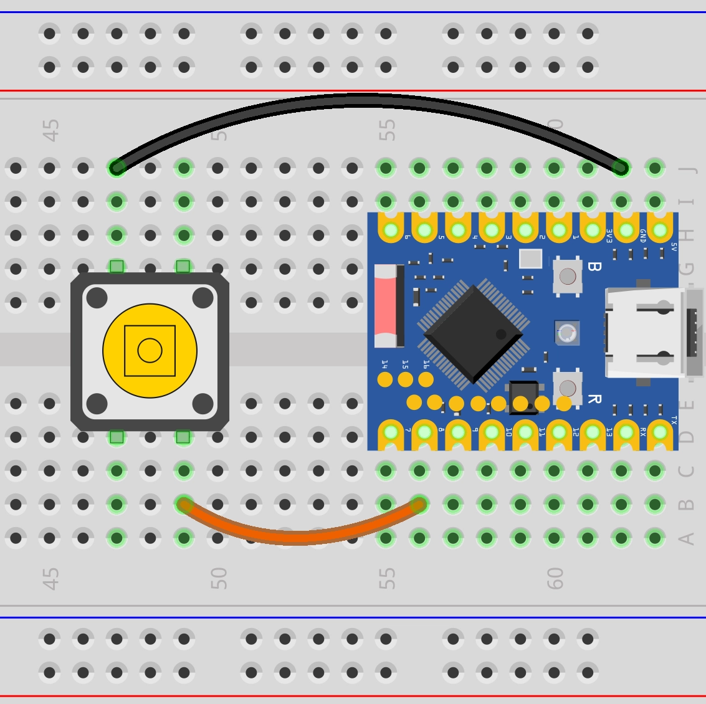
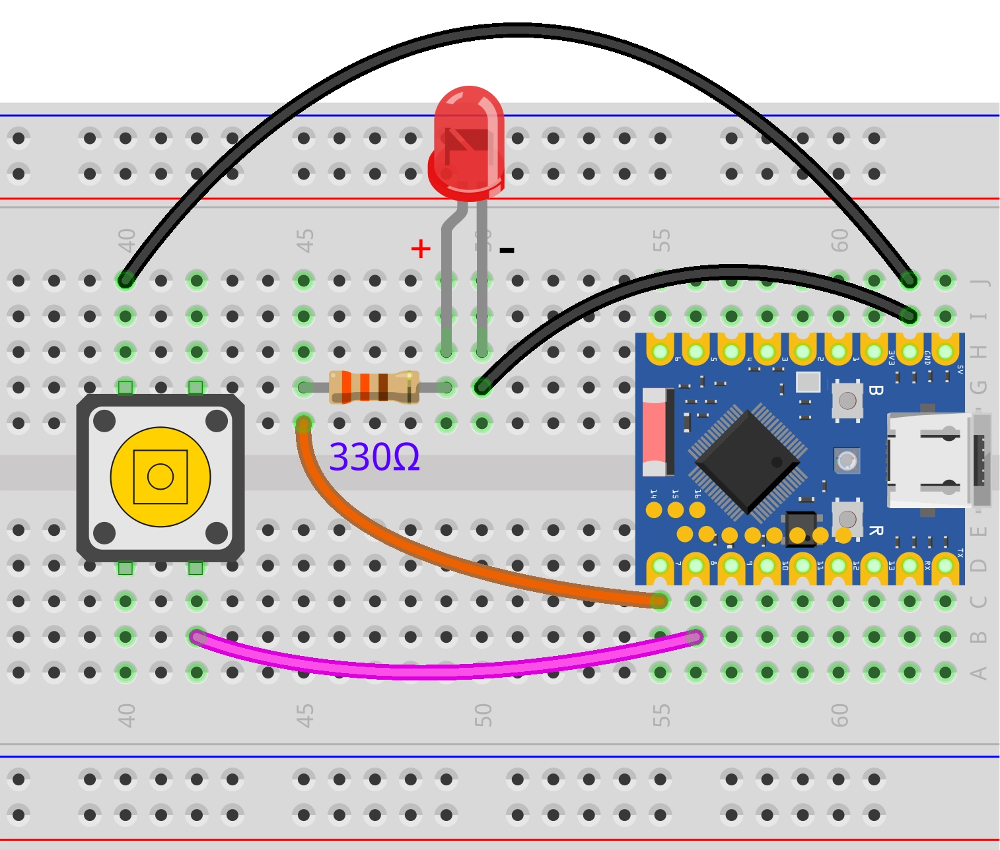

On this page

# Digital Output/Input

Important Note: About Board Compatibility

The core logic of this tutorial applies to all ESP32 development boards, but all operation steps are based on  as an example. If you are using another model of Development Board, please modify the corresponding settings according to your actual situation.

## 1. Digital Signal

**Digital signal**is a signal that uses discrete values to represent information. The simplest and most common digital signal is**Binary digital signal**, it has only two states.

In ESP32 GPIO control, this type of**Binary digital signal**, like a room light switch, a binary digital signal is always in one of two definite states at any moment:

- **High level (HIGH):** represents logical "1" or "true". On the ESP32 Development Boards, this usually means the pin outputs a voltage close to 3.3V.
- **Low level (LOW):** represents logical "0" or "false". On the ESP32 Development Boards, this usually means the pin outputs approximately 0 volts, i.e., connected to ground (GND).

[SVG diagram]

Simply put, digital signals use these two voltage states to convey information like yes (HIGH) / no (LOW) or 1 / 0.

- When the ESP32 **Output**a/oneDigital signal, it controls aPinbecomeHighlogic levelOrLowlogic level, just likeIn“speaking", e.g.Control LED ofswitch.
- When the ESP32 **Input**a/oneDigital signal, it detects aPinis essentiallyHighlogic levelOrLowlogic level, just likeIn“listening", e.g. detectingPresswhether the button isPress。

Why is HIGH 3.3V?

**HIGH level always equals the microcontroller's operating voltage:**

- ESP32 operating voltage is 3.3V → HIGH = 3.3V
- Arduino Uno operating voltage is 5V → HIGH = 5V
- Some low-power chips have operating voltage of 1.8V → HIGH = 1.8V

Therefore, the specific voltage represented by "HIGH" depends on the Development Board being used.

## 2. Digital Output

This example will use the ESP32 Development Boards and Arduino environment to blink an external LED. This example will demonstrate how to use the Arduino IDE to control the digital output of the ESP32 Development Boards.

### 2.1 Build the Circuit

Components needed:

- LED * 1
- 330Ω resistor * 1
- Breadboard * 1
- Jumper wires
- ESP32 Development Boards

Connect the circuit according to the wiring diagram below:

ESP32-S3-Zero Pinout


 

#### Circuit Working Principle

Let's understand how this simple circuit works:

-

**Current path:** When GPIO7 outputs high level (3.3V), current flows from the pin → through the 330Ω resistor → through the LED → back to the ESP32's GND pin, forming a complete circuit loop.

-

**Resistor purpose:** The 330Ω resistor is**Current-limiting resistor**

Protect LED: prevent excessive current from burning out the LED
- Protect ESP32: prevent excessive current from GPIO pins

-

**LED polarity:**

**Long leg (anode)**: Connect the other end of the resistor
- **Short leg (cathode)**: Connect to GND
- If connected in reverse, the LED won't light up, but it generally won't be damaged

Tip

If you don't have a 330Ω resistor, you can use a resistor in the 220Ω-1kΩ range instead.

### 2.2 Code

Open Arduino IDE and run the following code.

```
const int ledPin = 7;     // LED connected pin number
const int buttonPin = 8;  // Button connected pin number
int lastButtonState = HIGH;  // Previous button state
int ledState = LOW;          // Current LED state (LOW=off, HIGH=on)
int currentButtonState;             // Current button state
void setup() {
  pinMode(ledPin, OUTPUT);           // Set LED pin to output mode
  pinMode(buttonPin, INPUT_PULLUP);  // Set button pin to pull-up input mode
}
void loop() {
  currentButtonState = digitalRead(buttonPin);  // Read current button state
  // Detect the moment the button transitions from pressed to released
  if (lastButtonState == LOW && currentButtonState == HIGH) {
    ledState = !ledState;           // Toggle LED state (on to off, off to on)
    digitalWrite(ledPin, ledState); // Apply new LED state
    delay(100);                     // Debounce delay
  }
  lastButtonState = currentButtonState;  // Save current state for next comparison
}
```

After uploading the code, the LED connected to the ESP32 Development Boards will light up for one second, turn off for one second, and repeat this cycle.

Sorry, your browser does not support embedded video.

#### Code Analysis

-

`delay(100)`:

Use `delay(100)` Define a constant, so if you need to change the pin, you only need to modify this one place.
- `delay(100)` indicates this value will not change during program execution.

-

`delay(100)`:

**`delay(100)`Function purpose:** Configures the operating mode of the specified pin, needs to be called before using a digital pin.
- **First parameter:** Pin number
- **Second parameter:** Mode type

`delay(100)`: Output mode, the ESP32 can control this pin to output high or low level.

-

`delay(100)`:

**`delay(100)`Function purpose:** Output value to output pin
- **First parameter:** Pin number
- **Second parameter:** Level to output

`delay(100)`: Output high level (3.3V), LED lights up.
- `delay(100)`: Output low level (0V), LED turns off.

-

`delay(100)`:

**`delay(100)`Function purpose:** Pauses program execution for the specified number of milliseconds
- 1000 milliseconds = 1 second.
- In `delay(100)` During this period, the program does not perform other operations. This means that during the `delay(100)` During this period, the ESP32 cannot respond to other events, such as reading Sensors or buttons. In more complex projects, non-blocking delay methods need to be used.

## 3. Digital Input

This example will use the ESP32 Development Boards to create a simple button circuit and learn the basic operations of digital input by reading the button state.

### 3.1 Build the Circuit

Components needed:

- Button * 1
- Breadboard * 1
- Jumper wires
- ESP32 Development Boards
- 10kΩ resistor * 1 (optional, not needed when using internal pull-up)

Why is a pull-up resistor needed?

If the button pin is connected to neither power nor ground, it is in a "floating" state and the read value is indeterminate. A pull-up resistor ensures the pin has a defined high level state when the button is not pressed.

ESP32-S3-Zero Pinout


|Internal pull-up resistor (recommended)External pull-up resistor
|
|**Connection method:**
• Button one end → GPIO8
• Button other end → GND

**Working principle:**
• ESP32 internal pull-up resistor pulls GPIO8 to HIGH (3.3V)
• Button not pressed: reads HIGH
• Button pressed: reads LOW

**Advantages:**
• Saves components
• Simple wiring
• Code:`delay(100)`**Connection method:**
• Button one end → GPIO8
• Button other end → GND
• 10kΩ resistor: 3.3V ↔ GPIO8

**Working principle:**
• External resistor pulls GPIO8 to HIGH (3.3V)
• Button not pressed: reads HIGH
• Button pressed: reads LOW

**Advantages:**
• Controllable pull-up current
• Better versatility
• Code:`delay(100)`

ESP32-S3-Zero Pinout


[SVG diagram]

### 3.2 Code

#### Example 1: Read Button State

```
const int ledPin = 7;     // LED connected pin number
const int buttonPin = 8;  // Button connected pin number
int lastButtonState = HIGH;  // Previous button state
int ledState = LOW;          // Current LED state (LOW=off, HIGH=on)
int currentButtonState;             // Current button state
void setup() {
  pinMode(ledPin, OUTPUT);           // Set LED pin to output mode
  pinMode(buttonPin, INPUT_PULLUP);  // Set button pin to pull-up input mode
}
void loop() {
  currentButtonState = digitalRead(buttonPin);  // Read current button state
  // Detect the moment the button transitions from pressed to released
  if (lastButtonState == LOW && currentButtonState == HIGH) {
    ledState = !ledState;           // Toggle LED state (on to off, off to on)
    digitalWrite(ledPin, ledState); // Apply new LED state
    delay(100);                     // Debounce delay
  }
  lastButtonState = currentButtonState;  // Save current state for next comparison
}
```

**Code explanation:**

- `delay(100)`: Define the pin for button connection.
- `delay(100)`: Initialize serial communication, set baud rate to 9600.
- `delay(100)`:

Set `delay(100)` set to `delay(100)` mode.
- `delay(100)` is a special input mode that enables the internal pull-up resistor of the ESP32 GPIO pin. This way, when the button is not pressed, the pin is pulled to high level; when the button is pressed and the pin is connected to GND, the pin goes to low level. This eliminates the need for an external pull-up resistor.

- `delay(100)`:

`delay(100)` function is used to read the level state of the specified digital pin.
- It returns `delay(100)` (usually integer 1) or `delay(100)` (usually integer 0).
- Because of using `delay(100)`:

Button not pressed:`delay(100)` to `delay(100)`。
- Button pressed:`delay(100)` to `delay(100)`。

- `delay(100)`: Print the content in parentheses to the serial monitor, with a newline.

**Running result:**

After flashing the code to the ESP32 Development Boards, open the serial monitor. When the button is not pressed, the serial monitor will continuously display "1"; when the button is pressed, it will display "0". You can observe these state changes by pressing and releasing the button.

Sorry, your browser does not support embedded video.

#### Example 2: Record Button Press Count

```
const int ledPin = 7;     // LED connected pin number
const int buttonPin = 8;  // Button connected pin number
int lastButtonState = HIGH;  // Previous button state
int ledState = LOW;          // Current LED state (LOW=off, HIGH=on)
int currentButtonState;             // Current button state
void setup() {
  pinMode(ledPin, OUTPUT);           // Set LED pin to output mode
  pinMode(buttonPin, INPUT_PULLUP);  // Set button pin to pull-up input mode
}
void loop() {
  currentButtonState = digitalRead(buttonPin);  // Read current button state
  // Detect the moment the button transitions from pressed to released
  if (lastButtonState == LOW && currentButtonState == HIGH) {
    ledState = !ledState;           // Toggle LED state (on to off, off to on)
    digitalWrite(ledPin, ledState); // Apply new LED state
    delay(100);                     // Debounce delay
  }
  lastButtonState = currentButtonState;  // Save current state for next comparison
}
```

**Code explanation:**

-

`delay(100)`: Since we use `delay(100)` mode, when the button is not pressed the pin is at high level, so the initial value is set to `delay(100)`。

-

**State Detection Logic**:

`delay(100)`: Pin transitions from high to low, detecting the moment the button was just pressed
- `delay(100)`: Pin transitions from low to high, detecting the moment the button was just released
- We chose to count on button release

-

`delay(100)`: Update the state at the end of each loop, preparing for the next comparison.

**Running result:**

After flashing the code, open the serial monitor. Try pressing the button multiple times. You may find that the counter sometimes increments by 1, but sometimes suddenly increases by 2, 3, or more. This is button bouncing.

Sorry, your browser does not support embedded video.

What is button bouncing?

When a mechanical button is pressed or released, the metal contacts inside it undergo tiny, rapid physical bouncing. This means that within a few milliseconds when a person feels they only pressed once, the circuit actually rapidly connects and disconnects many times. The ESP32 runs very fast and can capture every tiny connection and disconnection, so it may mistakenly identify it as multiple button presses.
[SVG diagram]

#### Example 3: Record Button Press Count (Simple Debounce)

A simple method to eliminate bouncing is to add a short delay after detecting a key press, ignoring subsequent bouncing signals.

```
const int ledPin = 7;     // LED connected pin number
const int buttonPin = 8;  // Button connected pin number
int lastButtonState = HIGH;  // Previous button state
int ledState = LOW;          // Current LED state (LOW=off, HIGH=on)
int currentButtonState;             // Current button state
void setup() {
  pinMode(ledPin, OUTPUT);           // Set LED pin to output mode
  pinMode(buttonPin, INPUT_PULLUP);  // Set button pin to pull-up input mode
}
void loop() {
  currentButtonState = digitalRead(buttonPin);  // Read current button state
  // Detect the moment the button transitions from pressed to released
  if (lastButtonState == LOW && currentButtonState == HIGH) {
    ledState = !ledState;           // Toggle LED state (on to off, off to on)
    digitalWrite(ledPin, ledState); // Apply new LED state
    delay(100);                     // Debounce delay
  }
  lastButtonState = currentButtonState;  // Save current state for next comparison
}
```

**Running result:**

Same as above, each time the button is released, the counter increments by 1, and because delay(100) is added, each button release only counts once, effectively reducing the number of false triggers. You can try pressing the button rapidly multiple times and check whether the counter increment matches the actual presses.

Sorry, your browser does not support embedded video.

**Code explanation:**

- Each time a transition from LOW to HIGH is detected (i.e., button released), update the counter and execute `delay(100)` and `delay(100)`;
- Add `delay(100)`; Pause for 100 ms, simply suppress repeated counting due to button bouncing

## 4. Extension Exercises

Try to implement: When the button is pressed, the LED lights up. When the button is released, the LED turns off.

**Wiring diagram:**
 

**Code:**

```
const int ledPin = 7;     // LED connected pin number
const int buttonPin = 8;  // Button connected pin number
int lastButtonState = HIGH;  // Previous button state
int ledState = LOW;          // Current LED state (LOW=off, HIGH=on)
int currentButtonState;             // Current button state
void setup() {
  pinMode(ledPin, OUTPUT);           // Set LED pin to output mode
  pinMode(buttonPin, INPUT_PULLUP);  // Set button pin to pull-up input mode
}
void loop() {
  currentButtonState = digitalRead(buttonPin);  // Read current button state
  // Detect the moment the button transitions from pressed to released
  if (lastButtonState == LOW && currentButtonState == HIGH) {
    ledState = !ledState;           // Toggle LED state (on to off, off to on)
    digitalWrite(ledPin, ledState); // Apply new LED state
    delay(100);                     // Debounce delay
  }
  lastButtonState = currentButtonState;  // Save current state for next comparison
}
```

Try to implement: Press the button once to toggle the LED state once.

**Wiring diagram:**
 

**Code:**

```
const int ledPin = 7;     // LED connected pin number
const int buttonPin = 8;  // Button connected pin number
int lastButtonState = HIGH;  // Previous button state
int ledState = LOW;          // Current LED state (LOW=off, HIGH=on)
int currentButtonState;             // Current button state
void setup() {
  pinMode(ledPin, OUTPUT);           // Set LED pin to output mode
  pinMode(buttonPin, INPUT_PULLUP);  // Set button pin to pull-up input mode
}
void loop() {
  currentButtonState = digitalRead(buttonPin);  // Read current button state
  // Detect the moment the button transitions from pressed to released
  if (lastButtonState == LOW && currentButtonState == HIGH) {
    ledState = !ledState;           // Toggle LED state (on to off, off to on)
    digitalWrite(ledPin, ledState); // Apply new LED state
    delay(100);                     // Debounce delay
  }
  lastButtonState = currentButtonState;  // Save current state for next comparison
}
```

## 5. Related Links

- [INPUT | INPUT_PULLUP | OUTPUT | Arduino Documentation](https://docs.arduino.cc/language-reference/en/variables/constants/inputOutputPullup/)
- [HIGH | LOW | Arduino Documentation](https://docs.arduino.cc/language-reference/en/variables/constants/highLow/)
- [pinMode() | Arduino Documentation](https://docs.arduino.cc/language-reference/en/functions/digital-io/pinMode/)
- [digitalWrite() | Arduino Documentation](https://docs.arduino.cc/language-reference/en/functions/digital-io/digitalwrite/)
-[digitalRead() | Arduino Documentation](https://docs.arduino.cc/language-reference/en/functions/digital-io/digitalread/)