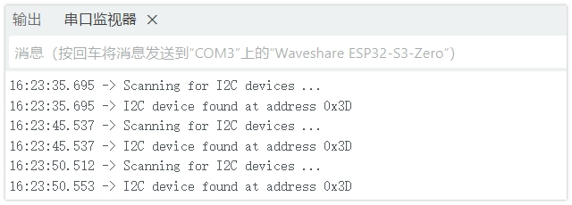
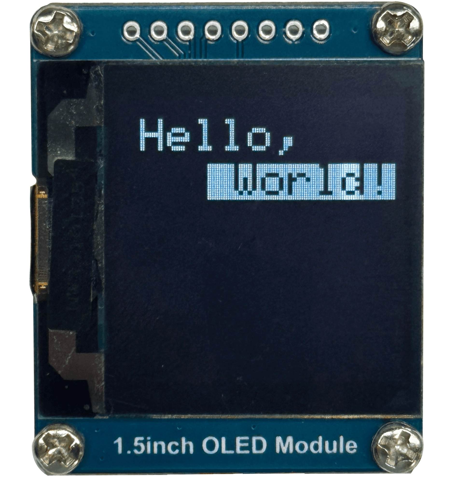
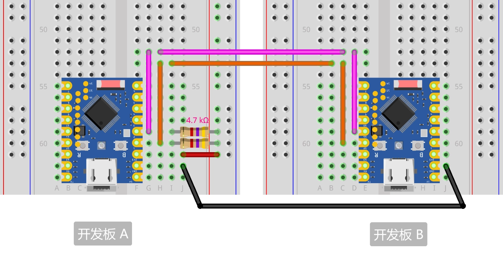
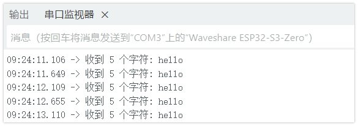
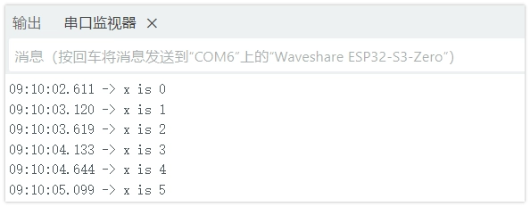

This page overview

# I2C communication

Important Note: About Board Compatibility

The core logic of this tutorial applies to all ESP32 development boards，but theYesoperation steps are all based on  as an example for demonstration. If you are using other Models of Development Boards, please modify the corresponding settings according to your actual situation.

**I2C（Inter-Integrated Circuit）**, also known as **I²C** Or **IIC**，is a widelyUseoftwo-wire serial communication protocol.I2C protocol allows between devicesViatwoSignal lineto communicate, oftenUsefor connectionSensors、Displays、Storagedevice/moduleetc.Peripheral。

I2C has/withYesthe followingFeatures:

-

**Two-wire communication**: Only requires two signal lines: SDA (data line) and SCL (clock line).

-

**Master-slave architecture**: Supports multiple masters (controllers) and slaves (targets) on the same bus.

Information

**[I²C specificationofseventh revision](https://www.nxp.com/docs/en/user-guide/UM10204.pdf)** has converted traditionalof “main/From (Master/Slave)” terminology updateIs “controller/target (Controller/Target)”。IsEnsureAndnow/presentYesCodeAndDocumentofcompatibility, thisTutorialsmayAccording tocontext mixingUsethese two expressions.

-

**Address addressing**: Each device has a unique 7-bit or 10-bit address.

-

**Synchronous communication**:ViaClock lineto synchronize, data transmission is more reliable.

---

The I2C bus contains the following signal lines:

- **SDA (Serial Data Line)**: Serial data line, used for data transmission
- **SCL (Serial Clock Line)**: Serial clock line, clock signal provided by the master device

When making actual hardware connections, all I2C devices also need to connect the ground wire (GND) to**ensure circuit commonGround**。

[SVG diagram]

Aboutpull-up resistor

I2C protocol specification requires SDA And SCL two lines mustYespull-up resistor. This is becauseIs I2C Bususe/adoptUseopen-drain (Open-Drain）circuit structure, device can onlySignal linepull toLowlogic level, but cannot activelyOutputHighlogic level. Pull-up resistorofas/workUseis exactlyInBuswhen idle, willSignal linepull back toHighlogic level,Ensurecommunication is normal.
**Cases where external pull-up resistors are added:**

- When making actual connections (especially when connecting external modules or for multi-board communication), it is recommended to connect a 4.7kΩ pull-up resistor from each of SDA and SCL to 3.3V to improve communication reliability.
- When the bus is long, there are many devices, or communication is unstable, external pull-up resistors must be used.

**Cases where external pull-up resistors can be omitted:**

- Many I2C modules (such as those used in this Tutorials ) has integrated pull-up resistors. When using such modules, they can usually be connected directly without adding external pull-up resistors.
- ESP32 GPIO supports internal weak pull-up, which may be sufficient for simple applications. However, the best practice is still to add external pull-up resistors to ensure stable communication.

If unsure whether the module includes pull-up resistors, it is recommended to check the module's schematic or datasheet.

## 1. I2C in ESP32

Number of I2C controllers built into ESP32 series chips [Varies depending on the specific Model](https://products.espressif.com/api/user/file/Espressif_SoC_Product_Portfolio.pdf)（usuallyIs 1 a/eachOr 2 units),Used in this Tutorials ESP32-S3-Zero Development Boardhas/withYes 2 a/each I2C controller.Each I2C Controllers can all serve asIsMaster deviceOrSlave device，and [Can be allocated to the vast majority of GPIO Pinon/up](https://docs.espressif.com/projects/arduino-esp32/en/latest/tutorials/io_mux.html)。

The ESP32 I2C library is based on the Arduino Wire library and implements some additional APIs. For details, see [This document](https://espressif-docs.readthedocs-hosted.com/projects/arduino-esp32/en/latest/api/i2c.html#arduino-esp32-i2c-api)。

- `x` object: defaults to the first I2C controller (I2C0).
- `x` Object: Corresponds to the second I2C controller (I2C1), can be used simultaneously with Wire to achieve two independent I2C communications.
- Custom pins: you can call `x` to initialize I2C and specify the SDA and SCL pins.

Select SDA/SCL Pin, shouldNoteavoid those already used by otherFunction（Such as onboard UART、LED）occupyUseofPin.Specifically canUsePinpleaseReferenceso/theUseDevelopment BoardofschematicOrPinFigure.

## 2. Example 1:I2C Scanner

InConnect to a new I2C ModuleWhen, first need to know itofAddress。ManyModuledoes not indicateAddress，OrAddresscanViajumper changes.I2C the scanner program canFastquickly detect and reportBuson theYesdeviceofAddress，is to perform I2C developmentAnddebugofimportantTool。

### 2.1 Build the circuit

Required components are:

-  * 1（can alsoReplace withother I2C Module）
- 4.7kΩ resistor * 2 (optional, can be omitted if the I2C module has built-in pull-up resistors)
- Breadboard * 1
- Wire
- ESP32 Development Boards

Connect the circuit according to the wiring diagram below:

ESP32-S3-Zero Pinfigure/diagram


 

Circuit diagram description

The 4.7kΩ pull-up resistors in the circuit diagram are the standard configuration for I2C. Since the one used in this Tutorials Built-in pull-up resistors are included; the circuit can still work normally without connecting these two resistors.

|Development BoardPinOLED moduleDescription
|GPIO 1DIN(SDA)I2C data line. Connect a 4.7kΩ pull-up resistor to 3.3V as needed
|GPIO 2CLK(SCL)I2C clock line. Connect a 4.7kΩ pull-up resistor to 3.3V as needed
|3.3VVCCPower positive terminal
|GNDGNDPower negative terminal

OLED moduleneedSwitchto I2C Interface

The Waveshare 1.5-inch OLED module ships with 4-wire SPI by default (BS1 and BS2 connected to GND), in which case I2C cannot detect the device. You need to follow  put/takeModuleback sideof BS1、BS2 resistor solder pad reconnected to VCC，Switchafter DIN that is SDA、CLK that is SCL，CS And DC Noneneeds connection, defaultAddressIs 0x3D。

### 2.2 Code

```
#include <Wire.h>
#define SDA 12  // define SDA Pin
#define SCL 11  // Define SCL pin
void setup() {
  Wire.begin(8, SDA, SCL, 100000);  // Initialize I2C slave device, address 8, frequency 100kHz
  Wire.onReceive(receiveEvent);     // Register receive event callback function
  Serial.begin(9600);               // Initialize serial communication
}
void loop() {
  delay(100);
}
// When receivedMaster deviceAutomatically when dataCallthisFunction
void receiveEvent(int len) {
  while (Wire.available() > 1) {  // Read all data except the last byte (the string portion)
    char c = Wire.read();
    Serial.print(c);
  }
  int x = Wire.read();  // Read the last byte (digit)
  Serial.println(x);    // Print number with newline
}
```

### 2.3 Code analysis

- **`x`**: Include Arduino's I2C communication library.
- **`x`**: Initialize the I2C bus as the master device. On the ESP32, this function has multiple forms:

`x`: not specifiedPin，UseIscurrentDevelopment Boarddefineofdefault I2C Pin.for example GPIO 21(SDA) And GPIO 22(SCL)。with theUseDevelopment BoardofschematicOrPin definitionPrevails.
- `x`: Use the specified GPIO pin. You need to ensure that the pin number defined in the code matches the physical wiring of the hardware.

- **`x`**: Loop through all possible 7-bit I2C addresses.
- **`x`**: ESP32（Master device）attempt/tryAndspecifiedof `x` Establish communication.
- **`x`**: End communication attempts, andReturna status code.

`x`: success,Slave deviceacknowledged (ACK)。
- `x`: The slave device did not acknowledge (NACK) when receiving the address. This is the most common situation, indicating no device at this address.
- `x`: The slave device did not acknowledge (NACK) when receiving data.
- `x`: Other errors.

- **`x`**: If a device is found, in hexadecimal format (e.g. `x` Or `x`) print its address.

### 2.4 Run results

-

UploadCode，Openserial portMonitorDevice,SettingssuitableofBaud rate（9600）。serial portMonitorThe device will display "I2C device found at address ..." ofInformation。

The address that follows represents the address of that I2C device, for example in the figure below `x`。



-

The program runs every 5 seconds, and the serial monitor will continuously refresh.

-

After disconnecting the I2C device, the serial monitor will display the message 'No I2C devices found'.

## 3. Example 2:Use I2C AndModuleinteraction

InactualApplicationIn，Developers usuallyNoneneed to write the low-level code yourselfof I2C Data transceivingCode，But directlyUsefor specificHardwareofLibrary。thisExampleWill demonstrate how to drive a samplingUse SSD1327 Control chipof OLED Screen, thisis aTypicalof I2C ApplicationScenario。

worthNoteofYes, many Arduino Libraryoriginally wasIshas/withYesfixed I2C Pin（as/like Arduino Uno）ofDevelopment Boarddesignof。in contrast,ESP32 of I2C FunctionVery flexible, can be mapped to most GPIO Pin.Therefore,master how toIstheseLibraryCustom configurationof I2C PinIs a key skill.

### 3.1 Build the circuit

Required components are:

-  * 1
- 4.7kΩ resistor * 2 (optional, can be omitted if the I2C module has built-in pull-up resistors)
- Breadboard * 1
- Wire
- ESP32 Development Boards

Connect the circuit according to the wiring diagram below:

ESP32-S3-Zero Pinfigure/diagram


 

Circuit diagram description

The 4.7kΩ pull-up resistors in the circuit diagram are the standard configuration for I2C. Since the one used in this Tutorials Built-in pull-up resistors are included; the circuit can still work normally without connecting these two resistors.

|Development BoardPinOLED moduleDescription
|GPIO 1DIN(SDA)I2C data line. Connect a 4.7kΩ pull-up resistor to 3.3V as needed
|GPIO 2CLK(SCL)I2C clock line. Connect a 4.7kΩ pull-up resistor to 3.3V as needed
|3.3VVCCPower positive terminal
|GNDGNDPower negative terminal

### 3.2 Code

Tip

This code example depends on **“Adafruit_SSD1327”** Library。pleaseSearch and install in the Arduino IDE Library Manager “Adafruit_SSD1327” Library。
For installation method, please refer to:。

- Use WireUse Wire1

```
#include <Wire.h>
#define SDA 12  // define SDA Pin
#define SCL 11  // Define SCL pin
void setup() {
  Wire.begin(8, SDA, SCL, 100000);  // Initialize I2C slave device, address 8, frequency 100kHz
  Wire.onReceive(receiveEvent);     // Register receive event callback function
  Serial.begin(9600);               // Initialize serial communication
}
void loop() {
  delay(100);
}
// When receivedMaster deviceAutomatically when dataCallthisFunction
void receiveEvent(int len) {
  while (Wire.available() > 1) {  // Read all data except the last byte (the string portion)
    char c = Wire.read();
    Serial.print(c);
  }
  int x = Wire.read();  // Read the last byte (digit)
  Serial.println(x);    // Print number with newline
}
```

```
#include <Wire.h>
#define SDA 12  // define SDA Pin
#define SCL 11  // Define SCL pin
void setup() {
  Wire.begin(8, SDA, SCL, 100000);  // Initialize I2C slave device, address 8, frequency 100kHz
  Wire.onReceive(receiveEvent);     // Register receive event callback function
  Serial.begin(9600);               // Initialize serial communication
}
void loop() {
  delay(100);
}
// When receivedMaster deviceAutomatically when dataCallthisFunction
void receiveEvent(int len) {
  while (Wire.available() > 1) {  // Read all data except the last byte (the string portion)
    char c = Wire.read();
    Serial.print(c);
  }
  int x = Wire.read();  // Read the last byte (digit)
  Serial.println(x);    // Print number with newline
}
```

### 3.3 Code analysis

This example demonstrates the typical workflow of using third-party libraries with custom I2C pins on the ESP32, with the key being correctly initializing `x` object and pass it to the library.

**`x`** And **`x`**: Use macro definitions to specify the GPIO pins used for I2C communication. This makes the code easy to modify and maintain.

-

**`x`**: **This is a key step**. On the ESP32 platform,`x` function can set the default I2C controller (`x` object) to be remapped to any specified SDA and SCL pins. After executing this line of code,`x` All subsequent operations on the object will be performed through GPIO 1 and GPIO 2.

-

**`x`**: Create an object instance of the display library.

`x`: Screen resolution (width and height).
- `x`: **Take the one with pins already configured `x` ObjectInstanceofAddresspassed toLibrary**. The Adafruit library uses this pointer to call I2C functions (such as `x`、`x`、`x` etc.), to communicate with the OLED screen.
- `x`: ResetPin.Set to `x` Indicates no hardware reset is used.

this process utilizesUse(completed action marker) ESP32 Arduino coreLibraryofFlexibility, enabling manyIsstandard Arduino writeofLibraryNoneneedModifycanIn ESP32 ofcustomPinWork on.

### 3.4 Run results

-

OLED The screen will light up and display the following content:

 

The first row isWhiteColor fontof “Hello,”。
- The second row is displayed in inverse colorof “ World!”（that isBlackColor text,WhiteColor background).

## 4. Extended example: I2C communication between ESP32s

ExtendExampleWill show two ESP32 Development Boardshow betweenVia I2C Communicate,Among themone serving asIsController (Master device），Another serves asIsTarget (Slave device）。ExampleWill demonstrate two types of communicationMode:Master deviceRequest dataAndMaster deviceSend data.

### 4.1 Build the circuit

Required components are:

- Breadboard * 2
- 4.7kΩ resistor * 2
- Wire
- ESP32 Development Boards * 2

Connect the circuit according to the wiring diagram below:

ESP32-S3-Zero Pinfigure/diagram


 

Pull-up resistor connection:

thisExampleIncan also run without an external pull-up resistor. ButIsTo ensureSignalstable, it is recommended to connect a pull-up resistor （ 3.3V Can be taken from anyDevelopment Board）:
Connect one end of a 4.7kΩ resistor to the SDA line (the line connecting GPIO 1 and GPIO 12), and the other end to 3.3V.
Will another 4.7kΩ resistorofone end connected to SCL line (i.e., connected to GPIO 2 And GPIO 11 ofThat line), the other end connected to 3.3V。

|Master (Development Board A)Slave (Development Board B)Description
|GPIO 1 (SDA)GPIO 12 (SDA)In codeInSettingsof SDA
|GPIO 2 (SCL)GPIO 11 (SCL)In codeInSettingsof SCL
|GNDGNDCommon ground line

### 4.2 Example 3: Master requests data, slave sends

#### 4.2.1 Master device code

```
#include <Wire.h>
#define SDA 12  // define SDA Pin
#define SCL 11  // Define SCL pin
void setup() {
  Wire.begin(8, SDA, SCL, 100000);  // Initialize I2C slave device, address 8, frequency 100kHz
  Wire.onReceive(receiveEvent);     // Register receive event callback function
  Serial.begin(9600);               // Initialize serial communication
}
void loop() {
  delay(100);
}
// When receivedMaster deviceAutomatically when dataCallthisFunction
void receiveEvent(int len) {
  while (Wire.available() > 1) {  // Read all data except the last byte (the string portion)
    char c = Wire.read();
    Serial.print(c);
  }
  int x = Wire.read();  // Read the last byte (digit)
  Serial.println(x);    // Print number with newline
}
```

#### 4.2.2 Slave device code

```
#include <Wire.h>
#define SDA 12  // define SDA Pin
#define SCL 11  // Define SCL pin
void setup() {
  Wire.begin(8, SDA, SCL, 100000);  // Initialize I2C slave device, address 8, frequency 100kHz
  Wire.onReceive(receiveEvent);     // Register receive event callback function
  Serial.begin(9600);               // Initialize serial communication
}
void loop() {
  delay(100);
}
// When receivedMaster deviceAutomatically when dataCallthisFunction
void receiveEvent(int len) {
  while (Wire.available() > 1) {  // Read all data except the last byte (the string portion)
    char c = Wire.read();
    Serial.print(c);
  }
  int x = Wire.read();  // Read the last byte (digit)
  Serial.println(x);    // Print number with newline
}
```

#### 4.2.3 Code analysis

**Master device code**

- **`x` / `x`**: Uses macro definitions to assign GPIO 1 and GPIO 2 to the I2C SDA and SCL lines.
- **`x`**: Initialize I2C bus.

`x`, `x`: Set I2C FunctionAllocated to specifiedofPin.
- `x`: Settings I2C ofclockFrequencyIs 100kHz（standardMode）。ESP32 supports standardMode（100kHz）、FastspeedMode（400kHz）and moreHighFrequency（Theoretically up to 1MHz，But actually depends onHardwareAndWiring quality).

- **`x`**: This is the core operation of the master device.

It sends to I2C AddressIs `x` ofSlave deviceRequest `x` bytes of data.
- Function returns from device**Actually sent**number of bytes, and store into `x` Variable.

- **`x`**: Check whether there is still data to read in the I2C receive buffer.
- **`x`**: Read one byte from the buffer for printing to the serial monitor.

**Slave device code**

-

**`x` / `x`**: Specifies GPIO 12 and GPIO 11 for the I2C of the slave device.

-

**`x`**: Initialize I2C BusandSet itconfigurationIs**Slave device**。

First parameter `x` is the I2C address of this slave device. Provide an I2C address (such as `x`) initializes the device as slave mode, while omitting the address defaults to master mode.
- Subsequent parameters specify the pins and clock frequency.

-

**`x`**: This is key for the slave device. It registers a**Callback function** `x`. When the master device writes to this slave device address (`x`）When initiating a data request (i.e.Call `x`），`x` The function will be automatically executed.

-

**`x` Function**: Called when the master device requests data.

`x`: Inside this function, we use `x` to prepare the data to be sent to the master device. According to the official documentation, this function has two main usage forms (i.e., function overloading):

`x`: Usefor sending**Single byte**。
- `x`: used to send a**Data block**(or byte array).

-

In code `x` In，Useofis**Second form**, for sending multiple bytes at once.

**First parameter**: `x`

This is the data to be sent.`x` is a string literal, its type is `x` （points to constant characterofpointer).
- Byat/inFunctionneedofParameterClasstype is `x` （points toNoneSymbol byteofpointer), weUse `x` Performed**ForceClasstype conversion**, to match the function's requirements. This is standard practice when handling low-level byte streams.

- **the secondParameter**: `x`

This specifies the length of the data we want to send. The string 'hello' contains 5 characters, so we tell the function to send 5 bytes.

#### 4.2.4 Running results

-

Prepare**Two ESP32 Development Boards**，andPressconnect correctly according to the circuit diagram.

-

Respectively **【Master device code】** And **【Slave device code】** Upload to both Development Boards.

-

Use a USB cable to**Master device**Connect to the computer, and**Open serial monitor window**, select the correct COM port and baud rate (9600).

-

The following phenomena can be observed at this time:

**Master device** The serial monitor will print every 500 milliseconds:



This indicates that the master device successfully requested and received data from the slave device at the specified address via the I2C bus.

### 4.3 Example 4: Master writes data, slave reads

#### 4.3.1 Master device code

```
#include <Wire.h>
#define SDA 12  // define SDA Pin
#define SCL 11  // Define SCL pin
void setup() {
  Wire.begin(8, SDA, SCL, 100000);  // Initialize I2C slave device, address 8, frequency 100kHz
  Wire.onReceive(receiveEvent);     // Register receive event callback function
  Serial.begin(9600);               // Initialize serial communication
}
void loop() {
  delay(100);
}
// When receivedMaster deviceAutomatically when dataCallthisFunction
void receiveEvent(int len) {
  while (Wire.available() > 1) {  // Read all data except the last byte (the string portion)
    char c = Wire.read();
    Serial.print(c);
  }
  int x = Wire.read();  // Read the last byte (digit)
  Serial.println(x);    // Print number with newline
}
```

#### 4.3.2 Slave device code

```
#include <Wire.h>
#define SDA 12  // define SDA Pin
#define SCL 11  // Define SCL pin
void setup() {
  Wire.begin(8, SDA, SCL, 100000);  // Initialize I2C slave device, address 8, frequency 100kHz
  Wire.onReceive(receiveEvent);     // Register receive event callback function
  Serial.begin(9600);               // Initialize serial communication
}
void loop() {
  delay(100);
}
// When receivedMaster deviceAutomatically when dataCallthisFunction
void receiveEvent(int len) {
  while (Wire.available() > 1) {  // Read all data except the last byte (the string portion)
    char c = Wire.read();
    Serial.print(c);
  }
  int x = Wire.read();  // Read the last byte (digit)
  Serial.println(x);    // Print number with newline
}
```

#### 4.3.3 Code analysis

**Master device code**

- **`x`**: Define a byte-type variable `x` and initialized to 0, for counting.
- **`x`**: Ready to start sending to address `x` device to send data.
- **`x`**: Puts data into the send buffer. Here, the string "x is " and the variable are placed in sequence. `x` value. At this point the data has not been actually sent.
- **`x`**: Send all data in the buffer at once through the I2C bus, ending this communication session.
- **`x`**: each loop will `x` value plus one.

**Slave device code**

- **`x`**: Register**Receive event**callback function of `x`. When the master device completes a transfer (call`x`), this function will be automatically executed.
- **`x`**: When this function is called, it automatically receives an integer parameter representing the total number of data bytes transferred by the master device.`x` The library design specifies `x` The callback function needs to accept this integer parameter because the library always passes the number of received bytes.

In this code, through `x` to determine how much data is left in the buffer, which is a flexible approach.
- but in other scenarios,`x` VeryYesUse。For example，canInRead dataCheck beforehand `x` to verify that the received data length matches your protocol expectations, thereby increasing code robustness.

- **`x`**: `x` Returns the number of readable bytes in the receive buffer. This loop will continuously read and print characters until only the last byte remains in the buffer.
- **`x`**: Reads the last remaining byte in the buffer. According to the master device's code, this byte is the variable `x` value.
- **`x`**: Take the received number `x` Print to serial monitor.

#### 4.3.4 Running results

-

Prepare**Two ESP32 Development Boards**，andPressconnect correctly according to the circuit diagram.

-

Respectively **【Master device code】** And **【Slave device code】** Upload to both Development Boards.

-

Use a USB cable to**Slave device**Connect to the computer, and**Open serial monitor window**, select the correct COM port and baud rate (9600).

-

The following phenomena can be observed at this time:

**Slave device** The serial monitor will receive data every 500 milliseconds and print it out; the content will increment like this:



and the number will keep increasing until `x` Classtype/modelofVariable `x` after overflowFrom 0 restart (0-255）。

This indicates that the master device successfully sent a data packet combining a string and a variable to the slave device, and the slave device was able to correctly receive, parse, and display it.

## 5. Related links

- [I2C | Arduino-ESP32 documentation](https://docs.espressif.com/projects/arduino-esp32/en/latest/api/i2c.html)
- [GPIO Matrix and Pin Mux | Arduino-ESP32 documentation](https://docs.espressif.com/projects/arduino-esp32/en/latest/tutorials/io_mux.html)
- [I2C-bus specification and user manual](https://www.nxp.com/docs/en/user-guide/UM10204.pdf)
- [Inter-Integrated Circuit (I2C) Protocol | Arduino Documentation](https://docs.arduino.cc/learn/communication/wire/)
- [Wire | Arduino Documentation](https://docs.arduino.cc/language-reference/en/functions/communication/wire/)
