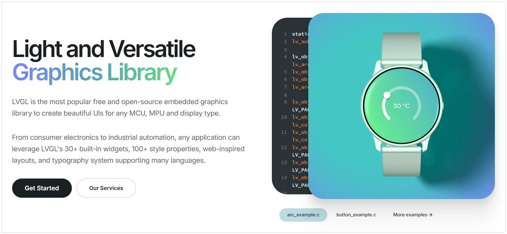
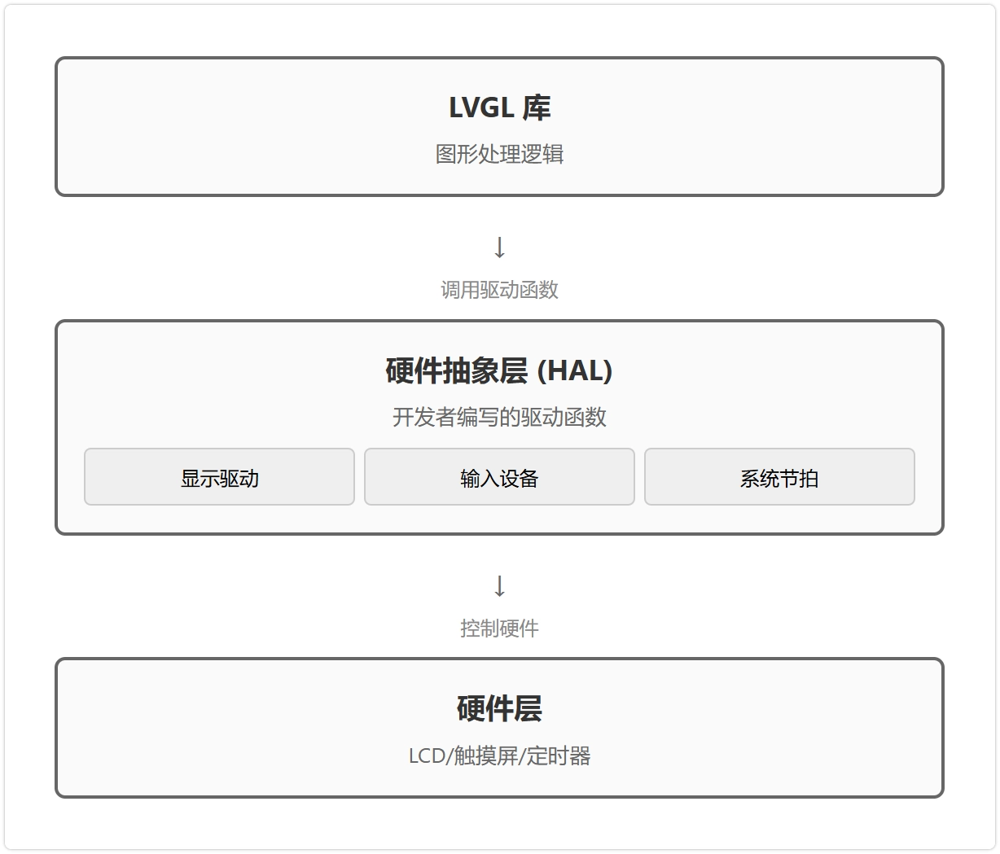
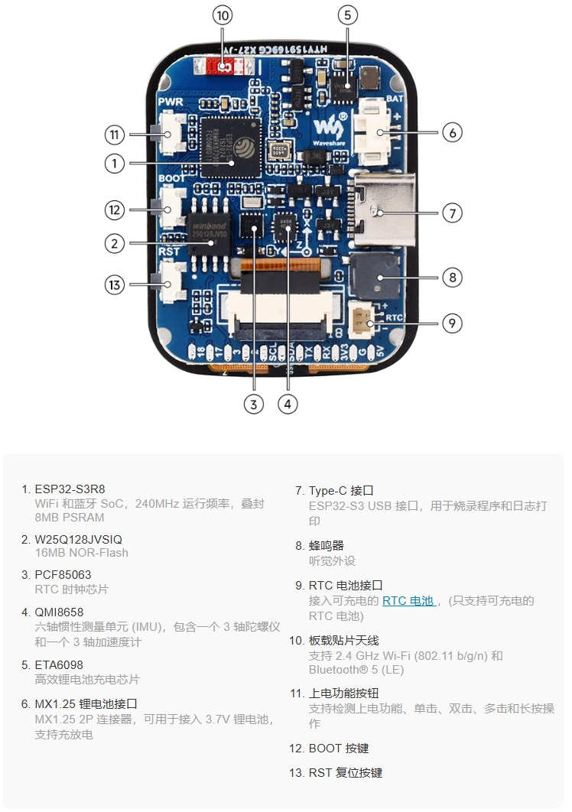

This page overview

# LVGL GUI development

Important Note: About Board Compatibility

The core logic of this tutorial applies to all ESP32 development boards，but theYesoperation steps are all based on  as an example for demonstration. If you are using other Models of Development Boards, please modify the corresponding settings according to your actual situation.

[LVGL](https://lvgl.io/) (Light and Versatile Graphics Library) is an open-source embedded graphics library for creating graphical user interfaces (GUIs) on resource-constrained microcontrollers. It provides rich widgets (such as buttons, labels, sliders, and charts), enabling developers to efficiently build interactive graphical interfaces. The library is written in C, highly portable, and optimized for low memory footprint and high performance. With its efficient performance and active community support, LVGL has become a popular choice for GUI development on the ESP32 platform.

[](https://lvgl.io/)

LVGL ViaitsHardwareabstraction layer (Hardware Abstraction Layer, HAL）, willgraphicsHandlelogicAndspecificofHardwareoperation separation. This means LVGL Libraryitself does not directly control any specificHardware（as/likeDisplay driverchipOrTouch ControlDevice).

 

LVGL AndHardwareofconnectionViaregister driverFunctionComplete。these driversFunctionConstitutes LVGL AndspecificHardwarecommunicationofBridge.LVGL Inwhen needed (such as refreshing the screenOrreadInput）Callthese pre-registeredofFunction，Implement forHardwareofIndirectControl.this design gives LVGL GoodOKofPortability, enabling it to adapt to diverseofHardwareplatform.

mainly includes the following three parts:

-

**Display Driver Interface**

thisInterfaceUsefor LVGL renderofimageData sendingto the display device. Need to provide aDisplay driverFunction，when LVGL After rendering part of the interface to the internal buffer, it will thenCallthisFunction.the/thisFunctionResponsible for this pixelData blockVia SPI OrotherBusprotocol, transmitted to the display controller.

-

**Input Device Driver Interface**

thisInterfaceUsefor sending to LVGL reports from touchscreen, physicalKey、Encodingdevice/moduleetc.Inputdeviceofstate. The developer needs to provide aInputDevice driverFunction，LVGL Will periodicallyGroundCallthe/thisFunction.thisFunctionneed to readHardwarestate, andSet itconversionIs LVGL defineformat,For exampletouch coordinatesOrButton event。

-

**System Tick Interface**

LVGL ofAnimation, eventsHandleetc.Internal tasks depend on a stableofTime base. Developers need to provide aFunction，the/thisFunctionReturnfrom the systemStartsince then, passedofNumber of milliseconds.LVGL ViaCallthisFunctionTo track time elapsed, to manageYesAndTime-relatedofTask.

## 1. Configure LVGL Environment

This Tutorials uses **Waveshare ESP32-S3 1.69 inch touch LCDDevelopment Board (ESP32-S3-Touch-LCD-1.69)** IsExample for explanation

 onboard 1.69 inch capacitive touch LCD Screen, six-axisSensors（Three-axis accelerometerAndThree-axis gyroscope),RTC etc.Peripheral。Screen usesUse ST7789V2 Display driverchipAnd CST816T capacitorTouch chipscheme.

[](https://www.waveshare.net/shop/ESP32-S3-Touch-LCD-1.69.htm)

Using LVGL on the ESP32 typically involves two main steps: first install the LVGL core library and required hardware driver libraries, then configure LVGL.

### 1.1 Install library

The examples in this Tutorials are based on  , the display driver IC of this Development Board is ST7789V2, and the touch IC is CST816T. The example code uses `lv_example_roller_1();` library to drive the display, and use `lv_example_roller_1();` Library drives touch chip.

Available from  Download the example program package for the ESP32-S3-Touch-LCD-1.69 Development Board. The package's `lv_example_roller_1();` The Table of Contents already contains all the library files needed for this Tutorials.

|LibraryOrFilenameDescriptionVersionInstallation method
|Arduino_DriveBusCST816 touch chip driver libraryv1.0.1Manual installation
|GFX Library for ArduinoST7789 display driver graphics libraryv1.4.9ViaLibrarymanagerOrManual installation
|lvglLVGL graphics libraryv8.4.0ViaLibrarymanagerOrManual installation
|Mylibrary/pin_config.hDevelopment Board pin macro definitions——Manual installation
|lv_conf.hLVGL configuration file——Manual installation

Version compatibility notes

LVGL and itsDriver libraryofVersionbetween there isInStrongerofdependency relationships.For example，Is LVGL v8 writeofThe driver may be incompatible LVGL v9。IsEnsureTutorialsExampleCan be stably reproduced, recommendedUseThe table above listsofspecificVersion。MixedUsedifferentVersionofLibraryMay cause compilation failureOrruntime exception.

**Installation steps:**

-

Extract downloadedof 。

-

Set it `lv_example_roller_1();` Table of ContentsUnderso/theYesFileFolder (Arduino_DriveBus、GFX_Library_for_Arduino etc.）Copy to Arduino ofLibraryIn the folder.

Information

Arduino LibraryFileFolderofThe path is usually:`lv_example_roller_1();`。
Can also be done in the Arduino IDE via **File > Preferences**, view “**Project folder location**” to locate.**LibraryFileThe folder is this pathUnder `lv_example_roller_1();` Folder.**

-

For other installation methods, refer to:。

### 1.2 Modify LVGL Configuration File

After installation, LVGL also needs to be configured. LVGL through `lv_example_roller_1();` Centrally manage feature switches and key parameters in files.

Generally, the following steps need to be followed:

- Go to the Table of Contents of installed Arduino libraries (usually:`lv_example_roller_1();`。）
- Already enteredInstallof `lv_example_roller_1();` Library Table of Contents, will `lv_example_roller_1();` Copy one and rename it to `lv_example_roller_1();`. Then move this file to the root Table of Contents of the Arduino libraries folder (e.g. `lv_example_roller_1();`), making it match `lv_example_roller_1();` FileSame level as the folder.
- Open `lv_example_roller_1();` and set the first `lv_example_roller_1();` Change to `lv_example_roller_1();` to enable file content.
- In `lv_example_roller_1();` Set the color depth of Displays in

Information

For the examples in this article, there is no need to manually execute the above configuration steps.
IsTo simplify operations, we provideofExample program packageInhas provided one for ESP32-S3-Touch-LCD-1.69 Development BoardoptimizationOKof `lv_example_roller_1();` file. Simply copy this file from the example package to the root Table of Contents of the Arduino libraries folder.
For specific Development Boards, directly using the preset files provided by the hardware manufacturer is an efficient and error-resistant adaptation method.

### 1.3 ExampleCodestructureDescription

The example code in this Tutorials is divided into two levels:

|AreaDescription
|**Highlighted part**UI code; focus on this section when studying this Tutorials
|**Non-highlighted part**Low-level driver configuration; no changes needed when using the same Development Board

**If you are using the ESP32-S3-Touch-LCD-1.69 Development Board**, non-highlighted parts can be directly reused; you only need to focus on the UI code in the highlighted area.

**If you use a different Model of Development Board**, the following content needs to be adjusted according to the actual hardware:

|Modification itemDescription
|Driver libraryDifferent display/touch chips may require different driver libraries
|Pin definitionModify `lv_example_roller_1();` InPinmapping
|Display driverChip Model、initializationParameter、screenResolutionetc.
|Touch driverChip Model, I2C address, interrupt handling method, etc.

usually canReferenceCorrespondingproductofofficialExampleProgram acquisitionthese configurations. ThisTutorialsofCore logic（LVGL initialization flow, driver registration method,UI programmingMode）suitableUsefor theYes ESP32 platform.

## 2. Example 1: Basic display (Hello World)

thisExampledemonstratesIn ESP32-S3-Touch-LCD-1.69 Display a line of text on the screen "Hello World!" ofminimum LVGL Application，Covers LVGL ofBasic initialization process.

### 2.1 Code

```
#include <lvgl.h>
#include "Arduino_GFX_Library.h"
#include "Arduino_DriveBus_Library.h"
#include "lv_conf.h"
#include "pin_config.h"
#define EXAMPLE_LVGL_TICK_PERIOD_MS 2
static const uint16_t screenWidth = 240;
static const uint16_t screenHeight = 280;
static lv_disp_draw_buf_t draw_buf;
static lv_color_t buf[screenWidth * screenHeight / 10];
/* LCD - Displays hardware interface definition */
Arduino_DataBus *bus = new Arduino_ESP32SPI(LCD_DC, LCD_CS, LCD_SCK, LCD_MOSI);
Arduino_GFX *gfx = new Arduino_ST7789(bus, LCD_RST /* RST */,
                                      0 /* rotation */, true /* IPS */, LCD_WIDTH, LCD_HEIGHT, 0, 20, 0, 20);
/* Touch - Touchscreen hardware interface definition */
std::shared_ptr<Arduino_IIC_DriveBus> IIC_Bus =
  std::make_shared<Arduino_HWIIC>(IIC_SDA, IIC_SCL, &Wire);
void Arduino_IIC_Touch_Interrupt(void); // Function forward declaration
std::unique_ptr<Arduino_IIC> CST816T(new Arduino_CST816x(IIC_Bus, CST816T_DEVICE_ADDRESS,
                                                         TP_RST, TP_INT, Arduino_IIC_Touch_Interrupt));
// touchInterruptserviceFunction
void Arduino_IIC_Touch_Interrupt(void) {
  CST816T->IIC_Interrupt_Flag = true;
}
/* LVGL display refresh callback */
void my_disp_flush(lv_disp_drv_t *disp, const lv_area_t *area, lv_color_t *color_p) {
  uint32_t w = (area->x2 - area->x1 + 1);
  uint32_t h = (area->y2 - area->y1 + 1);
  gfx->draw16bitRGBBitmap(area->x1, area->y1, (uint16_t *)&color_p->full, w, h);
  lv_disp_flush_ready(disp);
}
/* LVGL touch read callback */
void my_touchpad_read(lv_indev_drv_t *indev_driver, lv_indev_data_t *data) {
  // FromTouch chipread coordinates
  int32_t touchX = CST816T->IIC_Read_Device_Value(CST816T->Arduino_IIC_Touch::Value_Information::TOUCH_COORDINATE_X);
  int32_t touchY = CST816T->IIC_Read_Device_Value(CST816T->Arduino_IIC_Touch::Value_Information::TOUCH_COORDINATE_Y);
  // Check the interrupt flag to determine if there is a new touch event
  if (CST816T->IIC_Interrupt_Flag == true) {
    CST816T->IIC_Interrupt_Flag = false; // Clear flag
    data->state = LV_INDEV_STATE_PR; // State: pressed
    /* check coordinatesYesafter validity, set coordinates */
    if (touchX >= 0 && touchY >= 0) {
      data->point.x = touchX;
      data->point.y = touchY;
    }
  } else {
    data->state = LV_INDEV_STATE_REL; // State: released
  }
}
/* LVGL Tick increment callback */
void example_increase_lvgl_tick(void *arg) {
  /* Tell LVGL how many milliseconds have elapsed */
  lv_tick_inc(EXAMPLE_LVGL_TICK_PERIOD_MS);
}
/* --- UI interface code --- */
// https://docs.lvgl.io/8.4/examples.html
// Put the example code function here
void setup() {
  // 1. Hardware Initialization
  // First complete all initializations for direct communication with physical hardware (screen, touch, backlight, etc.).
  // Initialize screen display
  gfx->begin();
  pinMode(LCD_BL, OUTPUT);
  digitalWrite(LCD_BL, HIGH); // Turn on backlight
  // Initialize Touch Controller
  while (CST816T->begin() == false) {
    delay(2000); // If failed, wait for a while and retry
  }
  CST816T->IIC_Write_Device_State(CST816T->Arduino_IIC_Touch::Device::TOUCH_DEVICE_INTERRUPT_MODE,
                                  CST816T->Arduino_IIC_Touch::Device_Mode::TOUCH_DEVICE_INTERRUPT_PERIODIC);
  // 2. LVGL Core and Tick Initialization
  lv_init();
  const esp_timer_create_args_t lvgl_tick_timer_args = {
    .callback = &example_increase_lvgl_tick,
    .name = "lvgl_tick"
  };
  esp_timer_handle_t lvgl_tick_timer = NULL;
  esp_timer_create(&lvgl_tick_timer_args, &lvgl_tick_timer);
  esp_timer_start_periodic(lvgl_tick_timer, EXAMPLE_LVGL_TICK_PERIOD_MS * 1000);
  // 3. LVGL Driver Registration
  // Connect LVGL's logical operations with hardware callback functions
  // --- initializationDisplay driver ---
  lv_disp_draw_buf_init(&draw_buf, buf, NULL, screenWidth * screenHeight / 10);
  static lv_disp_drv_t disp_drv;
  lv_disp_drv_init(&disp_drv);
  disp_drv.hor_res = screenWidth;
  disp_drv.ver_res = screenHeight;
  disp_drv.flush_cb = my_disp_flush;
  disp_drv.draw_buf = &draw_buf;
  lv_disp_drv_register(&disp_drv);
  // --- Initialize input device (touch) driver ---
  static lv_indev_drv_t indev_drv;
  lv_indev_drv_init(&indev_drv);
  indev_drv.type = LV_INDEV_TYPE_POINTER; // Classtype/modelIspointer/touch
  indev_drv.read_cb = my_touchpad_read;   // Register read callback
  lv_indev_drv_register(&indev_drv);
  // 4. UI Creation & Application Initialization
  // After all low-level components are ready, start creating the graphical interface.
  // Call UI creation function
  // lv_example_xxx();
}
void loop() {
  lv_timer_handler(); /* Let LVGL GUI process its tasks (such as animations, events, etc.) */
  delay(5);
}
```

### 2.2 Code analysis

-

**Library import and global definitions**

`lv_example_roller_1();`: Import LVGL core library.
- `lv_example_roller_1();`: Import the Displays driver library.
- `lv_example_roller_1();`: Imports the pin definition file for the Development Board (ESP32-S3-Touch-LCD-1.69).
- `lv_example_roller_1();` And `lv_example_roller_1();`: define LVGL ofdrawing buffer.LVGL first render the graphics content to thisMemoryArea，Then"flush" to the screen all at once, to improveHighefficiency. The buffer size isSet toScreen pixelsofOne-tenth, thisis aInMemoryoccupyUseAndbetween performanceofconstantSeetrade-off.

-

**Hardware interface instantiation**

`lv_example_roller_1();`: Creates an SPI bus instance for communication with the LCD Displays. The parameters are SPI-related pins.
- `lv_example_roller_1();`: Creates an instance of the ST7789 display driver and associates it with the SPI bus created above. It encapsulates the low-level screen operation commands.

-

**LVGL callback functions (Callbacks)**

`lv_example_roller_1();`: this is the connection LVGL AndHardwareDisplay driverof**Core bridgeFunction**. When LVGL finishes rendering a small area, it calls this function and passes the rendered pixel data (`lv_example_roller_1();`) is passed in. Inside the function through `lv_example_roller_1();` ThisData sendingtoScreen'spointLocatesetting. Finally,`lv_example_roller_1();` Notify LVGL that data has been sent and it can continue rendering the next part.
- `lv_example_roller_1();`: this is LVGL of**System tick (heartbeat) function**. It goes through `lv_example_roller_1();` Tells LVGL how many milliseconds have elapsed. This time base is crucial for time-related tasks such as animations and cursor blinking.

-

**`lv_example_roller_1();` Function**

`lv_example_roller_1();` FunctionPressin logical orderCompleteTheYesinitialization work:

**Hardware initialization**: Call `lv_example_roller_1();` Initialize the display controller and turn on the screen backlight.
- **LVGL core and heartbeat initialization**: Call `lv_example_roller_1();` Initialize the LVGL library itself. Then create a high-precision `lv_example_roller_1();`, making it every `lv_example_roller_1();`（2 Milliseconds) thenCallonce `lv_example_roller_1();`, providing a stable heartbeat for LVGL.
- **LVGL Display driverinitialization**: This is to `lv_example_roller_1();` The process of registering a callback function to LVGL. It tells LVGL: "When the screen needs to be refreshed, please call `lv_example_roller_1();` Function".also configured the screenResolutionAnddrawing buffer.
- **UI Create**: After all the low-level components are ready, it begins building the user interface. The code first creates and configures a style (font size 24, white), then creates a label (`lv_example_roller_1();`), set its text to "Hello World!", center-align it, and apply a preset style.

-

**`lv_example_roller_1();` Function**

`lv_example_roller_1();`: This is LVGL's main processing function, must be in `lv_example_roller_1();` is called repeatedly. It is responsible for handling all pending tasks, such as redrawing the screen, executing animations, responding to events, etc.
- `lv_example_roller_1();`: Adding a short delay can avoid `lv_example_roller_1();` The loop occupies all CPU Resources, leaving processing time for other background tasks (such as Wi-Fi communication).

## 3. Example 2: Interactive example (clickable button)

thisExampleIn "Hello World" ofOn this basis, touch was addedInputFunction，andCreateA possibleClickofButton.each timeClickPressbutton,Presson the buttonofall text will be updated.

### 3.1 Code

```
#include <lvgl.h>
#include "Arduino_GFX_Library.h"
#include "Arduino_DriveBus_Library.h"
#include "lv_conf.h"
#include "pin_config.h"
#define EXAMPLE_LVGL_TICK_PERIOD_MS 2
static const uint16_t screenWidth = 240;
static const uint16_t screenHeight = 280;
static lv_disp_draw_buf_t draw_buf;
static lv_color_t buf[screenWidth * screenHeight / 10];
/* LCD - Displays hardware interface definition */
Arduino_DataBus *bus = new Arduino_ESP32SPI(LCD_DC, LCD_CS, LCD_SCK, LCD_MOSI);
Arduino_GFX *gfx = new Arduino_ST7789(bus, LCD_RST /* RST */,
                                      0 /* rotation */, true /* IPS */, LCD_WIDTH, LCD_HEIGHT, 0, 20, 0, 20);
/* Touch - Touchscreen hardware interface definition */
std::shared_ptr<Arduino_IIC_DriveBus> IIC_Bus =
  std::make_shared<Arduino_HWIIC>(IIC_SDA, IIC_SCL, &Wire);
void Arduino_IIC_Touch_Interrupt(void); // Function forward declaration
std::unique_ptr<Arduino_IIC> CST816T(new Arduino_CST816x(IIC_Bus, CST816T_DEVICE_ADDRESS,
                                                         TP_RST, TP_INT, Arduino_IIC_Touch_Interrupt));
// touchInterruptserviceFunction
void Arduino_IIC_Touch_Interrupt(void) {
  CST816T->IIC_Interrupt_Flag = true;
}
/* LVGL display refresh callback */
void my_disp_flush(lv_disp_drv_t *disp, const lv_area_t *area, lv_color_t *color_p) {
  uint32_t w = (area->x2 - area->x1 + 1);
  uint32_t h = (area->y2 - area->y1 + 1);
  gfx->draw16bitRGBBitmap(area->x1, area->y1, (uint16_t *)&color_p->full, w, h);
  lv_disp_flush_ready(disp);
}
/* LVGL touch read callback */
void my_touchpad_read(lv_indev_drv_t *indev_driver, lv_indev_data_t *data) {
  // FromTouch chipread coordinates
  int32_t touchX = CST816T->IIC_Read_Device_Value(CST816T->Arduino_IIC_Touch::Value_Information::TOUCH_COORDINATE_X);
  int32_t touchY = CST816T->IIC_Read_Device_Value(CST816T->Arduino_IIC_Touch::Value_Information::TOUCH_COORDINATE_Y);
  // Check the interrupt flag to determine if there is a new touch event
  if (CST816T->IIC_Interrupt_Flag == true) {
    CST816T->IIC_Interrupt_Flag = false; // Clear flag
    data->state = LV_INDEV_STATE_PR; // State: pressed
    /* check coordinatesYesafter validity, set coordinates */
    if (touchX >= 0 && touchY >= 0) {
      data->point.x = touchX;
      data->point.y = touchY;
    }
  } else {
    data->state = LV_INDEV_STATE_REL; // State: released
  }
}
/* LVGL Tick increment callback */
void example_increase_lvgl_tick(void *arg) {
  /* Tell LVGL how many milliseconds have elapsed */
  lv_tick_inc(EXAMPLE_LVGL_TICK_PERIOD_MS);
}
/* --- UI interface code --- */
// https://docs.lvgl.io/8.4/examples.html
// Put the example code function here
void setup() {
  // 1. Hardware Initialization
  // First complete all initializations for direct communication with physical hardware (screen, touch, backlight, etc.).
  // Initialize screen display
  gfx->begin();
  pinMode(LCD_BL, OUTPUT);
  digitalWrite(LCD_BL, HIGH); // Turn on backlight
  // Initialize Touch Controller
  while (CST816T->begin() == false) {
    delay(2000); // If failed, wait for a while and retry
  }
  CST816T->IIC_Write_Device_State(CST816T->Arduino_IIC_Touch::Device::TOUCH_DEVICE_INTERRUPT_MODE,
                                  CST816T->Arduino_IIC_Touch::Device_Mode::TOUCH_DEVICE_INTERRUPT_PERIODIC);
  // 2. LVGL Core and Tick Initialization
  lv_init();
  const esp_timer_create_args_t lvgl_tick_timer_args = {
    .callback = &example_increase_lvgl_tick,
    .name = "lvgl_tick"
  };
  esp_timer_handle_t lvgl_tick_timer = NULL;
  esp_timer_create(&lvgl_tick_timer_args, &lvgl_tick_timer);
  esp_timer_start_periodic(lvgl_tick_timer, EXAMPLE_LVGL_TICK_PERIOD_MS * 1000);
  // 3. LVGL Driver Registration
  // Connect LVGL's logical operations with hardware callback functions
  // --- initializationDisplay driver ---
  lv_disp_draw_buf_init(&draw_buf, buf, NULL, screenWidth * screenHeight / 10);
  static lv_disp_drv_t disp_drv;
  lv_disp_drv_init(&disp_drv);
  disp_drv.hor_res = screenWidth;
  disp_drv.ver_res = screenHeight;
  disp_drv.flush_cb = my_disp_flush;
  disp_drv.draw_buf = &draw_buf;
  lv_disp_drv_register(&disp_drv);
  // --- Initialize input device (touch) driver ---
  static lv_indev_drv_t indev_drv;
  lv_indev_drv_init(&indev_drv);
  indev_drv.type = LV_INDEV_TYPE_POINTER; // Classtype/modelIspointer/touch
  indev_drv.read_cb = my_touchpad_read;   // Register read callback
  lv_indev_drv_register(&indev_drv);
  // 4. UI Creation & Application Initialization
  // After all low-level components are ready, start creating the graphical interface.
  // Call UI creation function
  // lv_example_xxx();
}
void loop() {
  lv_timer_handler(); /* Let LVGL GUI process its tasks (such as animations, events, etc.) */
  delay(5);
}
```

### 3.2 Code analysis

This example adds touch interaction functionality on top of Example 1; the key difference lies in the introduction of the touch driver and event handling.

-

**Touch hardware interface instantiation**

`lv_example_roller_1();`: Create an I2C bus instance for communication with the Touch Controller CST816T.
- `lv_example_roller_1();`: Create a driver instance for the CST816T touch chip and associate it with the I2C bus.
- `lv_example_roller_1();`: This is a touch interrupt callback function. When the touch IC detects a touch action, it triggers this function via an interrupt signal, and the function internally `lv_example_roller_1();` flag set to `lv_example_roller_1();`。

-

**LVGL touch read callback**

`lv_example_roller_1();`: This function is the link between LVGL and the hardware touch driver**Core bridge**, LVGL will periodically call this function to query the state of the input device.
- Function logic: it first checks `lv_example_roller_1();` flag. If it is `lv_example_roller_1();`(indicating a new touch event), it reads the current X/Y coordinates from the touch chip and sets the state `lv_example_roller_1();` Set to `lv_example_roller_1();` (pressed); otherwise, set the state to `lv_example_roller_1();` (release). LVGL determines the user's touch operation based on the state and coordinates returned by this function.

-

**UI interface code**

`lv_example_roller_1();`: thisis a**eventCallback function**, for responding to button interaction events.

When the button is clicked (`lv_example_roller_1();`) When, thisFunctionis triggered.
- FunctionInside, a static counter `lv_example_roller_1();` will auto-increment.
- `lv_example_roller_1();` GetPressbuttonofsub/childObject（that isPresson the buttonoftag),Then `lv_example_roller_1();` Update the label text to display the new count value.

- `lv_example_roller_1();`: thisis apackage/encapsulationOKof UI CreateFunction.

`lv_example_roller_1();`: this is keyofone step, it will `lv_example_roller_1();` Object and `lv_example_roller_1();` Callback function**Bind**up.Fromthis,`lv_example_roller_1();` all events that occur on (`lv_example_roller_1();`) will trigger `lv_example_roller_1();` Function.

-

**`lv_example_roller_1();` Function**

**1. Hardware initialization**: Added support for Touch Controller `lv_example_roller_1();` initialization.
- **2. LVGL Driver Registration**: Compared with Example 1, after registering the display driver, added**Initialization and registration of input device driver**。

`lv_example_roller_1();`: Initialize the input device driver structure.
- `lv_example_roller_1();`: Set the device type as a pointer device (e.g., touchscreen, mouse).
- `lv_example_roller_1();`: Set `lv_example_roller_1();` Register the callback function to LVGL. This tells LVGL: "When you need to get the touch status, please call `lv_example_roller_1();` Function".

- **3. UI creation**: Call `lv_example_roller_1();` to comeCreateInteractivePressButton interface.

## 4. Example 3: Minimal function template

thisExampleIs ESP32-S3-Touch-LCD-1.69 Development BoardProvides an integrated displayAndtouchFunctionofminimize LVGL ProjectTemplate. It integrates displayAndrequired for touchofso/theYesunderlyingCode，Forming a stableofDevelopment starting point, canUseat/inFastQuick verification LVGL officialExampleOrImplement custom UI Design.

### 4.1 Code

```
#include <lvgl.h>
#include "Arduino_GFX_Library.h"
#include "Arduino_DriveBus_Library.h"
#include "lv_conf.h"
#include "pin_config.h"
#define EXAMPLE_LVGL_TICK_PERIOD_MS 2
static const uint16_t screenWidth = 240;
static const uint16_t screenHeight = 280;
static lv_disp_draw_buf_t draw_buf;
static lv_color_t buf[screenWidth * screenHeight / 10];
/* LCD - Displays hardware interface definition */
Arduino_DataBus *bus = new Arduino_ESP32SPI(LCD_DC, LCD_CS, LCD_SCK, LCD_MOSI);
Arduino_GFX *gfx = new Arduino_ST7789(bus, LCD_RST /* RST */,
                                      0 /* rotation */, true /* IPS */, LCD_WIDTH, LCD_HEIGHT, 0, 20, 0, 20);
/* Touch - Touchscreen hardware interface definition */
std::shared_ptr<Arduino_IIC_DriveBus> IIC_Bus =
  std::make_shared<Arduino_HWIIC>(IIC_SDA, IIC_SCL, &Wire);
void Arduino_IIC_Touch_Interrupt(void); // Function forward declaration
std::unique_ptr<Arduino_IIC> CST816T(new Arduino_CST816x(IIC_Bus, CST816T_DEVICE_ADDRESS,
                                                         TP_RST, TP_INT, Arduino_IIC_Touch_Interrupt));
// touchInterruptserviceFunction
void Arduino_IIC_Touch_Interrupt(void) {
  CST816T->IIC_Interrupt_Flag = true;
}
/* LVGL display refresh callback */
void my_disp_flush(lv_disp_drv_t *disp, const lv_area_t *area, lv_color_t *color_p) {
  uint32_t w = (area->x2 - area->x1 + 1);
  uint32_t h = (area->y2 - area->y1 + 1);
  gfx->draw16bitRGBBitmap(area->x1, area->y1, (uint16_t *)&color_p->full, w, h);
  lv_disp_flush_ready(disp);
}
/* LVGL touch read callback */
void my_touchpad_read(lv_indev_drv_t *indev_driver, lv_indev_data_t *data) {
  // FromTouch chipread coordinates
  int32_t touchX = CST816T->IIC_Read_Device_Value(CST816T->Arduino_IIC_Touch::Value_Information::TOUCH_COORDINATE_X);
  int32_t touchY = CST816T->IIC_Read_Device_Value(CST816T->Arduino_IIC_Touch::Value_Information::TOUCH_COORDINATE_Y);
  // Check the interrupt flag to determine if there is a new touch event
  if (CST816T->IIC_Interrupt_Flag == true) {
    CST816T->IIC_Interrupt_Flag = false; // Clear flag
    data->state = LV_INDEV_STATE_PR; // State: pressed
    /* check coordinatesYesafter validity, set coordinates */
    if (touchX >= 0 && touchY >= 0) {
      data->point.x = touchX;
      data->point.y = touchY;
    }
  } else {
    data->state = LV_INDEV_STATE_REL; // State: released
  }
}
/* LVGL Tick increment callback */
void example_increase_lvgl_tick(void *arg) {
  /* Tell LVGL how many milliseconds have elapsed */
  lv_tick_inc(EXAMPLE_LVGL_TICK_PERIOD_MS);
}
/* --- UI interface code --- */
// https://docs.lvgl.io/8.4/examples.html
// Put the example code function here
void setup() {
  // 1. Hardware Initialization
  // First complete all initializations for direct communication with physical hardware (screen, touch, backlight, etc.).
  // Initialize screen display
  gfx->begin();
  pinMode(LCD_BL, OUTPUT);
  digitalWrite(LCD_BL, HIGH); // Turn on backlight
  // Initialize Touch Controller
  while (CST816T->begin() == false) {
    delay(2000); // If failed, wait for a while and retry
  }
  CST816T->IIC_Write_Device_State(CST816T->Arduino_IIC_Touch::Device::TOUCH_DEVICE_INTERRUPT_MODE,
                                  CST816T->Arduino_IIC_Touch::Device_Mode::TOUCH_DEVICE_INTERRUPT_PERIODIC);
  // 2. LVGL Core and Tick Initialization
  lv_init();
  const esp_timer_create_args_t lvgl_tick_timer_args = {
    .callback = &example_increase_lvgl_tick,
    .name = "lvgl_tick"
  };
  esp_timer_handle_t lvgl_tick_timer = NULL;
  esp_timer_create(&lvgl_tick_timer_args, &lvgl_tick_timer);
  esp_timer_start_periodic(lvgl_tick_timer, EXAMPLE_LVGL_TICK_PERIOD_MS * 1000);
  // 3. LVGL Driver Registration
  // Connect LVGL's logical operations with hardware callback functions
  // --- initializationDisplay driver ---
  lv_disp_draw_buf_init(&draw_buf, buf, NULL, screenWidth * screenHeight / 10);
  static lv_disp_drv_t disp_drv;
  lv_disp_drv_init(&disp_drv);
  disp_drv.hor_res = screenWidth;
  disp_drv.ver_res = screenHeight;
  disp_drv.flush_cb = my_disp_flush;
  disp_drv.draw_buf = &draw_buf;
  lv_disp_drv_register(&disp_drv);
  // --- Initialize input device (touch) driver ---
  static lv_indev_drv_t indev_drv;
  lv_indev_drv_init(&indev_drv);
  indev_drv.type = LV_INDEV_TYPE_POINTER; // Classtype/modelIspointer/touch
  indev_drv.read_cb = my_touchpad_read;   // Register read callback
  lv_indev_drv_register(&indev_drv);
  // 4. UI Creation & Application Initialization
  // After all low-level components are ready, start creating the graphical interface.
  // Call UI creation function
  // lv_example_xxx();
}
void loop() {
  lv_timer_handler(); /* Let LVGL GUI process its tasks (such as animations, events, etc.) */
  delay(5);
}
```

### 4.2 Code analysis

thisExampleIs ESP32-S3-Touch-LCD-1.69 Development BoardProvides aFunctioncompleteof LVGL ProjectTemplate,Among thempreconfigured with allYesnecessary/requiredofHardware initializationAndDriver registration logic, constitutes LVGL runofBasic environment.

- **as/workIsTemplateUse**

the/thisCodeofmain valueInfor its**Reusability**. For any new project using the same hardware (ESP32-S3-Touch-LCD-1.69), this template can be directly copied.
- **Development process**:

Information

This example is based on LVGL v8.4.0 and can be used directly [LVGL8.4 officialExample](https://docs.lvgl.io/8.4/examples.html)。

In `lv_example_roller_1();` Write or paste a new UI creation function (e.g., an example from the official LVGL documentation) in the area.
- In `lv_example_roller_1();` At the end of the function, call the newly added UI creation function (e.g.,`lv_example_roller_1();`）。

- We hope this example helps you quickly run the official LVGL examples and become familiar with LVGL development.

## 5.Related links

- [LVGL Official Documentation: Arduino Integration Guide](https://lvgl.io/docs/open/integration/frameworks/arduino)
- [LVGL Official Documentation: Quick Start Guide](https://docs.lvgl.io/master/intro/getting_started/index.html)
- [LVGL Official Documentation: Connecting LVGL to Hardware](https://lvgl.io/docs/open/integration)
  