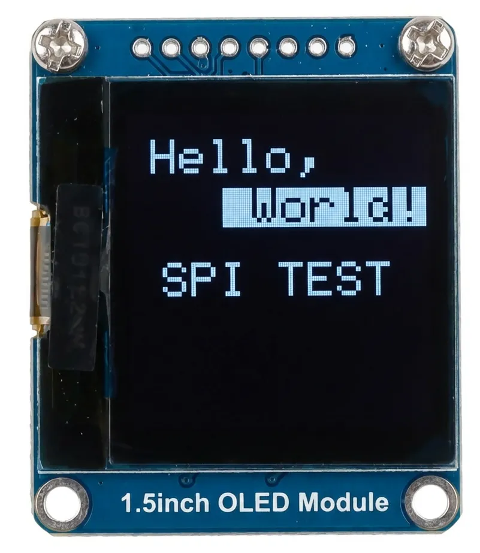

On this page

# SPI Communication

Important Note: About Board Compatibility

The core logic of this tutorial applies to all ESP32 development boards, but all operation steps are based on  as an example. If you are using another model of Development Board, please modify the corresponding settings according to your actual situation.

**SPI (Serial Peripheral Interface)** is a high-speed, full-duplex, synchronous serial communication protocol. SPI is widely used for communication between microcontrollers and various peripherals, such as SD cards, Displays, Sensors, Flash memory, etc.

SPI has the following characteristics:

- **Four-wire Communication**: Uses 4 signal lines for communication (can be reduced to 3 with a single slave device)
- **Master-Slave Architecture**: Clear master-slave relationship, the master controls communication timing
- **Full-duplex**: Can send and receive data simultaneously
- **High-speed Transfer**: Speed is typically faster than I2C and UART, reaching tens of MHz
- **Synchronous Communication**: Clock signal provided by the master, ensuring reliable data transmission

The four core signal lines of the SPI protocol are:

[SVG diagram]

- **SCK (Serial Clock)**: Serial clock line. The clock signal generated by the master, used to synchronize data transmission.
- **MOSI (Master Out Slave In)**: Master Out Slave In line. The master sends data to the slave through this line.
- **MISO (Master In Slave Out)**: Master In Slave Out line. The slave sends data to the master through this line.
- **SS/CS (Slave Select/Chip Select)**: Chip Select signal line. The master uses this line to select the slave to communicate with, with low level indicating selection. The SPI master selects the target slave through different CS (Chip Select) lines. Each additional SPI peripheral requires one more dedicated CS pin.

Supplementary Note on SPI Terminology Updates

You may notice in some new technical manuals or open-source projects that SPI terminology is changing. Understanding these new terms will help you read the latest materials without barriers. Here is the correspondence between old and new terms:

|CategoryTraditional TermNew Term
|Device Role**Master** (Master)**Controller** (Controller)
|Device Role**Slave** (Slave)**Peripheral** (Peripheral)
|Signal Lines**MOSI****PICO** (Peripheral In / Controller Out)
|Signal Lines**MISO****POCI** (Peripheral Out / Controller In)

## 1. SPI in ESP32

The ESP32 chip typically has multiple built-in SPI controllers (for specific quantities, please refer to the target chip's specification):

- SPI0 and SPI1: Used for accessing Flash or PSRAM.
- SPI2 and SPI3: Available for users to freely use**General** SPI controller, whose pins can be flexibly assigned.

In the Arduino environment, we use the `SPI` library to communicate with peripherals. Different models of ESP32 have different ways to access the SPI bus:

- ESP32 (Classic Model)ESP32-S3

`SPI` : Default SPI bus object, corresponds to VSPI (hardware SPI3).
- `SPI` : Creates a second bus object, corresponding to HSPI (hardware SPI2).

Common Misconceptions

In **[ESP32-S3 Technical Reference Manual (30.4 SPI Architecture Overview)](https://documentation.espressif.com/esp32-s3_technical_reference_manual_cn.pdf#spi)** , hardware SPI2 is also called FSPI. The "F" here stands for "Fast", not "Flash". In Arduino, this SPI2 bus is a fully available general-purpose bus.

- `SPI` : Default SPI bus object, corresponds to hardware SPI2 (FSPI).
- `SPI` : Creates a second bus object, corresponding to hardware SPI3.

Call `SPI` , if no pins are specified, the library will use the bus's default pins; if custom pin numbers are provided, it will [Routed through the GPIO matrix](https://docs.espressif.com/projects/arduino-esp32/en/latest/tutorials/io_mux.html)。

Note

When selecting SPI pins, be careful to avoid pins already used by other functions (such as USB, onboard LED). For specific available pins, please refer to the schematic or pinout of the Development Board you are using.

## 2. Example 1: Control Displays via SPI

This example demonstrates how to use the SPI interface to drive an OLED Display. Compared to I2C, the SPI version of Displays typically has a faster refresh rate.

### 2.1 Build the Circuit

Components needed:

-  × 1
- Breadboard × 1
- Jumper wires
- ESP32 Development Boards

Connect the circuit according to the wiring diagram below:

ESP32-S3-Zero Pinout


 

|ESP32 PinOLED ModuleDescription
|GPIO 13SCKSPI Clock Line
|GPIO 11MOSISPI Data Output
|GPIO 10CSChip Select Signal
|GPIO 8DCData/Command Select
|3.3VVCCPower Positive
|GNDGNDPower Negative

### 2.2 Code

Tip

This code example depends on **"Adafruit_SSD1327"** library. Please search for and install the 'Adafruit SSD1327' library in the Arduino IDE Library Manager.
Installation instructions:。

```
#include <SPI.h>
SPIClass hspi(HSPI);
void setup() {
  // Initialize HSPI bus and specify its pins
  hspi.begin(HSPI_SCLK, HSPI_MISO, HSPI_MOSI, HSPI_CS);
  // ...
}
void loop() {
  // ...
}
```

### 2.3 Code Analysis

-

**`SPI`**: Import Arduino's SPI communication library.

-

**`SPI`**: Initialize SPI bus and specify pins.

`SPI`: Clock line pin
- `SPI`: MISO pin (not used here, because Displays only require one-way data transmission)
- `SPI`: Data output line pin
- `SPI`: Chip select line pin

-

**`SPI`**: Create Display object.

`SPI`: Screen resolution
- `SPI`: Use the default SPI object
- `SPI`: Data/Command select pin
- `SPI`: Reset pin
- `SPI`: Chip select pin

-

**DC Pin Function**: SPI Displays usually require an additional DC (Data/Command) pin to distinguish between display data and control commands being transmitted.

### 2.4 Running Result

-

The OLED screen will light up, displaying the following content:

 

The first line shows "Hello," in white text.
- The second line shows " World!" in reverse video (i.e., black text on white background).
- The third line shows "SPI TEST" in white text.

## 3. Example 2: Using Multiple SPI Devices

**Code**

In the SPI library, a pre-created `SPI` object. If you want to use another SPI controller, you can define it as follows:

```
#include <SPI.h>
SPIClass hspi(HSPI);
void setup() {
  // Initialize HSPI bus and specify its pins
  hspi.begin(HSPI_SCLK, HSPI_MISO, HSPI_MOSI, HSPI_CS);
  // ...
}
void loop() {
  // ...
}
```

## 4. Related Links

- [SPI | Arduino-ESP32 documentation](https://docs.espressif.com/projects/arduino-esp32/en/latest/api/spi.html)
- [Arduino & Serial Peripheral Interface (SPI) | Arduino Documentation](https://docs.arduino.cc/learn/communication/spi/)
- [SPI | Arduino Documentation](https://docs.arduino.cc/language-reference/en/functions/communication/SPI/)
- [GPIO Matrix and Pin Mux | Arduino-ESP32 documentation](https://docs.espressif.com/projects/arduino-esp32/en/latest/tutorials/io_mux.html)
- [A Resolution to Redefine SPI Signal Names | OSHWA](https://oshwa.org/resources/a-resolution-to-redefine-spi-signal-names/)
- [New SPI Terminology | OSHWA](https://oshwa.org/announcements/new-spi-terminology/)
- [ESP32 Series SPI Naming Patterns (GitHub Issue)](https://github.com/espressif/arduino-esp32/pull/9216#issuecomment-1931983522)