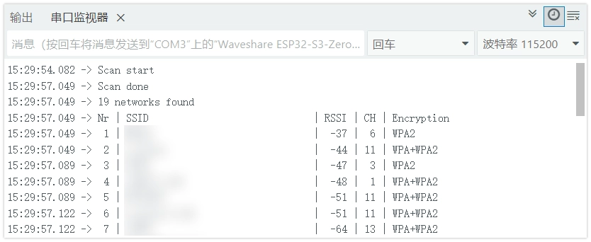
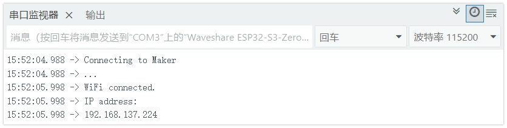
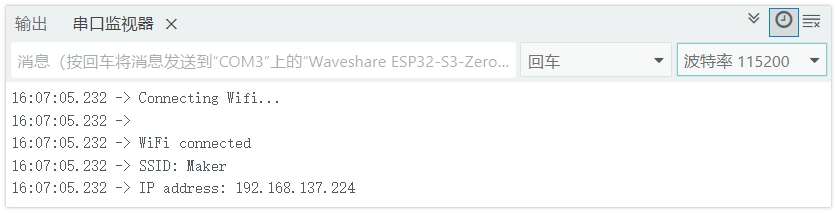
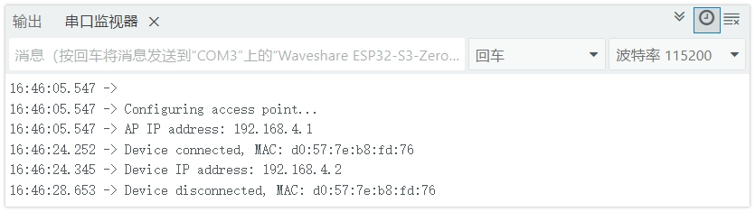

On this page

# Wi-Fi Basic Usage

Important Note: About Board Compatibility

The core logic of this tutorial applies to all ESP32 development boards, but all operation steps are based on  as an example. If you are using another model of Development Board, please modify the corresponding settings according to your actual situation.

The ESP32 series chips have built-in powerful wireless connectivity. Most ESP32 chips integrate Wi-Fi, making them very suitable for IoT (Internet of Things) projects. (Some models do not include Wi-Fi functionality to meet cost or specific application scenario requirements. For specific support details of various models, please check the official [ESP32 Product Overview](https://products.espressif.com/api/user/file/Espressif_SoC_Product_Portfolio.pdf) documentation.)

The ESP32 can operate in multiple Wi-Fi modes:

- **STA Mode (Station)**: ESP32 connects to a router or hotspot as a client.
- **AP Mode (Access Point)**: ESP32 creates a hotspot that other devices can connect to.
- **AP+STA Mode**: Simultaneously connects to a network as a client and provides a hotspot for other devices.

This Tutorial will introduce the basic usage of Wi-Fi on ESP32 in the Arduino environment through the following examples:

- [Example 1: Scan WiFi](#%E7%A4%BA%E4%BE%8B-1-%E6%89%AB%E6%8F%8F-wifi)
- [Example 2: Connect to Specified Wi-Fi (STA Mode)](#%E7%A4%BA%E4%BE%8B-2-%E8%BF%9E%E6%8E%A5%E6%8C%87%E5%AE%9A-wifi)
- [Example 3: Manage Multiple Wi-Fi (WiFiMulti)](#%E7%A4%BA%E4%BE%8B-3-%E7%AE%A1%E7%90%86%E5%A4%9A%E4%B8%AA-wifi)
- [Example 4: Create Wi-Fi Hotspot (AP Mode)](#%E7%A4%BA%E4%BE%8B-4-%E5%88%9B%E5%BB%BA-wifi-%E7%83%AD%E7%82%B9)
- [Example 5: Configure Static IP](#%E7%A4%BA%E4%BE%8B-5-%E9%85%8D%E7%BD%AE%E9%9D%99%E6%80%81-ip)

## 1. Example 1: Scan Wi-Fi

This example shows how to scan surrounding Wi-Fi networks and display their detailed Information, including network name, signal strength, channel, and encryption type.

### 1.1 Code

```
#include <WiFi.h>
const char *ssid = "ESP32S3-TEST";  // Set hotspot name
const char *password = "12345678";  // Set hotspot password (at least 8 characters)
IPAddress ip(192, 168, 5, 1);        // Set static IP address
IPAddress gateway(192, 168, 5, 1);   // Set gateway
IPAddress subnet(255, 255, 255, 0);  // Set subnet mask
void setup() {
  Serial.begin(115200);
  Serial.println();
  Serial.println("Configuring access point...");
  // Set Wi-Fi event callback functions
  WiFi.onEvent(WiFiStationConnected, WiFiEvent_t::ARDUINO_EVENT_WIFI_AP_STACONNECTED);
  WiFi.onEvent(WiFiStationGotIP, WiFiEvent_t::ARDUINO_EVENT_WIFI_AP_STAIPASSIGNED);
  WiFi.onEvent(WiFiStationDisconnected, WiFiEvent_t::ARDUINO_EVENT_WIFI_AP_STADISCONNECTED);
  // Call before WiFi.softAP() to create hotspot
  WiFi.softAPConfig(ip, gateway, subnet);
  // Create Wi-Fi hotspot
  if (!WiFi.softAP(ssid, password)) {
    Serial.println("Soft AP creation failed.");
    while (1)
      ;
  }
  Serial.print("AP IP address: ");
  Serial.println(WiFi.softAPIP());
}
void loop() {
}
// Device connected event
void WiFiStationConnected(WiFiEvent_t event, WiFiEventInfo_t info) {
  Serial.print("Device connected, MAC: ");
  Serial.println(macToString(info.wifi_ap_staconnected.mac));
}
// Device obtained IP event
void WiFiStationGotIP(WiFiEvent_t event, WiFiEventInfo_t info) {
  Serial.print("Device IP address: ");
  Serial.println(IPAddress(info.got_ip.ip_info.ip.addr));
}
// Device disconnected event
void WiFiStationDisconnected(WiFiEvent_t event, WiFiEventInfo_t info) {
  Serial.print("Device disconnected, MAC: ");
  Serial.println(macToString(info.wifi_ap_stadisconnected.mac));
}
// MAC address to string helper function
String macToString(const uint8_t *mac) {
  char buf[18];
  snprintf(buf, sizeof(buf), "%02x:%02x:%02x:%02x:%02x:%02x",
           mac[0], mac[1], mac[2], mac[3], mac[4], mac[5]);
  return String(buf);
}
```

### 1.2 Code Explanation

- `WiFi.softAP()`: Set the ESP32's Wi-Fi operating mode to Station mode.
- `WiFi.softAP()`: Disconnect any previously existing connections to ensure a disconnected state.
- `WiFi.softAP()`: Perform a synchronous scan to detect surrounding Wi-Fi networks. This function is blocking and returns the number of networks found after scanning is complete.
- `WiFi.softAP()`: Get the indexed `WiFi.softAP()` network's SSID (network name), returns String type.
- `WiFi.softAP()`: Get the indexed `WiFi.softAP()` network's RSSI (Received Signal Strength Indicator). Unit is dBm, the value is negative, and the closer to 0, the stronger the signal.
- `WiFi.softAP()`: Get the indexed `WiFi.softAP()` network's Wi-Fi channel.
- `WiFi.softAP()`: Get the indexed `WiFi.softAP()` network's encryption type.
- `WiFi.softAP()`: Delete scan results to free memory; this is a good programming habit.

### 1.3 Running Result

Open the serial monitor, set baud rate to `WiFi.softAP()`. The serial monitor will display the list of detected available Wi-Fi networks, output similar to the following:



## 2. Example 2: Connect to Specified Wi-Fi (STA Mode)

ESP32 connects to the specified Wi-Fi network, obtains an IP address, and maintains the connection.

### 2.1 Code

```
#include <WiFi.h>
const char *ssid = "ESP32S3-TEST";  // Set hotspot name
const char *password = "12345678";  // Set hotspot password (at least 8 characters)
IPAddress ip(192, 168, 5, 1);        // Set static IP address
IPAddress gateway(192, 168, 5, 1);   // Set gateway
IPAddress subnet(255, 255, 255, 0);  // Set subnet mask
void setup() {
  Serial.begin(115200);
  Serial.println();
  Serial.println("Configuring access point...");
  // Set Wi-Fi event callback functions
  WiFi.onEvent(WiFiStationConnected, WiFiEvent_t::ARDUINO_EVENT_WIFI_AP_STACONNECTED);
  WiFi.onEvent(WiFiStationGotIP, WiFiEvent_t::ARDUINO_EVENT_WIFI_AP_STAIPASSIGNED);
  WiFi.onEvent(WiFiStationDisconnected, WiFiEvent_t::ARDUINO_EVENT_WIFI_AP_STADISCONNECTED);
  // Call before WiFi.softAP() to create hotspot
  WiFi.softAPConfig(ip, gateway, subnet);
  // Create Wi-Fi hotspot
  if (!WiFi.softAP(ssid, password)) {
    Serial.println("Soft AP creation failed.");
    while (1)
      ;
  }
  Serial.print("AP IP address: ");
  Serial.println(WiFi.softAPIP());
}
void loop() {
}
// Device connected event
void WiFiStationConnected(WiFiEvent_t event, WiFiEventInfo_t info) {
  Serial.print("Device connected, MAC: ");
  Serial.println(macToString(info.wifi_ap_staconnected.mac));
}
// Device obtained IP event
void WiFiStationGotIP(WiFiEvent_t event, WiFiEventInfo_t info) {
  Serial.print("Device IP address: ");
  Serial.println(IPAddress(info.got_ip.ip_info.ip.addr));
}
// Device disconnected event
void WiFiStationDisconnected(WiFiEvent_t event, WiFiEventInfo_t info) {
  Serial.print("Device disconnected, MAC: ");
  Serial.println(macToString(info.wifi_ap_stadisconnected.mac));
}
// MAC address to string helper function
String macToString(const uint8_t *mac) {
  char buf[18];
  snprintf(buf, sizeof(buf), "%02x:%02x:%02x:%02x:%02x:%02x",
           mac[0], mac[1], mac[2], mac[3], mac[4], mac[5]);
  return String(buf);
}
```

### 2.2 Code Explanation

- `WiFi.softAP()`: Start the connection process. This is an asynchronous function that returns immediately, while the connection proceeds in the background.
- `WiFi.softAP()`: Returns the current Wi-Fi connection status.`WiFi.softAP()` indicates successful connection.`WiFi.softAP()` The loop waits for connection to complete by polling this status. Common Wi-Fi status values:

`WiFi.softAP()`: Wi-Fi is in idle state
- `WiFi.softAP()`: Specified network name not found
- `WiFi.softAP()`: Successfully connected
- `WiFi.softAP()`: Connection failed
- `WiFi.softAP()`: Connection lost

- `WiFi.softAP()`: Get the IP address assigned by the DHCP server to the ESP32 after successful connection. Type is IPAddress.

### 2.3 Running Result

Change the `WiFi.softAP()` and `WiFi.softAP()` After modifying to your Wi-Fi Information, upload. The serial monitor will display the connection process, and print the obtained IP address upon success:



## 3. Example 3: Manage Multiple Wi-Fi (WiFiMulti)

Pre-configure multiple Wi-Fi network Information, and the ESP32 automatically connects to the available network with the strongest signal.

### 3.1 Code

```
#include <WiFi.h>
const char *ssid = "ESP32S3-TEST";  // Set hotspot name
const char *password = "12345678";  // Set hotspot password (at least 8 characters)
IPAddress ip(192, 168, 5, 1);        // Set static IP address
IPAddress gateway(192, 168, 5, 1);   // Set gateway
IPAddress subnet(255, 255, 255, 0);  // Set subnet mask
void setup() {
  Serial.begin(115200);
  Serial.println();
  Serial.println("Configuring access point...");
  // Set Wi-Fi event callback functions
  WiFi.onEvent(WiFiStationConnected, WiFiEvent_t::ARDUINO_EVENT_WIFI_AP_STACONNECTED);
  WiFi.onEvent(WiFiStationGotIP, WiFiEvent_t::ARDUINO_EVENT_WIFI_AP_STAIPASSIGNED);
  WiFi.onEvent(WiFiStationDisconnected, WiFiEvent_t::ARDUINO_EVENT_WIFI_AP_STADISCONNECTED);
  // Call before WiFi.softAP() to create hotspot
  WiFi.softAPConfig(ip, gateway, subnet);
  // Create Wi-Fi hotspot
  if (!WiFi.softAP(ssid, password)) {
    Serial.println("Soft AP creation failed.");
    while (1)
      ;
  }
  Serial.print("AP IP address: ");
  Serial.println(WiFi.softAPIP());
}
void loop() {
}
// Device connected event
void WiFiStationConnected(WiFiEvent_t event, WiFiEventInfo_t info) {
  Serial.print("Device connected, MAC: ");
  Serial.println(macToString(info.wifi_ap_staconnected.mac));
}
// Device obtained IP event
void WiFiStationGotIP(WiFiEvent_t event, WiFiEventInfo_t info) {
  Serial.print("Device IP address: ");
  Serial.println(IPAddress(info.got_ip.ip_info.ip.addr));
}
// Device disconnected event
void WiFiStationDisconnected(WiFiEvent_t event, WiFiEventInfo_t info) {
  Serial.print("Device disconnected, MAC: ");
  Serial.println(macToString(info.wifi_ap_stadisconnected.mac));
}
// MAC address to string helper function
String macToString(const uint8_t *mac) {
  char buf[18];
  snprintf(buf, sizeof(buf), "%02x:%02x:%02x:%02x:%02x:%02x",
           mac[0], mac[1], mac[2], mac[3], mac[4], mac[5]);
  return String(buf);
}
```

### 3.2 Code Explanation

- `WiFi.softAP()`: Create a `WiFi.softAP()` object instance, used to manage multiple Wi-Fi networks.
- `WiFi.softAP()`: to `WiFi.softAP()` instance to add a candidate Wi-Fi network's credentials. Can be called multiple times to add multiple networks.
- `WiFi.softAP()`: Core function. It scans, selects the available network with the strongest signal, and attempts to connect. Returns the current connection status, similar to `WiFi.softAP()`. In `WiFi.softAP()` calling continuously in the loop can achieve automatic reconnection after disconnection.

### 3.3 Running Result

After configuring at least one available Wi-Fi Information, upload the code. The ESP32 will connect to the network with the strongest signal in the list and print the IP address. If the current connection disconnects, it will automatically try to reconnect to other available networks in the list.



## 4. Example 4: Create Wi-Fi Hotspot (AP Mode)

The ESP32 creates a Wi-Fi hotspot that other devices can connect to. When devices connect and disconnect, the serial monitor displays the device Information. This example uses event callbacks to monitor client connections and disconnections.

### 4.1 Code

```
#include <WiFi.h>
const char *ssid = "ESP32S3-TEST";  // Set hotspot name
const char *password = "12345678";  // Set hotspot password (at least 8 characters)
IPAddress ip(192, 168, 5, 1);        // Set static IP address
IPAddress gateway(192, 168, 5, 1);   // Set gateway
IPAddress subnet(255, 255, 255, 0);  // Set subnet mask
void setup() {
  Serial.begin(115200);
  Serial.println();
  Serial.println("Configuring access point...");
  // Set Wi-Fi event callback functions
  WiFi.onEvent(WiFiStationConnected, WiFiEvent_t::ARDUINO_EVENT_WIFI_AP_STACONNECTED);
  WiFi.onEvent(WiFiStationGotIP, WiFiEvent_t::ARDUINO_EVENT_WIFI_AP_STAIPASSIGNED);
  WiFi.onEvent(WiFiStationDisconnected, WiFiEvent_t::ARDUINO_EVENT_WIFI_AP_STADISCONNECTED);
  // Call before WiFi.softAP() to create hotspot
  WiFi.softAPConfig(ip, gateway, subnet);
  // Create Wi-Fi hotspot
  if (!WiFi.softAP(ssid, password)) {
    Serial.println("Soft AP creation failed.");
    while (1)
      ;
  }
  Serial.print("AP IP address: ");
  Serial.println(WiFi.softAPIP());
}
void loop() {
}
// Device connected event
void WiFiStationConnected(WiFiEvent_t event, WiFiEventInfo_t info) {
  Serial.print("Device connected, MAC: ");
  Serial.println(macToString(info.wifi_ap_staconnected.mac));
}
// Device obtained IP event
void WiFiStationGotIP(WiFiEvent_t event, WiFiEventInfo_t info) {
  Serial.print("Device IP address: ");
  Serial.println(IPAddress(info.got_ip.ip_info.ip.addr));
}
// Device disconnected event
void WiFiStationDisconnected(WiFiEvent_t event, WiFiEventInfo_t info) {
  Serial.print("Device disconnected, MAC: ");
  Serial.println(macToString(info.wifi_ap_stadisconnected.mac));
}
// MAC address to string helper function
String macToString(const uint8_t *mac) {
  char buf[18];
  snprintf(buf, sizeof(buf), "%02x:%02x:%02x:%02x:%02x:%02x",
           mac[0], mac[1], mac[2], mac[3], mac[4], mac[5]);
  return String(buf);
}
```

### 4.2 Code Explanation

- `WiFi.softAP()`: Register Wi-Fi event callback functions. When a specified event occurs, the system automatically calls the corresponding callback function. This is an event-driven programming pattern that does not require active polling of status.
- **Event Type Description**:

`WiFi.softAP()`: Triggered when a device connects to the ESP32 hotspot
- `WiFi.softAP()`: Triggered when a connected device obtains an IP address
- `WiFi.softAP()`: Triggered when a device disconnects from the ESP32 hotspot
- For other events, refer to [Wi-Fi Event Examples](https://docs.espressif.com/projects/arduino-esp32/en/latest/api/wifi.html#wi-fi-events-example)

- `WiFi.softAP()`: Create a Wi-Fi hotspot. The first parameter is the hotspot name, the second is the password (at least 8 characters). Returns a boolean indicating whether creation was successful.
- `WiFi.softAP()`: Get the ESP32's IP address as a hotspot, usually defaulting to 192.168.4.1.
- `WiFi.softAP()`: A structure containing event-related Information; different event types contain different Information fields.
- `WiFi.softAP()`: Helper function that converts a 6-byte MAC address array to a readable string format (e.g., "aa:bb:cc:dd:ee:ff"）。

### 4.3 Running Result

After the program runs, the ESP32 will create a Wi-Fi hotspot named "ESP32S3-TEST". The serial monitor will first print the AP's IP address. When a device connects to or disconnects from this hotspot, the corresponding event Information will be printed:



## 5. Example 5: Configure Static IP

In specific application scenarios, setting a fixed IP address for the ESP32 (instead of obtaining one dynamically via DHCP) is a common requirement, making it easier for the device to be accessed stably.

### 5.1 STA Mode: Configure Static IP

Based on Example 2, add static IP configuration:

```
#include <WiFi.h>
const char *ssid = "ESP32S3-TEST";  // Set hotspot name
const char *password = "12345678";  // Set hotspot password (at least 8 characters)
IPAddress ip(192, 168, 5, 1);        // Set static IP address
IPAddress gateway(192, 168, 5, 1);   // Set gateway
IPAddress subnet(255, 255, 255, 0);  // Set subnet mask
void setup() {
  Serial.begin(115200);
  Serial.println();
  Serial.println("Configuring access point...");
  // Set Wi-Fi event callback functions
  WiFi.onEvent(WiFiStationConnected, WiFiEvent_t::ARDUINO_EVENT_WIFI_AP_STACONNECTED);
  WiFi.onEvent(WiFiStationGotIP, WiFiEvent_t::ARDUINO_EVENT_WIFI_AP_STAIPASSIGNED);
  WiFi.onEvent(WiFiStationDisconnected, WiFiEvent_t::ARDUINO_EVENT_WIFI_AP_STADISCONNECTED);
  // Call before WiFi.softAP() to create hotspot
  WiFi.softAPConfig(ip, gateway, subnet);
  // Create Wi-Fi hotspot
  if (!WiFi.softAP(ssid, password)) {
    Serial.println("Soft AP creation failed.");
    while (1)
      ;
  }
  Serial.print("AP IP address: ");
  Serial.println(WiFi.softAPIP());
}
void loop() {
}
// Device connected event
void WiFiStationConnected(WiFiEvent_t event, WiFiEventInfo_t info) {
  Serial.print("Device connected, MAC: ");
  Serial.println(macToString(info.wifi_ap_staconnected.mac));
}
// Device obtained IP event
void WiFiStationGotIP(WiFiEvent_t event, WiFiEventInfo_t info) {
  Serial.print("Device IP address: ");
  Serial.println(IPAddress(info.got_ip.ip_info.ip.addr));
}
// Device disconnected event
void WiFiStationDisconnected(WiFiEvent_t event, WiFiEventInfo_t info) {
  Serial.print("Device disconnected, MAC: ");
  Serial.println(macToString(info.wifi_ap_stadisconnected.mac));
}
// MAC address to string helper function
String macToString(const uint8_t *mac) {
  char buf[18];
  snprintf(buf, sizeof(buf), "%02x:%02x:%02x:%02x:%02x:%02x",
           mac[0], mac[1], mac[2], mac[3], mac[4], mac[5]);
  return String(buf);
}
```

**Code Explanation**

-

`WiFi.softAP()`: Create a `WiFi.softAP()` object to represent the IP address.

-

`WiFi.softAP()`: In `WiFi.softAP()` Call before, to configure static IP. If configuration fails, returns `WiFi.softAP()`。

Note

Please ensure that the IP address, gateway, and subnet mask you set match your local network environment, and that the IP is not occupied by other devices.

### 5.2 AP Mode: Configure Static IP

Based on Example 4, set a custom IP address for the hotspot:

```
#include <WiFi.h>
const char *ssid = "ESP32S3-TEST";  // Set hotspot name
const char *password = "12345678";  // Set hotspot password (at least 8 characters)
IPAddress ip(192, 168, 5, 1);        // Set static IP address
IPAddress gateway(192, 168, 5, 1);   // Set gateway
IPAddress subnet(255, 255, 255, 0);  // Set subnet mask
void setup() {
  Serial.begin(115200);
  Serial.println();
  Serial.println("Configuring access point...");
  // Set Wi-Fi event callback functions
  WiFi.onEvent(WiFiStationConnected, WiFiEvent_t::ARDUINO_EVENT_WIFI_AP_STACONNECTED);
  WiFi.onEvent(WiFiStationGotIP, WiFiEvent_t::ARDUINO_EVENT_WIFI_AP_STAIPASSIGNED);
  WiFi.onEvent(WiFiStationDisconnected, WiFiEvent_t::ARDUINO_EVENT_WIFI_AP_STADISCONNECTED);
  // Call before WiFi.softAP() to create hotspot
  WiFi.softAPConfig(ip, gateway, subnet);
  // Create Wi-Fi hotspot
  if (!WiFi.softAP(ssid, password)) {
    Serial.println("Soft AP creation failed.");
    while (1)
      ;
  }
  Serial.print("AP IP address: ");
  Serial.println(WiFi.softAPIP());
}
void loop() {
}
// Device connected event
void WiFiStationConnected(WiFiEvent_t event, WiFiEventInfo_t info) {
  Serial.print("Device connected, MAC: ");
  Serial.println(macToString(info.wifi_ap_staconnected.mac));
}
// Device obtained IP event
void WiFiStationGotIP(WiFiEvent_t event, WiFiEventInfo_t info) {
  Serial.print("Device IP address: ");
  Serial.println(IPAddress(info.got_ip.ip_info.ip.addr));
}
// Device disconnected event
void WiFiStationDisconnected(WiFiEvent_t event, WiFiEventInfo_t info) {
  Serial.print("Device disconnected, MAC: ");
  Serial.println(macToString(info.wifi_ap_stadisconnected.mac));
}
// MAC address to string helper function
String macToString(const uint8_t *mac) {
  char buf[18];
  snprintf(buf, sizeof(buf), "%02x:%02x:%02x:%02x:%02x:%02x",
           mac[0], mac[1], mac[2], mac[3], mac[4], mac[5]);
  return String(buf);
}
```

**Code Explanation**

- `WiFi.softAP()`: In `WiFi.softAP()` Call before, to set a custom IP address, gateway, and subnet mask for the ESP32's AP mode.

## 6. Related Links

- [Wi-Fi API | Arduino-ESP32 documentation](https://docs.espressif.com/projects/arduino-esp32/en/latest/api/wifi.html)
- [WiFi Network | Arduino Documentation](https://docs.arduino.cc/language-reference/en/functions/wifi/wificlass/)

