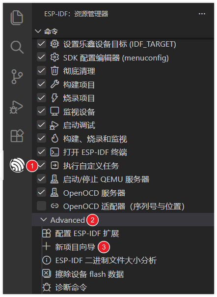
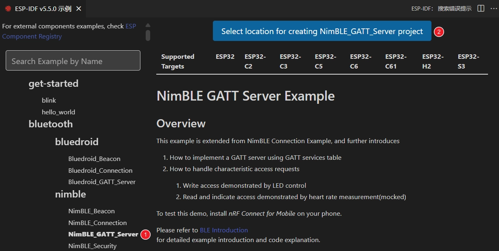
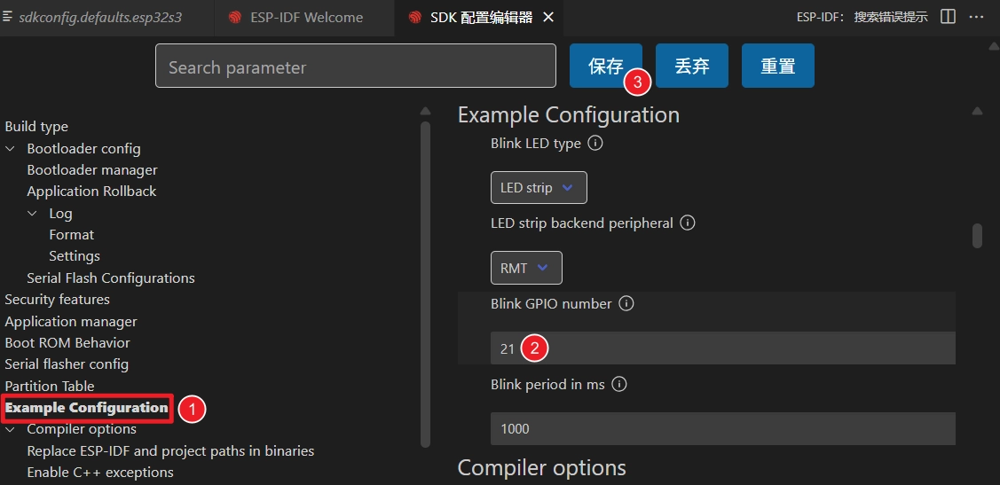
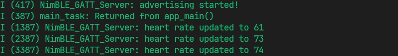
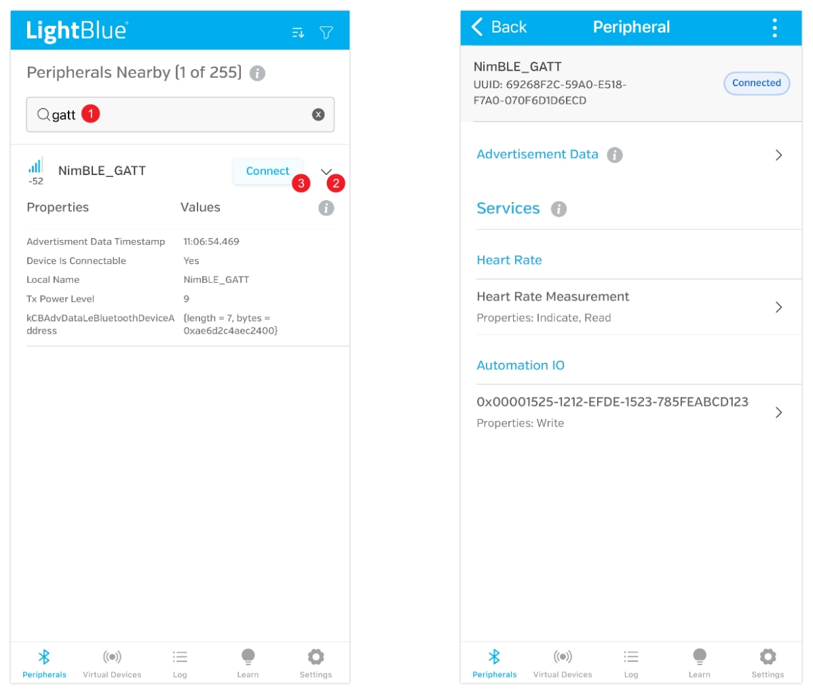
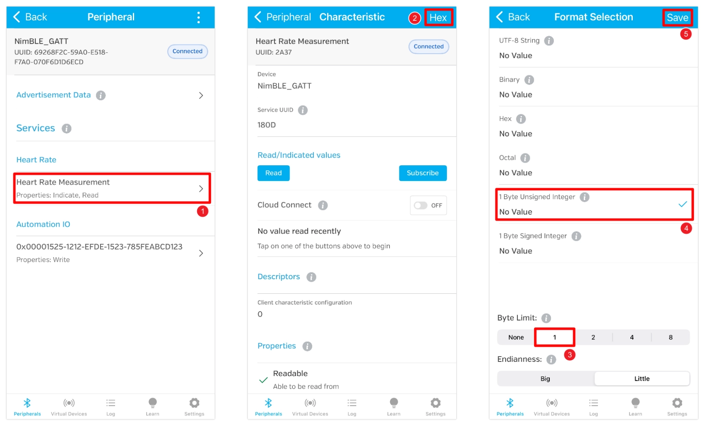
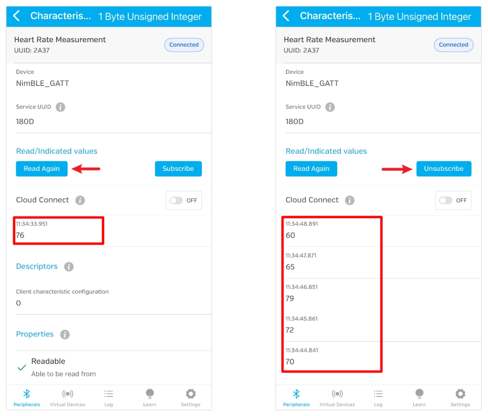
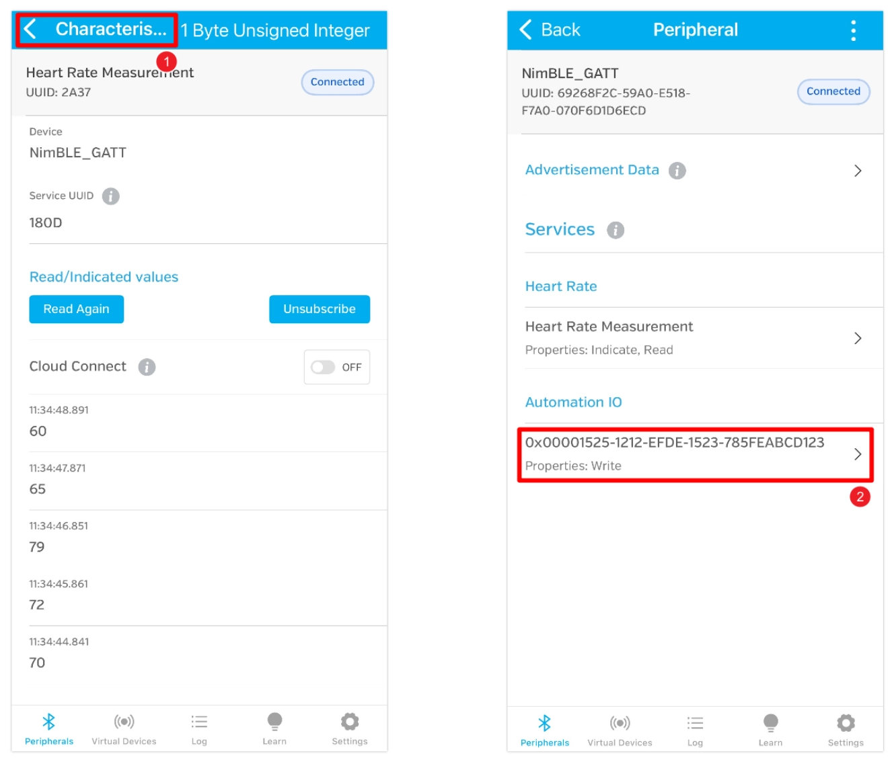
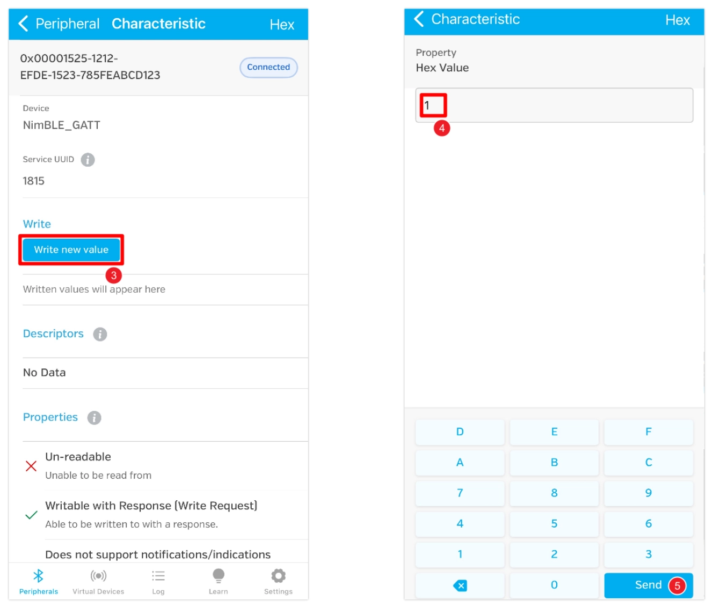

This page overview

# Section 9: BLE Programming

Important Note: About Board Compatibility

The core logic of this tutorial applies to all ESP32 development boards，but theYesoperation steps are all based on  as an example for demonstration. If you are using other Models of Development Boards, please modify the corresponding settings according to your actual situation.

this section introduces ESP32 LowPower consumptionBlueBluetooth (BLE) ofBasic knowledge, andViaa/one GATT serverExample，demonstrationCreate BLE serviceAndFeatures, andUsemobile phone App AndDevelopment BoardPerformBlueBluetooth communicationofprocess.

## 0. Bluetooth (Bluetooth)

The ESP32 series chips have built-in powerful Bluetooth capabilities, making them ideal for smart wearables, wireless sensing, and short-range communication between devices. Bluetooth technology is divided into two main types:

- **Bluetooth Classic**: Designed for continuous, high-throughput data transfer, commonly found in wireless audio devices.
- **Bluetooth Low Energy (BLE)**: Optimized for low-power, intermittent, small packet communication, it is the mainstream choice for IoT applications, such as smart wristbands and wireless Sensors.

ESP32 chipofBlueBluetooth support statusYesdifferent:

- The classic ESP32 chip supports both Bluetooth Classic and BLE;
- and subsequent new Models only support BLE (for specific support status, please check:[ESP32 product overview](https://products.espressif.com/api/user/file/Espressif_SoC_Product_Portfolio.pdf)). In fields such as IoT and wearable devices, BLE is the preferred choice due to its low power consumption and high compatibility.

This Tutorials focuses on the application of Bluetooth Low Energy (BLE) technology.

## 1. Bluetooth Low Energy (BLE) Overview

BLE (Bluetooth Low Energy) is a wireless communication protocol designed for low-power, intermittent data transmission. It was introduced in the Bluetooth 4.0 standard and is incompatible with Bluetooth Classic. Typical BLE application scenarios include IoT devices, smart switches, smart sensors, wearable devices, etc. Compared with Bluetooth Classic, BLE has lower communication rates but extremely low power consumption, making it very suitable for devices requiring long battery life.

ESP-IDF（Espressif IoT Development Framework）Is ESP32 series chips provide a completeof BLE protocol stack support. Its BLE protocol stack usesUseLayered architecture, mainly including:

[SVG diagram]

- **BlueBluetooth controller layer (Controller)**: Responsible for low-level hardware interface and link management.
- **BlueBluetooth host layer (Host)**:ESP-IDF supports two host protocol stacks:

**ESP-Bluedroid**: Supports Classic Bluetooth and BLE (some chips only support BLE), with a clear architecture but larger Resources footprint.
- **ESP-NimBLE**: Only supports BLE, with a smaller Resources footprint, suitable for scenarios with strict memory and firmware size requirements.

- **Bluetooth Profiles (Profiles)**: Such as ESP-BLE-MESH (based on the Zephyr Mesh protocol stack), BluFi (configuring Wi-Fi via BLE), etc.
- **Applicationlayer (Applications)**: Developers can build various BLE applications based on the above APIs and specifications.

## 2. Main BLE Protocols

BLE ofCore protocols include GAP（Generic Access Profile，responsible forDevice discovery、Connection management、broadcastetc.）And GATT（Generic Attribute Profile，Defines the data communication format). For details, seeReference  And [Layered architecture of Bluetooth Low Energy](https://docs.espressif.com/projects/esp-idf/zh_CN/latest/esp32s3/api-guides/ble/get-started/ble-introduction.html#id4)。

- **GAP（Generic Access Profile）**:defineDevice discovery、Connection management、broadcastetc.，Specifies the deviceofConnection rowIsAndRoles (such as broadcaster, scanner, connection initiator,Peripheral device、Central device），and supports multi-roleAndMulti-connection topology.
- **GATT/ATT（Generic Attribute Profile / Attribute Protocol）**:Define dataofrepresents/indicatesAndExchange method.ATT by attributeIsBasic data structures, samplingUseclient/Server architecture.GATT In ATT Defined characteristics on this basis (Characteristic）、service (Service）、Specification (Profile）etc.Concept, implementing dataofLayeredAndcomplex/repeatUse。
- **L2CAP（Logical link controlAndAdaptation protocol)**: Responsible for data segmentation, reassembly, and multiplexing, providing data channels for upper-layer protocols.
- **SMP (Security Manager Protocol)**: Responsible for authentication, encryption, and secure pairing.

## 3. Exampleprogram

Based on official code examples [NimBLE_GATT_Server](https://github.com/espressif/esp-idf/tree/5c5eb99e/examples/bluetooth/ble_get_started/nimble/NimBLE_GATT_Server) Demonstrate how to implement a Bluetooth Low Energy application on the ESP32-S3 using ESP-IDF, and through **[LightBlue](https://punchthrough.com/lightblue/)** Use a phone debugging app to control the LED and read simulated heart rate data, establishing an intuitive understanding of Bluetooth Low Energy functionality. For information about using **[nRF Connect for Mobile](https://www.nordicsemi.com/Products/Development-tools/nRF-Connect-for-mobile)** for alternative methods, please refer to [ESP-IDF Programming Guide - BLE Getting Started Guide](https://docs.espressif.com/projects/esp-idf/zh_CN/latest/esp32s3/api-guides/ble/get-started/ble-introduction.html#id9)。

[SVG diagram]

### 3.1 Open example project

-

Open VS Code, click the icon to launch the ESP-IDF extension. Under the 'Advanced' options, click 'Show Example Projects'.

-

Select ESP-IDF version.

[SVG diagram]

-

InExamplelistIn "bluetooth" divide/partClassdown/belowSelect "NimBLE_GATT_Server"。Then, then click "Select location for creating NimBLE_GATT_Server project" SelectProjectstoreFolder.

The ESP-IDF extension will automatically copy the example code to the specified location and open a new project.

Note

The project storage path should not contain spaces, Chinese characters, or special characters.

### 3.2 Modify project configuration

the/thisExampleProjectA default configuration is providedUsefor status indicationof LED。IsTo enable the program to correctly controlDevelopment Boardofonboard LED，needAccording toDevelopment BoardofactualHardware connectionto comeModify LED ofClasstype/modelAnd GPIO Pin.

-

Click [SVG diagram] Open the SDK Configuration Editor.

Different from `0x00` The command-line configuration tool (TUI) provided; the ESP-IDF VS Code plugin provides a more intuitive graphical configuration interface.

-

Modify the configuration according to the Development Board's onboard LED:

Blink LED type: Select the LED type.

`0x00`: regular LED.
- `0x00`: Addressable LEDs (e.g., WS2812).

- Blink GPIO number: Set the GPIO pin number connected to the LED.
- Blink period in ms: Set the LED blink period (unit: milliseconds).

Information

Used in this Tutorials  Onboard WS2812 addressable LED, connected to GPIO 21 pin.

-

ModifyComplete, then click "save" Button.

### 3.3 build, flashAndMonitor

-

configure flashOption

First, before building and flashing, please make sure to check and set the correct target device, serial port, and flashing method. Refer to 。

[SVG diagram]

-

Click [SVG diagram] Automatically execute build, flash, and monitor in sequence with one click.

-

After flashing is complete, the serial monitor will start printing Information.canSee BLE initializationofLog，and randomly generatedofheart rate data at approximately 1 Hz ofFrequencyIn 60-80 Update within range.

### 3.4 Connect to Development Board via Bluetooth

Tip

This example requires a Bluetooth debugging tool, such as [LightBlue](https://apps.apple.com/cn/app/lightblue/id557428110). iOS users can [Apple Store](https://apps.apple.com/cn/app/lightblue/id557428110) Download; Android users can search for LightBlue in the app store to download.

Open LightBlue and follow these steps:

-

**Connect Development Board**:

First, search "GATT", find "NimBLE_GATT" Device.ClickRight sidePressButton can expand to view broadcastInformation，ThenClick "Connect" Perform connection.

 

On the device detail page, you can see that the device has two services, each with one characteristic. Both services use[Standard Bluetooth SIG UUID](https://www.bluetooth.com/specifications/assigned-numbers/), so they are automatically recognized as "Heart Rate" and "Automation IO", providing heart rate data reading and LED control functions respectively.

-

**Receive heart rate data**:

Clickenter "Heart Rate Measurement" characteristic.ThenClicktop right cornerof "HEX" SettingsdataClasstype. Will "Byte Limit" Set to 1，Select "1 Byte Unsigned Integer" and save it for later data review.

 

After saving, return to the characteristic detail page and click "Read" to read data. You can also click "Subscribe" to subscribe to data, which will be automatically pushed when the heart rate updates.

 

-

**Control LED**:

Clicktop-left cornerofReturnPressButton, return to previousPage.Thenenter "0x00001525-1212-EFDE-1523-785FEABCD123" characteristic.

this UUID is notBlueBluetooth standard definitionof SIG UUID，thereforeWill notis automatically recognized, but directly displays the original UUID。（In Nordic Semiconductor developmentof nRF Connect for Mobile InCan be recognizedIs LED）

 

It is actually several well-known manufacturers (especially Nordic Semiconductor）InExampleCodeInwidelyUseof UUID，usually represents LED state characteristic. It receives 1 byte integer:write `0x00` means "on", write `0x00` Indicates "off".

Click "Write new value"，write value 1，LED immediatelyLight up。If writing values 0，LED will followTurn off。

 

## 5. Reference Links

- [ESP Friends - BLE Example](https://docs.espressif.com/projects/esp-techpedia/zh_CN/latest/esp-friends/get-started/case-study/BLE-examples/index.html)
- [ESP Friends - BLE examples - Common steps](https://docs.espressif.com/projects/esp-techpedia/zh_CN/latest/esp-friends/get-started/case-study/BLE-examples/general-steps.html)
- [API Guide - Bluetooth Low Energy ®](https://docs.espressif.com/projects/esp-idf/zh_CN/latest/esp32s3/api-guides/ble/index.html)
- [API Guide - Bluetooth Low Energy ® - Quick Start](https://docs.espressif.com/projects/esp-idf/zh_CN/latest/esp32s3/api-guides/ble/get-started/ble-introduction.html)

