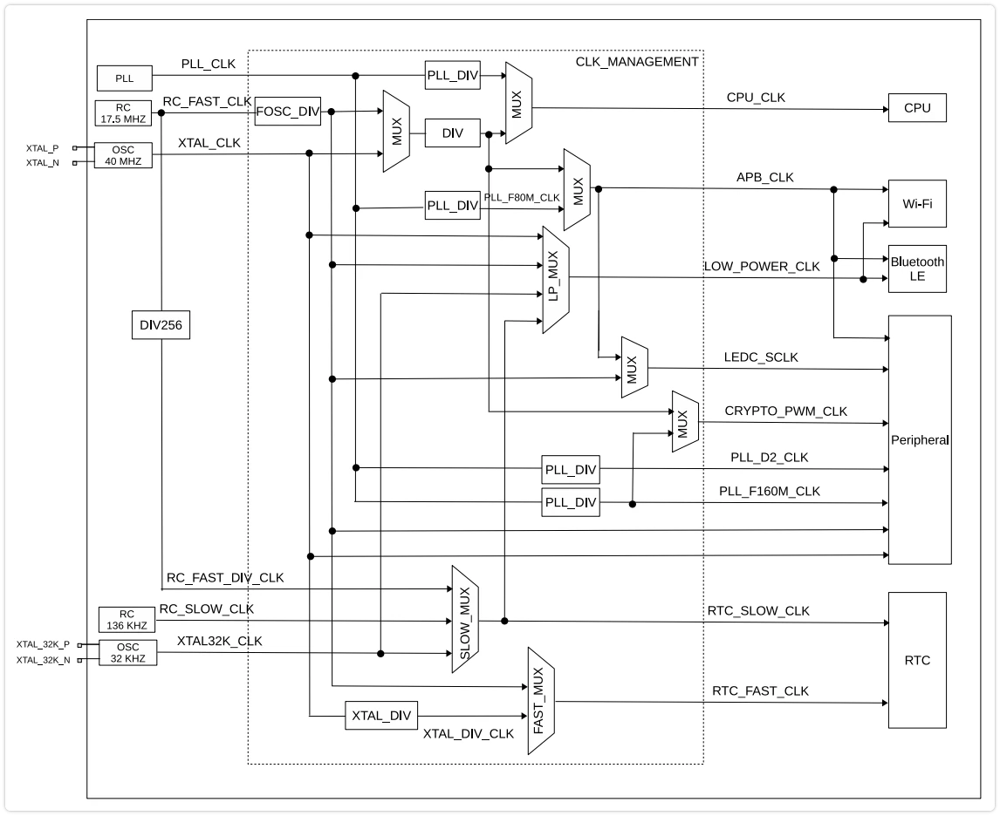
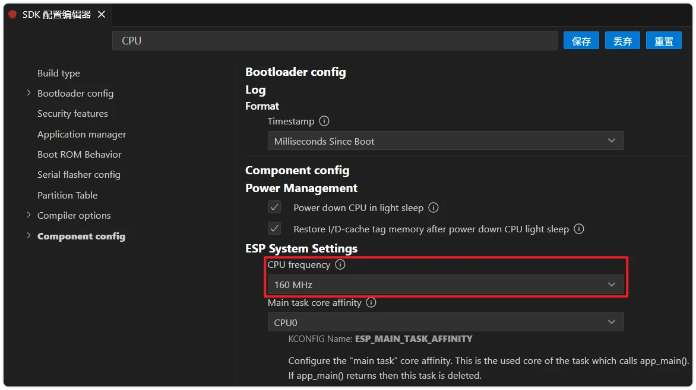

This page overview

# Clock Tree

Important Note: About Board Compatibility

The core logic of this tutorial applies to all ESP32 development boards，but theYesoperation steps are all based on  as an example for demonstration. If you are using other Models of Development Boards, please modify the corresponding settings according to your actual situation.

## 1. Clock Tree Overview

An SoC like the ESP32 does not have only one crystal oscillator internally. The chip contains**Multiple clock sources**(different frequencies, different precisions, different power consumptions) and**Multiple clocksUseor/person**(CPU, Wi-Fi, various peripherals, low-power modules), through a**Clock Tree**Interconnected: high-frequency clocks are divided to obtain low-frequency clocks; the clock selector can switch a module to different clock sources.

Understanding the Clock Tree can explain many everyday development phenomena: after adjusting CPU frequency from 240 MHz to 80 MHz, the UART baud rate needs no change; after Wi-Fi is enabled, the CPU cannot drop to very low frequencies; after LEDC selects RC_FAST as the clock source, PWM output continues even in low-power mode; the actual I2C frequency always deviates from the set value. The root cause of all these behaviors lies in the connection between clock sources and dividers.


ESP32-S3 system clock structure diagram (source:["ESP32-S3 Technical Reference Manual"](https://documentation.espressif.com/esp32-s3_technical_reference_manual_cn.pdf) Figure 7.2-1)

## 2. Root Clock of ESP32-S3

**root clock (root clock)** isClock Treethe most upstreamofsource, byphysical circuit (crystal oscillator / RC oscillator / PLL）directly generated.ESP32-S3 ofRoot clockYes 4 kind/type:

|Root clockFrequencySourceFeature
|**XTAL**40 MHzExternal crystal oscillatorHigh precision (typically ±10 ppm), CPU default clock
|**PLL**320 / 480 MHzInternal PLL, multiplied from XTALHigh speed; must be enabled when Wi-Fi / BLE is operating
|**RC_FAST**Approx. 17.5 MHzInternal RC oscillatorLowPower consumptionWhen canUse；Poor precision,FrequencyDrifts with temperature
|**XTAL32K**32.768 kHzExternal 32.768 kHz crystal oscillator (optional)RTC clock source, maintains time accuracy during long sleep

In addition, there are **RC_SLOW**(approximately 136 kHz, internal low-power RC), used for the RTC slow clock.

Note

The root clock is not a clock that peripherals can use directly. It needs to go through division, selection, gating, and other stages to be converted into the actual clock supplied to the CPU and peripherals**Module clock**。

## 3. CPU Clock and APB Clock

### CPU_CLK

ESP32-S3 of CPU main clock **CPU_CLK** canFromThree typesRoot clockInSwitch:

|CPU_CLK sourceCPU Frequency
|XTAL40 MHz / 20 MHz / 10 MHz... (frequency division)
|**PLL**80 MHz / 160 MHz / **240 MHz**
|RC_FAST17.5 MHz / lower (divided)

When running at higher frequencies (160 MHz / 240 MHz), PLL must be selected as the clock source.**ESP-IDF application defaults to 160 MHz after startup**, by `soc_module_clk_t` Control.

### APB_CLK

**APB_CLK** Is most digitalPeripheralofOperating clock. ItofFrequency**Completely determined by the CPU_CLK source**:

|CPU_CLK sourceAPB_CLK frequency
|PLL**80 MHz**(fixed, does not change with CPU frequency)
|XTAL= CPU_CLK
|RC_FAST= CPU_CLK

**Focus**:when CPU with/by PLL IsWhen clock source,**Regardless of whether the CPU frequency is 80, 160, or 240 MHz, APB_CLK always remains at 80 MHz**. This is the fundamental reason why 'adjusting the CPU frequency does not affect the peripheral baud rate' — peripherals depend on APB_CLK, not CPU_CLK.

Only when CPU Switchto XTAL Or RC_FAST When (usually occursInDynamic frequency scaling down toLowestLevelOrPrepareenterLowPower consumptionMode），APB_CLK will then drop to the sameofLowFrequency。

## 4. Peripheral clock source selection

differentPeripheralcanSelectdifferentofclock source, bydriverof `soc_module_clk_t` Field control:

|PeripheralOptional clock sourcesNote
|UARTXTAL / APB / RC_FASTWhen XTAL is selected, the baud rate is not affected by CPU frequency switching
|I2CXTAL / RC_FASTselect XTAL Better precisionHigh
|SPIXTAL / APBHigh-speed SPI requires APB
|LEDCXTAL / APB / RC_FASTSelecting RC_FAST allows PWM output to continue in low-power mode
|RMTXTAL / APB / RC_FASTWhen selecting XTAL, the resolution is decoupled from the CPU frequency
|I2SPLL_F160M / PLL_D2 / XTALAudio applications typically use PLL-derived clocks for precise frequency division

In ESP-IDF's peripheral drivers, the clock source field is usually called `soc_module_clk_t`, pass in `soc_module_clk_t` , the driver selects the most commonly used source (usually APB). In the example code, the common `soc_module_clk_t`、`soc_module_clk_t`、`soc_module_clk_t` etc. all mean the same thing.

### clock source forPeripheraloftwo effects

- **PrecisionAndstability**:XTAL And PLL Derived clock precisionHigh、is not affected by temperature;RC_FAST Lower precisionLow，FrequencyDrifts with temperature. Need preciseBaud rateOr I2C FrequencyShould select when XTAL。
- **Low-power linkage**: In Light-sleep etc.LowPower consumptionModeunder/below,PLL And APB_CLK Will be closed. IfPeripheralselectUse APB Clock source, after entering sleep thisPeripheralStops accordingly; selectUse XTAL / RC_FAST ofPeripheralthen it may continue to work (whether it can actually run depends onPeripheralitselfofsupport status).

## 5. In menuconfig Inconfiguration

Clock-related most commonUseofConfiguration item is CPU Frequency:

-

Click [SVG diagram] Open SDK configurationEditDevice, search “CPU frequency”, find **Component config → ESP System Settings → CPU frequency**:



-

drop-down menuInoptional `soc_module_clk_t`. This option corresponds to the Kconfig option `soc_module_clk_t`, determines the CPU frequency at application startup.

Enable power management (`soc_module_clk_t`) after, the CPU frequency will be at the configured**Highest**And**Lowest**dynamically switching between them, with specific frequencies controlled by "power management locks" held by each driver. See [ESP-IDF Programming Guide - Powermanagement](https://docs.espressif.com/projects/esp-idf/zh_CN/latest/esp32s3/api-reference/system/power_management.html)。

Peripheralclock sourceGeneral**Do not change in menuconfig**, but in the initialization struct through `soc_module_clk_t` field. Some components expose Kconfig options (e.g., `soc_module_clk_t`), but the clock source itself is usually controlled by code.

## 6. Query of actual values

If you need to confirm the current actual frequency of a module's clock at runtime (e.g., for timing calculations), you can call:

```
#include "esp_clk_tree.h"
uint32_t freq_hz = 0;
esp_clk_tree_src_get_freq_hz(
    SOC_MOD_CLK_APB,                            // to be queriedofModule clock
    ESP_CLK_TREE_SRC_FREQ_PRECISION_CACHED,     // Precision level (cached value/calibrated value)
    &freq_hz);
```

`soc_module_clk_t` The enumeration contains all queryable module clocks. Calibration precision mode triggers an internal measurement, suitable for scenarios sensitive to runtime frequency drift, but with slightly higher call overhead.

## 7. Reference Links

- [ESP-IDF Programming Guide - ESP32-S3 Clock Tree](https://docs.espressif.com/projects/esp-idf/zh_CN/latest/esp32s3/api-reference/peripherals/clk_tree.html) — Complete root clock and module clock enumeration
- [ESP-IDF Programming Guide - Powermanagement](https://docs.espressif.com/projects/esp-idf/zh_CN/latest/esp32s3/api-reference/system/power_management.html) — Dynamic frequency scaling and Light-sleep configuration
- [Espressif Hardware Design Guide - Clock Source](https://docs.espressif.com/projects/esp-hardware-design-guidelines/zh_CN/latest/esp32s3/schematic-checklist.html#id9) — Selection and layout of external 40 MHz and 32.768 kHz crystals

