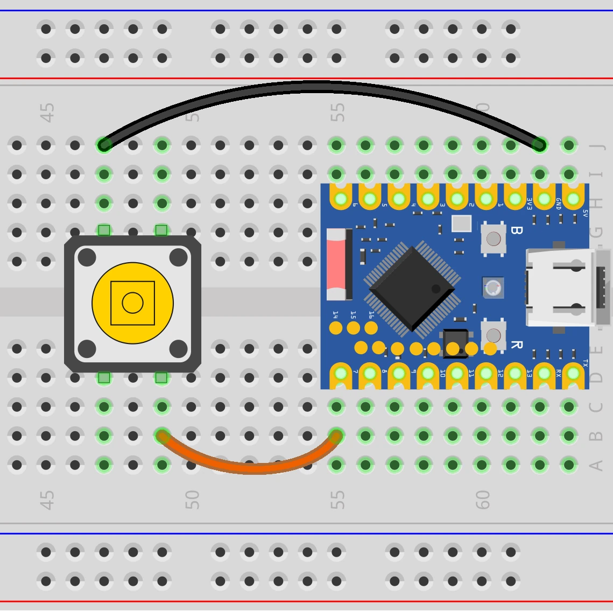
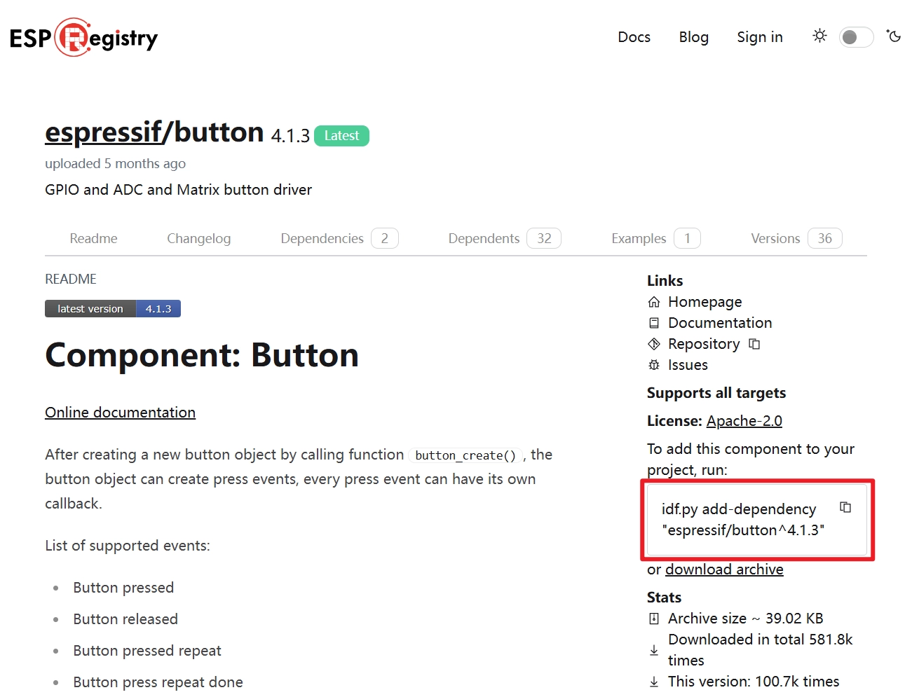
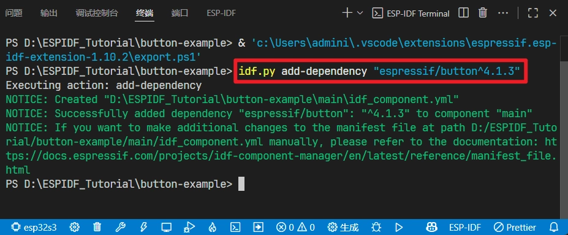
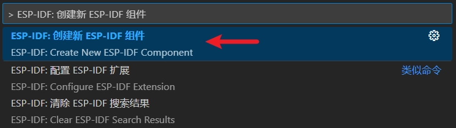

This page overview

# Section 4: Using Components

Important Note: About Board Compatibility

The core logic of this tutorial applies to all ESP32 development boards，but theYesoperation steps are all based on  as an example for demonstration. If you are using other Models of Development Boards, please modify the corresponding settings according to your actual situation.

this section introduces ESP-IDF component systemofBasic concepts, including componentsofClasstype/modelAndStructure, andViaBuilt-in components (GPIO) Andexternal components (Button) ofExample，DescriptionitsInProjectInApplication。

## 1. ESP-IDF Component Overview

[SVG diagram]

ESP-IDF use/adoptUsecomponent-based design, willsystemofEach itemFunction（Such as operating systems,Networkprotocol stack,Driver,Peripheralsupportetc.）DivisionIsindependentof“component" (Component）。Eachcomponentis aReusableUse、independentofCodepackage, focuses on implementing a specificFunction。InProjectAt build time, components will be compiledIsstaticLibrary，andBymainApplicationprogramOrLink with other componentsAndCall。

On this architectural foundation, developers can flexibly add custom components or integrate third-party components (such as specific cloud services, protocols, or drivers). By combining external components with ESP-IDF's internal core components, project functionality can be expanded and customized, achieving overall project modularization and efficient reuse. The advantages include: clear layering and dependency management, code reuse, easy extension and updating, thereby reducing project complexity and accelerating development iteration.

## 2. componentClasstype/model

In an ESP-IDF project, components are mainly divided into the following three categories:

-

**Built-in Components (Core/Built-in Components)**: These are core components bundled with the ESP-IDF framework, located under the ESP-IDF installation Table of Contents at `idf_component.yml` In the folder, it provides foundational functions such as low-level drivers, network protocol stacks, and the FreeRTOS operating system. Developers can directly include its header files in code and use them without additional configuration.

-

**Project Components**: These are the ones developers have in the project root Table of Contents `idf_component.yml` Components created in the folder are suitable for storing project-specific, reusable functional modules, helping to keep the main logic `idf_component.yml` ofcleanAndProjectofModuleization.

-

**External Components (External/Managed Components)**: These components are created by the community or third-party developers and published to [ESP-IDF Component Registry](https://components.espressif.com/). Can be done via [IDF component manager](https://docs.espressif.com/projects/esp-idf/zh_CN/stable/esp32s3/api-guides/tools/idf-component-manager.html) Automatically downloaded and integrated into the project; after downloading, it will be stored in the project root Table of Contents under `idf_component.yml` In the folder.

## 3. Component structure

A complete ESP-IDF component typically contains the following:

- **Source code**

Core functional code file of the component implementation.
- **Header file**

Interface declarations exposed externally, for other components or the main program to call.
- **CMakeLists.txt**

Define the compilation method for source code and header files
- Declare component dependencies
- Register component to build system
- Configure optional features
- Serves as a CMake build description file, instructing the compiler how to compile, link, and build the component

- **idf_component.yml**

component manager descriptionFile，List this component's dependenciesofOther components and theirVersionInformation。ESP-IDF component managerwillAccording tothisFileautomatic downloadAndIntegrate required dependencies,Ensuredependencies satisfied.

## 4. Components in the project

An example of the Table of Contents structure for a project containing components is as follows:

```
idf.py fullclean
```

-

**main/**

Main component Table of Contents of the project, containing the project's main source code.`idf_component.yml` The Table of Contents typically has its own CMakeLists.txt and optional `idf_component.yml`, used to declare the dependencies of the main component. An application must contain a main component (the name can be changed), which is the primary component that holds the application logic.

-

**components/**

ProjectcustomComponent Table of Contents。Eachsub/childTable of ContentsIsa component, containingSource code、Header file、CMakeLists.txt、Kconfig etc.。canUsefor organizing reusableUseCodeOrintroduce third-party components. IfYescomponents with the same name, priorityUse `idf_component.yml` version.

-

**managed_components/**

By [IDF component manager](https://docs.espressif.com/projects/esp-idf/zh_CN/stable/esp32s3/api-guides/tools/idf-component-manager.html) Automatically created for storing managed components downloaded via the component manager. Each managed component typically contains `idf_component.yml`, defining component metadata and dependencies. Do not manually modify the contents of this Table of Contents. If modifications are needed, copy the component to `idf_component.yml` Under Table of Contents.

-

**idf_component.yml**

Component manager description file, declaring the component's metadata and its dependencies. Can exist in `idf_component.yml`、`idf_component.yml` under each component's Table of Contents, and `idf_component.yml` The managed components Table of Contents under it. This file is optional and only needed when declaring dependencies.

-

**dependencies.lock**

By [IDF component manager](https://docs.espressif.com/projects/esp-idf/zh_CN/stable/esp32s3/api-guides/tools/idf-component-manager.html) Auto-generated; records all managed components used by the current project and their exact versions. Do not modify manually. Only when the project contains `idf_component.yml` FileOnly then will it generate theFile。

## 5. Example: Usebuilt-in GPIO component

By using ESP-IDF's built-in [esp_driver_gpio component](https://docs.espressif.com/projects/esp-idf/zh_CN/v6.0/esp32s3/api-reference/peripherals/gpio.html) To readPressbuttonoflogic level state.

### 5.1 Build the circuit

Required components are:

- Pressbutton * 1
- Breadboard * 1
- Wire
- ESP32 Development Boards ()

ESP32-S3-Zero Pinfigure/diagram


 

### 5.2 Include GPIO library

-

Create a project. If you're not sure how to do this, please refer to 。

-

Before including ESP-IDF built-in components, please check [Corresponding component documentation](https://docs.espressif.com/projects/esp-idf/zh_CN/v6.0.1/esp32s3/api-reference/peripherals/gpio.html#api-gpio). Complete the following steps according to the instructions in the documentation.

First in **main.c** include header file in:

```
idf.py fullclean
```

Then in **main/CMakeLists.txt** Declared in `idf_component.yml` Components:

```
idf.py fullclean
```

### 5.3 Example code

Copy the following code to **main/main.c** In:

```
idf.py fullclean
```

### 5.4 build and flashCode

-

configure flashOption

First, before building and flashing, please make sure to check and set the correct target device, serial port, and flashing method. Refer to  。

[SVG diagram]

-

Click [SVG diagram] Automatically execute build, flash, and monitor in sequence with one click.

-

After flashing is complete, the serial monitor will start printing Information.

When the button is not pressed, due to the internal pull-up resistor, GPIO7 reads high, and the serial monitor outputs `idf_component.yml`。
- When the button is pressed, GPIO7 is connected to GND, reads low, and the serial monitor outputs `idf_component.yml`。

### 5.5 Code analysis

-

**Include header file**

```
idf.py fullclean
```

`idf_component.yml`: Contains function declarations and type definitions needed for configuring and operating GPIO.
- `idf_component.yml` And `idf_component.yml`: Provides FreeRTOS operating system API, we use `idf_component.yml` to implement non-blocking delay.

-

**Define GPIO pins**

```
idf.py fullclean
```

Use macro definitions to assign a meaningful name to the button-connected pin (GPIO7), making it easy to read and modify.

Note

Different chips have different availability and restrictions for GPIO7; please check the pin definitions of the Development Board you are using.

-

**Configure GPIO**

```
idf.py fullclean
```

Use `idf_component.yml` struct to configure all parameters at once.
- `idf_component.yml`: Set the pin to input mode to read external logic levels.
- `idf_component.yml`: Enables the internal pull-up resistor. When the button is not pressed, this resistor pulls the pin level high to VCC, ensuring a stable default HIGH state and preventing the pin from floating.
- `idf_component.yml`: specify the configurationofPin，Viashift operation `idf_component.yml` to select GPIO7. The expression `idf_component.yml` is an efficient bit operation.`idf_component.yml` Represents a 64-bit unsigned long integer 1, left-shift it by `idf_component.yml`(i.e., 7th) bit, generates a bitmask with only the 7th bit set to 1, thus precisely selecting `idf_component.yml`。

-

**Main loop**

```
idf.py fullclean
```

`idf_component.yml` The loop continues executing, continuously detecting button status.
- `idf_component.yml`: Read the current level state of the specified GPIO pin (0 or 1).
- `idf_component.yml`: Pause the current task for a short period of time (20 Milliseconds), will CPU Give time to other tasks. ThisInLoopIncrucial, can prevent tasks from monopolizing CPU Resources，is FreeRTOS programmingofBasic practices.

## 6. Example: Useexternal Button component

AboveofExample onlyis asimpleofExample, inactualApplicationInAlso need to considerKeydebounce (debounce)、Interruptetc.Complex situation.Useready-madeofcomponents can help developers simplify this process.

below we willUseCommunity providesof [espressif/button](https://components.espressif.com/components/espressif/button) component to manage button debouncing and event handling.

### 6.1 Build the circuit

Required components are:

- Pressbutton * 1
- Breadboard * 1
- Wire
- ESP32 Development Boards ()

ESP32-S3-Zero Pinfigure/diagram


 

### 6.2 Include button component

For external libraries (button), we will use the component manager and registry.

-

Create a project. If you're not sure how to do this, please refer to 。

-

Go to [ESP Component Registry](https://components.espressif.com/)。

-

Search for the "button" component ([espressif/button](https://components.espressif.com/components/espressif/button)）

-

Copy the command on the right:

```
idf.py fullclean
```



-

Click [SVG diagram] Open ESP-IDF terminal, paste the command.



Note

Addafter dependencies, need to perform a complete cleanup to make the oldofbuild cache invalidated. Next build, the build system will re-run CMake Configuration, automatically download new components and register theirHeader filePath.
Execute in VS Code `idf_component.yml`, or execute in the terminal:

```
idf.py fullclean
```

If you areInPreviousExampleofProjectOn the basis ofModify（Instead of creating newProject），this step is especiallyIsimportant — oldofBuild cache does not include new componentsofInformation，Will cause not found during compilationHeader file。

-

Additionally, you need to include the corresponding header files in the code and call the functions provided in the component documentation and folder. See the code section for details.

### 6.3 Example code

```
idf.py fullclean
```

### 6.4 build and flashCode

-

configure flashOption

First, before building and flashing, please make sure to check and set the correct target device, serial port, and flashing method. Refer to 。

[SVG diagram]

-

Click [SVG diagram] Automatically execute build, flash, and monitor in sequence with one click.

-

After flashing is complete, the serial monitor will start printing Information.

When the button is clicked, the monitor will output:`idf_component.yml`
- When the button is quickly double-clicked, the monitor will output:`idf_component.yml`

### 6.5 Code analysis

[espressif/button](https://components.espressif.com/components/espressif/button) The component supports detecting various button events, such as press, release, single click, double click, multi-click, long press start, long press hold, and long press release, and callback functions can be registered for each event type.

A callback function can be registered for each button event. When an event occurs, the component automatically calls the corresponding callback function, providing high efficiency and real-time responsiveness without losing events.

-

**Include header file**

```
idf.py fullclean
```

`idf_component.yml` provideKeycomponentofcore API AndEvent definition.
- `idf_component.yml` Provides specific configuration structures and creation functions for GPIO buttons. This component also supports ADC buttons and matrix buttons.

-

**defineCallback function**

```
idf.py fullclean
```

for differentofButton event（Define specific (such as single click, double click)callback function of。When the component detects the corresponding event, it will automaticallyCalltheseFunction.here weViaLogprint out detectedofeventInformation。

-

**Configure and create GPIO button**

```
idf.py fullclean
```

`idf_component.yml` Useat/inGeneralConfiguration,`idf_component.yml` for GPIO-related parameters.

Use `idf_component.yml` Create GPIO button instance.

-

**Register event callback**

```
idf.py fullclean
```

`idf_component.yml` Functionofas/workUseIs to make an eventAnda/oneCallback function“Bind”up.
- First parameterisKeyHandle.
- The second parameter is the event type, for example `idf_component.yml`(click) or `idf_component.yml`(double-click). For More events, please refer to:[Button event](https://docs.espressif.com/projects/esp-iot-solution/zh_CN/latest/input_device/button.html#id2)。
- The thirdParameteris `idf_component.yml`，Usefor passing eventsParameter。For normal events, can pass in `idf_component.yml`; For custom special events (such as long press duration, multiple clicks, etc.), the corresponding parameters need to be passed in.
- the fourthParameterIsCallback function。
- The fifth parameter is the user data pointer.

-

**Main loop**

This component's event detection and callback function invocation are completed in its internal task (driven by a FreeRTOS software timer), so we don't need to do so in the main loop `idf_component.yml`without writing any polling code. Keep an empty `idf_component.yml` LoopisIsto let `idf_component.yml` Does not return early to ensure the main task keeps running, making the system stable and reliable.

## 7. appendix:custom component

There are two ways to help you quickly create a component, or you can also create one manually:

-

**VS Code command**

Use shortcut key Ctrl + Shift + P Open VS Code commandpanel.Thenrun `idf_component.yml`。



-

**idf.py**

```
idf.py fullclean
```

Note

each timeCreateOrafter downloading new components, a complete cleanup is required to make the oldofbuild cache invalidated. Next build, the build system will re-run CMake Configuration, correctly identify and integrate new components.
Execute in VS Code `idf_component.yml`, or execute in the terminal:

```
idf.py fullclean
```

## 8. Appendix: Board Support Package (BSP)

Board Support Package (BSP) is a hardware abstraction and initialization package provided as a component in ESP-IDF for specific development boards. It encapsulates pin configurations and driver initialization for onboard peripherals (such as displays, touch, audio codecs, SD cards, LEDs, buttons, etc.), providing a unified API for quick start, cross-board code reuse, and reduced configuration errors.

Like any ESP-IDF component, BSP can be used through the component manager `idf_component.yml` Integrate into the project.

## 9. Reference Links

- [ESP Technical encyclopedia - component managementAndUse](https://docs.espressif.com/projects/esp-techpedia/zh_CN/latest/esp-friends/advanced-development/component-management.html)
- [Espressif DevCon23 Development, Publishing, and Maintenance of ESP-IDF Components](https://www.bilibili.com/video/BV1Gp4y1A7Aq)
- [ESP-Jumpstart Programming Guide](https://docs.espressif.com/projects/esp-jumpstart/zh_CN/latest/esp32/gettingstarted.html)
- [ESP-IDF Basics: Your First Project with ESP32-C3 and Components](https://developer.espressif.com/workshops/esp-idf-basic/)
- [ESP-IDF Advanced Workshop](https://developer.espressif.com/workshops/esp-idf-advanced/)
- [What is the ESP Component Registry?](https://developer.espressif.com/blog/2024/10/what-is-the-esp-registry/)
- [How to create an ESP-IDF component?](https://developer.espressif.com/blog/2024/12/how-to-create-an-esp-idf-component/)
- [Simplify Your Embedded Projects with ESP-BSP](https://developer.espressif.com/blog/simplify-embedded-projects-with-esp-bsp/)
- [Migrating from ESP-IDF 5.2 to 5.3 - Notes on splitting drivers into standalone components](https://docs.espressif.com/projects/esp-idf/zh_CN/latest/esp32s3/migration-guides/release-5.x/5.3/peripherals.html)
- [Introducing ESP-IDF button component](https://developer.espressif.com/blog/2026/02/component-introduction-button/)
- [ESP-IDF Build System](https://docs.espressif.com/projects/esp-idf/zh_CN/latest/esp32/api-guides/build-system.html)

