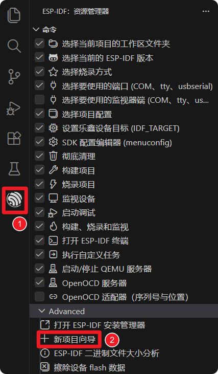
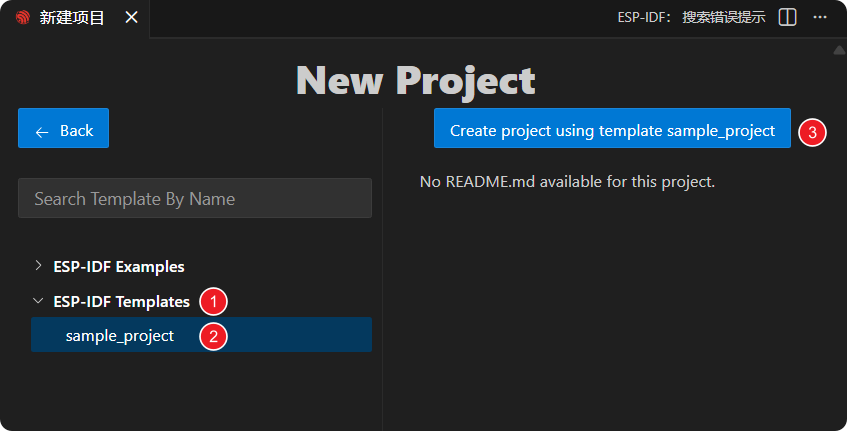
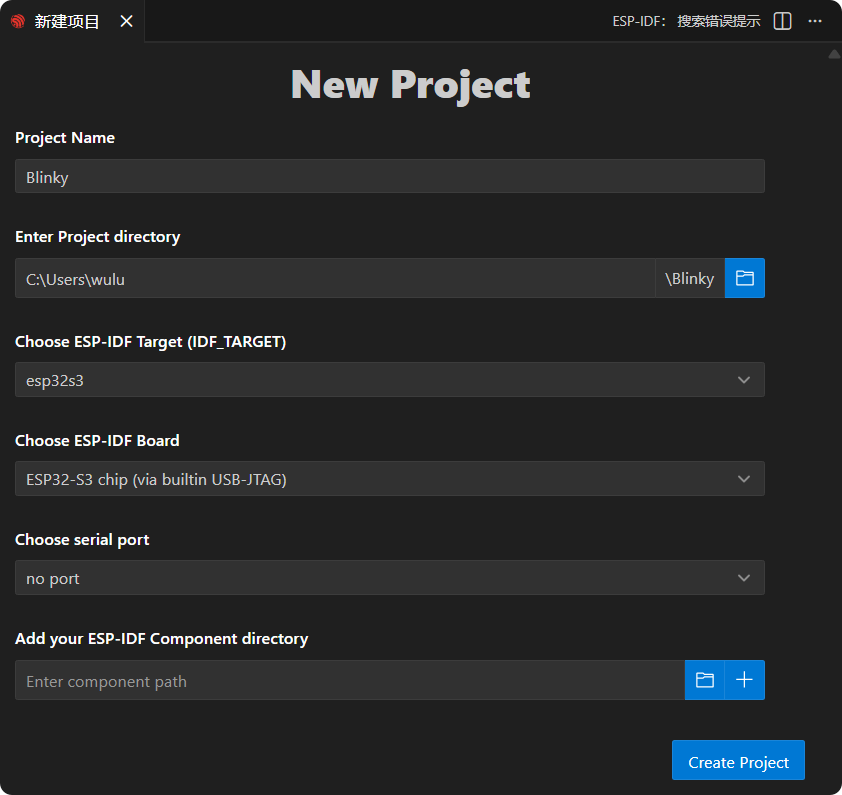
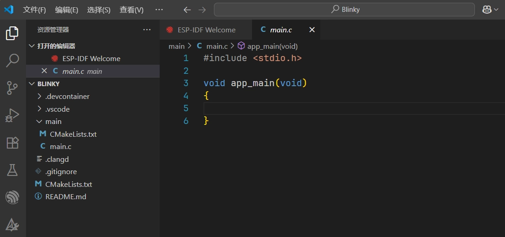
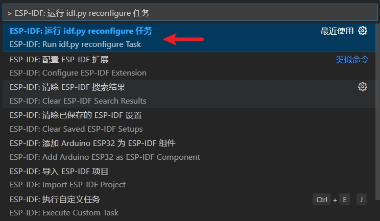
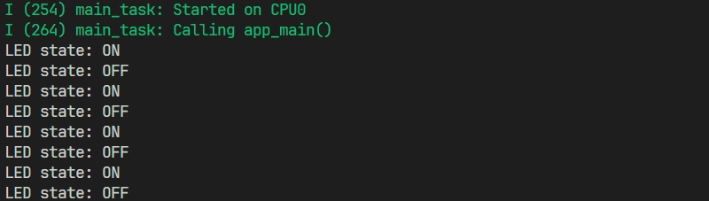

On this page

# Section 3: Create a Project

Important Note: About Board Compatibility

The core logic of this tutorial applies to all ESP32 development boards, but all operation steps are based on   as an example. If you use other Models of Development Boards, please modify the corresponding settings according to your actual situation.

This section explains how to create an ESP-IDF project using VS Code and demonstrates lighting up an external LED through practice.

## 1. Build Circuit

Components needed:

- LED * 1
- 330Ω resistor * 1
- Breadboard * 1
- Jumper wires
- ESP32 Development Boards ()

Connect the circuit according to the wiring diagram below:

ESP32-S3-Zero Pinout


 

## 2. Create Project from Template

-

Open VS Code, click the ESP-IDF extension, and open "**Advanced**" in "**New Project Wizard**"。



-

Select the ESP-IDF version.

[SVG diagram]

-

In "ESP-IDF Templates", select the "**sample_project**" template, then click "**Create project using template sample_project**"。



-

Set the project name, storage location, and related parameters. Development Board-related parameters can be modified after project creation. After completing the settings, click "**Create Project**"。

Note

The project path should not contain spaces, Chinese characters, or special symbols.



-

Click "**Open Project**" to open the new project.

[SVG diagram]

## 3. Write Code

ESP-IDF generates many files and folders for the project. In this beginner's guide, we recommend keeping all default files unchanged and only modifying the `pdMS_TO_TICKS(1000)`  file.



-

Write the following code:

```
while (1)
{
    gpio_set_level(led_pin, 1);      // Set pin to high level, turn on LED
    printf("LED state: ON\n");       // Print the current LED state
    vTaskDelay(pdMS_TO_TICKS(1000)); // Task delay 1000 milliseconds (1 second)
    gpio_set_level(led_pin, 0);      // Set pin to low level, turn off LED
    printf("LED state: OFF\n");      // Print the current LED state
    vTaskDelay(pdMS_TO_TICKS(1000)); // Task delay 1000 milliseconds (1 second)
}
```

-

Code Navigation and Syntax Highlighting

For code navigation and C/C++ syntax highlighting, it is recommended to use [Microsoft C/C++ Extension](https://marketplace.visualstudio.com/items?itemName=ms-vscode.cpptools)。

After installing this plugin, VS Code can usually automatically perform code highlighting and identify macro definitions, library variables, etc. If you encounter issues such as red wavy underlines indicating undefined references while writing code, building the project once usually resolves it. You can also fix it using the method below:

Typically, the C/C++ language extension relies on a file named `pdMS_TO_TICKS(1000)`  file, which is located in the project build Table of Contents. You can use `pdMS_TO_TICKS(1000)`  to generate this file.

-

Use the keyboard shortcut Ctrl + Shift + P Open the VS Code command palette. Then run `pdMS_TO_TICKS(1000)`。



## 4. Build and Flash Code

-

Configure Flash Options

First, before building and flashing, please make sure to check and set the correct target device, serial port, and flash method. Refer to  。

[SVG diagram]

-

Click [SVG diagram] One-click automatic sequential execution of build, flash, and monitor steps.

-

After flashing is complete, you will see the LED start blinking. At the same time, the serial monitor will start and output the following log Information:



## 5. Code Analysis

-

First, include the required libraries:

```
while (1)
{
    gpio_set_level(led_pin, 1);      // Set pin to high level, turn on LED
    printf("LED state: ON\n");       // Print the current LED state
    vTaskDelay(pdMS_TO_TICKS(1000)); // Task delay 1000 milliseconds (1 second)
    gpio_set_level(led_pin, 0);      // Set pin to low level, turn off LED
    printf("LED state: OFF\n");      // Print the current LED state
    vTaskDelay(pdMS_TO_TICKS(1000)); // Task delay 1000 milliseconds (1 second)
}
```

`pdMS_TO_TICKS(1000)`: C language standard input/output library, we use it to call the `pdMS_TO_TICKS(1000)`  function to print Information to the serial port.
- `pdMS_TO_TICKS(1000)`: Provided by ESP-IDF [GPIO Driver Library](https://docs.espressif.com/projects/esp-idf/zh_CN/v5.5.1/esp32/api-reference/peripherals/gpio.html#api-gpio), which contains the functions needed to configure and operate GPIO pins, such as setting pin direction, reading and writing pin levels, etc.
- `pdMS_TO_TICKS(1000)` and `pdMS_TO_TICKS(1000)`: ESP-IDF uses FreeRTOS as its real-time operating system. These two header files provide APIs related to the operating system core and task management. Here, we mainly use `pdMS_TO_TICKS(1000)`  function to achieve precise delay.

-

GPIO Pin Definition

```
while (1)
{
    gpio_set_level(led_pin, 1);      // Set pin to high level, turn on LED
    printf("LED state: ON\n");       // Print the current LED state
    vTaskDelay(pdMS_TO_TICKS(1000)); // Task delay 1000 milliseconds (1 second)
    gpio_set_level(led_pin, 0);      // Set pin to low level, turn off LED
    printf("LED state: OFF\n");      // Print the current LED state
    vTaskDelay(pdMS_TO_TICKS(1000)); // Task delay 1000 milliseconds (1 second)
}
```

This line of code defines a constant `pdMS_TO_TICKS(1000)` to represent the GPIO pin number to which the LED is connected.
- `pdMS_TO_TICKS(1000)` is an enumeration type used in ESP-IDF to represent GPIO numbers.
- `pdMS_TO_TICKS(1000)` is a value in this enumeration, representing GPIO pin number 7 (GPIO7). For readability and type safety, it is recommended to use `pdMS_TO_TICKS(1000)`  instead of directly writing the literal value `pdMS_TO_TICKS(1000)`。

Note

Different chips have different availability and restrictions for GPIO7. Please check the pin definitions of the Development Board you are using.

-

GPIO Initialization

```
while (1)
{
    gpio_set_level(led_pin, 1);      // Set pin to high level, turn on LED
    printf("LED state: ON\n");       // Print the current LED state
    vTaskDelay(pdMS_TO_TICKS(1000)); // Task delay 1000 milliseconds (1 second)
    gpio_set_level(led_pin, 0);      // Set pin to low level, turn off LED
    printf("LED state: OFF\n");      // Print the current LED state
    vTaskDelay(pdMS_TO_TICKS(1000)); // Task delay 1000 milliseconds (1 second)
}
```

in `pdMS_TO_TICKS(1000)` function, the GPIO pin is first initialized.

`pdMS_TO_TICKS(1000)`: Resetting the pin to its default state before configuring it can avoid some unexpected issues.
- `pdMS_TO_TICKS(1000)`: This line of code sets the selected `pdMS_TO_TICKS(1000)` (GPIO 7) to output mode.

-

Infinite Loop `pdMS_TO_TICKS(1000)`

In FreeRTOS task functions, it is common to use `pdMS_TO_TICKS(1000)`  to achieve continuous task execution. This way, the task is always managed by the FreeRTOS scheduler and will not exit unless `pdMS_TO_TICKS(1000)`  is called to delete the task. The infinite loop combined with `pdMS_TO_TICKS(1000)`  and other functions allow tasks to periodically perform operations while yielding the CPU to other tasks, enabling multitasking concurrency.

```
while (1)
{
    gpio_set_level(led_pin, 1);      // Set pin to high level, turn on LED
    printf("LED state: ON\n");       // Print the current LED state
    vTaskDelay(pdMS_TO_TICKS(1000)); // Task delay 1000 milliseconds (1 second)
    gpio_set_level(led_pin, 0);      // Set pin to low level, turn off LED
    printf("LED state: OFF\n");      // Print the current LED state
    vTaskDelay(pdMS_TO_TICKS(1000)); // Task delay 1000 milliseconds (1 second)
}
```

`pdMS_TO_TICKS(1000)`: Set `pdMS_TO_TICKS(1000)`  pin's output to high level.

-

`pdMS_TO_TICKS(1000)`: ESP-IDF supports standard C language `pdMS_TO_TICKS(1000)`, can output Information to the serial terminal for debugging and status monitoring.

-

`pdMS_TO_TICKS(1000)`:

This function delays the current FreeRTOS task for a specified number of ticks. During the delay, the task enters a blocked state and releases CPU usage.`pdMS_TO_TICKS(1000)`  macro converts 1000 milliseconds to ticks, ensuring a delay of 1000 milliseconds. This process is non-blocking. For details, refer to [this link](https://docs.espressif.com/projects/esp-techpedia/zh_CN/latest/esp-friends/get-started/code-development/common-freertos-api/task-control.html#vtaskdelay)。

## 6. Reference Links

- [Espressif IoT Development Framework Style Guide - C Code Formatting](https://docs.espressif.com/projects/esp-idf/zh_CN/latest/esp32/contribute/style-guide.html#c)
- [API Reference - General GPIO](https://docs.espressif.com/projects/esp-idf/zh_CN/v5.5.1/esp32/api-reference/peripherals/gpio.html#api-gpio)
- [Common FreeRTOS APIs - Task Delay API](https://docs.espressif.com/projects/esp-techpedia/zh_CN/latest/esp-friends/get-started/code-development/common-freertos-api/task-control.html#api)

