This page overview

# Section 5 JTAG Debugging

Important Note: About Board Compatibility

The core logic of this tutorial applies to all ESP32 development boards，but theYesoperation steps are all based on  as an example for demonstration. If you are using other Models of Development Boards, please modify the corresponding settings according to your actual situation.

this section demonstrates how toUse VS Code And ESP-IDF Extension，Via JTAG to/pair ESP32-S3 Development BoardPerform debugging.

## 1. Debugging process

Debugging is a critical part of the development process, especially important in embedded system development. It helps developers discover and fix errors, ensuring that the firmware interacts correctly with peripherals and external hardware.

Debugging by printing Information via the serial port (typically viewed through a serial monitor) is the most common and simplest debugging method. It mainly works by adding `printf` etc.print statement, willVariablevalueOrprogram stateOutputto the serial terminal. If notYesexternal debuggingTool，this is a way to collectCodeexecuteInformationofYeseffective method. But this kind ofMethodYesObviousLimitations:based on `printf` Debugging requires modifying the code and rebuilding the project each time you test new content. Using a debugger, however, allows you to step through code, inspect memory, and set breakpoints without modifying the source code.

The ESP32 series chips typically use the JTAG (Joint Test Action Group) interface, combined with OpenOCD and GDB, to implement debugging features such as breakpoints, single-step execution, variable and stack inspection, helping developers quickly locate and fix issues. JTAG debugging establishes a complete debugging chain from the development host to the target chip through a dedicated interface on the target chip, supporting in-depth analysis and control of running programs.

[SVG diagram]

In the ESP-IDF development environment, the JTAG debugging process is accomplished through the collaboration of multiple tools:

IDE （as/like VS Code) as/workIsUseuser interface,Via ESP-IDF ExtensionCall GDB (esp-gdb) Debugger client.GDB again/thenAnd OpenOCD ([openocd-esp32](https://github.com/espressif/openocd-esp32)) Server communication, and OpenOCD finalVia JTAG AdapterAnd ESP32 chip connection implementationHardwareLevel debugging, eachToolcooperativeCompleteFromUseuser interface to chip low-levelofDebug link.

To better support the Espressif chip series, ESP-IDF uses specific forked versions of standard tools:

- esp-gdb: A fork of GDB with enhanced support for the ESP series chips.
- openocd-esp32: A fork of OpenOCD that supports newly released ESP chips faster.

In the following content, unless otherwise specified, GDB and esp-gdb, OpenOCD and openocd-esp32 can be considered equivalent concepts.

## 2. Hardware preparation and drivers

### 2.1 Hardware requirements

This section introduces how to use the ESP32-S3 built-in JTAG interface for debugging.**thisTutorialsofMethodOnly suitableUsefor those with USB JTAG FunctionofDevice (such as ESP32-S3、ESP32-C3 And ESP32-P4 etc.）。**

For Development Boards without USB JTAG functionality, an external JTAG debugger can still be used (such as [ESP-PROG](https://docs.espressif.com/projects/esp-iot-solution/zh_CN/latest/hw-reference/ESP-Prog_guide.html)) for debugging, but this is not covered in this article. For more details, refer to the official Espressif Tutorials:[Debugging with ESP-IDF VS Code extension](https://developer.espressif.com/blog/2025/05/debugging-with-vscode/)。

### 2.2 Install driver

To ensure JTAG communication works properly, make sure the appropriate drivers are installed:

-

Via **ESP-IDF Installmanager (EIM)**

In [**ESP-IDF Installmanager (EIM)**](https://docs.espressif.com/projects/esp-idf/zh_CN/latest/esp32s3/get-started/windows-setup.html#get-started-windows-tools-installer) GUI (GUI), click `printf` Below `printf`, then click `printf`:

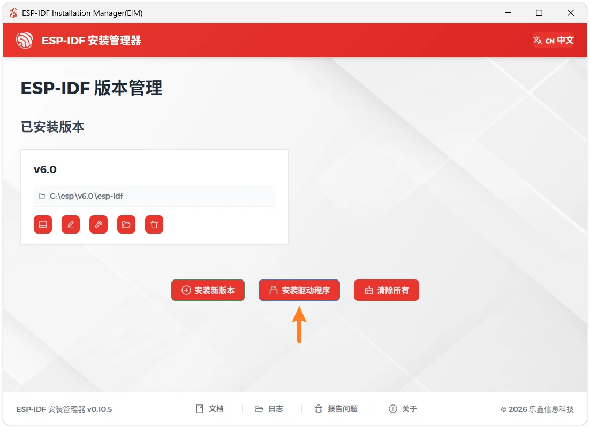

-

Via **PowerShell Command**

If you do not want to rerunInstallprogram, then canVia [idf-env](https://github.com/espressif/idf-env) Achieve the same effect. With**Administrator privileges**Open PowerShell and run the following command:

```
Open On-Chip Debugger v0.12.0-esp32-20250422 (2025-04-22-13:02)
Licensed under GNU GPL v2
For bug reports, read
	http://openocd.org/doc/doxygen/bugs.html
debug_level: 2
Info : only one transport option; autoselecting 'jtag'
Info : esp_usb_jtag: VID set to 0x303a and PID to 0x1001
Info : esp_usb_jtag: capabilities descriptor set to 0x2000
Info : Listening on port 6666 for tcl connections
Info : Listening on port 4444 for telnet connections
Info : esp_usb_jtag: serial (24:EC:4A:2C:6D:AC)
Info : esp_usb_jtag: Device found. Base speed 40000KHz, div range 1 to 255
Info : clock speed 40000 kHz
Info : JTAG tap: esp32s3.tap0 tap
/device found: 0x120034e5 (mfg: 0x272 (Tensilica), part: 0x2003, ver: 0x1)
Info : JTAG tap: esp32s3.tap1 tap/device found: 0x120034e5 (mfg: 0x272 (Tensilica), part: 0x2003, ver: 0x1)
Info : [esp32s3.cpu0] Examination succeed
Info : [esp32s3.cpu1] Examination succeed
Info : [esp32s3.cpu0] starting gdb server on 3333
Info : Listening on port 3333 for gdb connections
```

## 3. ExampleCode

-

Create a project. If you're not sure how to do this, please refer to 。

-

Copy the following code to **main/main.c** In:

```
Open On-Chip Debugger v0.12.0-esp32-20250422 (2025-04-22-13:02)
Licensed under GNU GPL v2
For bug reports, read
	http://openocd.org/doc/doxygen/bugs.html
debug_level: 2
Info : only one transport option; autoselecting 'jtag'
Info : esp_usb_jtag: VID set to 0x303a and PID to 0x1001
Info : esp_usb_jtag: capabilities descriptor set to 0x2000
Info : Listening on port 6666 for tcl connections
Info : Listening on port 4444 for telnet connections
Info : esp_usb_jtag: serial (24:EC:4A:2C:6D:AC)
Info : esp_usb_jtag: Device found. Base speed 40000KHz, div range 1 to 255
Info : clock speed 40000 kHz
Info : JTAG tap: esp32s3.tap0 tap
/device found: 0x120034e5 (mfg: 0x272 (Tensilica), part: 0x2003, ver: 0x1)
Info : JTAG tap: esp32s3.tap1 tap/device found: 0x120034e5 (mfg: 0x272 (Tensilica), part: 0x2003, ver: 0x1)
Info : [esp32s3.cpu0] Examination succeed
Info : [esp32s3.cpu1] Examination succeed
Info : [esp32s3.cpu0] starting gdb server on 3333
Info : Listening on port 3333 for gdb connections
```

-

configure flashOption

First, before building and flashing, please make sure to check and set the correct target device, serial port, and flashing method. Refer to  。

[SVG diagram]

-

Click [SVG diagram] Automatically execute build, flash, and monitor in sequence with one click.

-

After flashing is complete, the serial monitor will start printing Information.

```
Open On-Chip Debugger v0.12.0-esp32-20250422 (2025-04-22-13:02)
Licensed under GNU GPL v2
For bug reports, read
	http://openocd.org/doc/doxygen/bugs.html
debug_level: 2
Info : only one transport option; autoselecting 'jtag'
Info : esp_usb_jtag: VID set to 0x303a and PID to 0x1001
Info : esp_usb_jtag: capabilities descriptor set to 0x2000
Info : Listening on port 6666 for tcl connections
Info : Listening on port 4444 for telnet connections
Info : esp_usb_jtag: serial (24:EC:4A:2C:6D:AC)
Info : esp_usb_jtag: Device found. Base speed 40000KHz, div range 1 to 255
Info : clock speed 40000 kHz
Info : JTAG tap: esp32s3.tap0 tap
/device found: 0x120034e5 (mfg: 0x272 (Tensilica), part: 0x2003, ver: 0x1)
Info : JTAG tap: esp32s3.tap1 tap/device found: 0x120034e5 (mfg: 0x272 (Tensilica), part: 0x2003, ver: 0x1)
Info : [esp32s3.cpu0] Examination succeed
Info : [esp32s3.cpu1] Examination succeed
Info : [esp32s3.cpu0] starting gdb server on 3333
Info : Listening on port 3333 for gdb connections
```

## 4. Configure OpenOCD

OpenOCD use/adoptUseserver-Client architecture to debug embedded systems.OpenOCD serverViaDebug adapter (usually JTAG）AndtargetHardwareEstablish a connection, and provideNetworkInterfaceprovide gdb Or telnet etc.Client sends commandOrLoadCode。

-

Select OpenOCD Development Board configuration:
Use shortcut key Ctrl + Shift + P Open VS Code commandpanel.Thenrun `printf`。

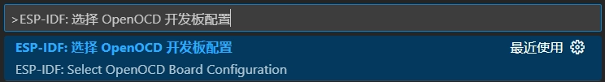

Select `printf`。

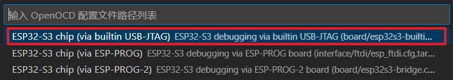

-

Start OpenOCD:

Use shortcut key Ctrl + Shift + P Open VS Code commandpanel.Thenrun `printf`。

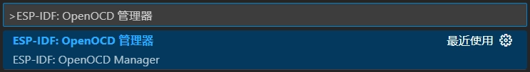

Click “Start OpenOCD”。

[SVG diagram]

-

After OpenOCD starts, you should see output similar to the following, indicating the server is now waiting for a connection:

```
Open On-Chip Debugger v0.12.0-esp32-20250422 (2025-04-22-13:02)
Licensed under GNU GPL v2
For bug reports, read
	http://openocd.org/doc/doxygen/bugs.html
debug_level: 2
Info : only one transport option; autoselecting 'jtag'
Info : esp_usb_jtag: VID set to 0x303a and PID to 0x1001
Info : esp_usb_jtag: capabilities descriptor set to 0x2000
Info : Listening on port 6666 for tcl connections
Info : Listening on port 4444 for telnet connections
Info : esp_usb_jtag: serial (24:EC:4A:2C:6D:AC)
Info : esp_usb_jtag: Device found. Base speed 40000KHz, div range 1 to 255
Info : clock speed 40000 kHz
Info : JTAG tap: esp32s3.tap0 tap
/device found: 0x120034e5 (mfg: 0x272 (Tensilica), part: 0x2003, ver: 0x1)
Info : JTAG tap: esp32s3.tap1 tap/device found: 0x120034e5 (mfg: 0x272 (Tensilica), part: 0x2003, ver: 0x1)
Info : [esp32s3.cpu0] Examination succeed
Info : [esp32s3.cpu1] Examination succeed
Info : [esp32s3.cpu0] starting gdb server on 3333
Info : Listening on port 3333 for gdb connections
```

By default, after the OpenOCD server starts, the port `printf` Used for Telnet communication; port `printf` for TCL communication; port `printf` Useat/in GDB。

## 5. Start debug session

Next, we will launch gdb and connect to OpenOCD. After starting debugging, VS Code will automatically complete this process.

-

In code `printf` Set a breakpoint at this line. Go to this line and press F9，Or clickleft side of the line numberofemptyWhiteat/placeAddBreakpoint。

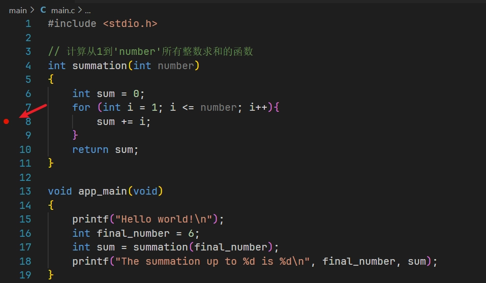

-

Press F5 Start debugging, or click "Run" -> "Start Debugging" in the top menu bar of VS Code.

After starting debugging, the debugger will by default `printf` The first line of the function pauses, waiting for user action.

You can see on the left **Variable**、**Monitor**、**Call stack**And**Breakpoint** Panels for debugging-related information, at the bottom is **Debug console**、**Output** and other windows, a prompt will appear above the code window **Debug toolbar**。

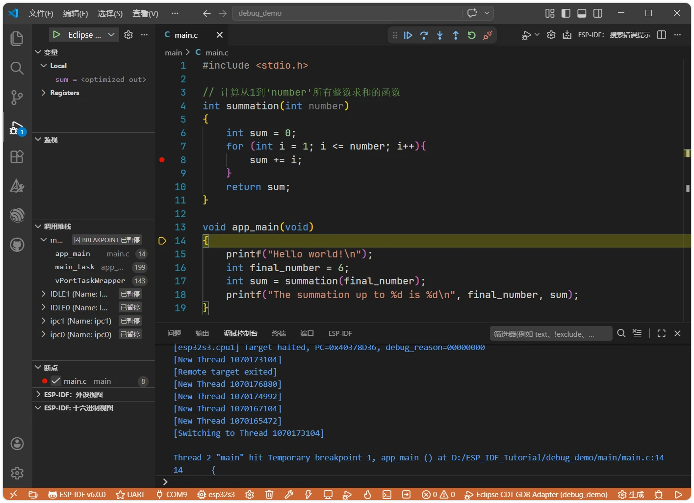

## 6. Common debug operations

-

The debug toolbar contains a set of buttons for controlling the program debugging process:

[SVG diagram]

[SVG diagram]: Resumes program execution from the current paused position until it hits the next breakpoint or the program ends.
- [SVG diagram](Step Over): Executes the current line of code. If the current line is a function call, it executes the entire function and then stops at the next line, without entering the function body.
- [SVG diagram](Step Into): Executes the current line of code. If the current line is a function call, the debugger enters the function body and stops at the first line of the function.
- [SVG diagram](Step Out): Continue executing code until the current function completes and returns to the caller, then pause.
- [SVG diagram]:restart the entire debugging session.
- [SVG diagram]: Stop and completely exit the current debug session.

-

Common debugging operations:

After enabling debug, press again F5 Or click [SVG diagram], the program will run to the breakpoint and then stop.

You can see the program stopped at line 8, and the current values of each variable can be viewed on the left. Note that since the current line of code has not yet been executed, `printf` Variableofvalue stillIs `printf`。

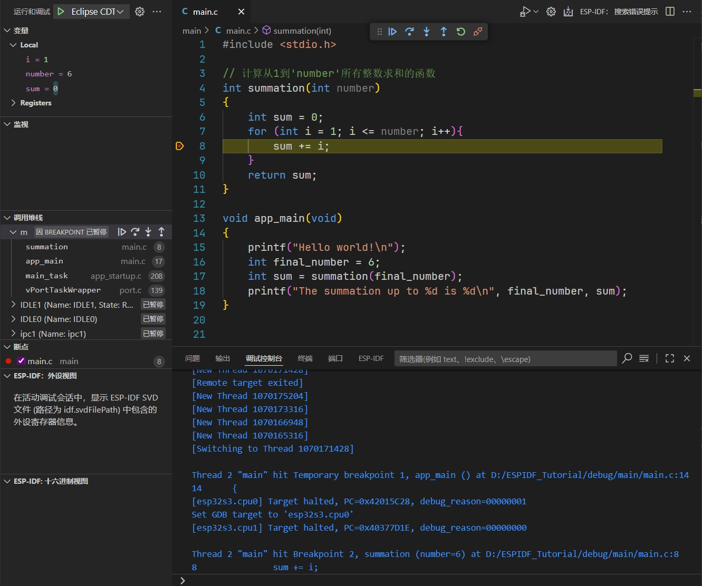

You can also type a variable name in the debug console and press Enter to view the variable's value.

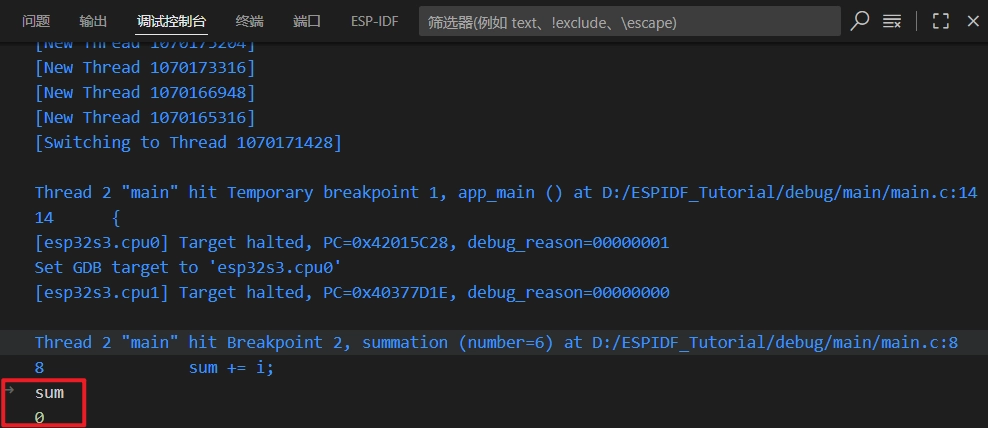

-

Press F10 Or click [SVG diagram] Step-by-step debugging.

After pressing, the code moves to the next line. Press this button multiple times to observe how the debugger executes the program line by line, while also watching the changes in each variable.

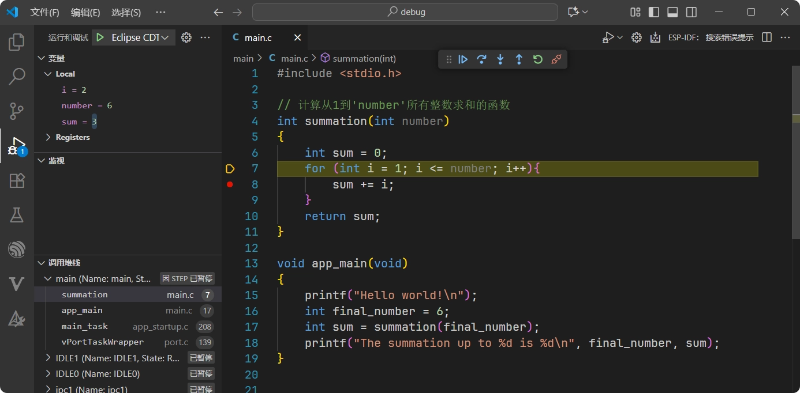

-

Set conditional breakpoints to stop program execution when specific conditions are met.

before findingSettingsBreakpoint，right-clickClick，ThenSelect“EditBreakpoint”，ThenInput `printf`。

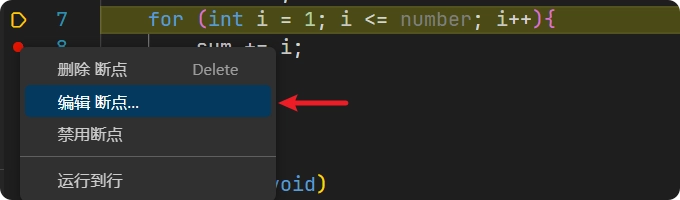

[SVG diagram]

Press F5 Or click [SVG diagram]. At this point, the code runs to `printf` VariableofvalueIs `printf` , pause execution.

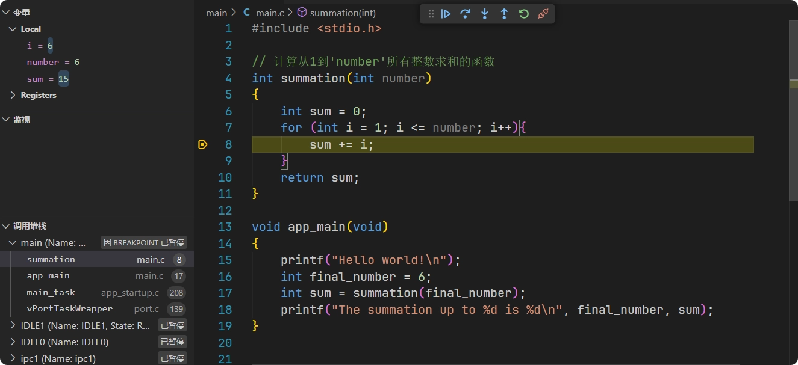

-

Press F11 or click [SVG diagram] Step into debugging. When encountering a function, the debugger will enter the function. Click multiple times [SVG diagram] You can see the debugger entered `printf` inside functions, even in FreeRTOS kernel code.

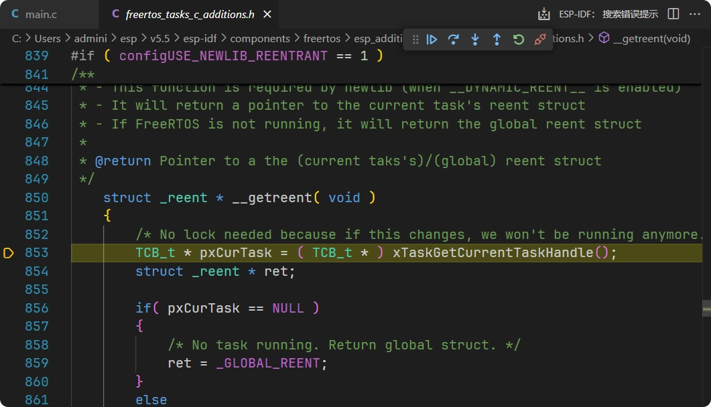

-

Press Shift + F11 or click [SVG diagram] Jump out and return to the main function.

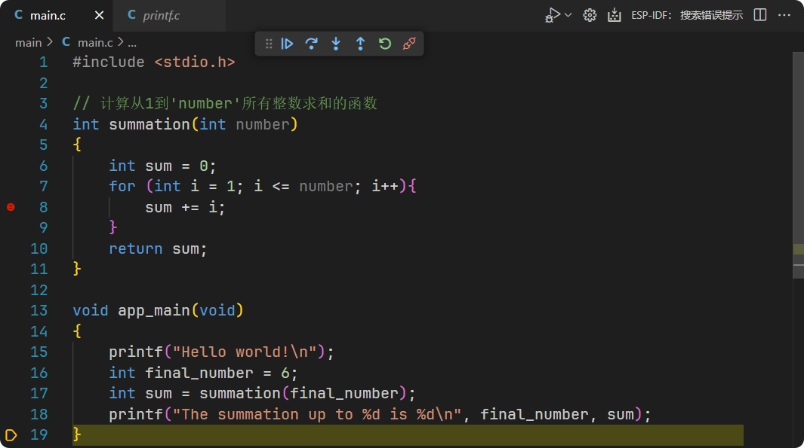

-

finally, you canPress Shift + F5 or click [SVG diagram] Disconnect to exit debug.

## 7. constantSeeproblem/issueAndtroubleshootingExcept

Encountering problems? Try these solutions

**LIBUSB_ERROR_NOT_FOUND error**
In [This page](https://github.com/espressif/openocd-esp32/wiki/Troubleshooting-FAQ) Search for corresponding errorCode, viewPossibleofsolution.
**OpenOCD error troubleshooting**

- Confirm whether the Development Board Model selected in the Arduino IDE is correct
- Check if port selection is correct
- retryPress BOOT Key to enter downloadMode
- Close other programs that may occupy the serial port

**Debug lineIsexception**
Try re-flashing the code. Each time you modify the code before debugging, you need to rebuild the project and flash the firmware.

## 8. Reference Links

- [ESP-IDF Programming Guide - JTAG Debugging](https://docs.espressif.com/projects/esp-idf/zh_CN/latest/esp32s3/api-guides/jtag-debugging/index.html)
- [ESP-IDF Programming Guide - Configuring the ESP32-S3 Built-in JTAG Interface](https://docs.espressif.com/projects/esp-idf/zh_CN/latest/esp32s3/api-guides/jtag-debugging/configure-builtin-jtag.html)
- [ESP-IDF Programming Guide - USB-Serial-JTAG Peripheral Introduction](https://docs.espressif.com/projects/esp-iot-solution/zh_CN/latest/usb/usb_overview/usb_serial_jtag.html)
- [ESP-IDF VS Code Extension documentation - Debugging projects](https://docs.espressif.com/projects/vscode-esp-idf-extension/zh_CN/latest/debugproject.html)
- [Debugging with ESP-IDF VS Code extension](https://developer.espressif.com/blog/2025/05/debugging-with-vscode/)
- [espressif/openocd-esp32 - Troubleshooting FAQ](https://github.com/espressif/openocd-esp32/wiki/Troubleshooting-FAQ)
- [Eclipse CDT GDB Debug Adapter](https://developer.espressif.com/blog/vscode-esp-idf-v1.8.0/#eclipse-cdt-gdb-debug-adapter)

