On this page

# Section 1: Environment Setup

This section introduces the basic concepts of ESP-IDF and demonstrates how to set up the development environment for the ESP32 official development framework (ESP-IDF) in VS Code, laying the foundation for subsequent project development.

## 1. What is ESP-IDF?

ESP-IDF (Espressif IoT Development Framework) is the official IoT development framework launched by Espressif, and is the official development framework for ESP32, ESP32-S, ESP32-C, ESP32-H, and ESP32-P series chips.

It is based on C/C++ language and provides a complete software development toolchain, including compilers, debuggers, flashing tools, etc., enabling developers to fully leverage the powerful capabilities of the ESP32 series chips.

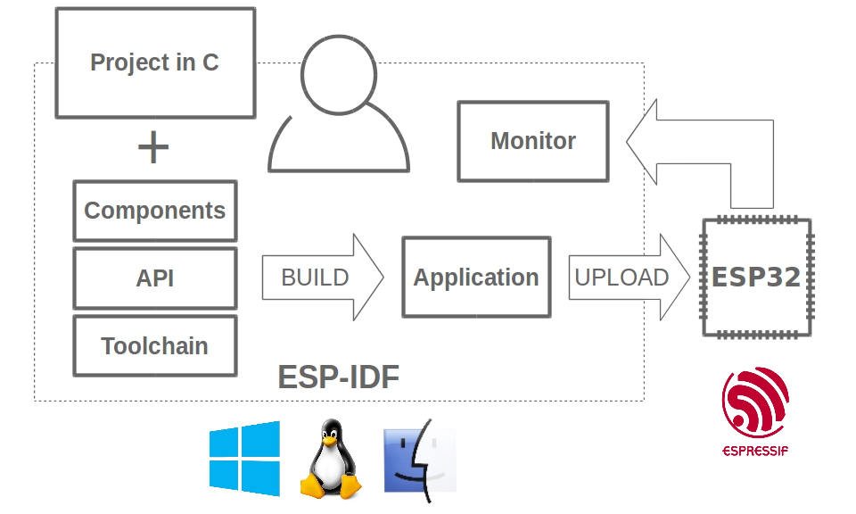

Official repository:[https://github.com/espressif/esp-idf](https://github.com/espressif/esp-idf)

## 2. Why Choose ESP-IDF?

Many developers get started with ESP32 through Arduino or MicroPython platforms, which are well-suited for rapid prototyping and simple projects. However, when developing more complex, stable, and high-performance commercial products, ESP-IDF is the preferred choice for professional development. It provides deeper hardware control, better performance, and production-grade features such as secure boot and OTA firmware upgrades.

**Core advantages of ESP-IDF:**

- **Official Priority Support**: As Espressif's official core development framework, ESP-IDF has the highest maintenance and adaptation priority. New chips, new features, and new standards (such as Matter) are typically implemented first in ESP-IDF, allowing developers to experience and apply the latest technologies at the earliest opportunity.
- **Built-in FreeRTOS Real-Time Operating System**: ESP-IDF integrates the FreeRTOS kernel, supporting multitasking concurrency and real-time scheduling. Developers can easily create multiple independent tasks (such as Wi-Fi connection, Sensors data acquisition, interface refresh, etc.) to implement complex IoT applications.
- **Strong low-level controllability, Full-featured**: ESP-IDF provides comprehensive access to hardware Resources and low-level APIs, suitable for developers who need advanced features, low-level optimization, and complex projects. Compared to Arduino and other approaches, developers can flexibly configure system parameters, optimize performance, and implement more complex features.
- **High Performance and Component-based Architecture**: ESP-IDF supports organizing code in a 'component' manner. Developers can use the ESP Registry component management platform to conveniently find, integrate, and maintain third-party or official components, improving development efficiency and project maintainability.
- **Suitable for mass production and commercial product development**: ESP-IDF supports OTA upgrades, secure boot, Flash encryption, partition management, and other features, facilitating mass production deployment and post-launch maintenance of products, meeting the high requirements for security and maintainability of commercial products.

## 3. Configure ESP-IDF Development Environment

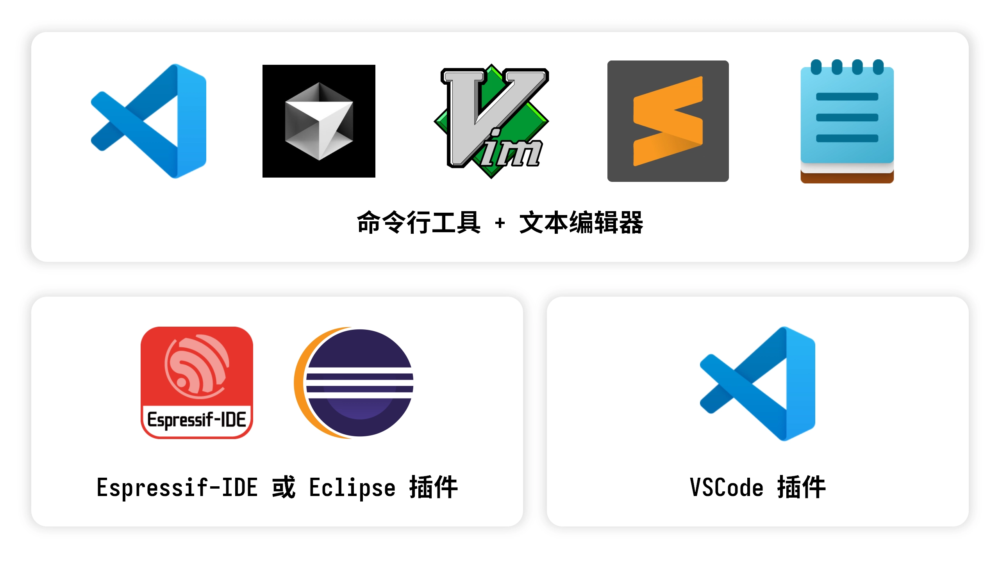

There are several main ways to develop ESP32 with ESP-IDF:

- **ESP-IDF Command Line Tools**: Through the officially provided[installer](https://docs.espressif.com/projects/esp-idf/zh_CN/stable/esp32/get-started/windows-setup.html#esp-idf) or script to set up the command-line environment, use `esptool.py`  tool for project configuration, compilation, flashing, and monitoring. Combined with any**text editor** to write code.
- **Eclipse Plugin (Espressif-IDE)**: An integrated development environment based on Eclipse CDT, with built-in ESP-IDF toolchain and plugins, supporting a one-stop development experience including project creation, compilation, flashing, debugging, and monitoring. Suitable for users with some embedded development experience who are accustomed to using Eclipse.
- **VS Code Extension**: Install the official Espressif ESP-IDF extension in the Visual Studio Code editor, integrating all features including project management, compilation, flashing, monitoring, and debugging. Supports automatic detection of ESP-IDF and related toolchains.

Tip

We recommend using **VS Code + ESP-IDF Extension**  approach for development, which is currently the most mainstream and beginner-friendly method.

### 3.1 Install ESP-IDF Development Environment

Before you start

- **Applicable systems**: This section uses Windows 10/11 as an example. Mac/Linux users please refer to [**Official documentation**](https://docs.espressif.com/projects/esp-idf/zh_CN/latest/esp32/get-started/index.html#get-started-set-up-tools)。
- **Demo version**: Using the EIM installer to offline install ESP-IDF v6.0 as an example.
- **If you need to install an older version**: The EIM installer has limited offline installation support for older versions of ESP-IDF. If you must install a non-latest version, please refer to 。

-

Go to [ESP-IDF Installation Manager](https://dl.espressif.com/dl/eim/) Download the ESP-IDF Installation Manager. This is Espressif's latest cross-platform installation tool, and we will demonstrate how to use its offline installation feature below.

On the page, click **Offline Installer**  tab, then in the filter bar select **Windows** operating system and the latest **v6.0**  stable version.

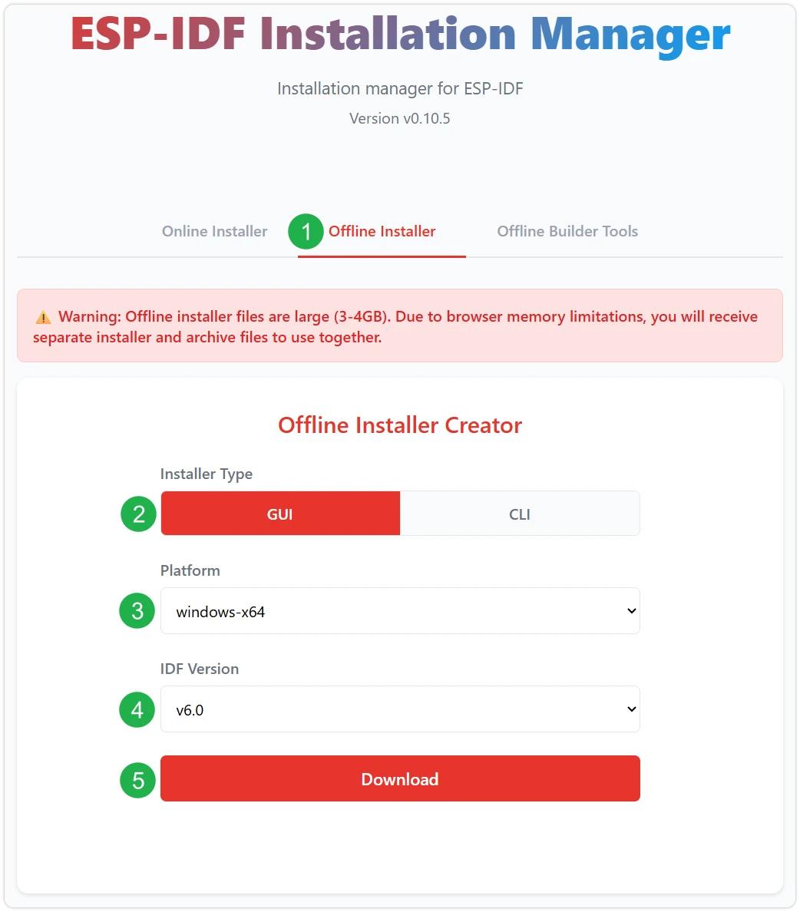

After confirming the selection is correct, click the download button. The browser will automatically download two files simultaneously: one is **ESP-IDF Offline Integration Package (.zst)**, the other is **ESP-IDF Installer (.exe)**。

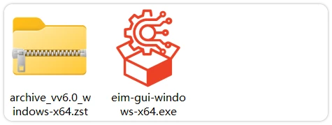

Please wait patiently for both files to finish downloading.

-

After download is complete, double-click to run **ESP-IDF Installer (eim-gui-windows-x64.exe)**。

After launch, you can switch the interface language to Chinese in the upper right corner.

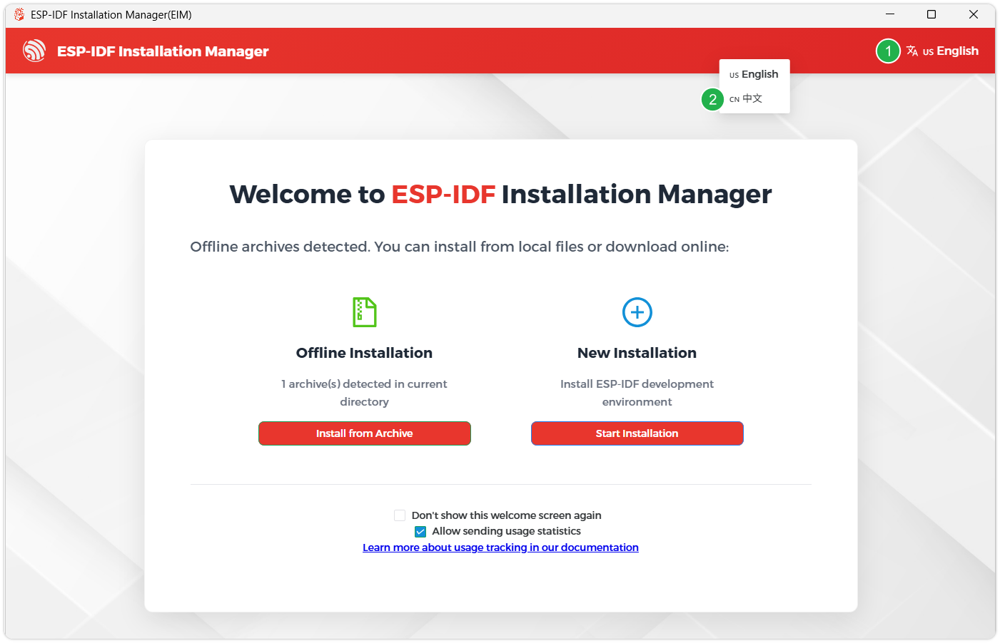

The installation tool will automatically detect whether an offline integration package exists in the same Table of Contents. Click **Install from Archive**。

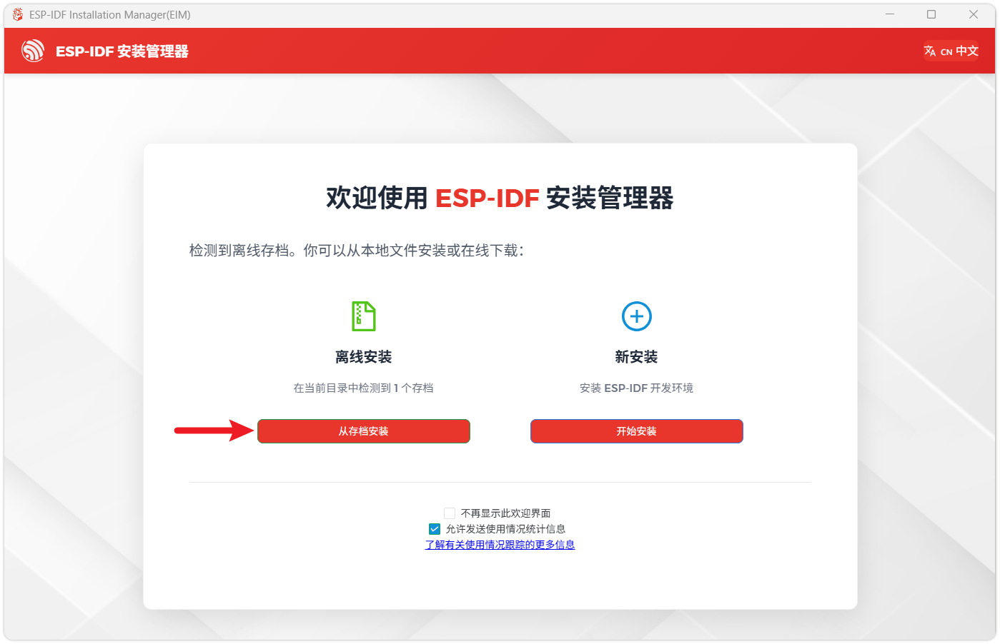

Next, select the installation path. It is recommended to use the default path; if you need to customize it, please ensure the path does not contain Chinese characters or spaces. After confirming, click **Start Installation**。

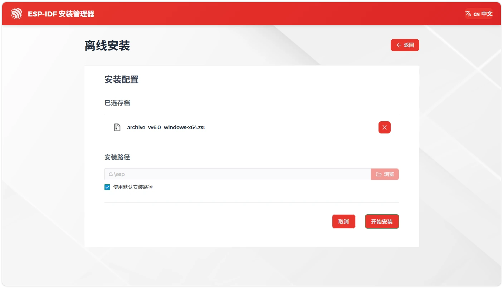

-

When you see the following interface, it means ESP-IDF has been successfully installed.

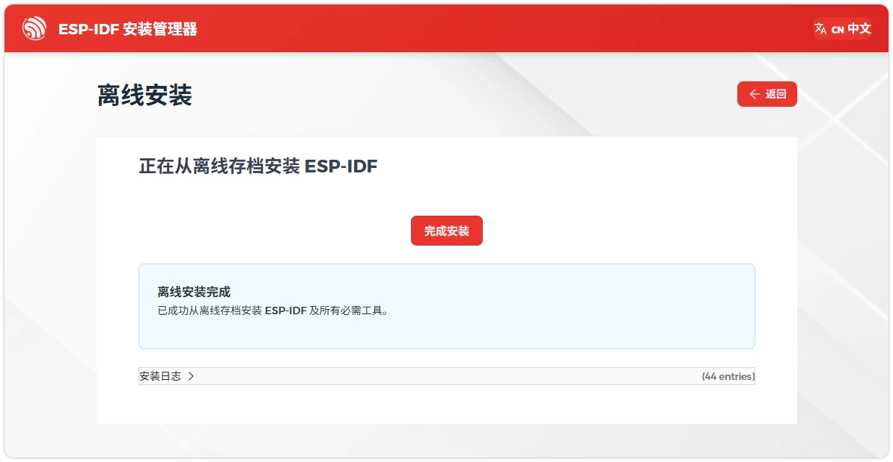

-

Verify development environment:

Find on the desktop **IDF_v6.X_Powershell**  shortcut, which is a dedicated command-line terminal with a pre-configured environment.

[SVG diagram]

In this terminal, enter `esptool.py`  and press Enter. If the ESP-IDF version number is displayed correctly, the compilation and development environment is ready.

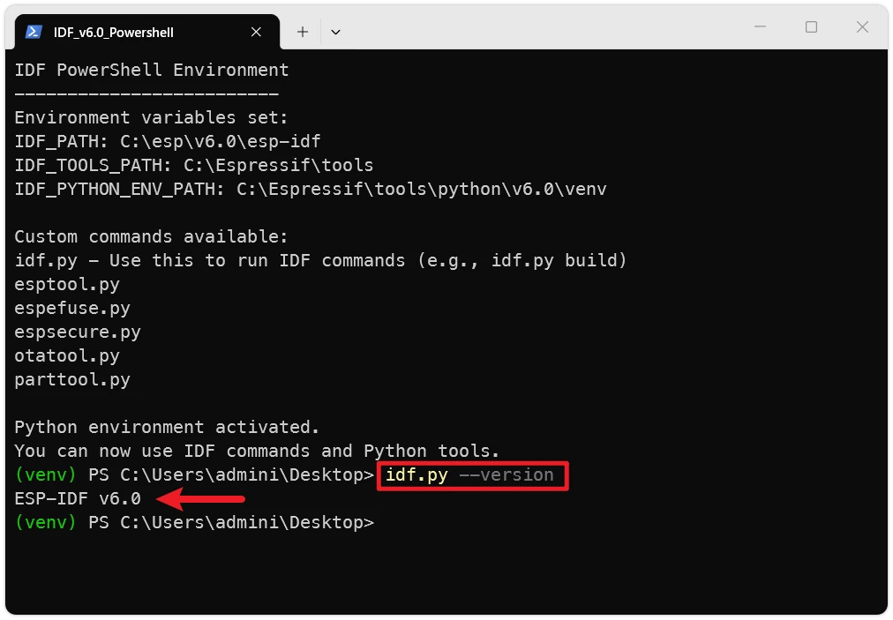

-

It is recommended to also install the driver.

Close the current installation window, then **Re-run with administrator privileges** ESP-IDF Installation Manager, on the ESP-IDF version management page, click **Install Driver**。

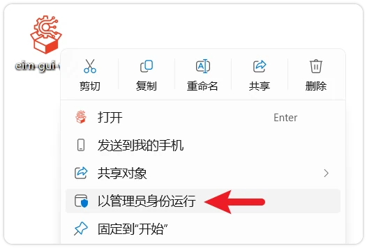

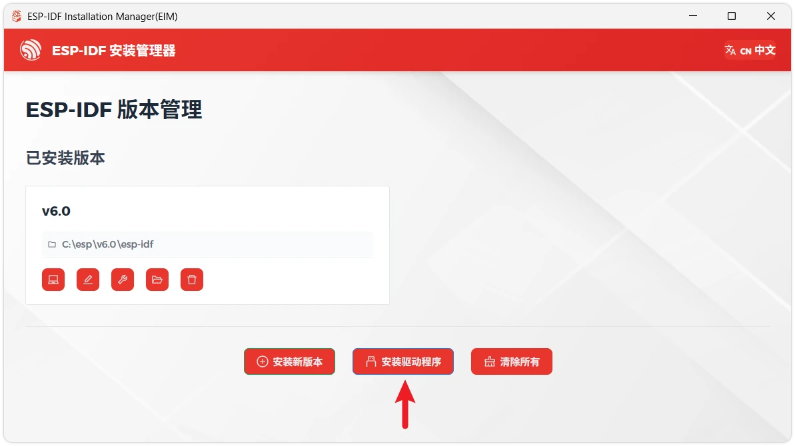

### 3.2 Install Visual Studio Code and ESP-IDF Extension

-

Download and install [Visual Studio Code](https://code.visualstudio.com/)。

-

It is recommended to check during installation **Add 'Open with Code' action to Windows Resources Explorer file context menu** to quickly open project folders.

-

In VS Code, click the sidebar activity bar's [SVG diagram] extension icon (or use the keyboard shortcut Ctrl + Shift + X) to open **Extension**  view.

-

In the search box, enter **ESP-IDF**, find the [ESP-IDF](https://marketplace.visualstudio.com/items?itemName=espressif.esp-idf-extension) extension and click install.

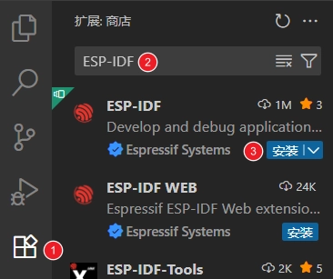

-

When **ESP-IDF extension version >= 2.0** , the extension will automatically detect and identify the ESP-IDF environment installed in the previous steps, without the need for manual configuration.

## 4. VS Code ESP-IDF Extension Interface Overview

After opening an ESP-IDF project, when the ESP-IDF extension finishes loading, a toolbar will be displayed at the bottom, as shown in the figure:

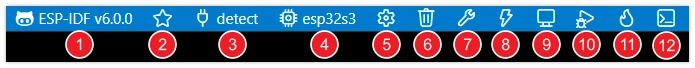

- **① ESP-IDF Version**: Display and switch the ESP-IDF version used by the current project. When a project uses a specific version, you can switch it through this feature.
- **(2) Select Flash Method**: Select the flashing method for the project flash command. You can choose DFU, JTAG, or UART interface.
- **③ Select Port to Use**: Select the serial port for ESP-IDF tasks (such as flashing or monitoring devices).
- **④ Set Espressif Device Target**: This command sets the target (IDF_TARGET) for the current project, equivalent to `esptool.py`. Select the corresponding chip Model here.
- **⑤ SDK Configuration Editor**: Launch the UI interface for ESP-IDF project settings. This command is equivalent to `esptool.py`。
- **⑥ Full Clean**: Delete the build Table of Contents of the current ESP-IDF project.
- **⑦ Build Project**: Use `esptool.py` and `esptool.py`  to build the project.
- **⑧ Flash Project**: Flash the binary files generated by the current project to the target device.
- **⑨ Monitor Device**: Start serial communication between the computer and Espressif devices. Equivalent to `esptool.py`。
- **⑩ Debug**: Launch debugging function.
- **⑪ Build, Flash and Monitor**: Used to build the project, write the binary program to the device, and launch the monitor terminal, similar to `esptool.py`。
- **⑫ Open ESP-IDF Terminal**: Open a terminal and activate IDF_PATH and the Python virtual environment.

## 5. Install C/C++ Language Extension

For code navigation and C/C++ syntax highlighting, it is recommended to use [Microsoft C/C++ Extension](https://marketplace.visualstudio.com/items?itemName=ms-vscode.cpptools)。

-

In VS Code, click the VS Code sidebar activity bar's [SVG diagram] (or use the keyboard shortcut Ctrl + Shift + X) to open **Extension**  view.

-

Then, search for [C/C++ Extension Pack](https://marketplace.visualstudio.com/items?itemName=ms-vscode.cpptools-extension-pack) extension and install.

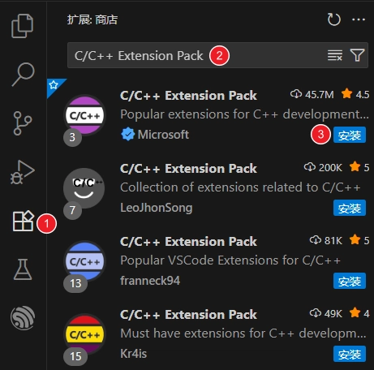

## 6. Appendix: Core Toolchain Overview

Behind the ESP-IDF development workflow, there is a series of supporting tools. Here is a brief introduction to give you an initial impression:

-

**`esptool.py`**

ESP-IDF's top-level command-line tool. It provides developers with a unified, convenient interface that encapsulates the underlying build system (CMake), compilation tool (Ninja), flashing tool (esptool.py), and debugging tools.

Common commands preview:

Create new project: `esptool.py`
- Select target chip: `esptool.py`
- Launch graphical configuration tool: `esptool.py`
- Build project: `esptool.py`
- Flash project: `esptool.py`

-

**Kconfig / menuconfig**

A component configuration system originating from the Linux kernel. ESP-IDF uses the Kconfig mechanism to manage a large number of configurable options in a project. Developers can run `esptool.py`  command to launch a text-based user interface (TUI), where you can enable or disable specific components, configure network parameters, adjust log levels, etc. All configuration options are ultimately saved in the project root Table of Contents under `esptool.py`  file, and provided to the source code as macro definitions at compile time.

-

**[CMake](https://cmake.org/)**

An open-source, cross-platform automated build system. In ESP-IDF, it is responsible for parsing the project's `esptool.py`  file, managing source code, component dependencies, compiler options, and linker scripts, ultimately generating the build instructions required by a specific build tool (such as Ninja).

-

**[Ninja](https://ninja-build.org/)**

A small build system focused on speed. In ESP-IDF, after CMake generates build rules during the configuration phase, Ninja is used by default to efficiently execute these rules. Ninja's main advantage lies in its extremely fast incremental build speed; it can precisely determine which files have changed since the last compilation and only recompile those files, significantly reducing compilation time during the development cycle.

-

**[esptool.py](https://github.com/espressif/esptool/#readme)**

A Python tool that communicates with the Espressif chip ROM Bootloader. Its core functions include: flashing the compiled firmware binary file (`esptool.py`) to the chip's Flash, reading chip Information (such as MAC address), erasing Flash, and performing other low-level Flash read/write operations.`esptool.py`  command calls `esptool.py`  to complete the actual flashing task.

## 7. Reference Links

- [ESP-IDF Programming Guide](https://docs.espressif.com/projects/esp-idf/zh_CN/v6.0/esp32s3/get-started/index.html)
- [ESP-IDF VS Code Extension Documentation](https://docs.espressif.com/projects/vscode-esp-idf-extension/zh_CN/latest/index.html)
- [ESP Technical Encyclopedia](https://docs.espressif.com/projects/esp-techpedia/zh_CN/latest/index.html)
- [ESP DevCon23 Beginner's Guide: Key Concepts and Resources](https://www.bilibili.com/video/BV1114y1r7du/)

