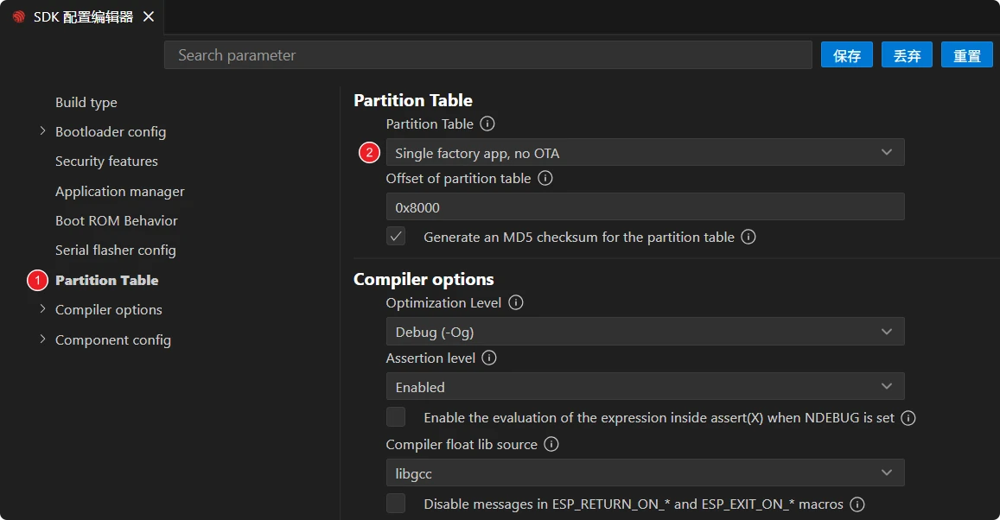
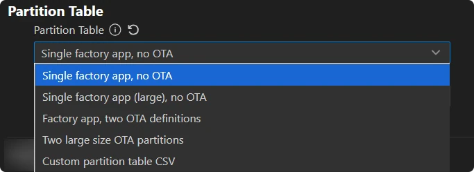
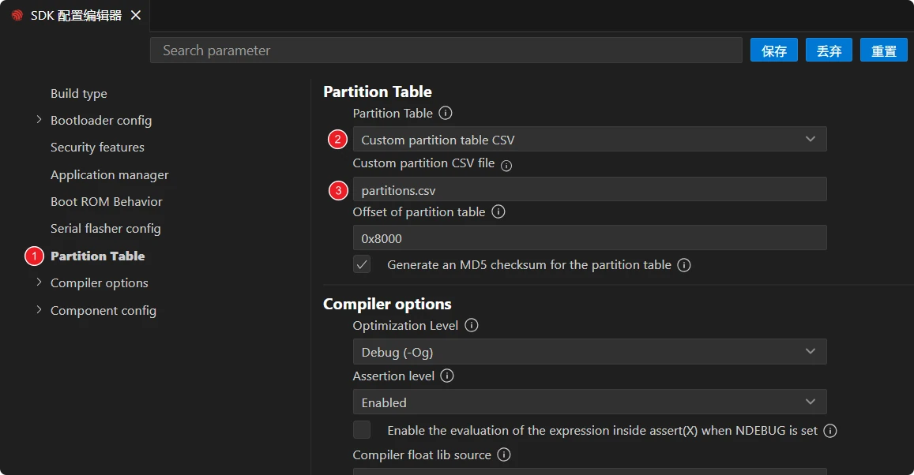
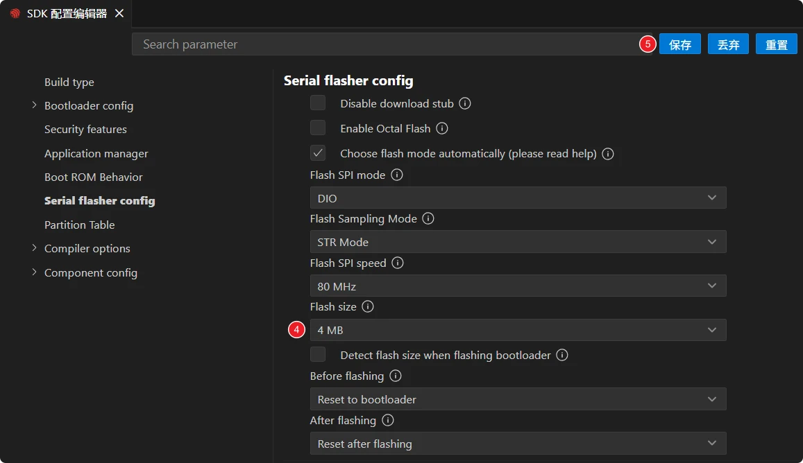

This page overview

# Partition Table

Important Note: About Board Compatibility

The core logic of this tutorial applies to all ESP32 development boards，but theYesoperation steps are all based on  as an example for demonstration. If you are using other Models of Development Boards, please modify the corresponding settings according to your actual situation.

## 1. What is a Partition Table

ESP32 ofexternal Flash usually contains**Multiple blocks with different purposes**:bootloader (bootloader)、ApplicationprogramCode (app)、Wi-Fi Calibrationdata (phy_init)、Key valueStorage (nvs)、（optionalof）OTA Upgrade backupetc.。these blocksof**Position and size**by a sheet called**Partition Table (partition table)** data structure description.

The Partition Table occupies one 4 KB sector in Flash, and on the ESP32-S3 it is flashed at the offset address `esp_partition` . At system startup, the bootloader first reads the Partition Table to obtain the location of each partition, then jumps to the app partition to execute code.

EachPartitionBythe followingFieldDescribe:

|FieldMeaning
|NamePartitionName (maximum 16 bytes, for easy identification)
|TypePartition type:`esp_partition`(program),`esp_partition`(data)
|SubTypeSubtype: such as `esp_partition` / `esp_partition` / `esp_partition` / `esp_partition` etc.
|OffsetOffset address in Flash
|SizePartition size (bytes, supports `esp_partition`、`esp_partition` Suffix)
|FlagsOptional flags, such as `esp_partition`

## 2. Default Partition Table

ESP-IDF includes several predefined Partition Tables; new projects use the simplest one by default. **"Single factory app, no OTA"**:

```
*******************************************
# ESP-IDF Partition Table
# Name, Type, SubType, Offset, Size, Flags
nvs,data,nvs,0x9000,24K,
phy_init,data,phy,0xf000,4K,
factory,app,factory,0x10000,2M,
storage,data,spiffs,0x210000,1M,
*******************************************
```

Meaning:

- `esp_partition` (24 KB, starting at 0x9000): Key-value storage; Wi-Fi configuration, user parameters, etc. are stored here.
- `esp_partition` (4 KB, starting at 0xf000): RF calibration data.
- `esp_partition` (1 MB, starting from 0x10000): Your application code.**The bootloader executes the program in this partition by default**。

This table is suitable for **2 MB and above Flash**, entry-level scenarios that do not need OTA, covering the vast majority of learning projects.

Another commonUseofpredefined table is **"Factory app, two OTA definitions"**:

```
*******************************************
# ESP-IDF Partition Table
# Name, Type, SubType, Offset, Size, Flags
nvs,data,nvs,0x9000,24K,
phy_init,data,phy,0xf000,4K,
factory,app,factory,0x10000,2M,
storage,data,spiffs,0x210000,1M,
*******************************************
```

One more than the previous:

- `esp_partition` (8 KB): Records "which OTA partition is currently running".
- `esp_partition` And `esp_partition` (1 MB each): Two OTA application backups. During upgrades, new firmware is written to the idle one, and the next boot runs from the new partition; on failure, it can roll back to the other.

This table requires approximately 3.2 MB,**At least 4 MB Flash**。

## 3. SwitchPartition Table

-

Click [SVG diagram] Open SDK configurationEditDevice, left-side listSelect **Partition Table**:



-

Right side **Partition Table** The dropdown menu contains:



`esp_partition`(default)
- `esp_partition`(app partition expanded to 1.5 MB)
- `esp_partition`(enable OTA)
- `esp_partition`(no factory partition, only two 1700 KB OTA partitions)
- `esp_partition`(custom, see next section)

-

After selecting, click the 'Save' button. The next build will regenerate the binary according to the new Partition Table, and it will be written during flashing.

Note

**After switching the Partition Table, the relevant Flash sections may need to be fully erased once**（`esp_partition` Then `esp_partition`). Otherwise, residual old Partition Table entries may prevent the bootloader from finding the new partitions.

## 4. Custom Partition Table

When predefined tables are insufficientUseWhen (For example:Applicationprogram > 1.5 MB、Need to Flash Mount on SPIFFS / LittleFS Filesystem, to reserve a custom data areaetc.），Can write your own CSV。

Operation steps:

-

Create a new file under the project root Table of Contents `esp_partition`, write your own partitions following the predefined table. For example, expand the app partition to 2 MB and reserve 1 MB for SPIFFS:

```
*******************************************
# ESP-IDF Partition Table
# Name, Type, SubType, Offset, Size, Flags
nvs,data,nvs,0x9000,24K,
phy_init,data,phy,0xf000,4K,
factory,app,factory,0x10000,2M,
storage,data,spiffs,0x210000,1M,
*******************************************
```

`esp_partition` When left blank, it is automatically calculated and aligned by the tool.

-

Open in the SDK Configuration Editor **Partition Table**, will **Partition Table** Switch the drop-down menu to `esp_partition`, below **Custom partition CSV file** Fill in path `esp_partition`(relative to the project root Table of Contents).



-

**Check Flash size**: Select on the left side of the SDK configuration editor **Serial flasher config**, to **Flash size** Set tonot less than theYesPartitiontotalAndofCapacity, and must not exceedDevelopment Boardactualof Flash Capacity (ESP32-S3-Zero onboard Flash Is 4 MB, i.e.select `esp_partition`). Finally click the "Save" button.



-

Build and flash. Open the ESP-IDF terminal, enter `esp_partition` command to print the currently active Partition Table and confirm it is correct.

```
*******************************************
# ESP-IDF Partition Table
# Name, Type, SubType, Offset, Size, Flags
nvs,data,nvs,0x9000,24K,
phy_init,data,phy,0xf000,4K,
factory,app,factory,0x10000,2M,
storage,data,spiffs,0x210000,1M,
*******************************************
```

## 5. Common Scenarios

|ScenarioProcessing method
|Application cannot be flashed into the default 1 MB partitionSwitch to "Single factory app (large)" or a custom table to `esp_partition` Expand
|Need toline/wire OTA upgradeChange to "Factory app, two OTA definitions", and set the Flash configuration to ≥ 4 MB Flash
|Want to mount a file system on FlashCustom CSV, add a line `esp_partition` Or `esp_partition` subtypes of `esp_partition` Partition
|Occasionally shows "partition not found" after startupForgot to after switching Partition Table `esp_partition`; erase once and reflash

## 6. Reference Links

- [ESP-IDF Programming Guide - Partition Table](https://docs.espressif.com/projects/esp-idf/zh_CN/latest/esp32s3/api-guides/partition-tables.html) — Field semantics, comparison of all predefined tables, encrypted NVS variants
- [ESP-IDF Programming Guide - OTA](https://docs.espressif.com/projects/esp-idf/zh_CN/latest/esp32s3/api-reference/system/ota.html) — Combined with OTA PartitionUseof API
- [`esp_partition` API](https://docs.espressif.com/projects/esp-idf/zh_CN/latest/esp32s3/api-reference/storage/partition.html) — Look up partitions by name/type in code, read/write Flash sections

