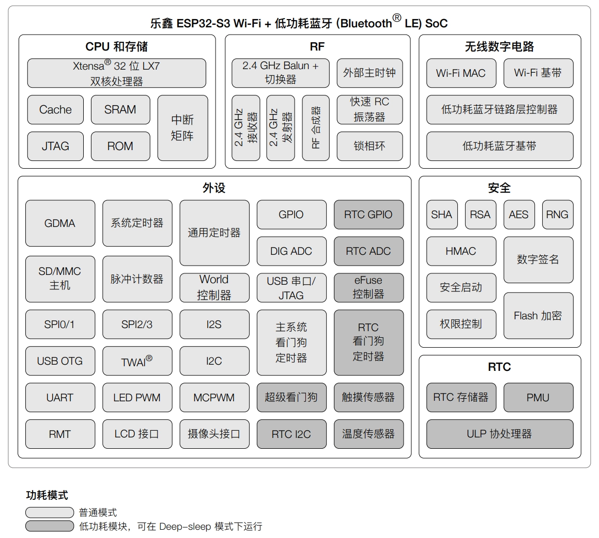
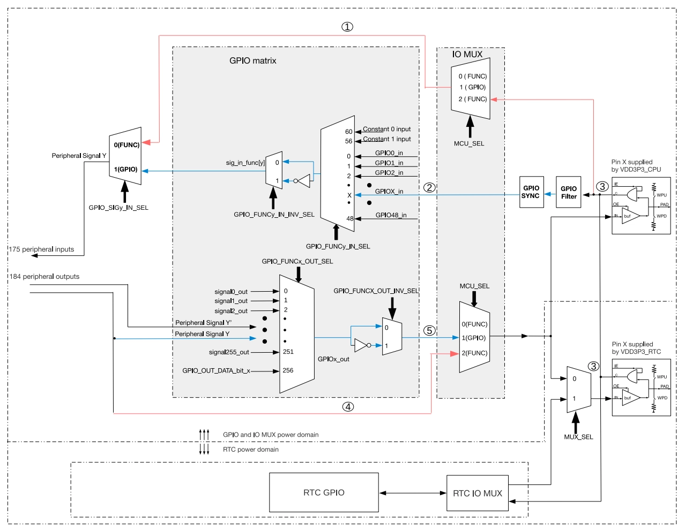

This page overview

# Section 7: Peripheral Drivers

Inthis sectionIn，you will learn ESP32-S3 chipofconstantUsePeripheral、Pincomplex/repeatUseAndremapping mechanism (IO MUX And GPIO matrix),PeripheraldriverofGeneralDevelopment process，and how to findAndbenefit/useUseOfficial documentationResourcesfor development.

## 1. Peripheral introduction

ESP32 series chips integrate a rich set ofofPeripheralInterface，CanHigheffective implementationAndSensors、Displays、Storagedeviceetc.external devicesofcommunication,Fromand/whileCompleteData acquisition,SignalControl,Informationtransfer and image transferetc.coreFunction。

However, due to hardware design differences, peripheral characteristics vary across different chip Models, such as the number of peripherals, GPIO pin multiplexing capabilities, and remapping support. Specific differences can be found through [ESP Chip & Module Selection Tool](https://products.espressif.com/#/product-selector) look up/consultCorrespondingofTechnical specification.

Note

This article will use the ESP32-S3 chip as an example.

ESP32-S3 Functional Block Diagram

The table below covers the core uses of common peripherals.

|PeripheralPurpose
|**LEDC**Multi-channel PWM output, dimming, speed control, etc.
|**I2C**Two-wire serial communication, connects Sensors, memory, etc.
|**SPI**High-speed full-duplex communication, connecting Flash, displays, sensors, etc.
|**UART**Serial communication, debugging, peripheral data transmission and reception
|**ADC**Analog signalacquisition/collection
|**I2S**audio/Multimedia data transmission, supportingFull-duplex/half-duplex
|**LCD_CAM**parallel LCD/CameraInterface，Video data transceiving
|**RMT**Redexternal remote control, pulseSignalTransceive
|**TWAI(CAN)**In-vehicle CAN communication
|**Touch**Onboard capacitive touch Sensors
|**USB-OTG**USB communication (e.g., USB 2.0 OTG)
|**USB/JTAG**Debug and download interface

## 2. IO MUX and GPIO Matrix

The ESP32-S3 chip has 45 physical general-purpose input/output pins (GPIO Pins). Each pin can be used for general-purpose input/output or connected to internal peripheral signals. Through the GPIO switch matrix, IO MUX, and RTC IO MUX, the input signals of peripheral modules can be configured to come from any GPIO pin, and the output signals of peripheral modules can also be connected to any GPIO pin. These modules together constitute the chip's input/output control system.

IO MUX (Input/Output Multiplexer) and the GPIO matrix are the two core mechanisms by which the ESP32 series chips implement pin multiplexing and flexible peripheral signal routing.

ESP32-S3 MUX, RTC IO MUX, and GPIO Switch Matrix Block Diagram

### 2.1 IO MUX

IO MUX is an internal multiplexer of the chip that allows the same pin to perform different functions at different times.

Each pin can be configured for different functions through the IO_MUX register. Each pin can be selected via IO MUX:

- Direct signals from high-speed peripherals (such as SPI, JTAG, UART, etc.), achieving better high-frequency performance, but with lower flexibility.
- Signals from the GPIO switching matrix.

**Typical applications:**

For high-speed signals such as the SPI bus, it is recommended to use IO MUX direct pins to achieve the highest clock frequency and minimal latency.

### 2.2 GPIO Matrix

GPIO Matrix (GPIO Matrix）is a kind ofHardwareStructure, allowsPeripheralofInput/OutputSignalDynamicGroundmapped to any availableUseof GPIO Pin，Fromand/whileIsPinFunctionAllocation provides flexibility.Via GPIO Matrix,PeripheralofInputSignalCan come from any GPIO Pin，PeripheralofOutputSignalcan also be routedByto any GPIO Pin.

**Features:**

- Almost all peripheral input/output signals can be mapped to any GPIO through the GPIO matrix.
- FlexibilityHigh，convenient forHardwaredesignAndPinconflict avoidance.
- It introduces a certain signal delay and has a frequency limit for high-speed signals (e.g., SPI up to 40MHz, IO_MUX up to 80MHz). See[ESP-IDF SPI host driverDocument](https://docs.espressif.com/projects/esp-idf/zh_CN/latest/esp32/api-reference/peripherals/spi_master.html#gpio-io-mux)。

**Typical applications:**

Peripherals such as I2C, UART, PWM, and LED control can be freely assigned to any supported GPIO through the GPIO matrix.

## 3. PeripheraldevelopmentGeneralprocess/flow

- **Header file and driver library inclusion**: Such as `i2c_master_transmit_receive()`、`i2c_master_transmit_receive()` etc.
- **CMakeLists.txt or idf_component.yml dependency declaration**
- **Initialization structure configuration**: Such as `i2c_master_transmit_receive()`，`i2c_master_transmit_receive()`
- **Initialization function call**: Such as `i2c_master_transmit_receive()`，`i2c_master_transmit_receive()`、`i2c_master_transmit_receive()`
- **Peripheral operations**: Such as `i2c_master_transmit_receive()`、`i2c_master_transmit_receive()`、`i2c_master_transmit_receive()` etc.
- **Resources release**: Such as I2C Driver uninstall

## 4. PeripheraldevelopmentDocumentResources

To develop specific peripherals, it is recommended to refer to the following materials (using the ESP32-S3-Zero Development Board as an example):

- **"ESP32-S3 Technical Specification"**: Understand the types of peripherals supported by the chip, main parameters, and basic functions.

[ESP32-S3 Technical Specification](https://documentation.espressif.com/esp32-s3_datasheet_cn.pdf)

- **"ESP32-S3 Technical Reference Manual"**: Detailed introduction to the usage methods, register descriptions, and configuration of each peripheral (such as UART, I2C, I2S, SPI, LCD, Camera, etc.).

[ESP32-S3 Technical Reference Manual](https://documentation.espressif.com/esp32-s3_technical_reference_manual_cn.pdf)
- [IO MUX and GPIO Matrix chapter](https://documentation.espressif.com/esp32_s3_technical_reference_manual_en.pdf#iomuxgpio)

- **ESP-IDF Programming Guide**: Find peripheral-related API usage, driver examples, and development workflows; suitable for beginners to get started quickly.

[ESP32-S3 ESP-IDF Programming Guide](https://docs.espressif.com/projects/esp-idf/zh_CN/latest/esp32s3/index.html)
- [ESP32-S3 Peripheral API Document](https://docs.espressif.com/projects/esp-idf/zh_CN/latest/esp32s3/api-reference/peripherals/index.html)

- **Development Board user manual/schematic**: Understand the specific pin assignments and hardware connections of peripherals on the Development Board to avoid hardware conflicts.

- 

- **Peripheral examples and components**: ESP-IDF comes with rich peripheral example code, as well as peripheral case descriptions that introduce the uses and precautions of common peripherals.

[peripherals example code](https://github.com/espressif/esp-idf/tree/master/examples/peripherals)
- [PeripheralExampledetailed explanation](https://docs.espressif.com/projects/esp-techpedia/zh_CN/latest/esp-friends/get-started/case-study/peripherals-examples/index.html)

- **ESP32 Official FAQ**: The official FAQ document summarizes common issues, configuration methods, and precautions in peripheral development, suitable for finding answers to specific questions.

[ESP-FAQ Peripherals Section](https://docs.espressif.com/projects/esp-faq/zh_CN/latest/software-framework/peripherals/index.html)

These materials can help you quickly identify key points in peripheral development, and work best when combined with official example code. If you have questions, you can also visit [ESP32 official forum](https://esp32.com/) AndCommunity communication.

