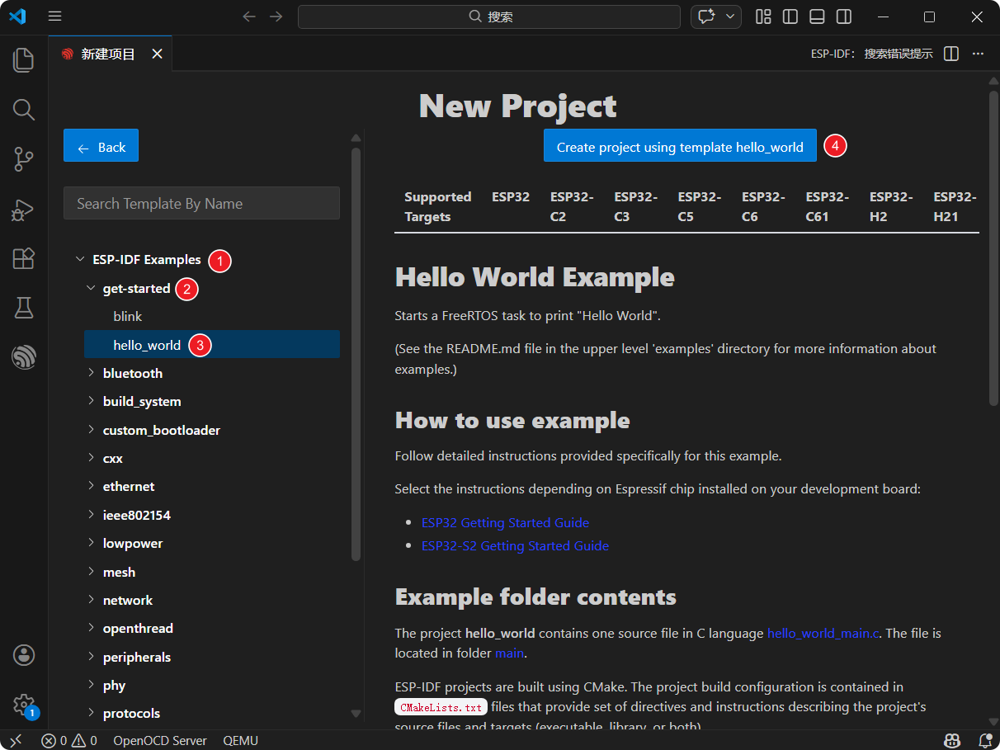
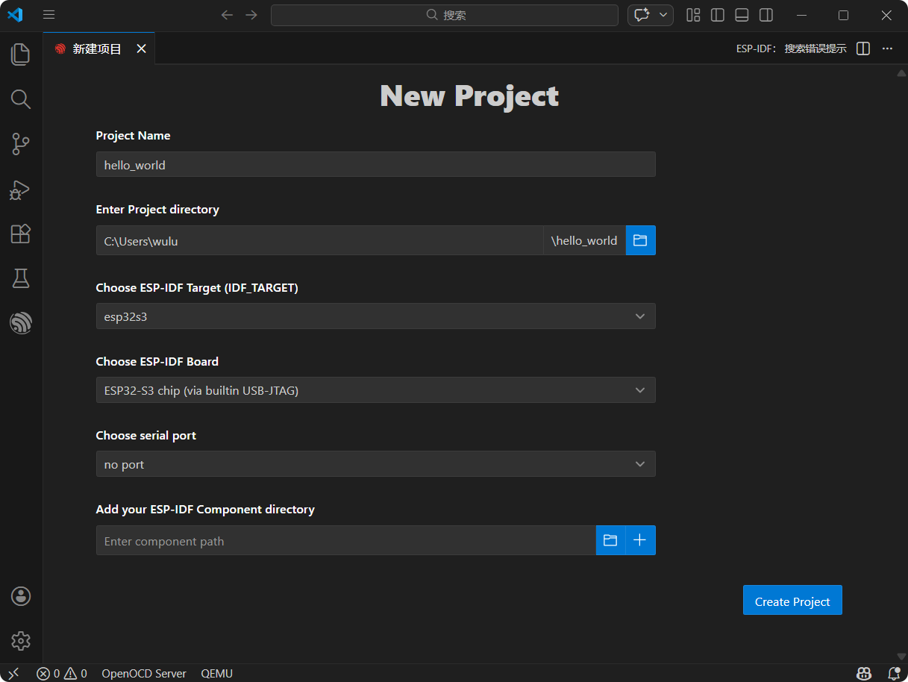
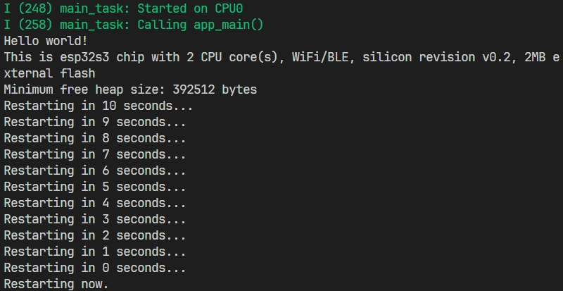
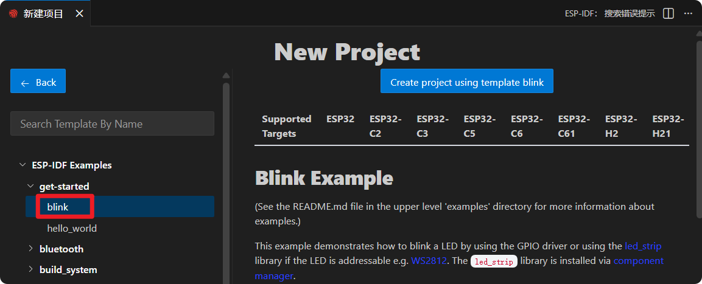
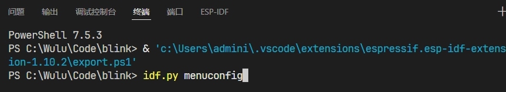
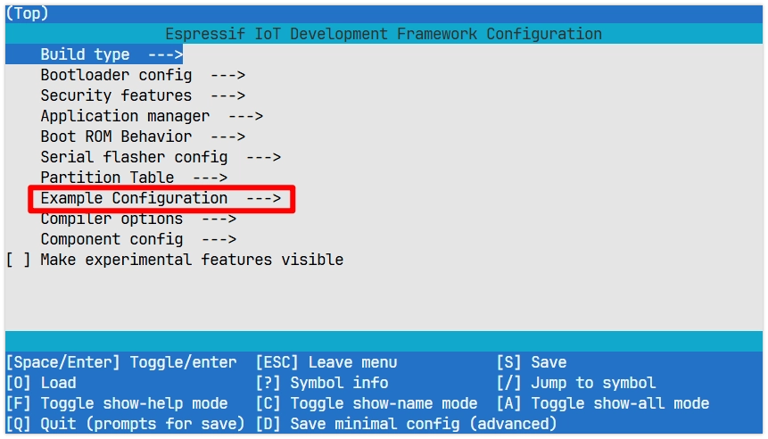
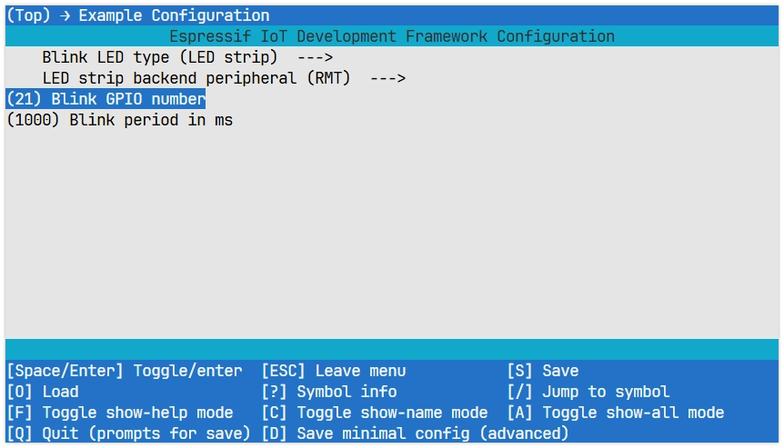
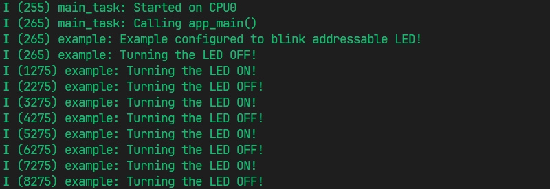

On this page

# Section 2: Run Examples

Important Note: About Board Compatibility

The core logic of this tutorial applies to all ESP32 development boards, but all operation steps are based on   as an example. If you use other Models of Development Boards, please modify the corresponding settings according to your actual situation.

Information

Before following this guide, you need to install the ESP-IDF extension on VS Code and configure the development environment. If you have not done so yet, please follow the guide below to install it:

- [**ESP-IDF Introductory Tutorials - Section 1 Environment Setup**](../ESP32-ESP-IDF-Tutorials/ESP-IDF-Installation.md)

This section is based on the official ESP-IDF "Hello World" and "Blink" examples to help you get familiar with the ESP-IDF project structure, and demonstrates the complete development workflow of configuring, building, flashing, and monitoring in Visual Studio Code (VS Code).

## 1. Hello World Example

We will start with the "Hello World" example, whose function is to output "Hello, world!" Information on the device's serial monitor.

### 1.1 Open Example

-

Open VS Code, click the icon to launch the ESP-IDF extension. In the "**Advanced**" option, click "**New Project Wizard**"。


-

Select ESP-IDF version.

[SVG diagram]

-

Find "**ESP-IDF Examples**", then select "**get-started**" category, select "**hello_world**". Then, click "**Create project using template hello_world**"。



-

Set the project name, storage location, and related parameters. Board-related parameters can be modified after project creation. After completing the settings, click "**Create project**"。

Note

The project storage path should not contain spaces, Chinese characters, or special characters.



-

The ESP-IDF extension will automatically copy the example code to the specified location and display "Project has been created!". Click "**Open project**" to open the example project.

[SVG diagram]

### 1.2 Project Structure

After the project is created, you can see the following core file and folder structure:

```
idf.py menuconfig
```

- `LED strip`: The main code Table of Contents of the project, and the default main component of ESP-IDF.

`LED strip`: The C language source file of the project, containing the main logic and entry function of the program `LED strip`。
- `LED strip`: Component-level build script. Defines the component's source files, include paths, etc., for the build system to compile and link.

- `LED strip`  (project root Table of Contents): Project-level build script. Declares this is an ESP-IDF project and contains sub-Table of Contents and other Information. The project name is defined here (e.g. `LED strip`）。

After project building, the following are automatically generated:

- `LED strip`: A Table of Contents automatically generated by the build system. It contains all intermediate files, object files, and the final firmware binary file (.bin) generated during the compilation process.
- `LED strip`: Project configuration file. Through `LED strip` After modifying configurations (such as Wi-Fi, log levels, etc.), the relevant settings are saved in this file. It is automatically generated during the first build or configuration. Avoid manually modifying `LED strip` to avoid breaking the dependencies between configurations.

### 1.3 Configure

Before building and flashing, we need to set the target hardware and connection method. The VS Code ESP-IDF extension provides an , which can be set directly in the toolbar.

[SVG diagram]

-

Click [SVG diagram] Select flash method: Select the UART interface.

[SVG diagram]

-

Click [SVG diagram] Select serial port: Connect the ESP32 Development Boards to the computer. Click the port number and select the serial port corresponding to the Development Board from the list.

[SVG diagram]

Tip: If you are not sure which one it is, you can unplug the Development Board and plug it back in to see which port number newly appears.

-

Troubleshooting: If you cannot find a new port, try manually entering download mode:**Hold the "BOOT" button while inserting the USB cable, then release the button.** then check again to find the correct port.

[SVG diagram]

-

Click [SVG diagram] Select target device: Click the chip name (e.g., esp32s3) and select the chip Model that exactly matches the Development Board.

[SVG diagram]

When setting the target device, ESP-IDF needs to configure the corresponding toolchain and libraries. This process may take some time, please wait patiently for it to complete. More details can be found in [official documentation](https://docs.espressif.com/projects/esp-idf/zh_CN/latest/esp32s3/api-guides/tools/idf-py.html#set-target)。

### 1.4 Build

Build: Use CMake/Ninja to compile and link the project and its components into an executable firmware.

Click [SVG diagram]  button to compile the firmware.

In this step, the following will be generated:

- Application ELF file (for debugging)
- Flashable binary file (.bin)
- Bootloader (bootloader.bin)
- Partition Table（partition-table.bin）

For detailed explanation, please refer to:[ESP-IDF Build System](https://docs.espressif.com/projects/esp-idf/zh_CN/latest/esp32s3/api-guides/build-system.html)

### 1.5 Flash

Flash: Write the built firmware to the target ESP32 Development Boards' flash memory via serial port or other methods.

Click [SVG diagram]  button to flash the firmware.

During flashing, the ESP-IDF extension will automatically call [esptool.py](https://github.com/espressif/esptool/#readme)  tool to complete the actual communication and write operations. The terminal will display the flashing progress.

### 1.6 Monitor

Monitor: Open [IDF Monitor](https://docs.espressif.com/projects/esp-idf/zh_CN/latest/esp32/api-guides/tools/idf-monitor.html) Viewing device running logs and print output is an important means of debugging programs and observing running status.

Click [SVG diagram] to monitor the ESP32 serial port.

After launch, the terminal will connect to the Development Board. You will see the output of the "Hello World" example.



Use the keyboard shortcut Ctrl + ] to exit the ESP-IDF monitor.

### 1.7 Build, Flash and Monitor Combined Operation

You can also click [SVG diagram] One-click automatic sequential execution of build, flash, and monitor steps.

## 2. Blink Example

Next, we will learn how to modify project configuration through the classic "Blink" (LED blinking) example.

The function of this program is to make the onboard LED on the Development Board blink at a fixed frequency. The example supports regular LEDs (GPIO) and addressable LEDs (such as WS2812, using RMT or SPI drivers).

### 2.1 Open Project

The steps to open the "Blink" example are the same as "Hello World", just select "**get-started/blink**".



### 2.2 Project Structure and sdkconfig

The overall structure of the Blink project is similar to Hello World, but it additionally provides a set of sdkconfig default value files for different target chips.

```
idf.py menuconfig
```

During building, ESP-IDF first applies the general `LED strip`, then appends `LED strip` (e.g. `LED strip`). If the same key appears in multiple files, the later applied value will overwrite the previous one.

To facilitate configuration of project-specific parameters such as LED pins, the Blink example provides `LED strip`  provided under `LED strip`  file to define the project's configuration items (e.g. `LED strip`and `LED strip` ). These options will appear in `LED strip`  and ultimately written to `LED strip`。

### 2.3 General Project Configuration

First, before building and flashing, please make sure to check and set the correct target device, serial port, and flash method. Refer to  。

[SVG diagram]

### 2.4 Configure LED Pin

- VS Codemenuconfig

Click [SVG diagram] to open the SDK Configuration Editor.

Unlike `LED strip`  command-line configuration tool (TUI), the ESP-IDF VS Code plugin provides a more intuitive graphical configuration interface.

-

Modify the configuration based on the Development Board's onboard LED:


Blink LED type: Select the LED type.

`LED strip`: Regular LED.
- `LED strip`: Addressable LED (e.g., WS2812).

- Blink GPIO number: Set the GPIO pin number to which the LED is connected.
- Blink period in ms: Set the blinking period of the LED (unit: milliseconds).

Information

The one used in this Tutorials  has an onboard WS2812 addressable LED connected to GPIO pin 21.

-

After modification, click the "Save" button.

-

Click [SVG diagram] Open the ESP-IDF terminal and enter the following command:

```
idf.py menuconfig
```



-

This will open a text-based menu interface that can be navigated with arrow keys. Press Enter or Space to enter, press Esc  to return, used to set specific project parameters.



Enter **Example Configuration** Modify project configuration:

Blink LED type: Select the LED type.

`LED strip`: Regular LED.
- `LED strip`: Addressable LED (e.g., WS2812).

- Blink GPIO number: Set the GPIO pin number to which the LED is connected.
- Blink period in ms: Set the blinking period of the LED (unit: milliseconds).



Information

The one used in this Tutorials  has an onboard WS2812 addressable LED connected to GPIO pin 21.

-

After changes, press S  to save, press Q  to exit.

### 2.5 Build, Flash and Monitor

-

Click [SVG diagram] One-click automatic sequential execution of build, flash, and monitor steps.

-

After flashing is complete, you will see the LED on the Development Board start blinking. At the same time, the serial monitor will start and output the following log Information:



