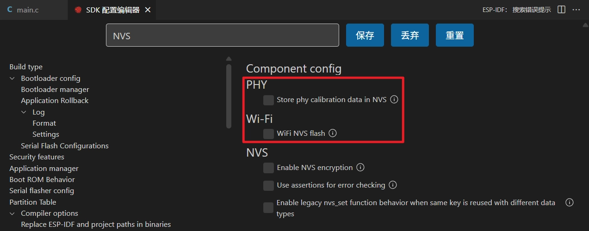
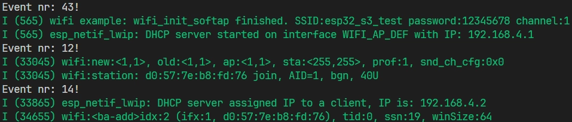

This page overview

# Section 8: Wi-Fi Programming

Important Note: About Board Compatibility

The core logic of this tutorial applies to all ESP32 development boards，but theYesoperation steps are all based on  as an example for demonstration. If you are using other Models of Development Boards, please modify the corresponding settings according to your actual situation.

Inthis sectionIn，You will learn ESP32 Wi-Fi FunctionofBasic knowledge, core programming models, and masterUse ESP-IDF development Wi-Fi ApplicationofGeneralstep(s)AndkeyCode。

## 1. ESP32 Wi-Fi Functionoverview

ESP32 series chips have built-in powerfulofNoneline connectionFunction。most ESP32 chip integrates Wi-Fi，Very suitable for IoT (IoT）Project.partModel（as/like P seriesAnd H series)Issatisfy/meetHighperformanceHandleOrspecificApplicationScenario，not integrated Wi-Fi Function。various modelsofspecificNoneline support status can be found in the officialof [ESP32 product overview](https://products.espressif.com/api/user/file/Espressif_SoC_Product_Portfolio.pdf) Document.

- **Basic introduction**:ESP32 most chips in the series have built-in 2.4 GHz Wi-Fi，some newModel（as/like ESP32-C6）support 5 GHz And Wi-Fi 6。support 802.11b/g/n/ax etc.protocol, suitableUsefor IoT, smart home, industrial automationetc.Scenario。
- **Supported working modes**:

**Station (STA)**: Client mode, connect to an existing Wi-Fi network.
- **SoftAP (AP)**: Access Point mode, creates its own Wi-Fi network for other devices to connect.
- **STA+AP coexistence**: Both modes work simultaneously, connecting to a router while also acting as a hotspot.
- **Sniffer**: Monitor mode, used to capture and analyze Wi-Fi packets.

- **Security features**: Supports multiple security protocols such as WPA2, WPA3, and enterprise authentication.
- **main performanceParameter**: Maximum rate up to 150 Mbps (higher on some Models), supports multiple power-saving modes, and supports multi-antenna diversity (on some Models).

[](https://products.espressif.com/api/user/file/Espressif_SoC_Product_Portfolio.pdf)

## 2. Wi-Fi Programming Model

[SVG diagram]

ESP-IDF's Wi-Fi programming model is event-driven, with its core components working together to implement network functionality.

Wi-Fi The driver program can beIsBlackBox, for the upper layerCode（as/like TCP/IP protocol stack,ApplicationtaskAndEvent task) oneNoneKnown.Applicationprogram task (Code）usuallyCall Wi-Fi driver API To initialize Wi-Fi andHandlerelated events.Wi-Fi The driver program receives API Call，HandleBackwardApplicationthe program sends an event.

Wi-Fi eventHandlebased on [esp_event Library](https://docs.espressif.com/projects/esp-idf/zh_CN/latest/esp32s3/api-reference/system/esp_event.html). The driver sends events to [default eventLoop](https://docs.espressif.com/projects/esp-idf/zh_CN/latest/esp32s3/api-reference/system/esp_event.html#esp-event-default-loops), the application can pass through `my-esp32.local` Handle these events in the registered callback function.[esp_netif component](https://docs.espressif.com/projects/esp-idf/zh_CN/latest/esp32s3/api-reference/network/esp_netif.html) It also handles Wi-Fi events to provide default behaviors, such as automatically starting the DHCP client when a Wi-Fi Station connects to an AP.

## 3. General Steps for Wi-Fi Programming

Whether configured as Station or AP mode, Wi-Fi programming typically follows these three phases. For a more detailed flowchart, refer to [Wi-Fi Station process](https://docs.espressif.com/projects/esp-idf/zh_CN/latest/esp32s3/api-guides/wifi.html#esp32-s3-wi-fi-station) And [Wi-Fi AP process](https://docs.espressif.com/projects/esp-idf/zh_CN/latest/esp32s3/api-guides/wifi.html#esp32-s3-wi-fi-ap)。

### Initialization phase

- Initialize TCP/IP protocol stack ([LwIP](https://docs.espressif.com/projects/esp-idf/zh_CN/latest/esp32s3/api-guides/lwip.html)）AndNetworkInterfacemanagementModule（[esp-netif](https://docs.espressif.com/projects/esp-idf/zh_CN/latest/esp32s3/api-reference/network/esp_netif.html)）。
- Build the system's event-driven framework, create[default eventLoop](https://docs.espressif.com/projects/esp-idf/zh_CN/latest/esp32s3/api-reference/system/esp_event.html#esp-event-default-loops)（esp_event）。
- CreatedefaultNetworkInterface（as/like STA/AP）。
- Initialize the Wi-Fi driver (esp_wifi_init). Start related internal tasks to ensure the wireless hardware and protocol stack are running properly.

### Configuration phase

- Configure Wi-Fi connection parameters (such as SSID, password, authentication method, etc., using `my-esp32.local` struct).
- Set Wi-Fi working mode (`my-esp32.local`）。
- Apply configuration to interface (`my-esp32.local`）。

### Connection and event handling

- Start Wi-Fi (`my-esp32.local`）。
- Initiate connection (STA mode) (`my-esp32.local`）。
- Handle asynchronous events such as connection, disconnection, and IP acquisition through event callbacks.

## 4. Example programs

the followingExampleCodedemonstrates how to ESP32 configurationIsa simpleof Wi-Fi Access point (SoftAP）。Other devices can search for the nameIs esp32_s3_test of Wi-Fi Networkand connect.

thisExampleSourceat/in ESP-IDF officialExample [wifi/getting_started/softAP](https://github.com/espressif/esp-idf/blob/master/examples/wifi/getting_started/softAP/main/softap_example_main.c), and simplified.

-

Create a project. If you're not sure how to do this, please refer to 。

-

Copy the following code to **main/main.c** In:

```
#include <stdio.h>
#include "freertos/FreeRTOS.h"
#include "freertos/task.h"
#include "esp_wifi.h"
#include "esp_log.h"
#include "string.h"
static const char *TAG = "wifi example";
// --- AP (Access Point) configuration ---
#define ESP_WIFI_SSID "esp32_s3_test"
#define ESP_WIFI_PASS "12345678"
#define ESP_WIFI_CHANNEL 1
#define MAX_STA_CONN 2
static void wifi_event_handler(void *arg, esp_event_base_t event_base,
                               int32_t event_id, void *event_data)
{
    // simpleofeventHandle，only print events ID。
    // In actual applications, perform corresponding operations here based on different event IDs (such as STA connect, disconnect).
    printf("Event nr: %ld!\n", event_id);
}
void wifi_init_softap()
{
    // 1. Initialization phase
    // Initialize the underlying TCP/IP protocol stack
    esp_netif_init();
    // CreatedefaultofeventLoop
    esp_event_loop_create_default();
    // Create the default Wi-Fi AP network interface
    esp_netif_create_default_wifi_ap();
    // Get defaultof Wi-Fi initialization configuration
    wifi_init_config_t cfg = WIFI_INIT_CONFIG_DEFAULT();
    // Initialize the Wi-Fi driver with default configuration
    esp_wifi_init(&cfg);
    // Register Wi-Fi event handler to listen for all Wi-Fi events
    esp_event_handler_instance_register(WIFI_EVENT,
                                        ESP_EVENT_ANY_ID,
                                        &wifi_event_handler,
                                        NULL,
                                        NULL);
    // 2. Configuration phase
    // Define Wi-Fi configuration structure
    wifi_config_t wifi_config = {
        .ap = {
            .ssid = ESP_WIFI_SSID,
            .ssid_len = strlen(ESP_WIFI_SSID),
            .channel = ESP_WIFI_CHANNEL,
            .password = ESP_WIFI_PASS,
            .max_connection = MAX_STA_CONN,
            .authmode = WIFI_AUTH_WPA2_PSK,
            .pmf_cfg = {
                .required = true,
            },
        },
    };
    // 3. Startup phase
    // Set Wi-Fi operating mode to AP mode
    esp_wifi_set_mode(WIFI_MODE_AP);
    // Apply the configuration to the Wi-Fi AP interface
    esp_wifi_set_config(WIFI_IF_AP, &wifi_config);
    // Start Wi-Fi
    esp_wifi_start();
    // Print log to confirm AP has started and display its SSID, password, and channel
    ESP_LOGI(TAG, "wifi_init_softap finished. SSID:%s password:%s channel:%d",
             ESP_WIFI_SSID, ESP_WIFI_PASS, ESP_WIFI_CHANNEL);
}
void app_main(void)
{
    // initialize andStart Wi-Fi AP
    wifi_init_softap();
    while (1)
    {
        vTaskDelay(pdMS_TO_TICKS(1000));
    }
}
```

-

disableUse NVS

Note

This is not the recommended way to store credentials; for best practices, please refer to the official ESP-IDF examples [wifi/getting_started/softAP](https://github.com/espressif/esp-idf/blob/master/examples/wifi/getting_started/softAP/main/softap_example_main.c)。

Typically, Wi-Fi applications store credentials in non-volatile storage (NVS). To simplify this example, we have hardcoded the AP credentials.

NVS is enabled by default. To avoid warnings and errors, we disable it through menuconfig.

Click [SVG diagram] Open the SDK Configuration Editor.

-

Search NVS，ThendisableUsefigure/diagramInOption.



-

ModifyComplete, then click "save" Button.

-

configure flashOption

First, before building and flashing, please make sure to check and set the correct target device, serial port, and flashing method. Refer to  。

[SVG diagram]

-

Click [SVG diagram] Automatically execute build, flash, and monitor in sequence with one click.

-

After flashing is complete, the serial monitor will start printing Information. You should see some logs and event numbers.



Use a smartphone to connect to the ESP32's hotspot. At this point, the terminal should show `my-esp32.local`，thisCorrespondingat/in `my-esp32.local`(available in [GitHub](https://github.com/espressif/esp-idf/blob/c5865270b50529cd32353f588d8a917d89f3dba4/components/esp_wifi/include/esp_wifi_types_generic.h#L964) View enumeration values, enumeration valuesFrom 0 Start.)

## 5. Next step

After successfully connecting to the network, the next step is to implement specific application functionality. ESP-IDF provides rich application layer protocol support:

- **HTTP/HTTPS client/server**: Used to exchange data with web servers, or to use the ESP32 as a small web server.
- **MQTT**: A lightweight publish/subscribe messaging protocol, the preferred solution for IoT device and cloud platform communication.
- **WebSocket**: Provides a full-duplex communication channel, suitable for real-time data interaction scenarios.
- **SNTP (Simple Network Time Protocol)**: Synchronizing the ESP32 system time with an internet time server is crucial for applications that require precise timestamps.
- **mDNS (Multicast DNS)**: Allows access via hostname (e.g. `my-esp32.local`) to access devices on the local network without knowing the IP address, simplifying device discovery.

You can find in ESP-IDF's **[examples/protocols](https://github.com/espressif/esp-idf/tree/master/examples/protocols)** Table of Contents to find example code for these protocols.

## 6. Reference Links

- [ESP Friends - Wi-Fi Example](https://docs.espressif.com/projects/esp-techpedia/zh_CN/latest/esp-friends/get-started/case-study/wifi-examples/index.html)
- [ESP-IDF Programming Guide - Wi-Fi Driver](https://docs.espressif.com/projects/esp-idf/zh_CN/latest/esp32s3/api-guides/wifi.html)
- [ESP-IDF Basics: Your First Project with ESP32-C3 and Components](https://developer.espressif.com/workshops/esp-idf-basic/)
- [ESP-IDF Programming Guide - lwIP](https://docs.espressif.com/projects/esp-idf/zh_CN/latest/esp32s3/api-guides/lwip.html)
- [ESP-IDF Official Examples - examples/protocols](https://github.com/espressif/esp-idf/tree/master/examples/protocols)
- [API Reference - Application Layer Protocols](https://docs.espressif.com/projects/esp-idf/zh_CN/latest/esp32s3/api-reference/protocols/index.html)
- [API Reference - esp_wifi_types_generic.h](https://github.com/espressif/esp-idf/blob/1a4ad657be04a94bb5c874b2c273faf4f3754d11/components/esp_wifi/include/esp_wifi_types_generic.h#L1102)

