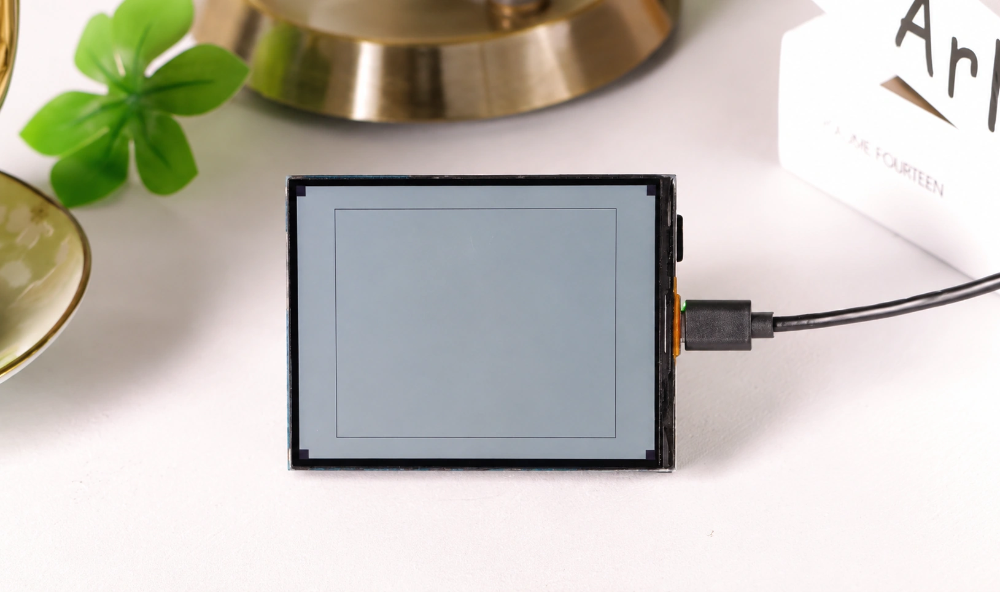
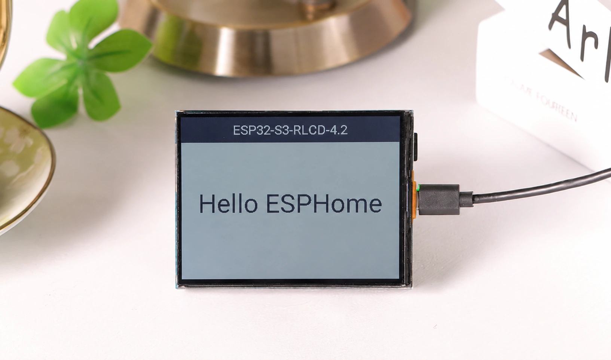
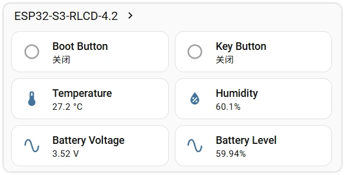
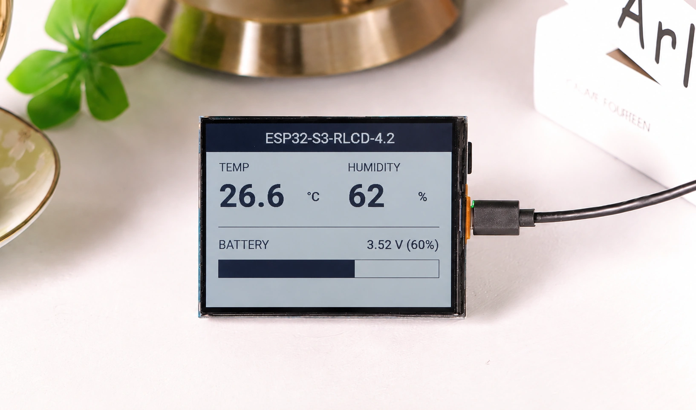
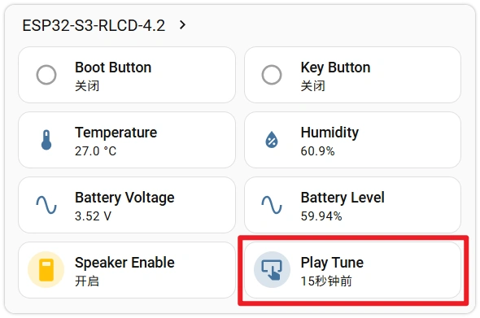
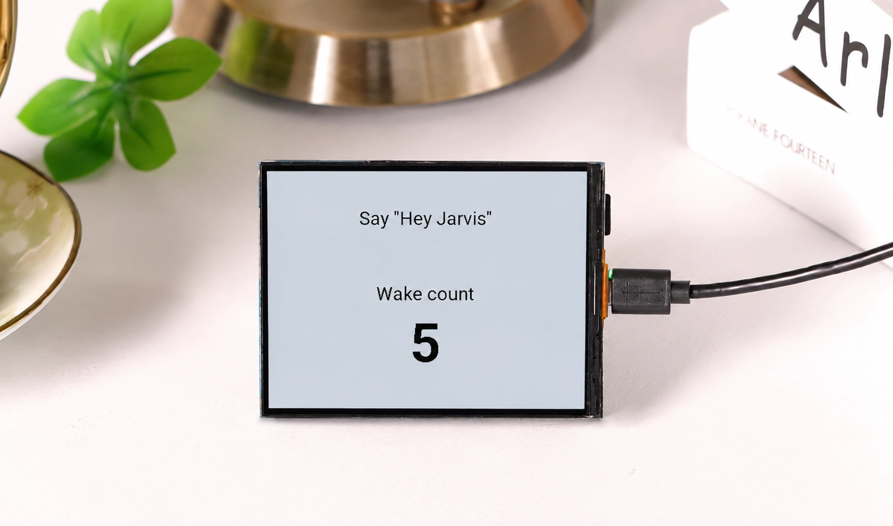

This page overview

# Section 5: ESP32-S3-RLCD-4.2 configuration example

This section uses  as an example, demonstrating how to comprehensively apply the knowledge learned in previous sections —`rtttl`, I²C / SPI bus declarations, and how to add different types of components. Each peripheral is covered in its own section and can be selected as needed.

Aboutthis sectionofHardware

This section uses  IsExampleboard, configureInUsetoofPin、Chip ModelAllAndthis board one by oneCorresponding。ifDevelopment BoardModeldifferent, pleaseReferencecorresponding schematicAdjustPinAndchip configuration.

## 1. Preparation work

- **Hardware**: one board, one USB-C cable, and optionally one 18650 battery.
- **Network**: Available 2.4 GHz Wi-Fi, with the HA host and Development Board on the same subnet.
- **Front**: Sections 1—4 have been completed. This section will heavily reuse the wizard flow introduced in Sections 3 and 4,`rtttl`、`rtttl`、`rtttl` etc.Concept, encountering unfamiliarFieldCan be consultedCorrespondingsection.

ESP32-S3-RLCD-4.2 onboardPeripheralthan/ratio ESP32-S3-Zero Rich —Reflective LCD、Temperature and humiditySensors、BatteryMonitoring, dual microphones, speakers, twoKey，this sectionPressPeripheralSegmented, each segment only focuses onCorrespondingcomponentofAddMethod, not requiring one throughoutoflarge configuration. Each segment can independentlyUse，Pressneed to combineThat's it.

## 2. Hardware Resources Quick Overview

### 2.1 Onboard peripherals

|PeripheralModelBusDescription
|DisplaysST7305 reflective monochrome LCDSPI400×300 resolution, 4.2 inches, visible under ambient light
|Temperature and humiditySHTC3I²C (`rtttl`)—
|Audio DACES8311I²C + I²SDrive speaker output
|Audio ADCES7210I²C + I²SCapture dual microphones
|RTCPCF85063AI²CCurrent configuration not connected yet
|StoragemicroSD card slotSPICurrent configuration not connected yet
|Battery18650 battery holder + ADCGPIO43x voltage divider, requires software restoration
|KeyBOOT × 1、KEY × 1GPIOActive low
|Extension2×8 pin 2.54 mm header—reservedUseuserExtension

### 2.2 GPIO Pin Assignment

|GPIOFunction
|GPIO0BOOT button (active low)
|GPIO4Battery ADC
|GPIO5Display DC
|GPIO8I²S DOUT (speaker)
|GPIO9I²S BCLK
|GPIO10I²S DIN (microphone)
|GPIO11SPI CLK (display)
|GPIO12SPI MOSI (display)
|GPIO13I²C SDA
|GPIO14I²C SCL
|GPIO16I²S MCLK
|GPIO18KEY button (active low)
|GPIO40Display CS
|GPIO41Display RESET
|GPIO45I²S LRCLK
|GPIO46Speaker amplifier enable

About speaker enable pin

GPIO46 controls the enable signal for the speaker amplifier —**Only by pulling it high will the DAC output be sent to the speaker through the amplifier**. Subsequent configuration will use a `rtttl` Set it by default `rtttl`, so that the device can output audio immediately after startup.

### 2.3 directlyUsecommunity configuration

[devices.esphome.io](https://devices.esphome.io/) already includes a ready-made configuration for this board. Search `rtttl` Community configurations for the board can be found; copy and modify the Wi-Fi credentials to use directly.

The following section breaks down by peripheral, showing how each type of component can be added to the configuration; you can select snippets to add as needed.

## 3. Basic configuration

Follow the process in Section 3, use the ESPHome wizard to create a new device: select chip **ESP32-S3**, after the wizard completes click **SKIP**, enter the YAML editor.

The initial configuration generated by the wizard is as follows (each device's `rtttl`, keys, and passwords differ; this is for illustration):

```
font:
  - file: "gfonts://Roboto"
    id: font_title
    size: 22
  - file: "gfonts://Roboto@700"
    id: font_value
    size: 64
display:
  - platform: st7305_rlcd
    model: WAVESHARE_400X300
    id: my_display
    width: 400
    height: 300
    cs_pin: GPIO40
    dc_pin: GPIO5
    reset_pin: GPIO41
    data_rate: 1MHz
    update_interval: 60s
    lambda: |-
      it.print(200, 40, id(font_title), TextAlign::TOP_CENTER, "Say \"Hey Jarvis\"");
      it.print(200, 130, id(font_title), TextAlign::TOP_CENTER, "Wake count");
      it.printf(200, 165, id(font_value), TextAlign::TOP_CENTER, "%d", id(wake_count));
```

Keep wizard-generated content

`rtttl`、`rtttl`、`rtttl` Is randomly generated by the wizard,Andthis deviceBindofCredentials;`rtttl` Determines the device's mDNS hostname.**Directly copying someone else's YAML to replace the entire section will lose these values**, causing HA integration failure, OTA failure, or mDNS unable to resolve the device.
the rest of this sectionYesFragments are all"**Append to the end of the wizard-generated YAML**"——Keep the above unchanged; subsequent snippets are appended on this basis.

After the wizard's output, append two more sections — these are the "additional basics" needed for all examples in this section:

```
font:
  - file: "gfonts://Roboto"
    id: font_title
    size: 22
  - file: "gfonts://Roboto@700"
    id: font_value
    size: 64
display:
  - platform: st7305_rlcd
    model: WAVESHARE_400X300
    id: my_display
    width: 400
    height: 300
    cs_pin: GPIO40
    dc_pin: GPIO5
    reset_pin: GPIO41
    data_rate: 1MHz
    update_interval: 60s
    lambda: |-
      it.print(200, 40, id(font_title), TextAlign::TOP_CENTER, "Say \"Hey Jarvis\"");
      it.print(200, 130, id(font_title), TextAlign::TOP_CENTER, "Wake count");
      it.printf(200, 165, id(font_value), TextAlign::TOP_CENTER, "%d", id(wake_count));
```

Several key points:

- **`rtttl`** — The ESP32-S3-RLCD-4.2 has 8 MB octal PSRAM on board, which Displays frame buffers and audio buffers both rely on. The mode must be `rtttl`, at 80 MHz speed. Without this section, compilation may pass, but it will crash at runtime due to insufficient memory.
- **`rtttl`** — the wizard defaults to `rtttl`, keep it unchanged. Some components (such as those mentioned in the FAQ `rtttl`) only supports the ESP-IDF framework.
- **`rtttl`** — ST7305 driver has not yet entered ESPHome mainline; through [`rtttl`](https://github.com/kylehase/ESPHome-ST7305-RLCD) introduced. SyntaxIn  introduced.

YAML snippets in subsequent sections are also "appended" after this configuration,**can be selected as needed**— for those that just need lighting, append Displays configuration; for those that need temperature and humidity, add Sensors and buttons; and so on. The same top-level key (such as `rtttl`、`rtttl`) appears multiple times, merge them using the YAML anchor syntax introduced in Section 4.

## 4. Displays: ST7305 reflective LCD

ST7305 Is a monochromeReflective LCD，no/notYesbacklight, relies on ambient light reflection for imaging, refresh rateLowbutPower consumptionVery small. It goes through SPI Andcommunicates with the main controller, onlyUseto CLK And MOSI twoData line（One-way write, not required MISO）。

```
font:
  - file: "gfonts://Roboto"
    id: font_title
    size: 22
  - file: "gfonts://Roboto@700"
    id: font_value
    size: 64
display:
  - platform: st7305_rlcd
    model: WAVESHARE_400X300
    id: my_display
    width: 400
    height: 300
    cs_pin: GPIO40
    dc_pin: GPIO5
    reset_pin: GPIO41
    data_rate: 1MHz
    update_interval: 60s
    lambda: |-
      it.print(200, 40, id(font_title), TextAlign::TOP_CENTER, "Say \"Hey Jarvis\"");
      it.print(200, 130, id(font_title), TextAlign::TOP_CENTER, "Wake count");
      it.printf(200, 165, id(font_value), TextAlign::TOP_CENTER, "%d", id(wake_count));
```

- `rtttl` — FromSection 3Introduced at the endofexternal components.
- `rtttl` — ST7305 has low timing requirements; 1 MHz is sufficient, and higher frequencies provide no actual improvement for ST7305 and may introduce communication errors.
- `rtttl` — Reflective displays have no display persistence issue, but writing to the screen consumes power and CPU; refreshing once per minute is sufficient for displaying date, temperature, humidity, and similar scenarios.
- `rtttl` — Display a test image on first power-up to easily confirm correct wiring.

After flashing, if the screen displays a test pattern, it indicates that the SPI wiring and driver are both working correctly.



### 4.1 Draw simple screen

After confirming display is normal, delete `rtttl` one line, via `rtttl` draw content on its own.Display textneed to declare the font first ——`rtttl` Will automatically download Google Fonts at compile time:

```
font:
  - file: "gfonts://Roboto"
    id: font_title
    size: 22
  - file: "gfonts://Roboto@700"
    id: font_value
    size: 64
display:
  - platform: st7305_rlcd
    model: WAVESHARE_400X300
    id: my_display
    width: 400
    height: 300
    cs_pin: GPIO40
    dc_pin: GPIO5
    reset_pin: GPIO41
    data_rate: 1MHz
    update_interval: 60s
    lambda: |-
      it.print(200, 40, id(font_title), TextAlign::TOP_CENTER, "Say \"Hey Jarvis\"");
      it.print(200, 130, id(font_title), TextAlign::TOP_CENTER, "Wake count");
      it.printf(200, 165, id(font_value), TextAlign::TOP_CENTER, "%d", id(wake_count));
```

Then `rtttl` In `rtttl` Replace with `rtttl`, draw a simple screen with a title bar:

```
font:
  - file: "gfonts://Roboto"
    id: font_title
    size: 22
  - file: "gfonts://Roboto@700"
    id: font_value
    size: 64
display:
  - platform: st7305_rlcd
    model: WAVESHARE_400X300
    id: my_display
    width: 400
    height: 300
    cs_pin: GPIO40
    dc_pin: GPIO5
    reset_pin: GPIO41
    data_rate: 1MHz
    update_interval: 60s
    lambda: |-
      it.print(200, 40, id(font_title), TextAlign::TOP_CENTER, "Say \"Hey Jarvis\"");
      it.print(200, 130, id(font_title), TextAlign::TOP_CENTER, "Wake count");
      it.printf(200, 165, id(font_value), TextAlign::TOP_CENTER, "%d", id(wake_count));
```



Draw coordinate system with screen top-left corner as origin `rtttl`，x to the right,y downward. Several constantsUseMethod:

- `rtttl` - Draw text,`rtttl` Makes the coordinates the text center.
- `rtttl` / `rtttl` — Hollow / filled rectangles.
- `rtttl` — Line.

Monochrome screen only has `rtttl`(lit) and `rtttl`(off) two states. After the title bar is filled with a solid rectangle, the text needs to specify `rtttl` to display as inverted color on a dark background.

Note

Displays component**Will not**Generate entities in HA — it is just a "canvas".`rtttl` for the complete drawing interface, see [Display Rendering Engine](https://esphome.io/components/display/#display-engine)。

The above draws static content. After connecting Sensors, real-time readings such as temperature, humidity, and battery level can also be displayed on the screen; see the full example in the later section "Displaying Sensor Readings".

## 5. Sensors and Buttons

### 5.1 I²C bus

SHTC3, ES8311, and ES7210 share the same I²C bus; only one declaration is needed:

```
font:
  - file: "gfonts://Roboto"
    id: font_title
    size: 22
  - file: "gfonts://Roboto@700"
    id: font_value
    size: 64
display:
  - platform: st7305_rlcd
    model: WAVESHARE_400X300
    id: my_display
    width: 400
    height: 300
    cs_pin: GPIO40
    dc_pin: GPIO5
    reset_pin: GPIO41
    data_rate: 1MHz
    update_interval: 60s
    lambda: |-
      it.print(200, 40, id(font_title), TextAlign::TOP_CENTER, "Say \"Hey Jarvis\"");
      it.print(200, 130, id(font_title), TextAlign::TOP_CENTER, "Wake count");
      it.printf(200, 165, id(font_value), TextAlign::TOP_CENTER, "%d", id(wake_count));
```

`rtttl` Scan the bus at power-up and print detected slave addresses in the LOGS. When checking the logs at first power-up, at least `rtttl`（ES8311）、`rtttl` Or `rtttl`（ES7210）、`rtttl`(SHTC3) and other addresses; if missing, subsequent Sensors and audio will not work properly.

### 5.2 SHTC3 Temperature and Humidity

```
font:
  - file: "gfonts://Roboto"
    id: font_title
    size: 22
  - file: "gfonts://Roboto@700"
    id: font_value
    size: 64
display:
  - platform: st7305_rlcd
    model: WAVESHARE_400X300
    id: my_display
    width: 400
    height: 300
    cs_pin: GPIO40
    dc_pin: GPIO5
    reset_pin: GPIO41
    data_rate: 1MHz
    update_interval: 60s
    lambda: |-
      it.print(200, 40, id(font_title), TextAlign::TOP_CENTER, "Say \"Hey Jarvis\"");
      it.print(200, 130, id(font_title), TextAlign::TOP_CENTER, "Wake count");
      it.printf(200, 165, id(font_value), TextAlign::TOP_CENTER, "%d", id(wake_count));
```

`rtttl` The platform covers both SHTC1/SHTC3.`rtttl` And `rtttl` Each comes with `rtttl`，HA InWill generate two independentofNumeric entity;`rtttl` provideDisplaysone sectionof `rtttl` Reference.

### 5.3 Battery voltage and charge percentage

The onboard battery holder to GPIO4 goes through a 3x voltage divider, so the read voltage needs to be multiplied by 3 to get the actual battery voltage. Then use a `rtttl` platform that linearly maps voltage to a 0—100% battery percentage:

```
font:
  - file: "gfonts://Roboto"
    id: font_title
    size: 22
  - file: "gfonts://Roboto@700"
    id: font_value
    size: 64
display:
  - platform: st7305_rlcd
    model: WAVESHARE_400X300
    id: my_display
    width: 400
    height: 300
    cs_pin: GPIO40
    dc_pin: GPIO5
    reset_pin: GPIO41
    data_rate: 1MHz
    update_interval: 60s
    lambda: |-
      it.print(200, 40, id(font_title), TextAlign::TOP_CENTER, "Say \"Hey Jarvis\"");
      it.print(200, 130, id(font_title), TextAlign::TOP_CENTER, "Wake count");
      it.printf(200, 165, id(font_value), TextAlign::TOP_CENTER, "%d", id(wake_count));
```

- `rtttl` — ESP32-S3 of ADC Default range can only measure up to about 0.95 V，must set attenuation to raise the upper limit to about 3.1 V，Otherwise fully chargedof 18650 After voltage division (about 1.4 V）Will exceed the measurement range.
- `rtttl` Map 2.5 V → 0% and 4.2 V → 100% linearly, corresponding to the discharged to fully charged voltage of an 18650 battery;`rtttl` Limit it to 0-100 to avoid out-of-range voltages being incorrectly converted to negative numbers or values greater than 100.

### 5.4 User buttons

onboard BOOT（GPIO0）And KEY（GPIO18）TwoKeyAre allActive low，Pressnumber (ordinal prefix) 4.2.1 sectionofconfiguration approachThat's it.to bind trigger actions (such as page turning,SwitchdisplayMode），canIn `rtttl` Add under `rtttl` or other actions, the key binding in the audio section later is one example.

```
font:
  - file: "gfonts://Roboto"
    id: font_title
    size: 22
  - file: "gfonts://Roboto@700"
    id: font_value
    size: 64
display:
  - platform: st7305_rlcd
    model: WAVESHARE_400X300
    id: my_display
    width: 400
    height: 300
    cs_pin: GPIO40
    dc_pin: GPIO5
    reset_pin: GPIO41
    data_rate: 1MHz
    update_interval: 60s
    lambda: |-
      it.print(200, 40, id(font_title), TextAlign::TOP_CENTER, "Say \"Hey Jarvis\"");
      it.print(200, 130, id(font_title), TextAlign::TOP_CENTER, "Wake count");
      it.printf(200, 165, id(font_value), TextAlign::TOP_CENTER, "%d", id(wake_count));
```

### 5.5 Display Sensor Readings

Once the sensors are in place, take what's in the Displays section `rtttl` And `rtttl` Replace with the complete configuration below, and the screen will display temperature, humidity, and battery level — the screen is divided into three sections: a top title bar, middle temperature and humidity, and a bottom battery bar.

```
font:
  - file: "gfonts://Roboto"
    id: font_title
    size: 22
  - file: "gfonts://Roboto@700"
    id: font_value
    size: 64
display:
  - platform: st7305_rlcd
    model: WAVESHARE_400X300
    id: my_display
    width: 400
    height: 300
    cs_pin: GPIO40
    dc_pin: GPIO5
    reset_pin: GPIO41
    data_rate: 1MHz
    update_interval: 60s
    lambda: |-
      it.print(200, 40, id(font_title), TextAlign::TOP_CENTER, "Say \"Hey Jarvis\"");
      it.print(200, 130, id(font_title), TextAlign::TOP_CENTER, "Wake count");
      it.printf(200, 165, id(font_value), TextAlign::TOP_CENTER, "%d", id(wake_count));
```

Key points:

- `rtttl` And `rtttl` ClassSimilar, but supports `rtttl`、`rtttl` and other C format placeholders, followed by the values to display in order.
- values via `rtttl`、`rtttl` reading, corresponding to the sensors declared in sections 5.2 and 5.3.
- Progress bar consists of two steps:`rtttl` Draw border, thenPressCalculate the fill width from the battery percentage,Use `rtttl` Fill.

Note

To avoid additional glyph declarations, units are written in ASCII letters (`rtttl`、`rtttl`). To display the degree symbol `rtttl`, need to in the corresponding `rtttl` of `rtttl` explicitly add in `rtttl`, otherwise it cannot be displayed on screen.

at this point,Displays、Sensors、Keyall in place. After flashing HA InWill appear Temperature、Humidity、Battery Voltage、Battery Level、Boot Button、Key Button Several entities, the screen displaysTemperature and humidityAndBattery level screen.





## 6. Audio: Speaker and Microphone

onboardofspeaker (ES8311 DAC）AndMicrophone (ES7210 ADC）common/sharedUseone I²S Bus。below are the respective speakerAndmicrophoneofverificationMethod，canInconfirm before building a complete voice assistantHardwarenormal.

### 6.1 Speaker: button plays ringtone

Use `rtttl` Component makes the speaker play a melody (ringtone).`rtttl` Using the RTTTL ringtone format from the Nokia era, the melody is synthesized directly by the device without downloading audio files, and the sound is more noticeable than short beeps:

```
font:
  - file: "gfonts://Roboto"
    id: font_title
    size: 22
  - file: "gfonts://Roboto@700"
    id: font_value
    size: 64
display:
  - platform: st7305_rlcd
    model: WAVESHARE_400X300
    id: my_display
    width: 400
    height: 300
    cs_pin: GPIO40
    dc_pin: GPIO5
    reset_pin: GPIO41
    data_rate: 1MHz
    update_interval: 60s
    lambda: |-
      it.print(200, 40, id(font_title), TextAlign::TOP_CENTER, "Say \"Hey Jarvis\"");
      it.print(200, 130, id(font_title), TextAlign::TOP_CENTER, "Wake count");
      it.printf(200, 165, id(font_value), TextAlign::TOP_CENTER, "%d", id(wake_count));
```

After flashing, appears in HA **Play Tune** Button, click to play the ringtone, indicating the speaker and amplifier are working.`rtttl`(GPIO46) controls the amplifier enable; no output when disabled; if volume is too low, increase `rtttl`。



`rtttl` Following is an RTTTL string; replace it with another melody to play different ringtones, for example:

```
font:
  - file: "gfonts://Roboto"
    id: font_title
    size: 22
  - file: "gfonts://Roboto@700"
    id: font_value
    size: 64
display:
  - platform: st7305_rlcd
    model: WAVESHARE_400X300
    id: my_display
    width: 400
    height: 300
    cs_pin: GPIO40
    dc_pin: GPIO5
    reset_pin: GPIO41
    data_rate: 1MHz
    update_interval: 60s
    lambda: |-
      it.print(200, 40, id(font_title), TextAlign::TOP_CENTER, "Say \"Hey Jarvis\"");
      it.print(200, 130, id(font_title), TextAlign::TOP_CENTER, "Wake count");
      it.printf(200, 165, id(font_value), TextAlign::TOP_CENTER, "%d", id(wake_count));
```

### 6.2 Speaker: Make the device read text aloud

`rtttl` The speaker is confirmed to be working. If you want the device to**Read aloud any text**(such as announcing notifications or temperature/humidity), you can integrate HA's TTS. This feature depends on the network and HA's TTS service, and is an advanced usage.

Unlike section 6.1, speech playback goes through the media playback channel, requiring the speaker to be wrapped as `rtttl`, and use `rtttl` also supports 'media'And「Announcement" two audio streams (`rtttl`、`rtttl` Duplicated with the previous text, keep only one instance when merging into a single configuration):

```
font:
  - file: "gfonts://Roboto"
    id: font_title
    size: 22
  - file: "gfonts://Roboto@700"
    id: font_value
    size: 64
display:
  - platform: st7305_rlcd
    model: WAVESHARE_400X300
    id: my_display
    width: 400
    height: 300
    cs_pin: GPIO40
    dc_pin: GPIO5
    reset_pin: GPIO41
    data_rate: 1MHz
    update_interval: 60s
    lambda: |-
      it.print(200, 40, id(font_title), TextAlign::TOP_CENTER, "Say \"Hey Jarvis\"");
      it.print(200, 130, id(font_title), TextAlign::TOP_CENTER, "Wake count");
      it.printf(200, 165, id(font_value), TextAlign::TOP_CENTER, "%d", id(wake_count));
```

The audio chain is: pipeline → resampler (`rtttl` / `rtttl`）→ mixer Input（`rtttl` / `rtttl`) → mixer → physical speaker `rtttl`. Note that the mixer's input id and the resampler id must be different, otherwise validation will fail due to duplicate ids.

After flashing, a named appears in HA **RLCD Speaker** media player. Enter text in HA's TTS dialog and click "Read Aloud", and the device will read it out.

Read aloudNoneSound: Check HA internal URL

TTS audio is generated by HA at runtime and delivered to the device for download via an HTTP URL (`rtttl`）。if LOGS Inappear `rtttl` Or `rtttl`，indicating the deviceNoneCannot access theAddress（at this time thisGround `rtttl`、`rtttl` still works normally, because they are compiled into the firmware at build time and do not go through the network).
In HA **Settings → system → Network → thisGroundNetwork** , set the internal URL to a form directly accessible by the device: use**LAN IP**(to avoid `rtttl`), using **`rtttl`**(without `rtttl`, self-signed certificate will cause handshake timeout), port `rtttl`，andAndDevice on the same network segment,For example `rtttl`。

### 6.3 Microphone: wake word log

microphoneNoneCannot directly preview audio, canUse**Device-side wake word detection**Indirect verification — it runs entirely on the ESP32 and does not require HA's voice service. When a wake word is detected, it prints a log entry:

```
font:
  - file: "gfonts://Roboto"
    id: font_title
    size: 22
  - file: "gfonts://Roboto@700"
    id: font_value
    size: 64
display:
  - platform: st7305_rlcd
    model: WAVESHARE_400X300
    id: my_display
    width: 400
    height: 300
    cs_pin: GPIO40
    dc_pin: GPIO5
    reset_pin: GPIO41
    data_rate: 1MHz
    update_interval: 60s
    lambda: |-
      it.print(200, 40, id(font_title), TextAlign::TOP_CENTER, "Say \"Hey Jarvis\"");
      it.print(200, 130, id(font_title), TextAlign::TOP_CENTER, "Wake count");
      it.printf(200, 165, id(font_value), TextAlign::TOP_CENTER, "%d", id(wake_count));
```

Display the detection results on the screen, so you can confirm without checking logs. Below is an independent display configuration where the count increments by one each time it is woken:

```
font:
  - file: "gfonts://Roboto"
    id: font_title
    size: 22
  - file: "gfonts://Roboto@700"
    id: font_value
    size: 64
display:
  - platform: st7305_rlcd
    model: WAVESHARE_400X300
    id: my_display
    width: 400
    height: 300
    cs_pin: GPIO40
    dc_pin: GPIO5
    reset_pin: GPIO41
    data_rate: 1MHz
    update_interval: 60s
    lambda: |-
      it.print(200, 40, id(font_title), TextAlign::TOP_CENTER, "Say \"Hey Jarvis\"");
      it.print(200, 130, id(font_title), TextAlign::TOP_CENTER, "Wake count");
      it.printf(200, 165, id(font_value), TextAlign::TOP_CENTER, "%d", id(wake_count));
```

Note

the entire configurationIn `rtttl` Only one is allowed. The display configuration here and the one in the 'Displaying Sensor Readings' section are two independent examples; choose one according to your current testing purpose.

`rtttl` Need to `rtttl` Add to `rtttl`，during compilation, the wake word model is also automatically downloaded. After flashing, speak to the microphone "Hey Jarvis"，on the screenofThe count immediately increments by one, indicating the microphoneAnd I²S acquisition chain is normal.



## 7. FAQ for this section

- **Clicking Play Tune produces no sound**: Confirm `rtttl` is already enabled (GPIO46 controls the amplifier enable); if TTS playback has no sound, it is usually a HA internal URL configuration issue, see the hint in the playback section.
- **Wake wordNoneresponse**: Confirm `rtttl` Added `rtttl`、Model downloaded; can be adjusted appropriatelyHigh `rtttl`, and confirm speaking toward the microphone.
- **Battery voltage is always 0 or out of range**: Check `rtttl` Whether it is `rtttl`，`rtttl` whether it is correct, and confirm the battery's actual voltage is within the 2.5—4.2 V range.

## 8. Reference Links

- 
- [ESPHome ST7305 external component](https://github.com/kylehase/ESPHome-ST7305-RLCD)
- [ESPHome `rtttl` Document](https://esphome.io/components/psram/)
- [ESPHome Display Rendering Engine](https://esphome.io/components/display/#display-engine)
- [ESPHome `rtttl` Sensors documentation](https://esphome.io/components/sensor/shtcx/)
- [ESPHome `rtttl` Ringtone component](https://esphome.io/components/rtttl/)
- [devices.esphome.io](https://devices.esphome.io/)

