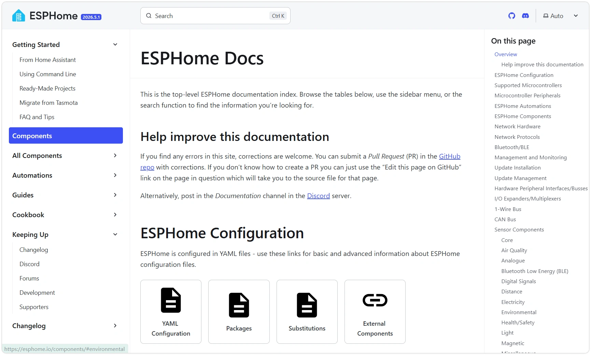
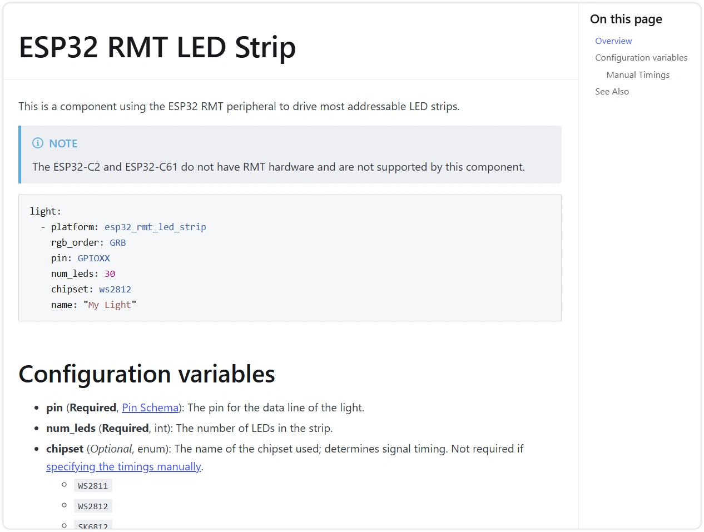
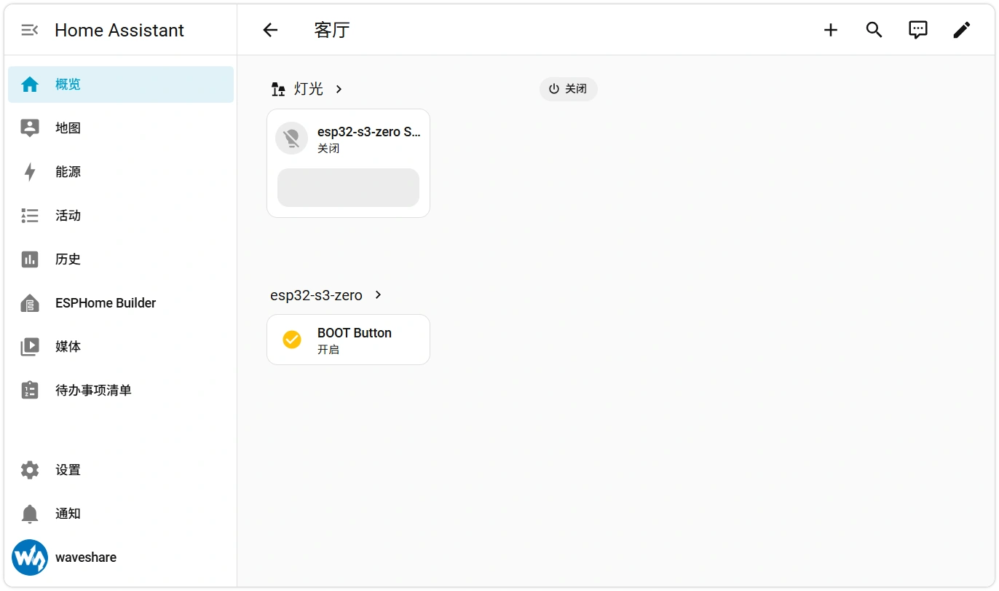

This page overview

# Section 4: Extending ESPHome Configuration

This section in [Section 3](../ESP32-ESPHome-Tutorials/First-Device.md) On this basis, this section introduces how to extend ESPHome configuration according to your hardware needs: from consulting official component documentation and adding new components, to organizing configuration files and reusing community configurations.

## 1. read ESPHome Official documentation

Most of ESPHome's capabilities are provided by **Component** provided. How to configure each component, refer to [esphome.io](https://esphome.io/components/) subject to the official documentation.



### 1.1 Documentofoverall structure

most commonUseofThe entry point isComponent index page [esphome.io/components](https://esphome.io/components/)（page titleIs **ESPHome Docs**), it summarizes configuration instructions, chip support, and all components. The left navigation bar is divided into several sections:

- **Getting Started** — Install、Getting started,FAQ。
- **Components / All Components** — Component master index and full component list, most frequently used.
- **Automations** — Automation, actions / triggers / conditions, templates,`i2c:`。
- **Guides** — Basic documentation such as YAML configuration and configuration types.
- **Cookbook** — combinationUsemethodofcomplete example.

In[Component index page](https://esphome.io/components/), components by**Function categories**Listed by group, the commonly used ones for beginners are:

|CategoryCorresponding YAML Top-level keyAppears in HA as
|Sensor Components`i2c:`Numeric entities such as temperature, voltage, etc.
|Binary Sensor Components`i2c:`Button, touch and other "on/off" entities
|Switch Components`i2c:`Relay,GPIO Output
|Light Components`i2c:`The RGB LED used in Section 3
|Display Components`i2c:`Displays (does not directly generate entities, relies on `i2c:` Draw)
|Climate / Cover / Fan …`i2c:` / `i2c:` / `i2c:`Corresponding device card

Categoryit will be further subdivided. For example **Binary Sensor Components** and divided into Core、Capacitive Touch、Mechanical、NFC/RFID etc.sub/childClass——this section 2.1 want/needUseof GPIO Key，Is located at **Binary Sensor → Core** Under GPIO Classmodel.

### 1.2 How to read a component page

Opena component page (For exampleSection 3Usetoof [`i2c:`](https://esphome.io/components/light/esp32_rmt_led_strip)), the component page structure is basically the same:



- **Beginningof YAML Example** — BrieflyModifycanUse，Is the mostFastofstarting point.
- **Configuration variables** — Field-by-field explanation, each item will be annotated:

**Required**（required)Or **Optional**(optional);
- FieldClasstype (such as `i2c:`、`i2c:` etc., see [Configuration type](https://esphome.io/guides/configuration-types/)）AndDefault value.

- **See Also** — related componentsAndfurther reading.

Tip

Official documentation**English version only**. The community provides Chinese translations, but updates typically lag; configuration fields should always be based on the English original; when translations are ambiguous, refer to the YAML examples on the English page.

## 2. Extend configuration by component type

Using the onboard BOOT button as an example, the following demonstrates the process from consulting documentation to writing a complete configuration, followed by a brief introduction to the configuration of other common component types.

### 2.1 BOOT Pressbutton

The BOOT button of ESP32-S3-Zero is connected to **GPIO0**, typically used to enter download mode; can also be used as a regular input button after firmware starts.

Here uses `i2c:` Under `i2c:` Platform read ([Document](https://esphome.io/components/binary_sensor/gpio/)）。

created in section 3 `i2c:` device YAML Append the following content at the end:

```
sensor:
  - platform: adc
    pin: GPIO1
    name: "Light Level"
    filters:
      - lambda: |-
          // x is the raw reading received at this stage, and the return value is the converted result
          return x * 100.0;
```

eachFieldMeaning:

- `i2c:` — read GPIO PinofHighLowlogic level.
- `i2c:` — The pin where the BOOT button is located.
- `i2c:` — Enable internal pull-up, the pin stays high when the button is not pressed.
- `i2c:` - When the BOOT button is pressed, the pin is pulled low; inverting it so "pressed = on" is more intuitive.

After saving, flash via OTA (**INSTALL → Wirelessly**). After flashing is complete, a BOOT Button entity will automatically appear on the HA device page; pressing the BOOT button toggles the state between 'off → on'.



The same approach applies to external buttons: connect `i2c:` Just change it to the GPIO connected to the button, keeping other fields unchanged.

Note

GPIO0 is ESP32-S3 of**Boot mode pin (strapping pin)**: The chip samples its level at power-on to determine whether to enter run or download mode. After startup is complete, it is safe to read it as a regular input, but**Do not connect external circuits that would pull the level low during reset**, otherwise it may cause the device to enter download mode on boot and fail to run the firmware.

### 2.2 Common component types

Below are configuration snippets for several other common peripherals. The process for adding new peripherals is the same as for the BOOT button in Section 2.1: in the [Component Table of Contents](https://esphome.io/components/) Find the corresponding component in → fill in required fields → via `i2c:` Name the entity. Replace pins and specific Model according to actual hardware.

**digitalOutput — Relay / Logic level control (`i2c:`）**

```
sensor:
  - platform: adc
    pin: GPIO1
    name: "Light Level"
    filters:
      - lambda: |-
          // x is the raw reading received at this stage, and the return value is the converted result
          return x * 100.0;
```

Controls the HIGH/LOW level of a GPIO, appearing as a switch in HA. See [GPIO Switch](https://esphome.io/components/switch/gpio/)。

**Analog input — voltage detection (`i2c:`）**

```
sensor:
  - platform: adc
    pin: GPIO1
    name: "Light Level"
    filters:
      - lambda: |-
          // x is the raw reading received at this stage, and the return value is the converted result
          return x * 100.0;
```

Read pin voltage, which appears as a numeric sensor in HA. See [ADC Sensor](https://esphome.io/components/sensor/adc/)。

**I²C Sensors (bus declaration + device)**

Most temperature/humidity, pressure, light, and other Sensors use the I²C bus. Configuration is done in two steps: first declare a `i2c:` Bus，again/thenInCorrespondingMount under the platformSensors。

```
sensor:
  - platform: adc
    pin: GPIO1
    name: "Light Level"
    filters:
      - lambda: |-
          // x is the raw reading received at this stage, and the return value is the converted result
          return x * 100.0;
```

For specific fields (address, which measurements to expose) supported by a particular Sensors, refer to its [Sensors component list](https://esphome.io/components/sensor/) subject to the documentation in.`i2c:` When no device is found by scanning, first check the wiring, pull-up resistors, and I²C address.

**Displays（`i2c:`）**

There are many types of Displays (OLED, LCD, e-Paper...), which generally**Does not directly generate HA entities**, but via `i2c:` To draw content on the screen, the configuration is relatively complex. This is not covered here; when needed, follow the screen's driver Model in [Display component](https://esphome.io/components/display/) to find it; Section 5 will provide a complete RLCD Displays example.

## 3. Configuration file organization methods

As components increase, the YAML becomes longer and longer, with more and more duplicated content. ESPHome provides several methods for parameterizing and splitting configurations.

### 3.1 `i2c:`: Parameterized

`i2c:` Used to define a set of variables, in the body through `i2c:` reference. Changing one instance takes effect globally, suitable for repeatedly appearing values like pins and device names.

```
sensor:
  - platform: adc
    pin: GPIO1
    name: "Light Level"
    filters:
      - lambda: |-
          // x is the raw reading received at this stage, and the return value is the converted result
          return x * 100.0;
```

### 3.2 YAML Anchors: Fragment Reuse

YAML natively supports using `i2c:` Define anchor points,`i2c:` reference, then combined with merge key `i2c:` Insert a group of fields into multiple places, suitable for reusing "a set of identical fields".

```
sensor:
  - platform: adc
    pin: GPIO1
    name: "Light Level"
    filters:
      - lambda: |-
          // x is the raw reading received at this stage, and the return value is the converted result
          return x * 100.0;
```

### 3.3 `i2c:` And `i2c:`:many/moreFileorganization

`i2c:` Insert the contents of another YAML file as-is at the current position;`i2c:` Split the configuration into several reusable "packages", which is especially useful when multiple devices share the same base configuration.

```
sensor:
  - platform: adc
    pin: GPIO1
    name: "Light Level"
    filters:
      - lambda: |-
          // x is the raw reading received at this stage, and the return value is the converted result
          return x * 100.0;
```

Extract parts that are identical for every device, such as Wi-Fi, logging, OTA, etc., into `i2c:` , new devices can directly reference it to avoid duplicate code. See for details [Packages](https://esphome.io/components/packages/) And [YAML configuration](https://esphome.io/guides/yaml/)。

### 3.4 `i2c:`: import third-party components

When a hardware driver has not yet been merged into the official ESPHome version, you can use `i2c:` Import community-written components from sources like GitHub.

```
sensor:
  - platform: adc
    pin: GPIO1
    name: "Light Level"
    filters:
      - lambda: |-
          // x is the raw reading received at this stage, and the return value is the converted result
          return x * 100.0;
```

The RLCD-4.2 Displays used in Section 5, whose ST7305 driver was introduced this way, will have a complete example at that point.

## 4. Introduction to lambda

ESPHome's YAML is**Declarative**— describing "what there is" rather than "how to do it". When encountering logic that cannot be expressed in declarative syntax (such as custom conversions on readings or conditionally triggering actions), you can write a small snippet of `i2c:` Add.

`i2c:` what is written in **C++ Code**。most commonSeeofGetting startedUseMethod, isInSensorsof `i2c:` do value conversion in:

```
sensor:
  - platform: adc
    pin: GPIO1
    name: "Light Level"
    filters:
      - lambda: |-
          // x is the raw reading received at this stage, and the return value is the converted result
          return x * 100.0;
```

Note

`i2c:` Is the path to ESPHome Highlevel/gradeUsemethodofEntry point, but it is essentially C++，In-depthUserequires some programming foundation, beyond the scope of thisIntroductory TutorialsofRange. Please when neededReference [Automations & Templates](https://esphome.io/automations/templates/)。

## 5. devices.esphome.io and community configurations

[devices.esphome.io](https://devices.esphome.io/board/esp32/) is a**Community maintained**a device configuration index that collects ready-made ESPHome configurations for numerous Development Boards and commercial products, serving as a starting point for your search.

Please note when using:

- These configurations are contributed by the community,**Not maintained by Waveshare officially**，qualityAndEffectiveness varies.
- Pin definitions and component versions may not match the actual hardware or the current ESPHome version.

It is recommended to use community configurations as a reference rather than applying them directly: after copying, verify each component's fields section by section following the method in Section 1, using **Validate** Verify correctness, then flash for testing.

## 6. FAQ for this section

- **Changed `i2c:` But not effective**: Confirm that the body uses `i2c:`, and variable names are spelled consistently;`i2c:` block must be at the top level of the configuration.
- **`i2c:` report not foundFile**: The path is relative to the Table of Contents where the main configuration file is located; note `i2c:` This type of sub-Table of Contents writing style.
- **I²C Sensors not found in LOGS scan**: Check if SDA/SCL are reversed, if pull-up resistors are missing, and if the address matches the documentation; first open `i2c:`, check the actual address reported in the log.
- **`i2c:` Pull failed**:MostlyNetworkNoneCannot access GitHub，Or `i2c:` Inofsilo/binLibrary/Branch name is written incorrectly.
- **No new entities appeared in HA after adding components**: Confirm flashing success and device is online; only with `i2c:` components will generate entities, pure bus declarations (such as `i2c:`) will not.

## 7. Reference Links

- [ESPHome component index (ESPHome Docs)](https://esphome.io/components/)
- [ESPHome YAML configuration](https://esphome.io/guides/yaml/)
- [ESPHome configuration types (Config Types)](https://esphome.io/guides/configuration-types/)
- [ESPHome Cookbook](https://esphome.io/cookbook/)
- [ESPHome Automations & Templates](https://esphome.io/automations/)
- [ESPHome Packages](https://esphome.io/components/packages/)
- [GPIO Binary Sensor](https://esphome.io/components/binary_sensor/gpio/)
- [devices.esphome.io](https://devices.esphome.io/)

