This page overview

# Section 1: Install Home Assistant OS

This section uses Windows + VMware Workstation Isexample, introducing how toInvirtual machineInInstall Home Assistant operating system (HAOS）。Completeafter, havingYesa running HAOS ofvirtual machine, canViaBrowser accessits management interface,Isnumber (ordinal prefix) 2 sectionofinitialization doesOKPrepare。

## 1. About Home Assistant installation methods

Home Assistant officially provides two installation types:

- **Home Assistant Operating System**（hereinafter referred to as HAOS）:Official recommendation. Thisis aIs Home Assistant CustomizationofMinimalist operating system, integrated Home Assistant coreAndApplication（Apps）system. Can be directlyInstallInRaspberry Pi,Mini PC etc.HardwareOn, can also runInvirtual machineIn.
- **Home Assistant Container**:with/by Docker Run in container mode Home Assistant Core. Need to selfPrepare Linux systemAnd Docker Environment, and manuallyHandleUpdate.Container Installdoes not containApplicationsystem,ESPHome need to act asIsindependent Docker ContainerAnd HA Containers run in parallel.

In this Tutorials ESPHome with/by Home Assistant Applicationofrunning in form, this is the most direct way to get startedofMethod, therefore with HAOS IsExample expanded.

HAOS can be deployed on Raspberry Pi, x86-64 hosts, or virtual machines. This Tutorials uses **Windows + VMware Workstation Pro 17** virtual machine solution: no additional hardware needed, backup and rollback only require copying disk files. If using VirtualBox, Hyper-V, or other platforms, the approach is the same.

Other deployment targets

For direct installation on single-board computers like Raspberry Pi, or installation via containers/other VM platforms, please refer to [Home Assistant official installation documentation](https://www.home-assistant.io/installation/) and select the corresponding platform.

## 2. Download Home Assistant OS image

Open [Home Assistant Official Website Windows Installation Page](https://www.home-assistant.io/installation/windows), in **DOWNLOAD THE APPROPRIATE IMAGE** section found **VMware Workstation (.vmdk)**, clickdownload.

Download the compressed archive (usually .zip), and extract it to obtain the .vmdk file.

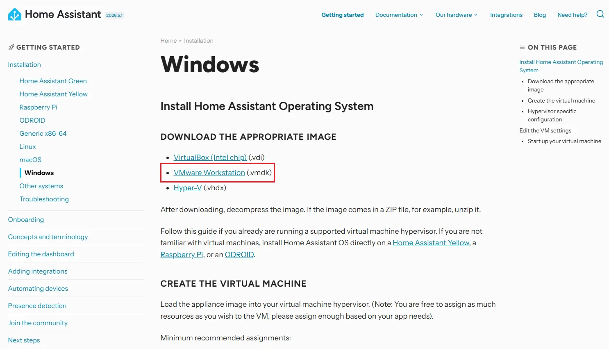

## 3. Create Home Assistant virtual machine

Note

the followingSettingsofSpecific nameAndposition will vary due to VMware VersionVaries, thisTutorialsbased on VMware Workstation Pro 17。

-

Launch VMware Workstation, select**Createnewofvirtual machine**。

[SVG diagram]

-

Select"Typical (recommended)"After, proceed to the next step.

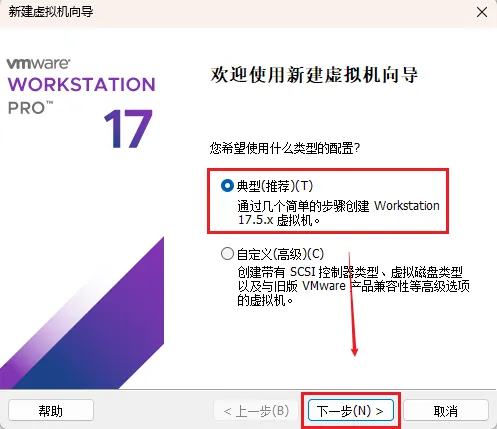

-

Select "Install operating system later", then select the operating system type as **Linux** → Version **Other Linux 5.x kernel 64-bit**。

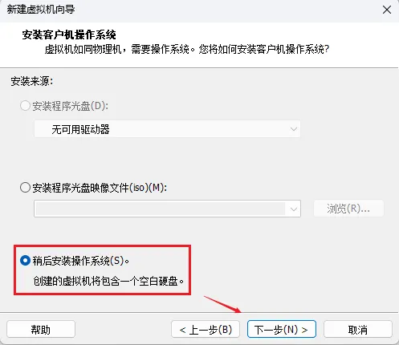

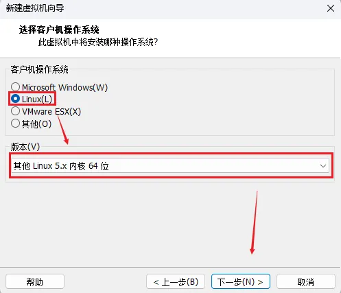

-

Set a name for the virtual machine, and specify a**Easy to find**storage path, for example `ha core logs`. You will need to return to this Table of Contents when replacing the disk image later.

Note

It is recommended that the name does not contain spaces or Chinese characters, to avoid file name inconsistency when replacing the vmdk later. This Tutorials example uses `ha core logs`。

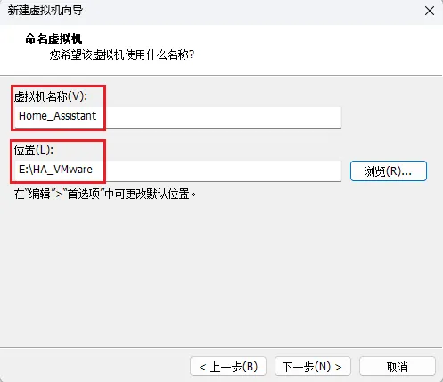

-

Set virtual disk size,**32 GB or more recommended**，andSelect"Virtual diskStorageIssingleFile"。

Note

hereCreateofemptyWhitethe virtual disk will be subsequentlyReplace with HAOS Mirror, so disk sizeWill nottakes effect directly, but maintains 32 GB isIsto let VMware Inreserve enough space at the virtual machine configuration level.

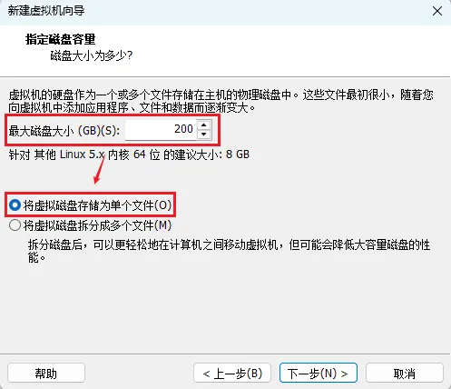

## 4. Custom hardware configuration

-

Createvirtual machineComplete, then click**Custom hardware**。

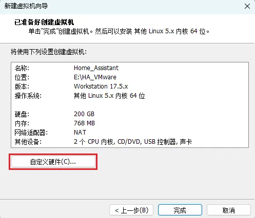

-

Adjust Hardware Resources:

**Memory**: At least 2 GB, 4 GB recommended. The more HA applications installed, the more memory is consumed.
- **Processor**: At least 2 cores. You can increase the number of cores appropriately to speed up firmware building.
- Delete the "New CD/DVD Drive" entry (the HAOS image method does not require optical disc boot).

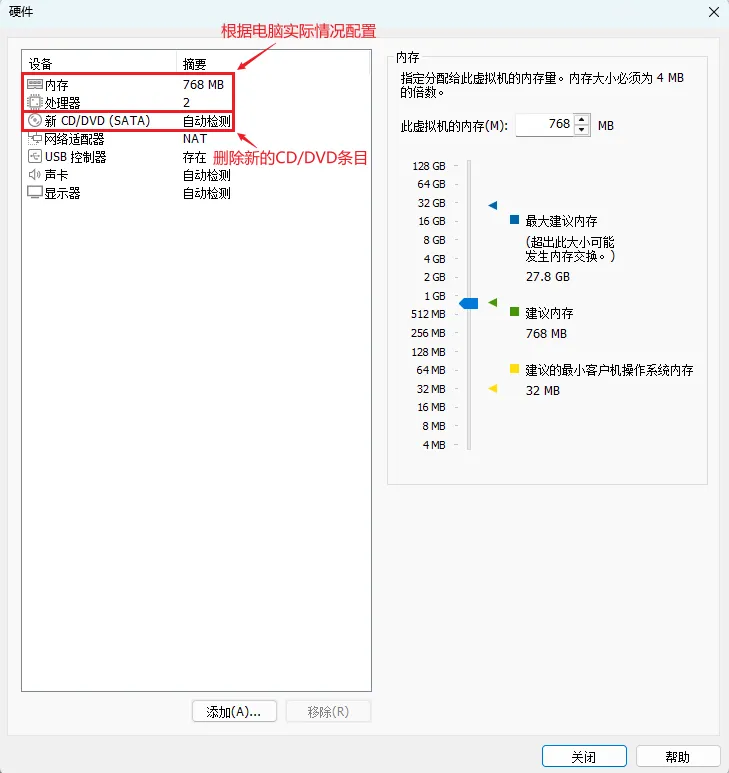

-

Network adapter configured as**Bridge mode**。

Difference between bridged mode and NAT mode

Both modes allow the virtual machine to access the network; the difference lies in the virtual machine's position in the network:

**Bridge mode**: The virtual machine is directly bridged to the physical LAN, on the same subnet as the host and ESP32. Accessible via `ha core logs` Access HA, and subsequent ESP32 device mDNS auto-discovery will also take effect directly.
- **NAT Mode**: The virtual machine is located in a subnet created by VMware. You need to access HA through the virtual machine's IP address (`ha core logs` Cannot be resolved in the host network).

This Tutorials uses bridged mode as an example, which directly corresponds to the operations in subsequent chapters. If you are already using NAT mode, adjust the access method accordingly.

In the network adapter options:

- Select"Bridge mode:directly connected to the physicalNetwork"
- **Uncheck**"Copy physical network connection state"
- Click "Configure Adapters", check only the physical network adapters actually in use:

When connecting to router with Ethernet cable, check**Yeswired Ethernet card**
- When only Wi-Fi, check**Wireless network card**
- Uncheck all virtual adapters (VMware Virtual Ethernet Adapter, etc.) and Bluetooth PAN devices

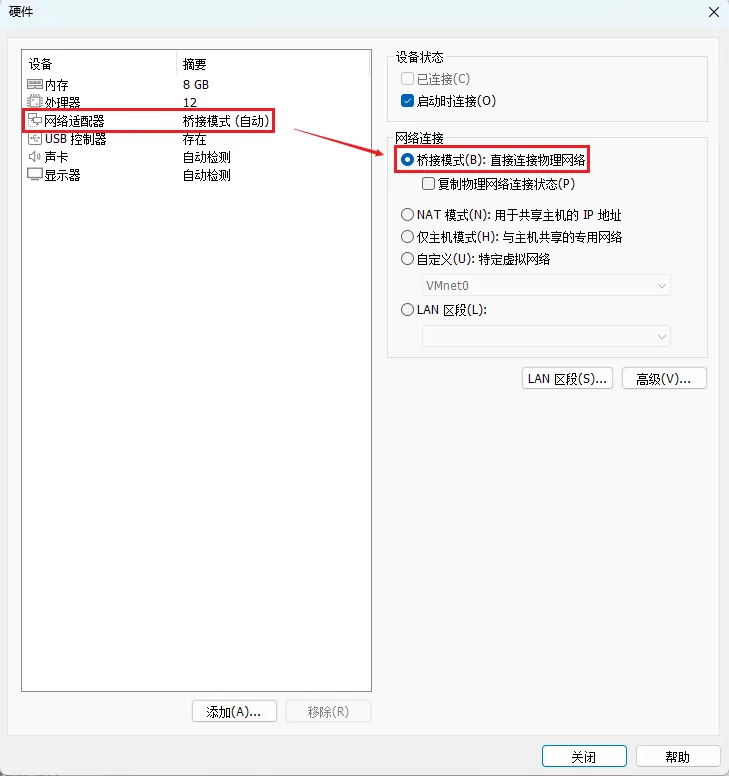

## 5. Replace with Home Assistant OS Disk Image

VMware automatically generates a blank virtual disk file when creating a virtual machine (`ha core logs`）。HAOS is acompleteofsystem image, which already contains the bootloaderAndFilesystem, therefore we need to take this emptyWhitediskFileDelete,Change tonumber (ordinal prefix) 2 Section downloadof HAOS Mirror, and enableUse EFI boot.

-

Right-click the newly created virtual machine in the VMware library → **Settings** → **Hard disk**, note the full path of the hard disk file (example:`ha core logs`）。

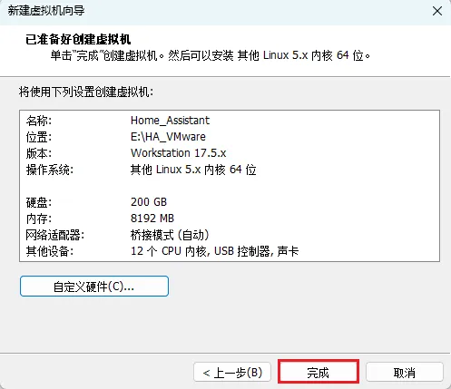

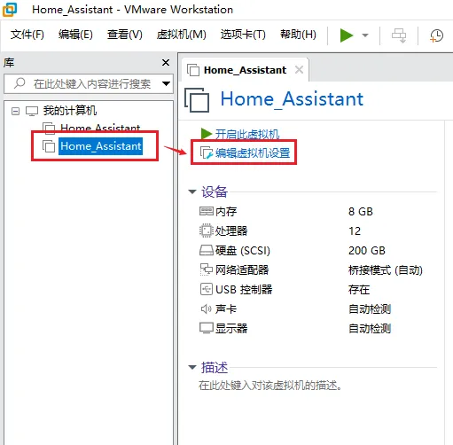

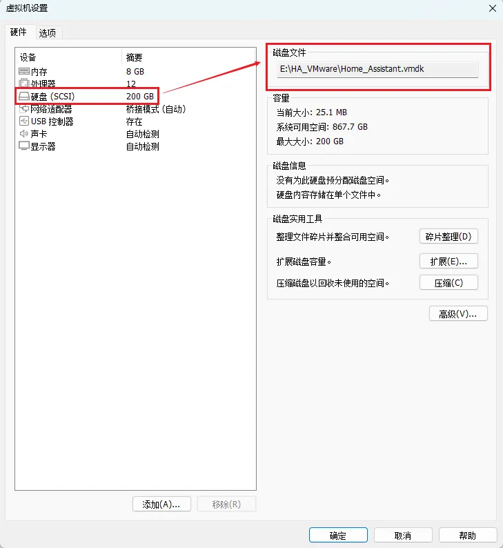

-

Close VMware (or at least close the virtual machine's settings window), and use File Explorer to open the Table of Contents from the previous step,**Delete the `ha core logs` File**(i.e., the blank disk automatically generated by VMware).

Note

The file name matches the name specified when creating the virtual machine. This Tutorials example is `ha core logs`, please refer to the actual file name under that Table of Contents.

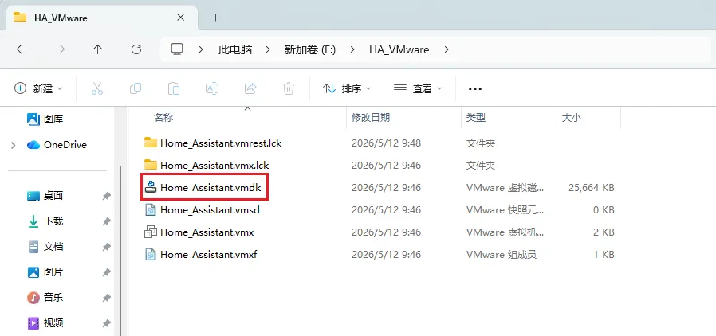

-

Take the one downloaded in section 2 `ha core logs` Copy the file to this Table of Contents.

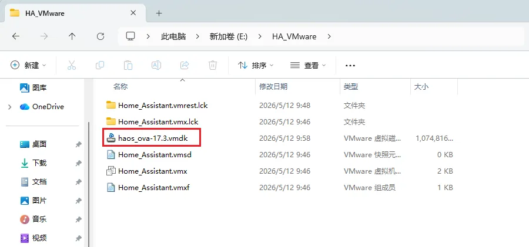

-

Will be copied inof `ha core logs` Rename to**The exact same name as the file deleted in the previous step**— In this Tutorials example, it is `ha core logs`。

Note

FileName mustAnd `ha core logs` exactly consistent with the name referenced in the configuration (including hyphens / underscores / case), otherwise the virtual machine will report that the disk file cannot be found at startup.

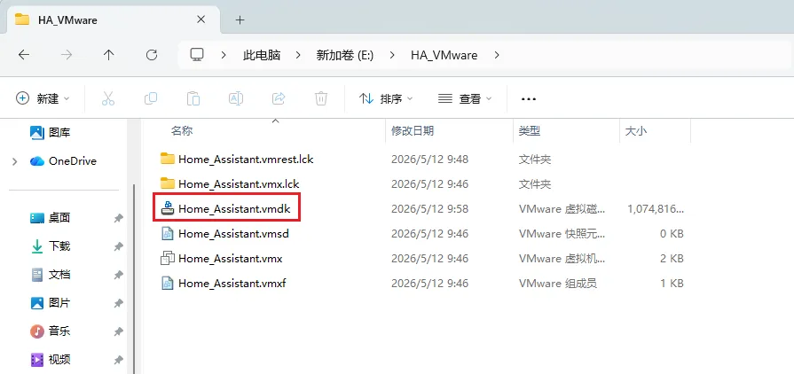

-

Find under the same Table of Contents `ha core logs` File，right-click to**Notepad**Open. Append a line at the end of the file:

```
http://homeassistant.local:8123
```

Why add EFI

The HAOS image is built for EFI boot, while VMware defaults to BIOS boot. If not switched to EFI, the virtual machine screen will freeze at a black screen or `ha core logs`，no/notYesFurther errorsTip。

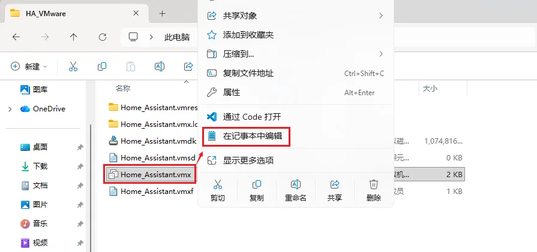

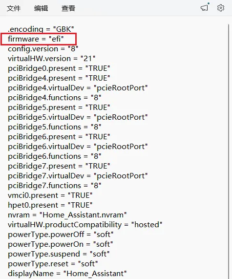

## 6. Start the virtual machine

-

Completeabove-mentionedSettingsafter,Startvirtual machine. If a popup appears"side-channel mitigation mechanism"Tip, clickDetermineThat's it.

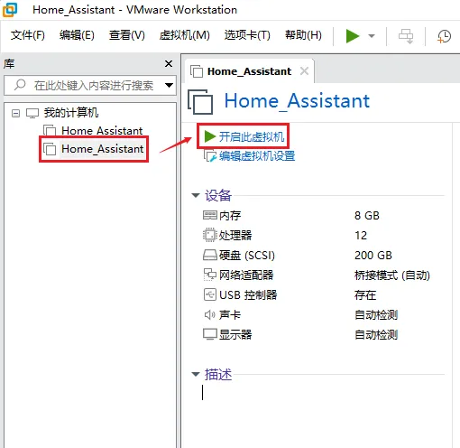

-

Observe the HAOS boot process. Under normal circumstances, the screen will display a series of boot logs, eventually stopping at `ha core logs` TipSymbol, at this point**No login required**。

-

InAndsame as virtual machineNetworkofComputerBrowser access:

```
http://homeassistant.local:8123
```

First access requires waiting

On first boot, HAOS pulls from the GitHub Container Registry (`ha core logs`）download Supervisor And HA Core image (about 700 MB）。InDomestic access may take time 5-15 Minutes or even longer (may take hours when network conditions are poor),Browserthe page will stayIn“positive/correctInPrepare Home Assistant”。this is normalPhenomenon，Please be patientetc.wait, do not restart the virtual machine.
Click the "Show Details (See details)" button to view the download progress.

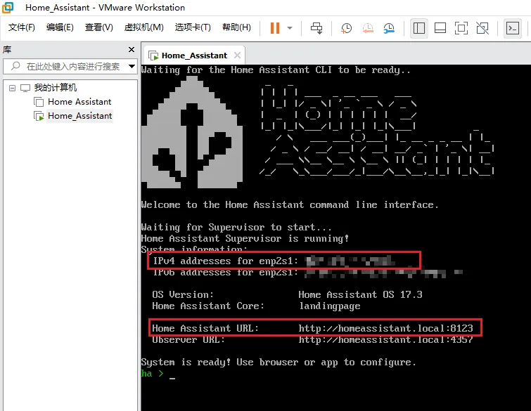

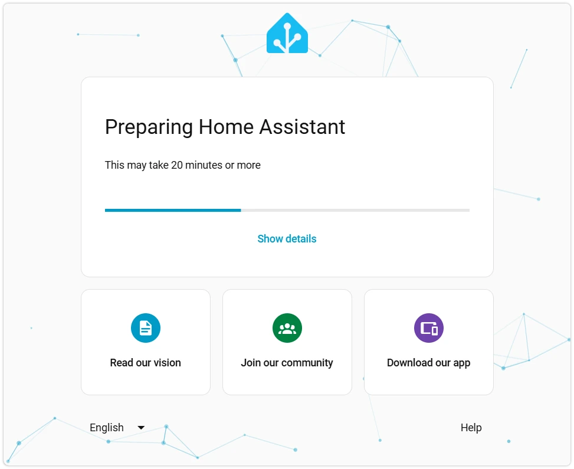

When homeassistant.local resolution fails

ifBrowserTip"NoneCannot access this website"，May be mDNS Incurrent Windows Orcircuit/routeByDoes not work in the device environment. CanVia IP addressAccess, obtain IP ofChoose one of two methods:

In the HAOS boot screen of the VMware virtual machine window,**IPv4 addresses** A line directly displays the virtual machine IP (in the format `ha core logs`, take the part before the slash).
- Invirtual machine windowPress Enter Enter the console, input `ha core logs`, view `ha core logs` Field.

Browser access `ha core logs` That's it.

-

Wait for initialization to complete; the browser will automatically redirect to the Home Assistant welcome page.

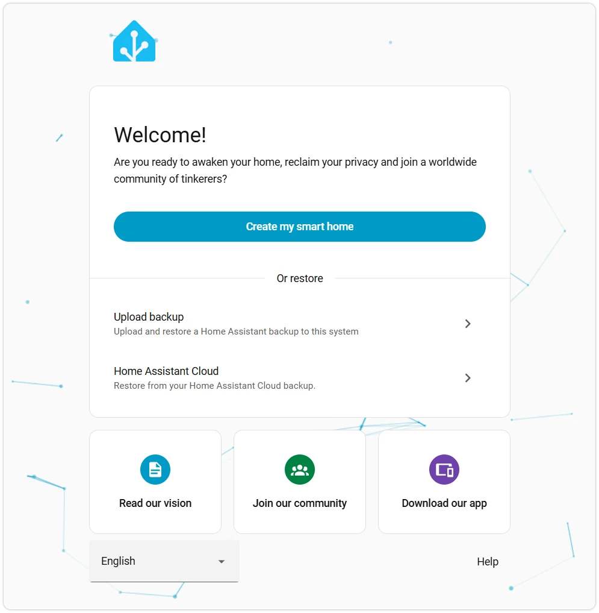

## 7. FAQ for this section

- **Black screen after VM starts / `ha core logs`**: EFI not enabled. Return to the last step of "Replace with HAOS disk image", check `ha core logs` InWhether written `ha core logs`。
- **Virtual machine reports "disk file not found"**: Check whether the vmdk file name matches the `ha core logs` In `ha core logs` Match the referenced name exactly (distinguish hyphens, underscores, and case).
- **Virtual machine has no IP under bridged network**: In VMware main menu → **Edit** → **virtualNetworkEditdevice/module** Confirm that VMnet0 is bridged to the correct physical network adapter in.
- **`ha core logs` Unable to parse**: See [6-Startvirtual machine](#start-vm) ofdeviceUsescheme.
- **"Preparing Home Assistant" stuck for more than 30 minutes**: may be `ha core logs` Image download failed. You can run in the HAOS console `ha core logs` Check the specific error, or try switching the network exit.

## 8. Reference Links

- [Home Assistant official installation documentation](https://www.home-assistant.io/installation/)
- [Home Assistant Windows installation page](https://www.home-assistant.io/installation/windows)
- [Home Assistant installation troubleshooting](https://www.home-assistant.io/installation/troubleshooting/)
- [HAOS GitHub Repository](https://github.com/home-assistant/operating-system)
- [VMware Workstation Pro Download (Broadcom Account Center)](https://support.broadcom.com/)

