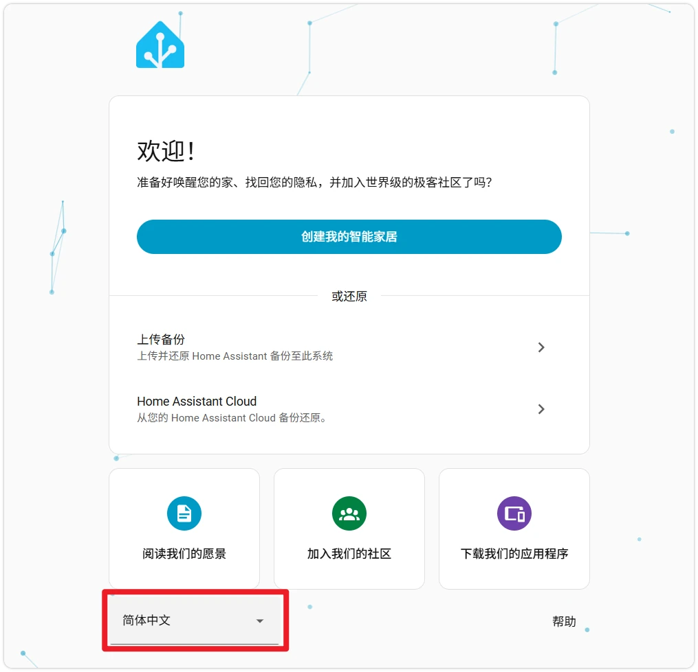
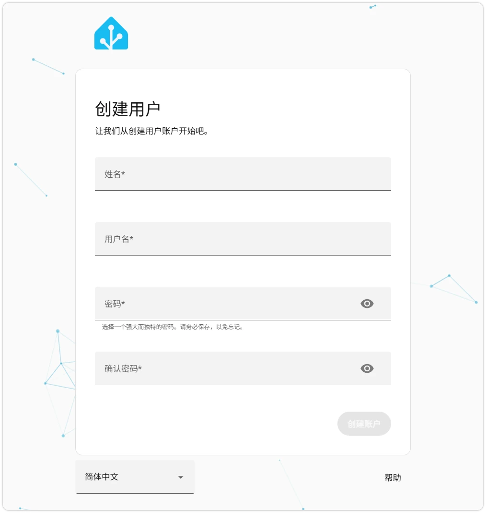
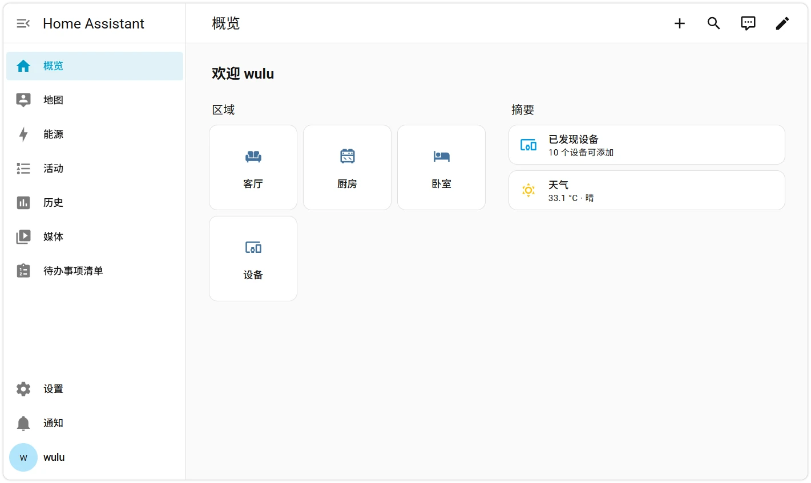
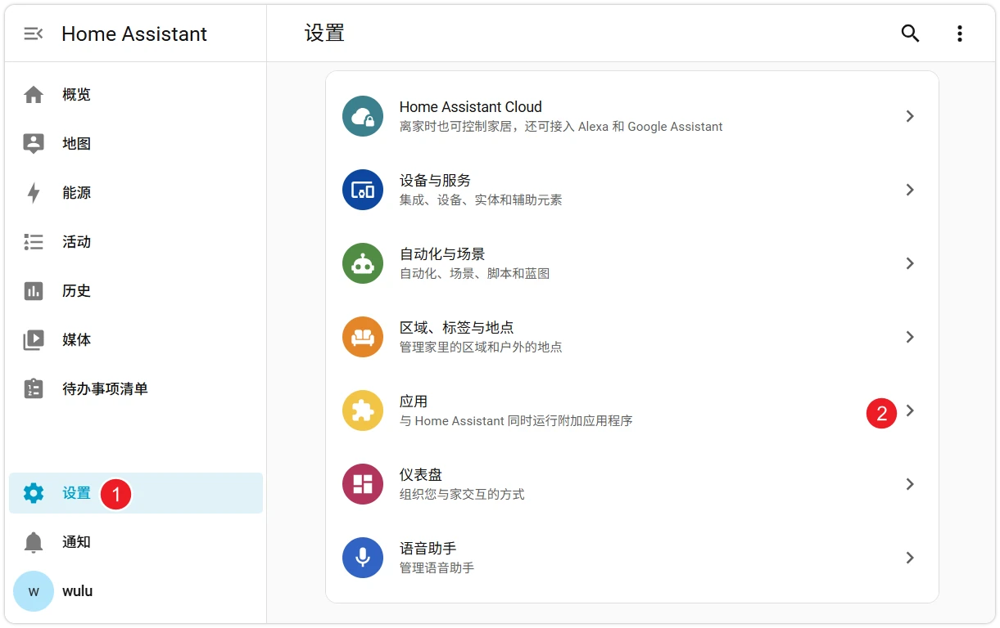
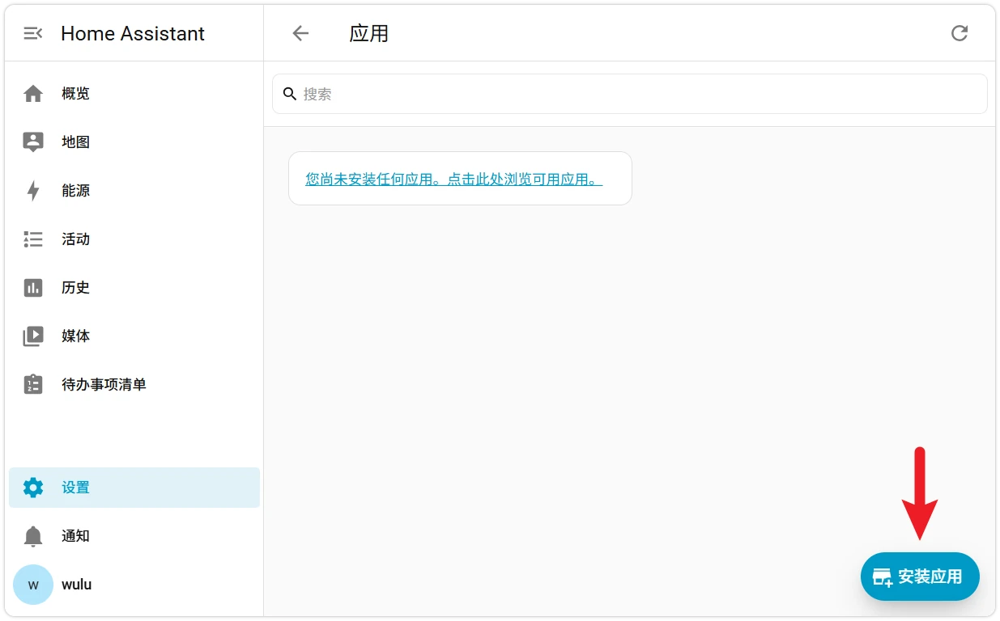
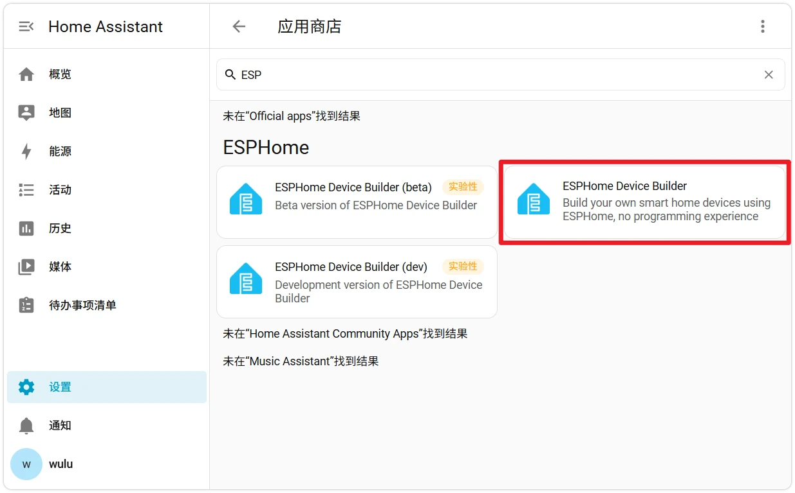
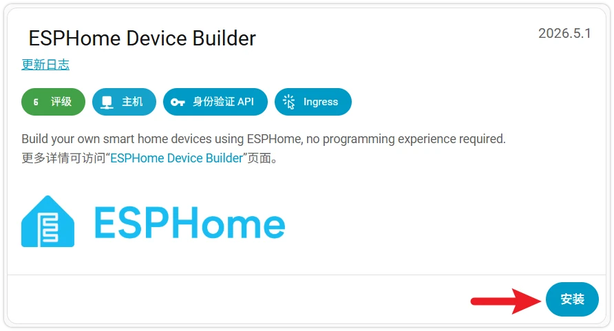
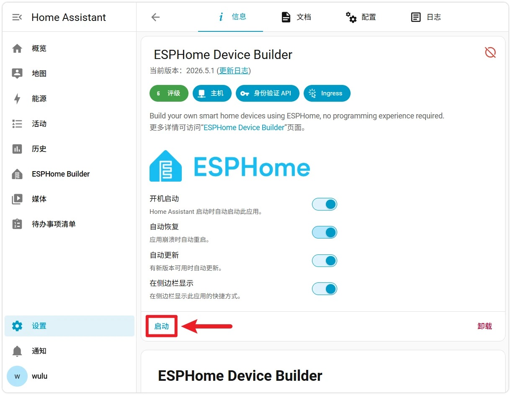
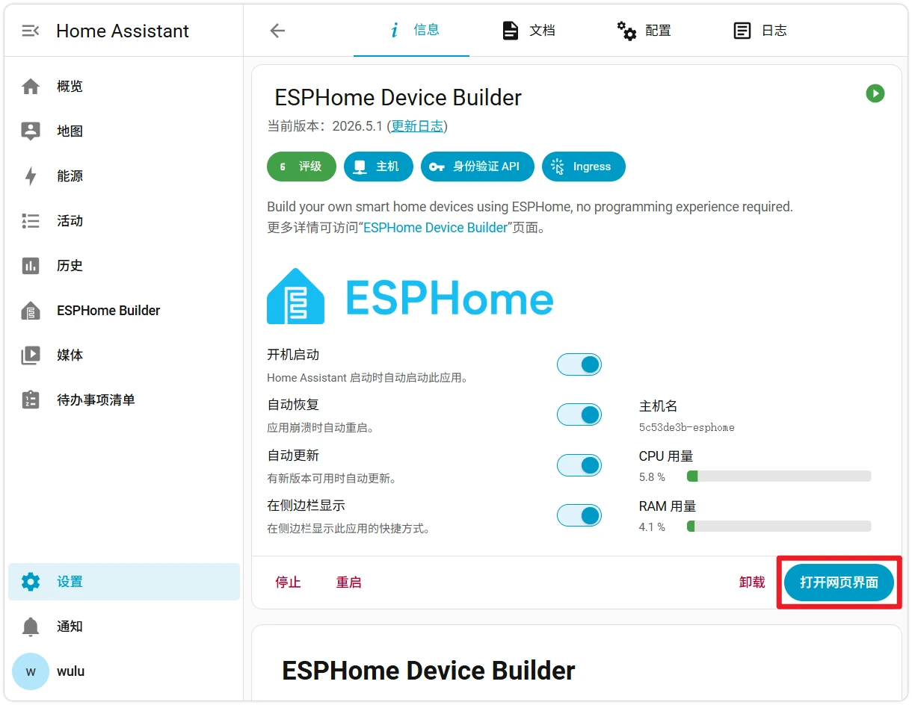
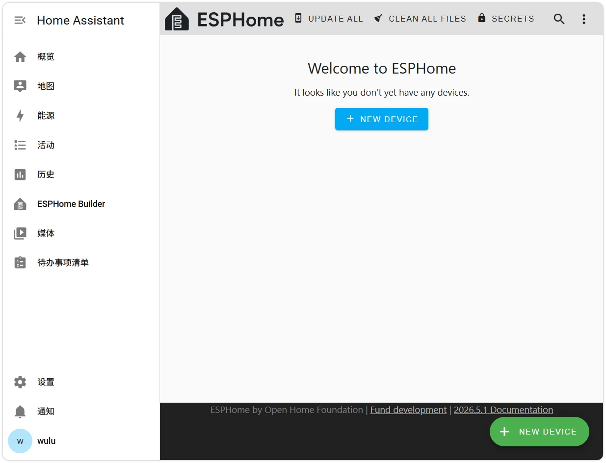

This page overview

# Section 2: Initialize Home Assistant

this section introduces how toSwitch Home Assistant interface language,Completefirst timeSettings（Createadmin account, locationetc.），andIn HA InInstall ESPHome Application。

## 1. Complete Home Assistant initial setup

-

InBottom right corner of the welcome pageClicklanguage dropdown menu,Select **Simplified Chinese** SwitchIntext interface.

-

Follow the guide to complete:

**CreateAdministrator account**: Set username and password.

-

**SettingspositionAndTimezone**: Affects location-based features such as sunrise/sunset, weather, and automation.

-

**Data sharing**: Whether to send anonymous usage statistics to the Home Assistant project. Optional, can be changed at any time in settings.

-

**Device discovery**: HA scans the local network for supported devices (routers, smart home brands, etc.). Click directly **Complete** Finish the initial setup; this Tutorials does not depend on this step.

-

After clicking "Finish", it will automatically redirect to the default dashboard, completing the initial Home Assistant setup.

## 2. Install ESPHome application

ESPHome runs as a Home Assistant application.

-

Click the bottom-left corner of the HA main interface **Settings** → **Application**。

-

Clickbottom-right cornerof **Install application** Button.

InSearch boxInput `Dashboard is running on port 6052`, find **ESPHome Device Builder**, clickenter.

-

Click **Install**。

First installation requires waiting

first timeInstallwillFrom GitHub Container Registry Pull ESPHome Download mirror and extract, domestic access may take time 10 More than minutes.InstallProgress canClick"Log"view.

-

InstallCompleteAfter, it is recommended to check the following firstOption，ThenClick **Start** Launch ESPHome application.

**Boot startup**: Automatically start the ESPHome application when HA starts.
- **Auto recovery**: Automatically restart when the application exits unexpectedly.
- **Insidebar displays**: Make ESPHome have a persistent entry in HA's left navigation.

-

After startup, click in the sidebar **ESPHome Builder**(or click on the application page **Openweb interface**), seeing the ESPHome welcome page indicates the application is running normally.

ESPHome is now ready. The next section will use the ESP32-S3-Zero as an example to create and flash your first device in ESPHome.

## 3. FAQ for this section

- **App store list is empty / cannot load**: It may be a communication failure between HA and GitHub. Check whether HA can access the external network, and switch the network egress if necessary.
- **ESPHome ApplicationInstallCardInA certain progress**: Possibly a ghcr.io image download failure. Go to the application page → **Log** InCheck the specific error, or try switching the network exit.
- **Cannot see ESPHome entry in the sidebar**: "Show in sidebar" is not checked. Return to the application page, check it, and refresh the browser.
- **Click"Open Web UI"NoneReactionOrreport error**: The app may not have started. On the app page, click **Start**, wait for it to appear in "Logs" `Dashboard is running on port 6052`。

## 4. Reference Links

- [Home Assistant Onboarding documentation](https://www.home-assistant.io/getting-started/onboarding/)
- [Home Assistant ApplicationDocument](https://www.home-assistant.io/apps/)
- [ESPHome Installguide (HA Application）](https://esphome.io/guides/getting_started_hassio.html)

