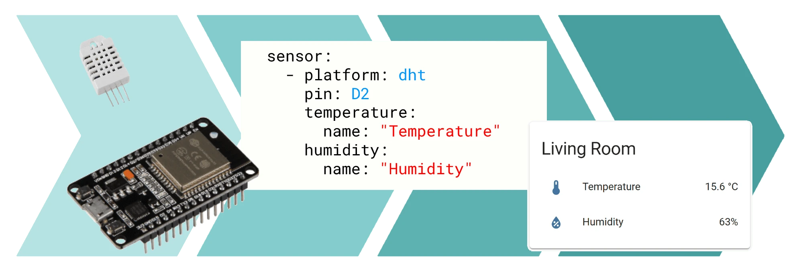

This page overview

# ESPHome Introductory Tutorials

Welcome to Waveshare ESPHome Introductory Tutorials.

thisTutorialsintroduce Home Assistant environmentofbuild/set upMethod，and howUse ESPHome will ESP32 Development BoardsAccess to smart home system. ThisTutorialsCovers the following content:

Important Note: About Hardware and Software Versions

**Hardware**:This Tutorials uses （) as an entry-level demo board, with （) as a complete reference example board. If you are using another ESP32 board, please adjust the board type and pin configuration accordingly.
**Software**:thisTutorialsbased on Home Assistant OS 17.3 And ESPHome Application 2026.5.1。Home Assistant and ESPHome All iterate frequently, menu positions, configuration syntaxAnd UI details may vary withVersionChange，operation to [Home Assistant Official documentation](https://www.home-assistant.io/docs/) And [ESPHome Official documentation](https://esphome.io/) Prevails.

## Home Assistant and ESPHome

[**Home Assistant**](https://www.home-assistant.io/)(hereafter referred to as HA) is an open-source home automation platform that serves as a hub to uniformly manage smart devices of various brands, providing dashboards, automation, voice assistants, and other features. HA itself does not directly control hardware but connects various devices through integrations. ESPHome is one such integration that enables HA to discover and control ESP32 devices running ESPHome firmware.

Image source: esphome.io

[**ESPHome**](https://esphome.io/) is a firmware generator that converts microcontrollers like ESP32 / ESP8266 into HA devices: developers declare what sensors, switches, lights, and other components are on the device using a YAML file, and ESPHome compiles the corresponding firmware and flashes it to the device. After flashing, the device is automatically discovered by HA, and the components declared in YAML appear as entities in the HA interface, without needing to write C/C++ code or additional HA integrations.

ESPHome operation consists of two parts:

- **Device side**: The compiled firmware runs on the ESP32 / ESP8266 and communicates with HA via Wi-Fi.
- **EditAndcompilation side**:responsible forCreate、Edit、compile YAML configuration。can be used asIs HA Applicationrunning (thisTutorialsuse/adoptUse），can alsoVia Docker OrRun independently from the command line.

---

### Table of Contents

- [Section 1: Install Home Assistant OS](../ESP32-ESPHome-Tutorials/HA-Installation.md)
- [Section 2: Initialize Home Assistant](../ESP32-ESPHome-Tutorials/HA-Setup-And-ESPHome-Addon.md)
- [Section 3: First ESPHome Device](../ESP32-ESPHome-Tutorials/First-Device.md)
- [Section 4: Extending ESPHome Configuration](../ESP32-ESPHome-Tutorials/Extending-Config.md)
- [Section 5: RLCD-4.2 Configuration Example](../ESP32-ESPHome-Tutorials/Example-RLCD-Voice.md)

