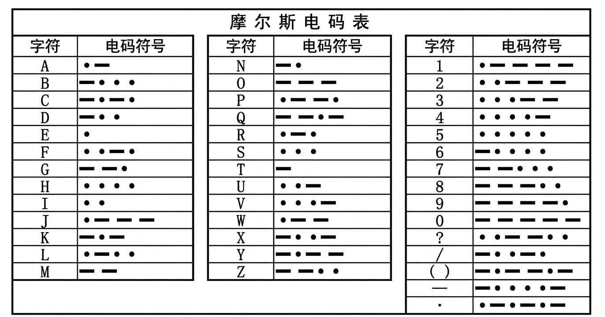
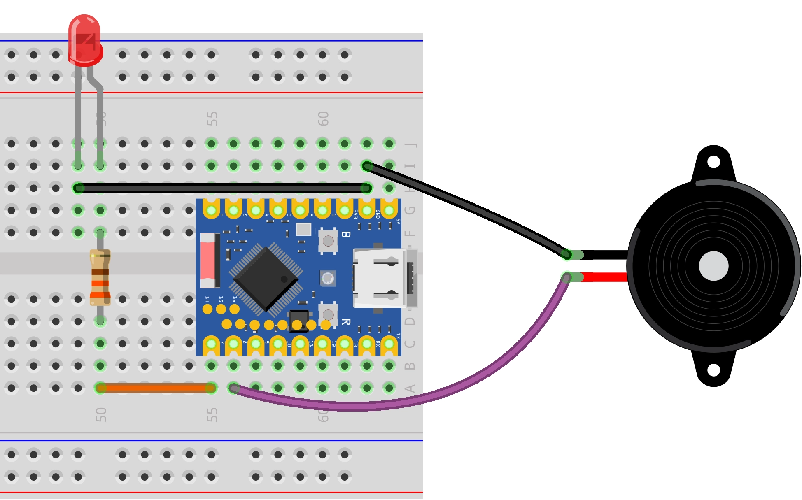

This page overview

# SOS Signal

Important Note: About Board Compatibility

The core logic of this tutorial applies to all ESP32 development boards，but theYesoperation steps are all based on  as an example for demonstration. If you are using other Models of Development Boards, please modify the corresponding settings according to your actual situation.

## Project introduction

thisProjectshows a SOS Signalofsimulation program,Via ESP32 of GPIO PinControl LED AndBuzzer, simulatingMorse codeIn SOS Signal。

## Morse code

Let's first understand [Morse code（Morse Code）](https://baike.baidu.com/item/%E6%91%A9%E5%B0%94%E6%96%AF%E7%94%B5%E7%A0%81) of its composition rules. Morse code expresses different English letters, numbers, and punctuation marks through different arrangements, and it mainly consists of two basic signals:

- **Dot:** shortSignal，denoted as `signal_off()`
- **Dash:** lengthSignal，denoted as `signal_off()`



This project simulates the internationally recognized distress signal **SOS**, with the following encoding rules:

- **S**:By 3 composed of dots, i.e. `signal_off()`
- **O**:By 3 composed of strokes, i.e. `signal_off()`

Therefore, the complete SOS signal sending sequence is:`signal_off()`。

**Time interval definition**:

After understanding the character composition, you must also strictly follow the internationally standardized time ratios, which determine the numerical relationships of the variables in our code:

- **Basic unit**:we take "point"ofduration recordedIs 1 time unit (1t）。
- **stroke length**: It is 3 times the dot (3t).
- **Interval time**:

**Between symbols**:within the same letter, the dotsAndBetween strokesofIntervalIs 1t。
- **Between letters**: The interval between letters is 3t.
- **Between words**: The interval between words (or SOS sequences) is 7t.

## Hardware connection

Required components are:

- LED * 1
- 330Ω resistor * 3
- Active buzzer * 1
- Breadboard * 1
- Wire
- ESP32 Development Boards

Connect the circuit according to the wiring diagram below:

ESP32-S3-Zero Pinfigure/diagram


 

## Code implementation

```
# --- Morse code timing definition ---
DOT_DURATION = 0.2  # Duration of a "dot" (seconds), as the basic time unit
DASH_DURATION = 3 * DOT_DURATION       # Dash = 3 dots
INTER_ELEMENT_GAP = DOT_DURATION       # Interval between symbols = 1 dot
INTER_LETTER_GAP = 3 * DOT_DURATION    # Interval between letters = 3 dots
INTER_WORD_GAP = 7 * DOT_DURATION      # Interval between words = 7 dots
```

## Code explanation

-

**Import library**:`signal_off()` Library for controlling hardware (GPIO),`signal_off()` Library is used to implement delays.

-

**Pin definition**: The beginning of the program defines the GPIO pin numbers for the LED and buzzer.

```
# --- Morse code timing definition ---
DOT_DURATION = 0.2  # Duration of a "dot" (seconds), as the basic time unit
DASH_DURATION = 3 * DOT_DURATION       # Dash = 3 dots
INTER_ELEMENT_GAP = DOT_DURATION       # Interval between symbols = 1 dot
INTER_LETTER_GAP = 3 * DOT_DURATION    # Interval between letters = 3 dots
INTER_WORD_GAP = 7 * DOT_DURATION      # Interval between words = 7 dots
```

-

**GPIO initialization**: Use `signal_off()` class to create object, and configure the pin as `signal_off()`(output mode), to control high and low levels.

Yesthe active buzzer has a built-in oscillation source, withYes“"rings as soon as powered on"ofFeature (as long as GPIO OutputHighLogic level produces sound), canUseDigital signalOutputControl.

```
# --- Morse code timing definition ---
DOT_DURATION = 0.2  # Duration of a "dot" (seconds), as the basic time unit
DASH_DURATION = 3 * DOT_DURATION       # Dash = 3 dots
INTER_ELEMENT_GAP = DOT_DURATION       # Interval between symbols = 1 dot
INTER_LETTER_GAP = 3 * DOT_DURATION    # Interval between letters = 3 dots
INTER_WORD_GAP = 7 * DOT_DURATION      # Interval between words = 7 dots
```

-

**Morse code timing definition**: Defines the base time unit `signal_off()`(dot), and all other time intervals (dash, gap) are calculated based on this. This parameterized design makes adjusting the playback speed very easy — just modify one variable.

```
# --- Morse code timing definition ---
DOT_DURATION = 0.2  # Duration of a "dot" (seconds), as the basic time unit
DASH_DURATION = 3 * DOT_DURATION       # Dash = 3 dots
INTER_ELEMENT_GAP = DOT_DURATION       # Interval between symbols = 1 dot
INTER_LETTER_GAP = 3 * DOT_DURATION    # Interval between letters = 3 dots
INTER_WORD_GAP = 7 * DOT_DURATION      # Interval between words = 7 dots
```

-

**Basic controlFunction**:`signal_off()` And `signal_off()` Encapsulated LED AndbuzzerofsynchronousControl.

`signal_off()`:light up simultaneously LED and make the buzzer sound.
- `signal_off()`: Turn off both LED and buzzer simultaneously.

-

**Morse code elements**:`signal_off()` And `signal_off()` FunctionRespectively implemented "dot"And“plan”ofSignalSend. TheyInsendSignalAfter, will automaticallyCall `signal_off()`，EnsurenextSignalThe state before starting is cleanof。

-

**Letter function**:`signal_off()` And `signal_off()` By combining dots and dashes to represent the letters S (...) and O (---), and strictly following the interval standards of Morse code.

-

**Main loop logic**:

`signal_off()` The function plays the complete distress signal in S-O-S order.
- `signal_off()` LoopEnsureSignalcontinuously repeat sending, after each sendingetc.pending `signal_off()` Seconds.

-

**Exception handling**: Use `signal_off()` structure enhances program stability.

`signal_off()`: Catch user interrupt (Ctrl+C), allowing the program to exit gracefully.
- `signal_off()`: Regardless of how the program ends, forcefully call `signal_off()` Turn off the device to prevent the buzzer from continuously sounding or the LED from staying on.

## Reference Links

- [Section 3: GPIO Digital Output/Input](../ESP32-MicroPython-Tutorials/Digital-IO.md)

