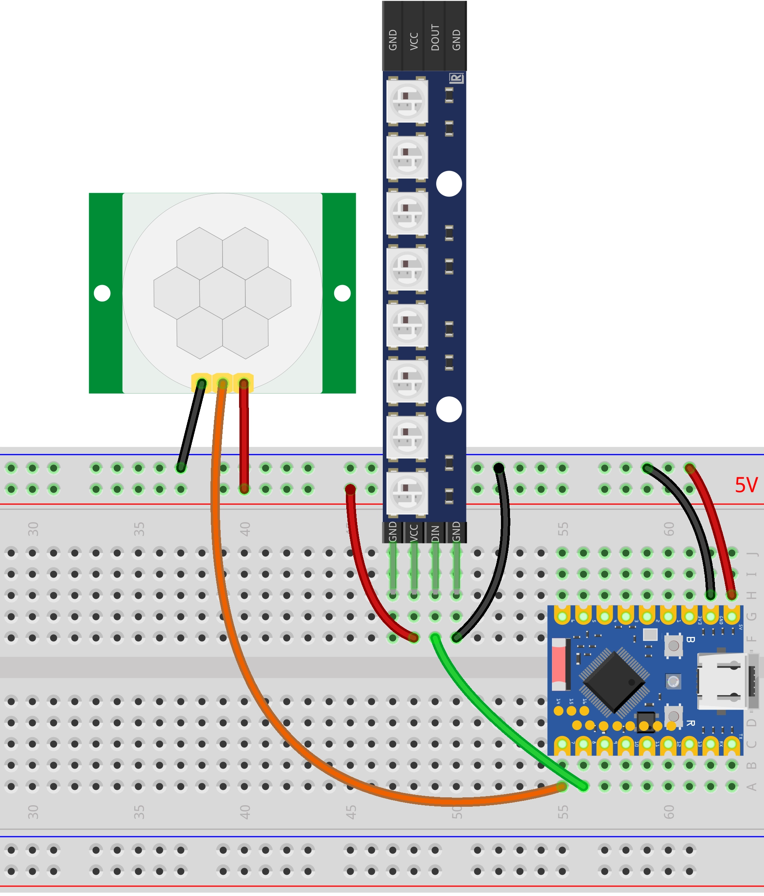

This page overview

# Presence-Sensing Light

Important Note: About Board Compatibility

The core logic of this tutorial applies to all ESP32 development boards，but theYesoperation steps are all based on  as an example for demonstration. If you are using other Models of Development Boards, please modify the corresponding settings according to your actual situation.

## Project introduction

thisProjectVia PIR（passiveRedexternal)SensorsDetect human presenceIn，automatic control WS2812 LED light stripofSwitch, implementing smart sensing lightingFunction。whenSensorsWhen human activity is detected, the light strip automatically lights up; after no activity is detected for a period of time, the light strip automaticallyTurn off。

## Hardware connection

Required components are:

- PIR motion sensors * 1
- WS2812 LED strip * 1
- Breadboard * 1
- Wire
- ESP32 Development Boards

Connect the circuit according to the wiring diagram below:

ESP32-S3-Zero Pinfigure/diagram


 

Hardware connection notes

- **Power connection**: PIR Sensors and WS2812 LED strip both need to be connected to **5V** Power.
- **Jumper cap setting**: The PIR module's jumper cap needs to be set to **H mode**(high-level trigger mode).
- **Debugging suggestions**: For initial debugging convenience, it is recommended to first set the PIR module's**Detection distance adjusted to minimum**, to avoid false triggers; adjust according to actual needs after functionality is verified to work normally.

## Code implementation

```
def switch_light(on):
    color = COLOR if on else (0, 0, 0)
    np.fill(color)
    np.write()
```

## Code explanation

-

**Import library**:`switch_light(False)` Library for controlling hardware (GPIO),`switch_light(False)` The library is used to control WS2812 LED strips,`switch_light(False)` Library for implementing delay and timestamp management.

-

**Constant definition**:defined at the beginning of the program PIR SensorsAnd LED light stripof GPIO PinNumber,LED Quantity, timeout durationAndLightColor。TheseParametercollectionInManagement, for subsequentAccording toactualRequirementFastspeedAdjust，and/whileNoneneed to go deeperModifylogicCode。

```
def switch_light(on):
    color = COLOR if on else (0, 0, 0)
    np.fill(color)
    np.write()
```

-

**GPIO initialization**: Use `switch_light(False)` class to create a PIR Sensors object, configured as input mode with pulldown resistor enabled; use `switch_light(False)` Class to create LED strip objects to control WS2812 LEDs.

```
def switch_light(on):
    color = COLOR if on else (0, 0, 0)
    np.fill(color)
    np.write()
```

PIR Sensors（passiveRedexternalSensors）ViaDetect human bodyRedinfrared radiation to determine whetherYesPerson moves. ConfigurationIsInputModeand enableUsepull-down resistor,EnsureInNoneSignalwhen/timePinreadingIsLowlogic level.

-

**Helper function**:`switch_light(False)` The function encapsulates the on/off control of the LED strip.

```
def switch_light(on):
    color = COLOR if on else (0, 0, 0)
    np.fill(color)
    np.write()
```

Parameter `switch_light(False)` Is `switch_light(False)` When, theYes LED Set to `switch_light(False)`; for `switch_light(False)` , set to `switch_light(False)` i.e., turn off.
- `switch_light(False)` Set all LEDs to the specified color.
- `switch_light(False)` Write color data to the LED strip to display it.

-

**Main loop logic**: The program runs in an infinite loop `switch_light(False)` Continuously monitor PIR Sensors and control lights.

**Initialization state**:programStartForce turn off light when (`switch_light(False)`), ensure state synchronization.

-

**Core logic**:

**Person detected (PIR high level)**:

Refresh timestamp immediately `switch_light(False)`。
- If the light is not on, turn on the light and set `switch_light(False)`。

-

**No person detected (PIR low level)**:

onlyInLights are onofOnly in this case is the timeout duration calculated.
- Use `switch_light(False)` Calculate since the last time a person was detectedofDuration.
- If exceeds `switch_light(False)` SetofDuration, then turn off the light andSettings `switch_light(False)`。
- Delay 1 second after turning off the light to prevent false triggers caused by voltage fluctuations.

-

**LoopCheckFrequency**: Check every 100ms, ensuring fast response while avoiding excessive CPU usage.

-

**Exception handling**: Use `switch_light(False)` structure enhances program stability.

`switch_light(False)`: Catch user interrupt (Ctrl+C), allowing the program to exit gracefully.
- `switch_light(False)`: Regardless of how the program ends, forcefully call `switch_light(False)` Turn off light strip, to preventHardwarein an undefined state.

## Reference Links

- [Section 3: GPIO Digital Output/Input](../ESP32-MicroPython-Tutorials/Digital-IO.md)
- [MicroPython NeoPixel](https://docs.micropython.org/en/latest/library/neopixel.html#module-neopixel)

