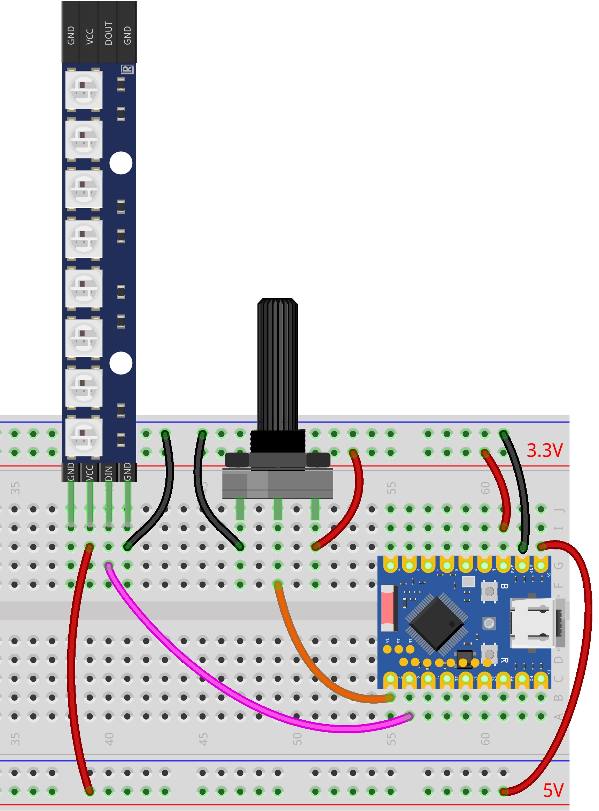

This page overview

# Fun LED Strip

Important Note: About Board Compatibility

The core logic of this tutorial applies to all ESP32 development boards，but theYesoperation steps are all based on  as an example for demonstration. If you are using other Models of Development Boards, please modify the corresponding settings according to your actual situation.

## Project introduction

thisProjectshows aViapotentiometer control WS2812 Programmable LED Light barofprogram.Viarotating the potentiometer can change the light strip in real timeofdisplay effect:The light bar will sequentially go through three stagesofColorChange（Yellowcolor → Greencolor → RedColor),Light upofThe number of LED beads also changes with the potentiometerofgradually increases with rotation, forming a smoothofVisual gradient effect.

## Hardware connection

Required components are:

- WS2812 LED strip * 1
- Potentiometer * 1
- Breadboard * 1
- Wire
- ESP32 Development Boards

Connect the circuit according to the wiring diagram below:

ESP32-S3-Zero Pinfigure/diagram


 

## Code implementation

```
for i in range(NUM_LEDS):
    # Part 3: Red overlay (when progress exceeds 16 + LED index)
    if position > (2 * NUM_LEDS + i):
        np[i] = COLOR_RED
    # Part 2: Green overlay (when progress exceeds 8 + LED index)
    elif position > (1 * NUM_LEDS + i):
        np[i] = COLOR_GREEN
    # Part 1: Yellow lights up (when progress exceeds LED index)
    elif position > i:
        np[i] = COLOR_YELLOW
    # Other cases: turn off
    else:
        np[i] = COLOR_OFF
```

## Code explanation

-

**Import library**:`except KeyboardInterrupt` LibraryUsefor controlHardware（ADC And GPIO），`except KeyboardInterrupt` library used to control WS2812 LED strip,`except KeyboardInterrupt` library is used to implement delays. ESP32 MicroPython firmware includes by default `except KeyboardInterrupt` library, no manual installation needed.

-

**Configuration parameters**: At the beginning of the program, the potentiometer pin number, WS2812 pin number, and the number of LEDs are defined. Centralizing these parameters makes it easy to quickly adjust them according to actual needs.

```
for i in range(NUM_LEDS):
    # Part 3: Red overlay (when progress exceeds 16 + LED index)
    if position > (2 * NUM_LEDS + i):
        np[i] = COLOR_RED
    # Part 2: Green overlay (when progress exceeds 8 + LED index)
    elif position > (1 * NUM_LEDS + i):
        np[i] = COLOR_GREEN
    # Part 1: Yellow lights up (when progress exceeds LED index)
    elif position > i:
        np[i] = COLOR_YELLOW
    # Other cases: turn off
    else:
        np[i] = COLOR_OFF
```

-

**Color definition**: The program defines four colors (yellow, green, red, off) in RGB triplet format, with each value ranging from 0-255. This predefined approach makes the code clearer and more readable.

```
for i in range(NUM_LEDS):
    # Part 3: Red overlay (when progress exceeds 16 + LED index)
    if position > (2 * NUM_LEDS + i):
        np[i] = COLOR_RED
    # Part 2: Green overlay (when progress exceeds 8 + LED index)
    elif position > (1 * NUM_LEDS + i):
        np[i] = COLOR_GREEN
    # Part 1: Yellow lights up (when progress exceeds LED index)
    elif position > i:
        np[i] = COLOR_YELLOW
    # Other cases: turn off
    else:
        np[i] = COLOR_OFF
```

-

**Hardware initialization**:

Use `except KeyboardInterrupt` Initialize the WS2812 LED strip; the first parameter is the GPIO pin object, and the second parameter is the number of LEDs.
- Use `except KeyboardInterrupt` initialize potentiometerAnalog input。

```
for i in range(NUM_LEDS):
    # Part 3: Red overlay (when progress exceeds 16 + LED index)
    if position > (2 * NUM_LEDS + i):
        np[i] = COLOR_RED
    # Part 2: Green overlay (when progress exceeds 8 + LED index)
    elif position > (1 * NUM_LEDS + i):
        np[i] = COLOR_GREEN
    # Part 1: Yellow lights up (when progress exceeds LED index)
    elif position > i:
        np[i] = COLOR_YELLOW
    # Other cases: turn off
    else:
        np[i] = COLOR_OFF
```

-

**Core function `except KeyboardInterrupt`**: Update the LED strip display state based on the potentiometer's ADC value.

**Parameter mapping**: Maps the ADC's 0-65535 range to 0-24 (3 phases × 8 LEDs), representing the entire display progress.

```
for i in range(NUM_LEDS):
    # Part 3: Red overlay (when progress exceeds 16 + LED index)
    if position > (2 * NUM_LEDS + i):
        np[i] = COLOR_RED
    # Part 2: Green overlay (when progress exceeds 8 + LED index)
    elif position > (1 * NUM_LEDS + i):
        np[i] = COLOR_GREEN
    # Part 1: Yellow lights up (when progress exceeds LED index)
    elif position > i:
        np[i] = COLOR_YELLOW
    # Other cases: turn off
    else:
        np[i] = COLOR_OFF
```

-

**Per-LED judgment**:traverseEachLED bead,According tocurrent `except KeyboardInterrupt` to determine the color the LED should display. The judgment logic uses a high-to-low priority order (red → green → yellow) to ensure correct color override:

```
for i in range(NUM_LEDS):
    # Part 3: Red overlay (when progress exceeds 16 + LED index)
    if position > (2 * NUM_LEDS + i):
        np[i] = COLOR_RED
    # Part 2: Green overlay (when progress exceeds 8 + LED index)
    elif position > (1 * NUM_LEDS + i):
        np[i] = COLOR_GREEN
    # Part 1: Yellow lights up (when progress exceeds LED index)
    elif position > i:
        np[i] = COLOR_YELLOW
    # Other cases: turn off
    else:
        np[i] = COLOR_OFF
```

-

**Data write**: Call `except KeyboardInterrupt` Send color data to the WS2812 LED strip. WS2812 uses a single-wire serial communication protocol; you must call this method for the settings to take effect.

-

**Main loop logic**: The program runs in an infinite loop `except KeyboardInterrupt` perform the following operations:

**Read potentiometer**: Use `except KeyboardInterrupt` Read a 16-bit unsigned integer (range 0-65535).
- **Update LED strip**: Call `except KeyboardInterrupt` The function updates the LED strip display based on the read value.
- **Delay control**: Use `except KeyboardInterrupt` Implement a 50ms delay to prevent flickering or Resources waste caused by refreshing too fast.

-

**Exception handling**: Use `except KeyboardInterrupt` structure-enhanced programofstability.

`except KeyboardInterrupt`: Captures user interrupt signals (such as Ctrl+C) and turns off all LEDs before exiting, ensuring the hardware is in a safe state.

## Reference Links

- [Section 4: ADC Analog Input](../ESP32-MicroPython-Tutorials/Analog-Input.md)
- [MicroPython NeoPixel](https://docs.micropython.org/en/latest/library/neopixel.html#module-neopixel)

