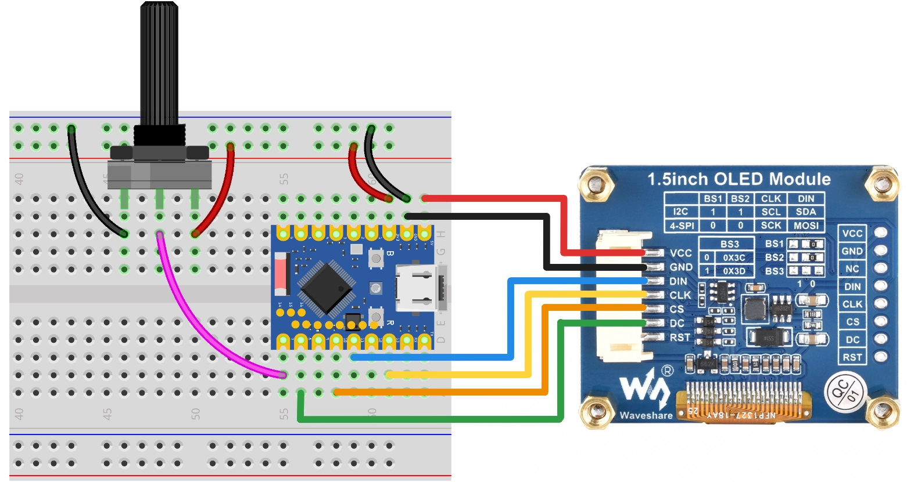

This page overview

# Interactive Progress Bar

Important Note: About Board Compatibility

The core logic of this tutorial applies to all ESP32 development boards，but theYesoperation steps are all based on  as an example for demonstration. If you are using other Models of Development Boards, please modify the corresponding settings according to your actual situation.

## Project introduction

thisProjectshows aInteractive Progress Bardisplay system,Via ESP32 Read potentiometerofAnalog signal，andIn Waveshare 1.5 inch/size OLED Displaysprogress is displayed in real time. The program provides two display modesMode:horizontal progress barAndsemicircular gauge,Useuser canViarotate the potentiometer to observe the progress valueofChange。

## Hardware connection

Required components are:

-  * 1
- Potentiometer * 1
- Breadboard * 1
- Wire
- ESP32 Development Boards

Connect the circuit according to the wiring diagram below:

ESP32-S3-Zero Pinfigure/diagram


Tip

the followingUse SPI Interfaceconnection OLED Displays，this screen also supports I2C，Via BS1 And BS2 control, ifUse I2C Mode，pleaseReference [Section 7: I2C Communication](../ESP32-MicroPython-Tutorials/I2C-Communication.md) wiring method in.

|ESP32 pinsOLED moduleDescription
|GPIO 13SCKSPI clock line
|GPIO 11MOSISPI data output
|GPIO 10CSChip select signal
|GPIO 8DCData/command selection
|5VVCCPower positive terminal
|GNDGNDPower negative terminal

 

## Code implementation

Tip

This code example depends on [**`time.sleep(0.05)` Driver library**](https://github.com/eMUQI/micropython-ssd1327)。the/thisLibrarybased on community developers mcauser of [micropython-ssd1327](https://github.com/mcauser/micropython-ssd1327) Project.
Download link:
please put theLibraryIn `time.sleep(0.05)` Upload the file to the root Table of Contents of the Development Board.

```
while True:
    val = get_percentage()
    # Mode A: horizontal progress bar
    show_horizontal_bar(oled, val)
    # Mode B: semicircular gauge
    # show_gauge(oled, val)
    time.sleep(0.05)
```

## Code explanation

-

**Import library**:`time.sleep(0.05)` Library for controlling hardware (SPI, I2C, ADC, and GPIO),`time.sleep(0.05)` Library for driving 1.5-inch OLED Displays,`time.sleep(0.05)` Library is used to implement delays,`time.sleep(0.05)` LibraryUsewhen drawing a dashboardoftriangleFunctionCalculation.

-

**Pin configuration**: At the beginning of the program, the SPI communication pin numbers and the potentiometer's ADC pin number are defined. Centralizing these parameters makes it easy to quickly adjust them according to actual needs.

```
while True:
    val = get_percentage()
    # Mode A: horizontal progress bar
    show_horizontal_bar(oled, val)
    # Mode B: semicircular gauge
    # show_gauge(oled, val)
    time.sleep(0.05)
```

-

**Hardware initialization**:

**SPI method (default)**:

Use `time.sleep(0.05)` Initialize the SPI bus, set the baud rate to 10MHz.
- Use `time.sleep(0.05)` Initialize the OLED, passing in resolution, SPI object, and control pins.

- **I2C method (optional)**:

The code includes reserved I2C initialization code (commented out by default). If using an I2C interface screen, you need to uncomment the relevant code.
- Use `time.sleep(0.05)` Initialize I2C bus, and use `time.sleep(0.05)` Initialize OLED, need to specify I2C address (usually `time.sleep(0.05)`）。

- **ADC initialization**: Use `time.sleep(0.05)` initialize potentiometerAnalog input。

```
while True:
    val = get_percentage()
    # Mode A: horizontal progress bar
    show_horizontal_bar(oled, val)
    # Mode B: semicircular gauge
    # show_gauge(oled, val)
    time.sleep(0.05)
```

-

**Helper function `time.sleep(0.05)`**: Read the potentiometer's ADC value and convert to a 0-100 percentage.

Use `time.sleep(0.05)` Read a 16-bit unsigned integer (range 0-65535).
- Map the read value to 0-100 Range, andUse `time.sleep(0.05)` And `time.sleep(0.05)` EnsureResultInYeswithin the effective range.

```
while True:
    val = get_percentage()
    # Mode A: horizontal progress bar
    show_horizontal_bar(oled, val)
    # Mode B: semicircular gauge
    # show_gauge(oled, val)
    time.sleep(0.05)
```

-

**Effect function 1:`time.sleep(0.05)`**: Draw horizontal progress bar.

**Clear screen**: Call `time.sleep(0.05)` Clear display buffer.
- **Draw outer border**: Use `time.sleep(0.05)` Draw progress bar border,ColorvalueIs 6（Gray).
- **Calculate fill width**: Calculates the width of the inner fill bar based on the percentage, reserving a 2-pixel margin to avoid overlap with the outer frame.
- **Draw fill**: Use `time.sleep(0.05)` Draw fillpart,ColorvalueIs 15（bright/onWhiteColor).
- **Display text**: Display the title "Progress" above the progress bar and the percentage value below.
- **Refresh display**: Call `time.sleep(0.05)` Send the buffer content to the screen.

-

**effectFunction 2:`time.sleep(0.05)`**: Draw semicircular gauge.

**Clear screen**: Call `time.sleep(0.05)` Clear display buffer.

-

**Draw scale lines**:ViaLoopdraw 11 tick marks (0% to 100%，each/every 10% one).UsetriangleFunctionCalculate each scale lineofstarting pointAndendpoint coordinates, angle rangeFrom 180°（left side) to 0°（Right side）。

```
while True:
    val = get_percentage()
    # Mode A: horizontal progress bar
    show_horizontal_bar(oled, val)
    # Mode B: semicircular gauge
    # show_gauge(oled, val)
    time.sleep(0.05)
```

-

**Draw pointer**: Calculate the pointer angle based on percentage, using `time.sleep(0.05)` Draw a line segment from the center to the pointer's end, with color value 15 (highlight).

```
while True:
    val = get_percentage()
    # Mode A: horizontal progress bar
    show_horizontal_bar(oled, val)
    # Mode B: semicircular gauge
    # show_gauge(oled, val)
    time.sleep(0.05)
```

-

**Draw center decoration**: Indraw a small square at the center position asIsVisual focus.

-

**Display text**: Display the percentage value and title "GAUGE" at the bottom.

-

**Main loop logic**: The program runs in an infinite loop `time.sleep(0.05)` perform the following operations:

**Read data**: Call `time.sleep(0.05)` Get potentiometerofpercentage value.
- **SelectdisplayMode**: The program provides two display modes (horizontal progress bar and semicircular gauge), switched by commenting/uncommenting.
- **Delay control**: Use `time.sleep(0.05)` Implement a 50ms delay to prevent flickering or Resources waste caused by refreshing too fast.

```
while True:
    val = get_percentage()
    # Mode A: horizontal progress bar
    show_horizontal_bar(oled, val)
    # Mode B: semicircular gauge
    # show_gauge(oled, val)
    time.sleep(0.05)
```

## Reference Links

- [Section 4: ADC Analog Input](../ESP32-MicroPython-Tutorials/Analog-Input.md)
- [Section 8: SPI Communication](../ESP32-MicroPython-Tutorials/SPI-Communication.md)

