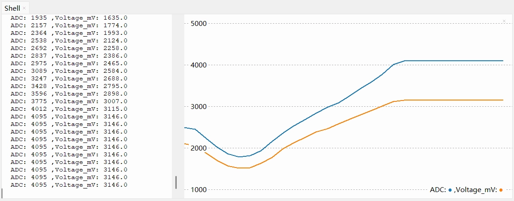
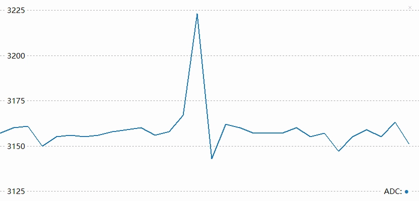
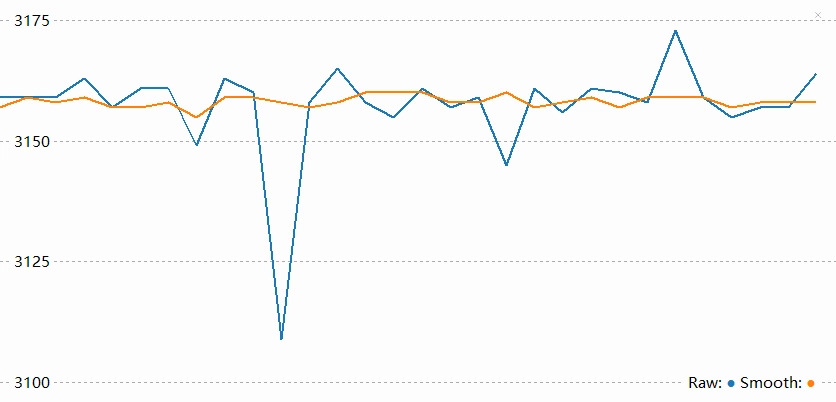

This page overview

# Analog input

this section will introduce ADC（analog-to-digital converter)ofbasic concepts, andViaRead potentiometerofvoltage value, explaining how toIn ESP32 MicroPython environmentInreadAnalog signal。

## 1. Analog signal

**Analog signal**is a kind ofInwithin a certain range can**Continuous change**signal.

such as a dimmer knob, can smoothlyGroundadjust lightofBrightness，FromcompletelyTurn offto the brightest,InbetweenYesNoneseveralBrightnesslevel. ThisBrightnessadjustofprocess is to simulateof。and/whileDigital signallike a normal light switch, onlyYes“on”And“off”.

In the real world, many physical quantities such as temperature, light intensity, and sound level are analog, and their changes are continuous and smooth.

For ESP32, to measure continuously changing signals (such as reading potentiometer or Sensors values), using only `print("ADC:", value)` (High) or `print("ADC:", value)` (Low) two digital states cannot achieve this. In this case, you need to use **ADC**。

-

**ADC (Analog-to-Digital Converter)**: A device that converts continuous analog voltage signals (e.g., 0V to 3.3V) into digital values that the ESP32 can process.

[SVG diagram]

simply put,ADC like a 0~3.3V betweenofvoltage divided into many “scales”ofruler, letsEachvoltage range allCorrespondinga specificofnumber.ADC how many subdivisions the voltage can be divided intoetc.level, this capability is called**Resolution**. The higher the resolution, the finer the voltage changes that can be detected.

ESP32's ADC is usually **12-bit**of，that is, can be divided into a total of **2¹²（= 4096）** levels. Therefore, the ADC reading range is **0 ~ 4095**。

- Input voltage is **0V**, ADC reading is approximately **0**。
- whenInputvoltageFrom **Continuously changes from 0V to 3.3V** , ADC readings will correspondingly**Continuously changes from 0 to 4095**。

 

This way, MicroPython programs can through `print("ADC:", value)` Obtain an integer between 0 and 4095; this value directly corresponds to the voltage at the input pin.

## 2. ADC pins

not allYes ESP32 pinsall supportAnalog input。need to queryCorrespondingDevelopment BoardofPinfigure/diagramOror chipofmanual, look up the labelYes“ADC”ofPinas/workIsAnalog inputUse。

**It is recommended to prioritize ADC1 channel pins to avoid conflicts with other functions.**

|Chip ModelADC Channel 1 (recommended)ADC channel 2Reference documentation
|**ESP32**GPIO32 - GPIO39GPIO0, 2, 4, 12-15, 25-27[ESP32 Technical Specification Section 2.2](https://documentation.espressif.com/esp32_datasheet_cn.html#%5B14,%22XYZ%22,56.69,70.87,null%5D)
|**ESP32-C3**GPIO0 - GPIO5-[ESP32-C3 Technical Reference Manual Section 2.3.2](https://documentation.espressif.com/esp32-c3_datasheet_cn.html#%5B21,%22XYZ%22,56.69,785.2,null%5D)
|**ESP32-C6**GPIO0 - GPIO6-[ESP32-C6 Technical Reference Manual Section 2.3.3](https://documentation.espressif.com/esp32-c6_datasheet_cn.html#%5B22,%22XYZ%22,56.69,785.2,null%5D)
|**ESP32-C5**GPIO1 - GPIO6-[ESP32-C5 Technical Reference Manual Section 2.3.3](https://documentation.espressif.com/esp32-c5_datasheet_cn.html#%5B22,%22XYZ%22,56.69,785.2,null%5D)
|**ESP32-S3**GPIO1 - GPIO10GPIO11 - GPIO20[ESP32-S3 Technical Reference Manual Section 2.3.3](https://documentation.espressif.com/esp32-s3_datasheet_cn.html#%5B22,%22XYZ%22,56.69,349.77,null%5D)
|**ESP32-P4**GPIO16 - GPIO23GPIO49 - GPIO54[ESP32-P4 Technical Reference Manual Section 2.3.3](https://documentation.espressif.com/esp32-p4_datasheet_cn.html#%5B22,%22XYZ%22,56.69,785.2,null%5D)
|**Other**--[EspressifDocumentIncenter (CDP）](https://documentation.espressif.com/zh/home)

## 3. Build the circuit

Required components are:

- Potentiometer * 1
- Breadboard * 1
- Wire
- ESP32 Development Boards

ESP32-S3-Zero Pinfigure/diagram


 

**Circuit analysis**

Let's understand how this analog signal reading circuit works:

-

**Potentiometer connection:**

**VCC Pin**: Connect to ESP32's 3.3V to provide the working voltage for the potentiometer.
- **GND Pin**: Connect to ESP32's GND to form a circuit loop.
- **Signal pin (middle)**: Connected to the ESP32's GPIO7 (ADC pin), outputting an analog voltage between 0V and 3.3V.

-

**Potentiometer working principle:**

A potentiometer contains a variable resistor inside; rotation changes its resistance.
- When rotating the potentiometer knob, the output voltage of the signal pin varies continuously between 0V and 3.3V.
- Fully counterclockwise: output approaches 0V.
- Fully clockwise: output approaches 3.3V.

## 4. Code

### 4.1 REPL Interaction

Before writing a complete program, you can familiarize yourself with ADC-related functions through REPL.

Enter the following commands line by line in the Shell and observe the results:

```
import time
from machine import Pin, ADC
POT_PIN = 7
pot = ADC(Pin(POT_PIN))
def read_average_adc(adc_obj, times=10):
    """
    Read ADC values multiple times continuously, remove the maximum and minimum values, then calculate the average
    :param adc_obj: ADC object
    :param times: Number of samples, default is 10
    :return: Averaged integer value
    """
    val_list = []
    for _ in range(times):
        val_list.append(adc_obj.read())
        time.sleep_ms(1) # Sampling interval
    # Remove the maximum and minimum values, calculate the average of the remaining data
    if len(val_list) > 2:
        val_list.remove(min(val_list))
        val_list.remove(max(val_list))
    return int(sum(val_list) / len(val_list))
while True:
    # Get the average of 20 samples
    smooth_value = read_average_adc(pot, 20)
    print("Raw:", pot.read(), "Smooth:", smooth_value)
    time.sleep(0.1)
```

```
import time
from machine import Pin, ADC
POT_PIN = 7
pot = ADC(Pin(POT_PIN))
def read_average_adc(adc_obj, times=10):
    """
    Read ADC values multiple times continuously, remove the maximum and minimum values, then calculate the average
    :param adc_obj: ADC object
    :param times: Number of samples, default is 10
    :return: Averaged integer value
    """
    val_list = []
    for _ in range(times):
        val_list.append(adc_obj.read())
        time.sleep_ms(1) # Sampling interval
    # Remove the maximum and minimum values, calculate the average of the remaining data
    if len(val_list) > 2:
        val_list.remove(min(val_list))
        val_list.remove(max(val_list))
    return int(sum(val_list) / len(val_list))
while True:
    # Get the average of 20 samples
    smooth_value = read_average_adc(pot, 20)
    print("Raw:", pot.read(), "Smooth:", smooth_value)
    time.sleep(0.1)
```

```
import time
from machine import Pin, ADC
POT_PIN = 7
pot = ADC(Pin(POT_PIN))
def read_average_adc(adc_obj, times=10):
    """
    Read ADC values multiple times continuously, remove the maximum and minimum values, then calculate the average
    :param adc_obj: ADC object
    :param times: Number of samples, default is 10
    :return: Averaged integer value
    """
    val_list = []
    for _ in range(times):
        val_list.append(adc_obj.read())
        time.sleep_ms(1) # Sampling interval
    # Remove the maximum and minimum values, calculate the average of the remaining data
    if len(val_list) > 2:
        val_list.remove(min(val_list))
        val_list.remove(max(val_list))
    return int(sum(val_list) / len(val_list))
while True:
    # Get the average of 20 samples
    smooth_value = read_average_adc(pot, 20)
    print("Raw:", pot.read(), "Smooth:", smooth_value)
    time.sleep(0.1)
```

```
import time
from machine import Pin, ADC
POT_PIN = 7
pot = ADC(Pin(POT_PIN))
def read_average_adc(adc_obj, times=10):
    """
    Read ADC values multiple times continuously, remove the maximum and minimum values, then calculate the average
    :param adc_obj: ADC object
    :param times: Number of samples, default is 10
    :return: Averaged integer value
    """
    val_list = []
    for _ in range(times):
        val_list.append(adc_obj.read())
        time.sleep_ms(1) # Sampling interval
    # Remove the maximum and minimum values, calculate the average of the remaining data
    if len(val_list) > 2:
        val_list.remove(min(val_list))
        val_list.remove(max(val_list))
    return int(sum(val_list) / len(val_list))
while True:
    # Get the average of 20 samples
    smooth_value = read_average_adc(pot, 20)
    print("Raw:", pot.read(), "Smooth:", smooth_value)
    time.sleep(0.1)
```

```
import time
from machine import Pin, ADC
POT_PIN = 7
pot = ADC(Pin(POT_PIN))
def read_average_adc(adc_obj, times=10):
    """
    Read ADC values multiple times continuously, remove the maximum and minimum values, then calculate the average
    :param adc_obj: ADC object
    :param times: Number of samples, default is 10
    :return: Averaged integer value
    """
    val_list = []
    for _ in range(times):
        val_list.append(adc_obj.read())
        time.sleep_ms(1) # Sampling interval
    # Remove the maximum and minimum values, calculate the average of the remaining data
    if len(val_list) > 2:
        val_list.remove(min(val_list))
        val_list.remove(max(val_list))
    return int(sum(val_list) / len(val_list))
while True:
    # Get the average of 20 samples
    smooth_value = read_average_adc(pot, 20)
    print("Raw:", pot.read(), "Smooth:", smooth_value)
    time.sleep(0.1)
```

### 4.2 Complete code example

In Thonny IDE Increate newFile，Inputand run the followingCode。thisCodewillLoopRead the voltage value, andPressSpecific formatOutput，to facilitate coordination with Thonny of“Plotter"FunctionUse。

```
import time
from machine import Pin, ADC
POT_PIN = 7
pot = ADC(Pin(POT_PIN))
def read_average_adc(adc_obj, times=10):
    """
    Read ADC values multiple times continuously, remove the maximum and minimum values, then calculate the average
    :param adc_obj: ADC object
    :param times: Number of samples, default is 10
    :return: Averaged integer value
    """
    val_list = []
    for _ in range(times):
        val_list.append(adc_obj.read())
        time.sleep_ms(1) # Sampling interval
    # Remove the maximum and minimum values, calculate the average of the remaining data
    if len(val_list) > 2:
        val_list.remove(min(val_list))
        val_list.remove(max(val_list))
    return int(sum(val_list) / len(val_list))
while True:
    # Get the average of 20 samples
    smooth_value = read_average_adc(pot, 20)
    print("Raw:", pot.read(), "Smooth:", smooth_value)
    time.sleep(0.1)
```

**Run result:**

After running the code on the ESP32 Development Boards, the Shell window will continuously output values.

In Thonny IDE, click the menu bar's **“view (View)” -> “Plotter (Plotter)”**, and you will see a real-time waveform chart on the right. Turn the potentiometer, and the curve will rise and fall accordingly.



Digging deeper: Why doesn't the maximum reading correspond exactly to 3.3V?

May be observed,ADC ofreadingInVoltage has not reached 3.3V Already saturated whenAnd（reach 4095），OrInBoth ends (approaching 0V And 3.3V）exhibits nonlinearity.
thisIs ESP32 ADC ofOne of the design features. Its internal core circuit can directlyHandleofVoltage rangeYeslimit, thereforeUsenameIsAttenuator (Attenuator) ofinternalModuleExtensionMeasurable voltage range.
In MicroPython Under the environment, the firmware will start by defaultUseone that can measureHighestvoltageofdecay/attenuationOption.According toOfficial documentation，thisSettingsdown/below ESP32 S3 ADC Reliable measurement upper limit approximatelyIs 3.1V。（Note:different chipsIndifferentofdecay/attenuationOptionunder, can measureofInputVoltage range is differentof。view [This table](https://docs.espressif.com/projects/arduino-esp32/en/latest/api/adc.html#analogsetattenuation)。）
Therefore, when the input voltage exceeds 3.1V, the reading will "saturate", i.e., remain at the maximum value of 4095.
Therefore,`print("ADC:", value)` is the more recommended approach, which uses factory calibration data to convert raw readings into more accurate voltage values (in microvolts), compensating to some extent for nonlinearity and reference voltage errors.

**Code analysis**

-

`print("ADC:", value)`

Create an ADC object to control the specified GPIO pin.

-

`print("ADC:", value)`

Read the raw ADC value. For the ESP32, this is typically a 12-bit value with a range of 0 to 4095.

-

`print("ADC:", value)`

Directly returns the calibrated voltage value in microvolts (μV). This is a very practical function that does not require manual `print("ADC:", value)` mathematical operations, and are typically factory-calibrated for higher accuracy.

-

`print("ADC:", value)`

**Thonny Plotter Format Description**:
Thonny's plotter draws curves by recognizing printed output in the Shell. To ensure the plotter displays data correctly, it is recommended to follow this format:

**Pure value**: Print one or more values per line (separated by commas or spaces).
- **Key-value pairs (recommended)**: Use `print("ADC:", value)` offormat.For example `print("ADC:", value)`。

This format can not only draw curves but also display the name of each curve in the legend, making it convenient to distinguish multiple sets of data.

## 5. Extension: Reducing noise

When you stop turning the potentiometer, you may observe that the ADC reading does not settle at a single value but continuously fluctuates within a small range, sometimes even showing larger spikes.



This phenomenon is typically caused by noise. The ESP32's ADC is relatively sensitive to power supply noise and electromagnetic interference from the external environment.

To reduce the impact of noise, there are usually two methods:

-

**Hardware filtering**: Connect a 0.1µF (100nF) ceramic capacitor in parallel between the ADC input pin and GND to filter out high-frequency interference.

-

**Software filtering**: Process multiple sampling results through algorithms. The simplest and most effective method is averaging filter.

**CodeExample:Remove extreme value average filter**

The following code demonstrates how to sample multiple times continuously, remove the maximum and minimum values, and average the rest to obtain a smooth reading.

```
import time
from machine import Pin, ADC
POT_PIN = 7
pot = ADC(Pin(POT_PIN))
def read_average_adc(adc_obj, times=10):
    """
    Read ADC values multiple times continuously, remove the maximum and minimum values, then calculate the average
    :param adc_obj: ADC object
    :param times: Number of samples, default is 10
    :return: Averaged integer value
    """
    val_list = []
    for _ in range(times):
        val_list.append(adc_obj.read())
        time.sleep_ms(1) # Sampling interval
    # Remove the maximum and minimum values, calculate the average of the remaining data
    if len(val_list) > 2:
        val_list.remove(min(val_list))
        val_list.remove(max(val_list))
    return int(sum(val_list) / len(val_list))
while True:
    # Get the average of 20 samples
    smooth_value = read_average_adc(pot, 20)
    print("Raw:", pot.read(), "Smooth:", smooth_value)
    time.sleep(0.1)
```

After applying software filtering, you can see the glitches in the waveform are reduced and the curve is smoother.



## 6. Related links

- [MicroPython - ESP32 Quick Reference - ADC](https://docs.micropython.org/en/latest/esp32/quickref.html#adc-analog-to-digital-conversion)
- [MicroPython - ADC Class](https://docs.micropython.org/en/latest/library/machine.ADC.html)
- [MicroPython - ADCBlock class](https://docs.micropython.org/en/latest/library/machine.ADCBlock.html#machine-adcblock)
- [MicroPython - esp32 machine_adc.c](https://github.com/micropython/micropython/blob/master/ports/esp32/machine_adc.c)

