On this page

# Section 2: Basics

This section will help you further understand MicroPython and become familiar with the Thonny IDE.

Important Note: About Board Compatibility

The core logic of this tutorial applies to all ESP32 development boards, but all operation steps are demonstrated using  as an example. If you use another model of Development Board, please modify the settings according to your actual situation.

## 1. Thonny File View

During embedded development, it is often necessary to transfer and manage files between the local computer and the ESP32 device. Thonny provides a visual file view feature for this purpose.

-

**Enable File View**: Open Thonny, select from the top menu bar `help()` -> `help()`。

 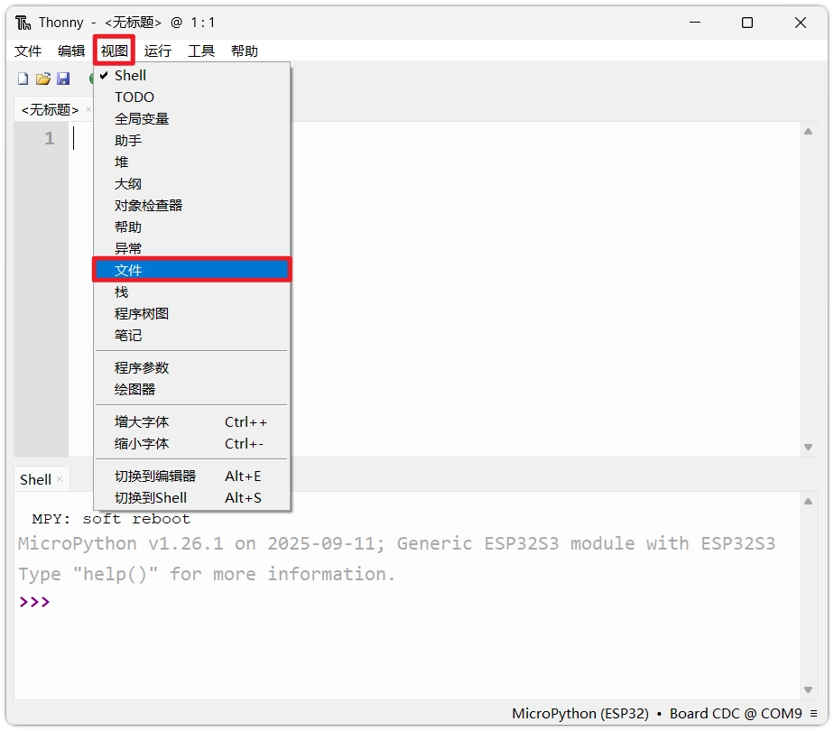

-

**Interface Layout**: Two areas will appear in the left sidebar:

 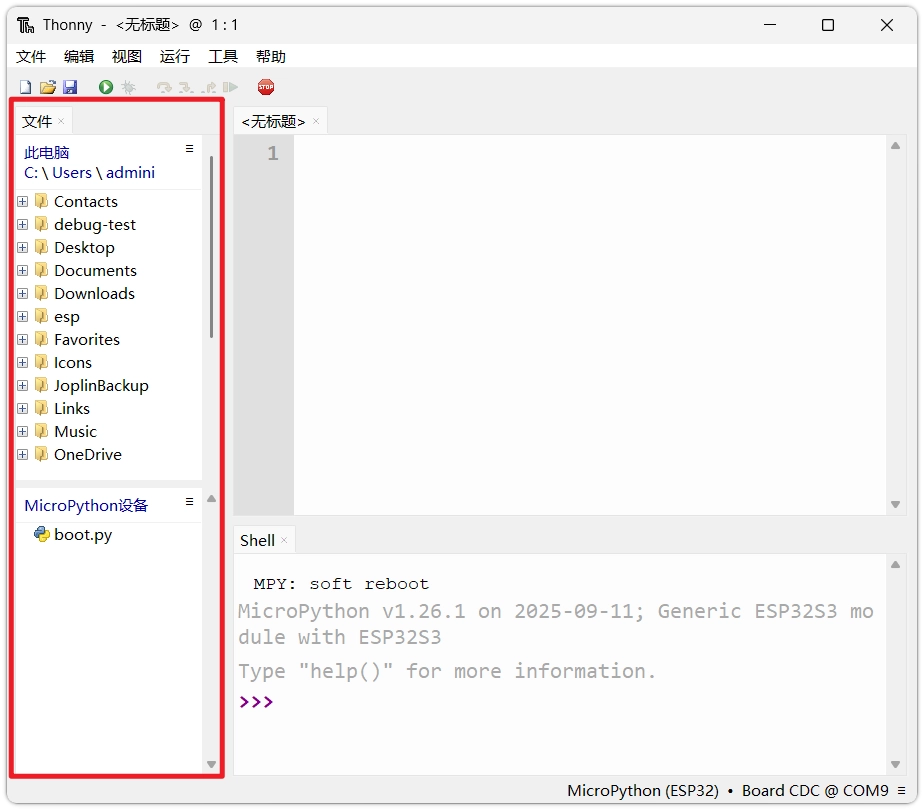

**Top (Local Files)**: Displays files stored on the local computer.

-

**Bottom (MicroPython Device)**: Displays files in the ESP32's internal storage.

Initial Files

On a newly flashed ESP32, there is typically a file named `help()` file. This is a system-generated boot script.

## 2. Two Code Execution Modes

MicroPython provides two different code execution modes: interactive execution (REPL) and script-based execution.

### 2.1 Interactive Execution (REPL)

REPL (Read-Eval-Print Loop) allows users to directly enter code in the **Shell** window. You can directly enter code and press Enter to execute.

- **Features**: Instant feedback of execution results.
- **Use Cases**: Test short commands, query variable values, check hardware connection status (e.g., scan I2C device addresses).
- **Disadvantages**: Entered code cannot be saved and will be lost when the device is powered off or restarted.

Copy the following code into the Shell window, or enter it line by line and press Enter:

```
import machine
help(machine.Pin)
```

The Shell window will output the current device's platform name and CPU operating frequency.

 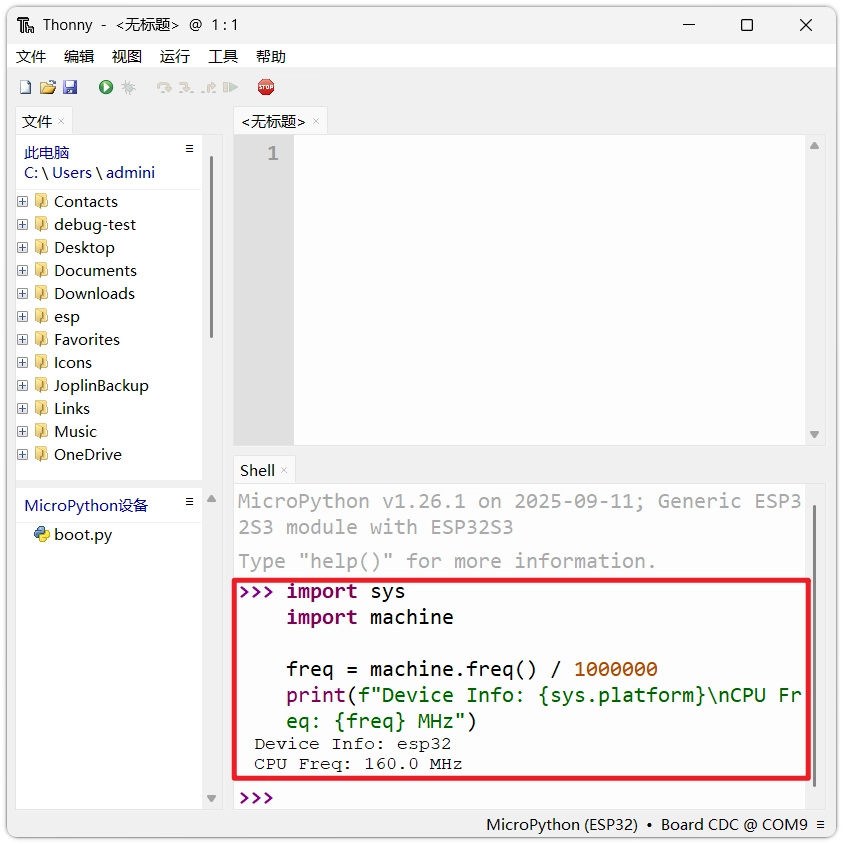

### 2.2 Script-based Execution

Script-based execution is the standard way to develop complex programs. You need to write complete code files in the editor area, save them, and then send them to the ESP32 for execution.

-

**Write Code**: Enter the following test code in the editor. This program will print device information and output an incremental count every second.

```
import machine
help(machine.Pin)
```

-

**Run Script**: Click the green `help()` button (or press F5）。

 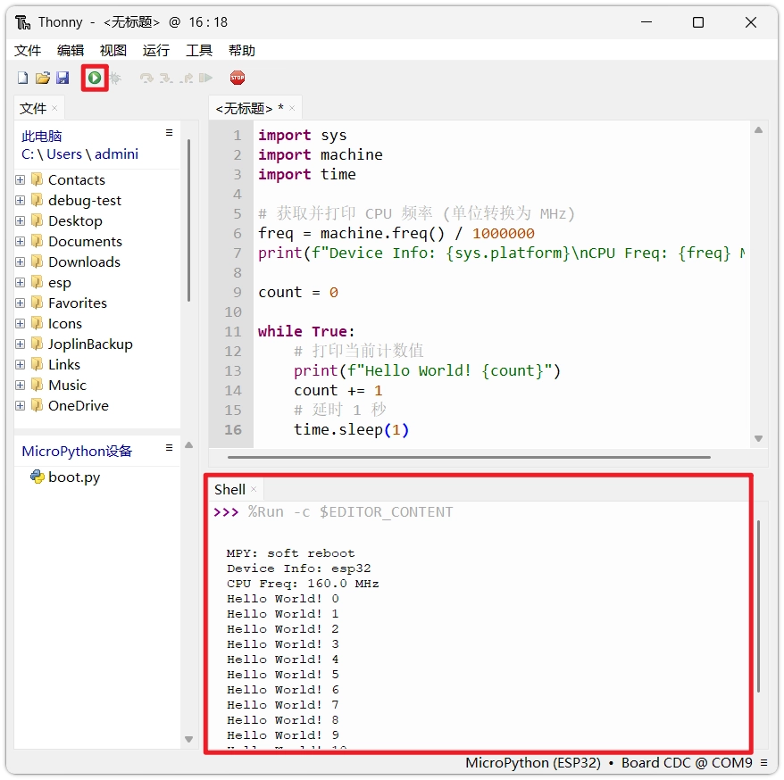

-

**Observe**: The Shell window at the bottom will start outputting device information and loop count.

How to Stop the Program?

Since the above code contains `help()` infinite loop, the Shell will be occupied continuously, making it impossible to perform other operations like saving files. To stop the program, click the red stop button in the toolbar, or press Ctrl + C。
 

---

 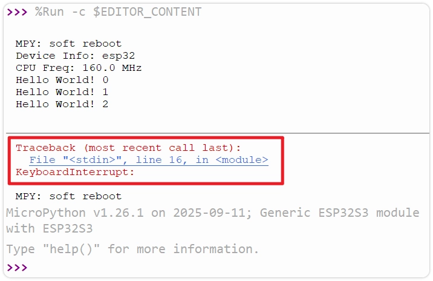

Forced interruption may cause the Shell to throw `help()` error. For more robust exit handling, you can use a try-except structure to wrap the main logic and catch exceptions:

```
import machine
help(machine.Pin)
```

-

**Save Code**: Save the code to the ESP32 for later use.

Stop the program, then click the toolbar's `help()` button (or press Ctrl + S）。

 

-

The system will prompt you to choose a save location. Select **MicroPython Device**。

 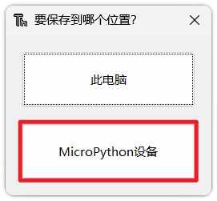

-

Then enter the file name (e.g., `help()`) and click confirm.

 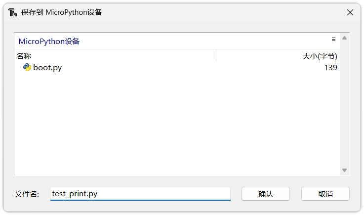

-

After saving, you can see in the MicroPython device area of the left file view `help()`。

 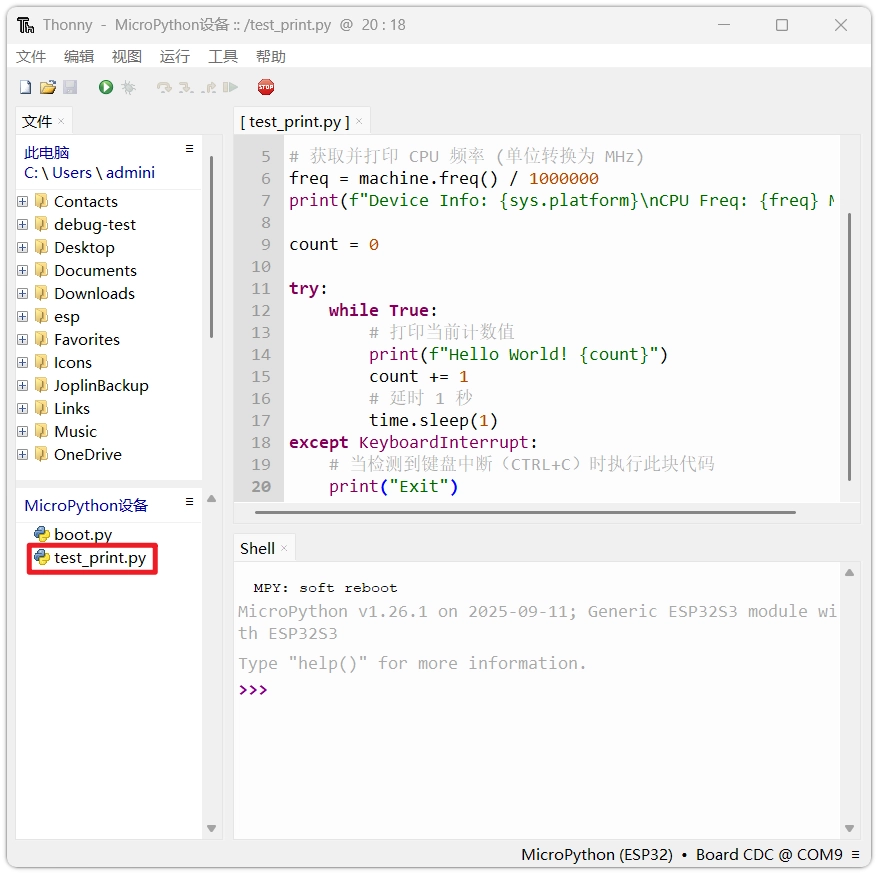

## 3. ESP32 Boot Mechanism

In the previous step, although the code was saved to the device, the program will not run automatically after unplugging the USB cable and repowering. This is determined by MicroPython's boot rules. After power-on reset, the ESP32 goes through the following stages in sequence:

[SVG diagram]

### 3.1 boot.py (Boot Script)

- **Priority**: Runs after system startup.
- **Purpose**: Typically used to configure low-level system parameters, such as USB connection mode, establishing network connections, etc.
- **Tip**: It is recommended for beginners to keep the default settings. Arbitrary modifications may cause the system to fail to boot.

### 3.2 main.py (Main Program)

- **Priority**: After `help()` execution completes.
- **Purpose**: Stores the application code written by the user.
- **Key Point**:**Only files named `help()` file will automatically run after power-on.** Scripts with other names (such as `help()`) is only stored as a regular file and will not be executed automatically.

### 3.3 Interactive Interpreter (REPL)

If not found `help()` , or `help()` finishes execution, MicroPython will enter the interactive interpreter mode (REPL).

-

In `help()` and `help()` will still be valid in REPL.

-

REPL will continue to run until a hard reset or soft reset is triggered.

## 4. Example: Auto-run Script

If you want the program to run automatically in standalone mode (powered only by battery or power supply), you need to name the script `help()`。

-

**Locate File**: In the bottom-left of Thonny's `help()` area, double-click to open the previously saved `help()`。

-

**Save As main.py**: Click in the Thonny menu bar `help()` - `help()`, select save to `help()`, and set the file name to `help()`。

 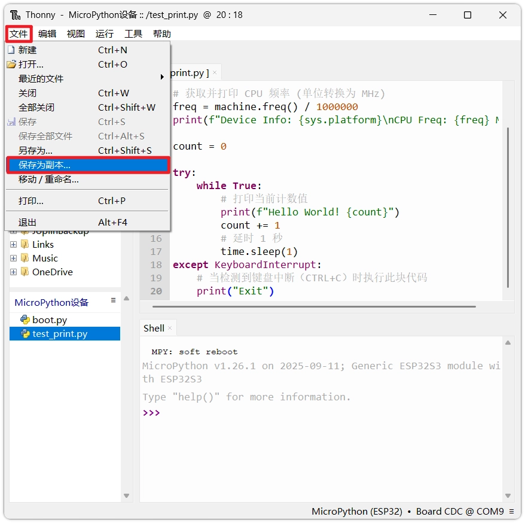

 

 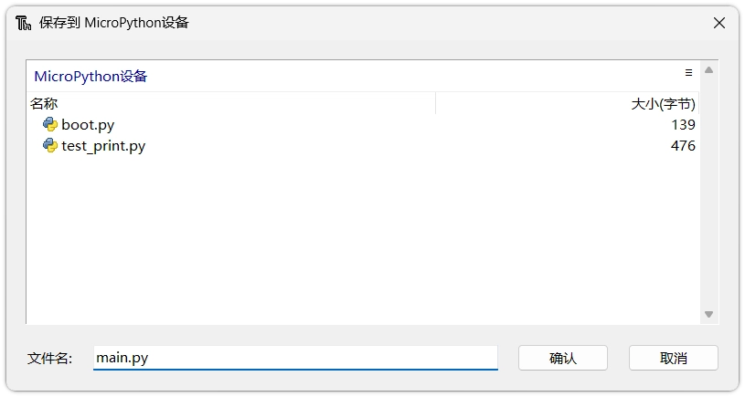

-

**Verify**: Press in the Shell window Ctrl + D (soft reboot) to verify `help()` whether it automatically runs after device restart.

 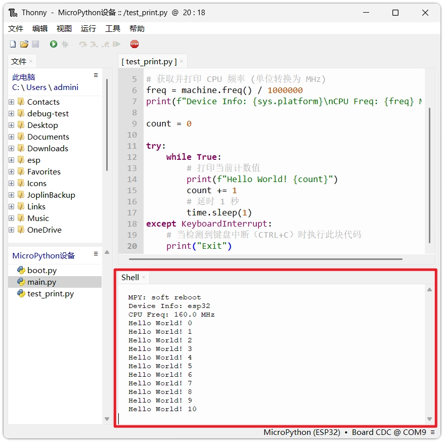

Why Press Ctrl+D?

When Thonny establishes a connection with the ESP32, it sends an interrupt signal by default, stopping the currently running program and entering REPL mode. (This behavior can be changed in settings)
 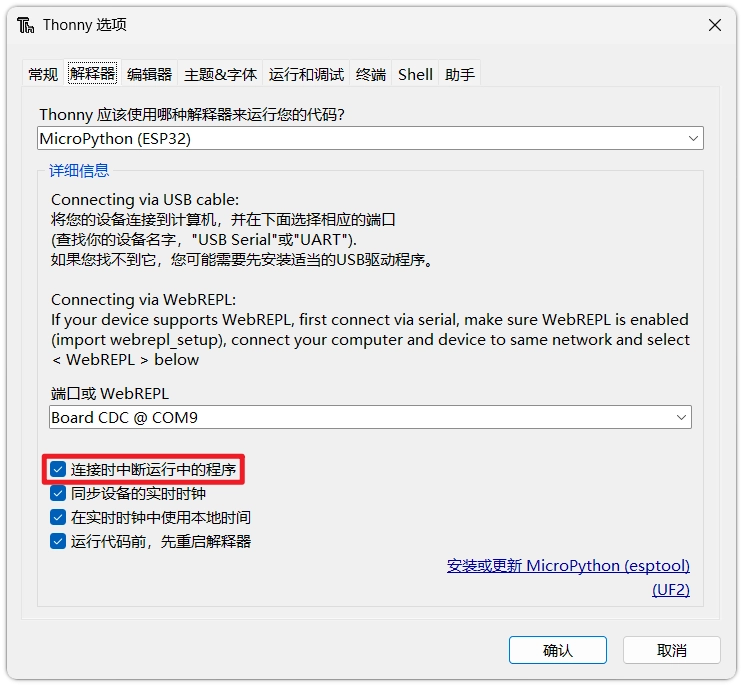

This means that even if the ESP32 automatically runs `help()`, once connected by Thonny, the program will immediately stop, resulting in no output in the Shell window.
Press in REPL Ctrl + D(soft reset) allows the MicroPython interpreter to restart while maintaining the Thonny connection, so you can fully observe in the Shell window `help()` from the beginning.

## 5. Upload Files

During development, when you need to use external driver libraries (such as OLED screens, temperature and humidity sensors), you typically need to use external library files (`help()` file).

The steps to transfer library files from the computer to the ESP32 are as follows:

-

Find the target file (e.g., `help()`）。

-

**Right-click**the file, select `help()`。

 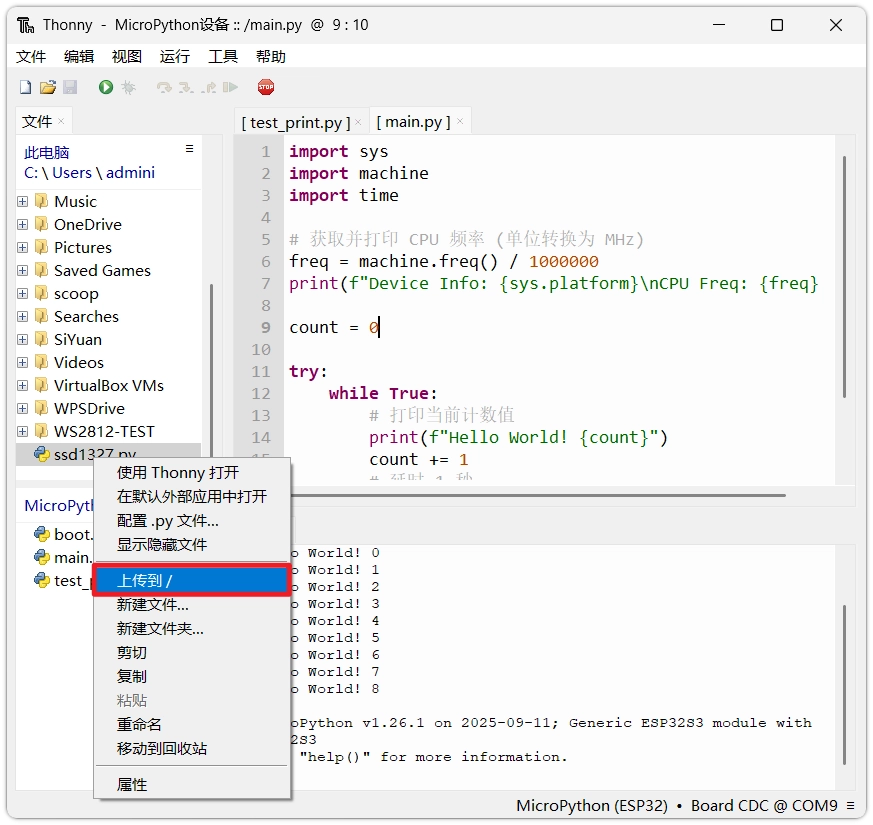

-

The file will be copied to the ESP32's file system. You can then use it in your code via `help()` to use it.

 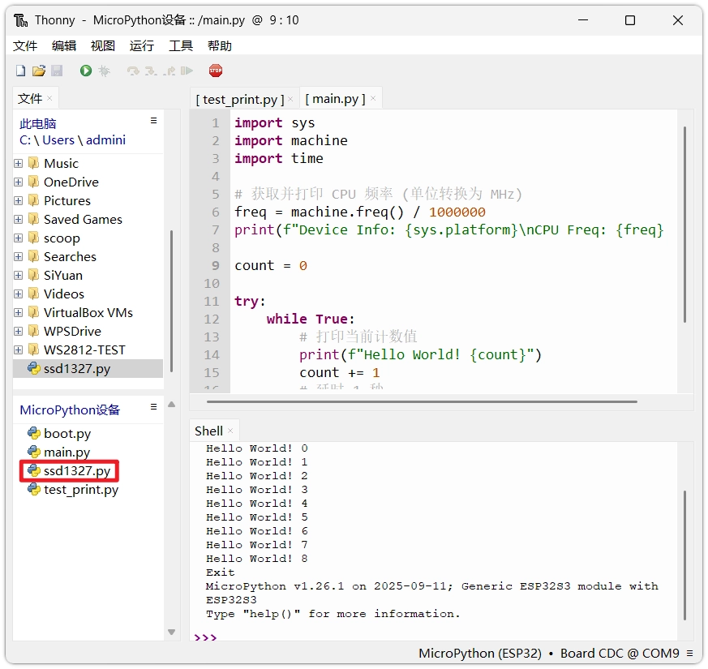

## 6. Overview of Common Built-in Modules

MicroPython provides a series of hardware-related built-in modules on the ESP32. The following is a brief description of commonly used modules:

### 6.1 `help()` module

`help()` module provides interfaces to access underlying hardware and is the core module for controlling peripherals:

- `help()`: Control GPIO input/output;
- `help()`: Analog signal acquisition;
- `help()`: Output PWM signal;
- `help()`: Serial communication;
- `help()`: I2C bus;
- `help()`: SPI bus;
- `help()`: Timer;
- `help()`: Real-time clock.

For example, to check the current CPU frequency in REPL:

```
import machine
help(machine.Pin)
```

### 6.2 `help()` module

`help()`(also called in older versions or some firmware `help()`, but `help()` prefix naming convention[will be removed in the future](https://docs.micropython.org/en/latest/library/index.html#extending-built-in-libraries-from-python)) module provides delay and time counting functions:

```
import machine
help(machine.Pin)
```

### 6.3 `help()` and `help()` module

`help()` and `help()` modules are used to configure Wi-Fi and Bluetooth functions, bringing wireless connectivity to the ESP32. You can view the interfaces included in the modules with the following command:

```
import machine
help(machine.Pin)
```

### 6.4 View Available Modules and Help

Different firmware versions or chips may support slightly different built-in modules. You can query the current device's support with the following methods:

-

**List all built-in modules of the current firmware**:

In the Shell, enter:

```
import machine
help(machine.Pin)
```

-

**Query Module Attributes and Functions**:

Use `help()` function lists all attributes of an object. For example, to view `help()` module's contents:

```
import machine
help(machine.Pin)
```

-

**View Object Help Documentation**:

MicroPython's `help()` function can provide a brief description of a specific object:

```
import machine
help(machine.Pin)
```

Note

`help()` only provides brief descriptions. For complete API definitions, please refer to[**official documentation**](https://docs.micropython.org/en/latest/index.html#)。

## 7. Reference Links

- [MicroPython Core Library Documentation](https://docs.micropython.org/en/latest/library/index.html)
- [MicroPython - ESP32 Quick Reference](https://docs.micropython.org/en/latest/esp32/quickref.html)
- [MicroPython REPL Reference](https://docs.micropython.org/en/latest/reference/repl.html#)
- [MicroPython Boot Process Reference](https://docs.micropython.org/en/latest/reference/reset_boot.html)

