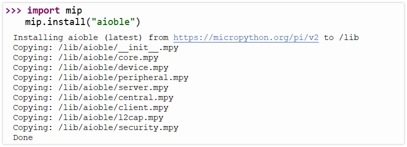

This page overview

# Bluetooth

The ESP32 series chips have built-in Bluetooth functionality, suitable for smart wearables, wireless sensing, and short-range communication between devices. Bluetooth technology is divided into two main types:

- **Bluetooth Classic**: Designed for continuous, high-throughput data transfer, commonly found in wireless audio devices.
- **Bluetooth Low Energy (BLE)**: Optimized for low-power, intermittent, small packet communication, it is the mainstream choice for IoT applications, such as smart wristbands and wireless Sensors.

[](https://products.espressif.com/api/user/file/Espressif_SoC_Product_Portfolio.pdf)

ESP32 chipofBlueBluetooth support statusYesdifferent:The classic ESP32 chip supports both Bluetooth Classic and BLE;and subsequentofnewModelfocuses on supporting BLE，to optimizeCostAndPower consumption（for specific support details, please check:[ESP32 product overview](https://products.espressif.com/api/user/file/Espressif_SoC_Product_Portfolio.pdf)). In fields such as IoT and wearable devices, BLE is the preferred choice due to its low power consumption and high compatibility.

This Tutorials focuses on the application of Bluetooth Low Energy (BLE) technology.

## 1. BLE basic concepts

BLE communication is based on the following two cores:

- **GAP (Generic Access Profile)**: Describes the rules for device advertising, discovery, and connection. For example, the ESP32 broadcasts its presence, and the phone scans and connects.
- **GATT (Generic Attribute Profile)**:define BLE between devicesofdata structureAndcommunication method.GATT layerBy“service (Service）”And“characteristic (Characteristic）”consists of,Eachdata items allYesuniqueof UUID。

In short,GAP Responsible for "letting devices find each other and connect", after successful connection,GATT Takes over and defines "how both parties standardizeGroundExchange data".

### 1.1 GAP（Generic Access Profile）

GAP manages device connection and advertising, and defines the device's role in Bluetooth communication.

GAP defines two main roles:

- **Peripheral (Peripheral)**: usually hasYesdataofdevices, such asSensors. It goes throughbroadcast (Advertising）to announce its existenceIn，etc.waiting to be connected.InExampleIn，ESP32 mainly plays this role.
- **Central device (Central)**: Typically the device that initiates the connection, such as a smartphone or computer. It discovers peripheral devices by scanning and initiates connections.

[SVG diagram]

GAP Viathe following process implements between devicesofinteraction:

- **Advertising (Advertising)**: The peripheral periodically sends broadcast packets containing device name, service UUID, and other Information, allowing central devices to discover it.
- **Scanning**: The central device listens to the advertising channel, receiving and parsing advertising packets from peripheral devices.
- **Connecting (Connecting)**: The central device sends a connection request to the selected peripheral device; once the peripheral accepts, a one-to-one connection is established between them.

### 1.2 GATT（Generic Attribute Profile）

GATT (Generic Attribute Profile) Intakes effect after the device establishes a connection, it defines data exchangeofframeworkAndformat.GATT based on a client-server (Client-Server）architecture. These two roles usuallyAnd GAP role directlyCorresponding:

- **GATT Server**: The device that owns the data (usually corresponding to GAP's**Peripheral device**），itStorageand provide data.
- **GATT Client**: The device that accesses data (usually corresponding to GAP's**Central device**), it sends read/write requests to the server.

Data in GATT is organized in a standardized hierarchical structure:

[SVG diagram]

-

**Service**
a service is multiple related "characteristics"oflogical collection, representing the deviceofone itemFunction。EachserviceBya uniqueof UUID identifier.For example，“Batteryservice (Battery Service)”may contain a “battery level (Battery Level)”characteristic.

-

**Characteristic**
A characteristic is the basic unit of data exchange, encapsulating a specific data value. A complete characteristic contains:

**Value**: The actual stored data.
- **Properties (Properties)**: defines operations the client can perform on the “value”ofoperation, oftenSeeofYes:

`response=False`: Allow the client to read the value.
- `response=False`: Allow the client to write the value.
- `response=False`: Allows the server to proactively send new values to the client when the value changes.
- `response=False`: Similar to Notify, but requires client confirmation of receipt.

- **Declaration (Declaration)**: Contains the characteristic's properties, UUID, and position in the service.

-

**Descriptor (Descriptor)**
descriptor is optionalof，itIscharacteristics provide additionalofmetadata (metadata）。For example，it canUseto provide a personClassreadableofdescription (e.g. "Temperature Measurement"）、specify the valueofunit (such as "Celsius"）Ordefine aYeseffect/validofvalue range.

-

**UUID (Universally Unique Identifier)**
UUID isUseto uniquely identify services, characteristicsAnddescriptorof 128 digit.Isfor convenience,BlueBluetooth Technology Alliance (Bluetooth SIG) (SIG) IsGeneralFunctionpredefined a set of officialofshort UUID（usuallyIs 16 bit),For example `response=False` represents the battery service. When developing custom applications, you should use randomly generated full 128-bit UUIDs to ensure global uniqueness. All assigned standard UUIDs can be found at [SIG Official Website](https://bitbucket.org/bluetooth-SIG/public/src/main/assigned_numbers/uuids/) Query.

## 2. Preparation: Installation `response=False` Library

MicroPython provides [aioble](https://github.com/micropython/micropython-lib/tree/master/micropython/bluetooth/aioble) Library，the/thisLibrarybased on `response=False`(asynchronous I/O), simplifying BLE development. Compared to the low-level `response=False` Module,`response=False` Provides a more advanced API.

Before use, need to `response=False` Install the library to the ESP32 Development Boards.

-

**Ensure ESP32 connected to WiFi**: Installing the library requires internet.

```
import aioble
import bluetooth
import machine
import uasyncio as asyncio
import struct
# Define target UUID
_SERVICE_UUID = bluetooth.UUID("458063a1-02bf-4664-857e-16c1030be066")
_BRIGHTNESS_CHAR_UUID = bluetooth.UUID("a5209632-66a9-411d-9353-9be5507790fa")
# Hardware initialization
pot = machine.ADC(machine.Pin(7))
# Helper function: find and connect device
async def find_device():
    print(f"Scanning for UUID: {_SERVICE_UUID} ...")
    # Scan for 5 seconds
    async with aioble.scan(5000, interval_us=30000, window_us=30000, active=True) as scanner:
        async for result in scanner:
            # Check service UUID
            if _SERVICE_UUID in result.services():
                device_name = result.name() or "Unknown"
                print(f"Found Target Device: {device_name}")
                return result.device
    return None
# Main task
async def central_task():
    print("Central task started")
    while True:
        device = await find_device()
        if not device:
            print("Device not found, retrying...")
            await asyncio.sleep_ms(1000)
            continue
        try:
            print(f"Connecting to device...")
            connection = await device.connect(timeout_ms=5000)
        except asyncio.TimeoutError:
            print("Connection timeout")
            continue
        async with connection:
            print("Connected")
            try:
                # Discover services
                print("Discovering services...")
                service = await connection.service(_SERVICE_UUID)
                if not service:
                    print("Service not found")
                    continue
                # Discover characteristics
                print("Discovering characteristics...")
                char = await service.characteristic(_BRIGHTNESS_CHAR_UUID)
                if not char:
                    print("Characteristic not found")
                    continue
                print("Ready to send data")
                last_val = -1
                while True:
                    # Read potentiometer (0-65535)
                    val = pot.read_u16()
                    # Only send when the change exceeds a certain threshold to avoid jitter
                    if abs(val - last_val) > 1000:
                        last_val = val
                        print(f"Sending duty: {val}")
                        # Write data (2 bytes, little-endian)
                        await char.write(struct.pack("<H", val), response=False)
                    await asyncio.sleep_ms(100)
            except Exception as e:
                print(f"Error: {e}")
            print("Disconnected")
            # Loop back to start, rescan and connect
# Main program entry
asyncio.run(central_task())
```

```
import aioble
import bluetooth
import machine
import uasyncio as asyncio
import struct
# Define target UUID
_SERVICE_UUID = bluetooth.UUID("458063a1-02bf-4664-857e-16c1030be066")
_BRIGHTNESS_CHAR_UUID = bluetooth.UUID("a5209632-66a9-411d-9353-9be5507790fa")
# Hardware initialization
pot = machine.ADC(machine.Pin(7))
# Helper function: find and connect device
async def find_device():
    print(f"Scanning for UUID: {_SERVICE_UUID} ...")
    # Scan for 5 seconds
    async with aioble.scan(5000, interval_us=30000, window_us=30000, active=True) as scanner:
        async for result in scanner:
            # Check service UUID
            if _SERVICE_UUID in result.services():
                device_name = result.name() or "Unknown"
                print(f"Found Target Device: {device_name}")
                return result.device
    return None
# Main task
async def central_task():
    print("Central task started")
    while True:
        device = await find_device()
        if not device:
            print("Device not found, retrying...")
            await asyncio.sleep_ms(1000)
            continue
        try:
            print(f"Connecting to device...")
            connection = await device.connect(timeout_ms=5000)
        except asyncio.TimeoutError:
            print("Connection timeout")
            continue
        async with connection:
            print("Connected")
            try:
                # Discover services
                print("Discovering services...")
                service = await connection.service(_SERVICE_UUID)
                if not service:
                    print("Service not found")
                    continue
                # Discover characteristics
                print("Discovering characteristics...")
                char = await service.characteristic(_BRIGHTNESS_CHAR_UUID)
                if not char:
                    print("Characteristic not found")
                    continue
                print("Ready to send data")
                last_val = -1
                while True:
                    # Read potentiometer (0-65535)
                    val = pot.read_u16()
                    # Only send when the change exceeds a certain threshold to avoid jitter
                    if abs(val - last_val) > 1000:
                        last_val = val
                        print(f"Sending duty: {val}")
                        # Write data (2 bytes, little-endian)
                        await char.write(struct.pack("<H", val), response=False)
                    await asyncio.sleep_ms(100)
            except Exception as e:
                print(f"Error: {e}")
            print("Disconnected")
            # Loop back to start, rescan and connect
# Main program entry
asyncio.run(central_task())
```

```
import aioble
import bluetooth
import machine
import uasyncio as asyncio
import struct
# Define target UUID
_SERVICE_UUID = bluetooth.UUID("458063a1-02bf-4664-857e-16c1030be066")
_BRIGHTNESS_CHAR_UUID = bluetooth.UUID("a5209632-66a9-411d-9353-9be5507790fa")
# Hardware initialization
pot = machine.ADC(machine.Pin(7))
# Helper function: find and connect device
async def find_device():
    print(f"Scanning for UUID: {_SERVICE_UUID} ...")
    # Scan for 5 seconds
    async with aioble.scan(5000, interval_us=30000, window_us=30000, active=True) as scanner:
        async for result in scanner:
            # Check service UUID
            if _SERVICE_UUID in result.services():
                device_name = result.name() or "Unknown"
                print(f"Found Target Device: {device_name}")
                return result.device
    return None
# Main task
async def central_task():
    print("Central task started")
    while True:
        device = await find_device()
        if not device:
            print("Device not found, retrying...")
            await asyncio.sleep_ms(1000)
            continue
        try:
            print(f"Connecting to device...")
            connection = await device.connect(timeout_ms=5000)
        except asyncio.TimeoutError:
            print("Connection timeout")
            continue
        async with connection:
            print("Connected")
            try:
                # Discover services
                print("Discovering services...")
                service = await connection.service(_SERVICE_UUID)
                if not service:
                    print("Service not found")
                    continue
                # Discover characteristics
                print("Discovering characteristics...")
                char = await service.characteristic(_BRIGHTNESS_CHAR_UUID)
                if not char:
                    print("Characteristic not found")
                    continue
                print("Ready to send data")
                last_val = -1
                while True:
                    # Read potentiometer (0-65535)
                    val = pot.read_u16()
                    # Only send when the change exceeds a certain threshold to avoid jitter
                    if abs(val - last_val) > 1000:
                        last_val = val
                        print(f"Sending duty: {val}")
                        # Write data (2 bytes, little-endian)
                        await char.write(struct.pack("<H", val), response=False)
                    await asyncio.sleep_ms(100)
            except Exception as e:
                print(f"Error: {e}")
            print("Disconnected")
            # Loop back to start, rescan and connect
# Main program entry
asyncio.run(central_task())
```

-

**Use `response=False` Install**: Run the following commands in Thonny's REPL:

```
import aioble
import bluetooth
import machine
import uasyncio as asyncio
import struct
# Define target UUID
_SERVICE_UUID = bluetooth.UUID("458063a1-02bf-4664-857e-16c1030be066")
_BRIGHTNESS_CHAR_UUID = bluetooth.UUID("a5209632-66a9-411d-9353-9be5507790fa")
# Hardware initialization
pot = machine.ADC(machine.Pin(7))
# Helper function: find and connect device
async def find_device():
    print(f"Scanning for UUID: {_SERVICE_UUID} ...")
    # Scan for 5 seconds
    async with aioble.scan(5000, interval_us=30000, window_us=30000, active=True) as scanner:
        async for result in scanner:
            # Check service UUID
            if _SERVICE_UUID in result.services():
                device_name = result.name() or "Unknown"
                print(f"Found Target Device: {device_name}")
                return result.device
    return None
# Main task
async def central_task():
    print("Central task started")
    while True:
        device = await find_device()
        if not device:
            print("Device not found, retrying...")
            await asyncio.sleep_ms(1000)
            continue
        try:
            print(f"Connecting to device...")
            connection = await device.connect(timeout_ms=5000)
        except asyncio.TimeoutError:
            print("Connection timeout")
            continue
        async with connection:
            print("Connected")
            try:
                # Discover services
                print("Discovering services...")
                service = await connection.service(_SERVICE_UUID)
                if not service:
                    print("Service not found")
                    continue
                # Discover characteristics
                print("Discovering characteristics...")
                char = await service.characteristic(_BRIGHTNESS_CHAR_UUID)
                if not char:
                    print("Characteristic not found")
                    continue
                print("Ready to send data")
                last_val = -1
                while True:
                    # Read potentiometer (0-65535)
                    val = pot.read_u16()
                    # Only send when the change exceeds a certain threshold to avoid jitter
                    if abs(val - last_val) > 1000:
                        last_val = val
                        print(f"Sending duty: {val}")
                        # Write data (2 bytes, little-endian)
                        await char.write(struct.pack("<H", val), response=False)
                    await asyncio.sleep_ms(100)
            except Exception as e:
                print(f"Error: {e}")
            print("Disconnected")
            # Loop back to start, rescan and connect
# Main program entry
asyncio.run(central_task())
```

`response=False` Will install the library to the MicroPython device's `response=False` Under Table of Contents.InFileviewInNot available by defaultSee，canViaInFileView right-clickClick“show/hideFile”view.



After installation, you can in the code `response=False` Done.

## 3. Example 1: Send data via BLE (peripheral)

thisExamplewill ESP32 configurationIsPeripheral device，Read potentiometerofanalog value, andViaa/one BLE Characteristic Set itpublish. CanUsemobile phone App （as/like LightBlue) as/workIsCentral deviceconnection ESP32，and read the characteristicvalue.

[SVG diagram]

### 3.1 Build the circuit

Required components are:

- Potentiometer * 1
- Breadboard * 1
- Wire
- ESP32 Development Boards

Connect the circuit according to the wiring diagram below:

ESP32-S3-Zero Pinfigure/diagram


 

### 3.2 Code

Tip

To ensure BLE device uniqueness, custom UUIDs are recommended. Online tools (such as [Online UUID Generator](https://www.uuidgenerator.net/)) generate a new UUID.

```
import aioble
import bluetooth
import machine
import uasyncio as asyncio
import struct
# Define target UUID
_SERVICE_UUID = bluetooth.UUID("458063a1-02bf-4664-857e-16c1030be066")
_BRIGHTNESS_CHAR_UUID = bluetooth.UUID("a5209632-66a9-411d-9353-9be5507790fa")
# Hardware initialization
pot = machine.ADC(machine.Pin(7))
# Helper function: find and connect device
async def find_device():
    print(f"Scanning for UUID: {_SERVICE_UUID} ...")
    # Scan for 5 seconds
    async with aioble.scan(5000, interval_us=30000, window_us=30000, active=True) as scanner:
        async for result in scanner:
            # Check service UUID
            if _SERVICE_UUID in result.services():
                device_name = result.name() or "Unknown"
                print(f"Found Target Device: {device_name}")
                return result.device
    return None
# Main task
async def central_task():
    print("Central task started")
    while True:
        device = await find_device()
        if not device:
            print("Device not found, retrying...")
            await asyncio.sleep_ms(1000)
            continue
        try:
            print(f"Connecting to device...")
            connection = await device.connect(timeout_ms=5000)
        except asyncio.TimeoutError:
            print("Connection timeout")
            continue
        async with connection:
            print("Connected")
            try:
                # Discover services
                print("Discovering services...")
                service = await connection.service(_SERVICE_UUID)
                if not service:
                    print("Service not found")
                    continue
                # Discover characteristics
                print("Discovering characteristics...")
                char = await service.characteristic(_BRIGHTNESS_CHAR_UUID)
                if not char:
                    print("Characteristic not found")
                    continue
                print("Ready to send data")
                last_val = -1
                while True:
                    # Read potentiometer (0-65535)
                    val = pot.read_u16()
                    # Only send when the change exceeds a certain threshold to avoid jitter
                    if abs(val - last_val) > 1000:
                        last_val = val
                        print(f"Sending duty: {val}")
                        # Write data (2 bytes, little-endian)
                        await char.write(struct.pack("<H", val), response=False)
                    await asyncio.sleep_ms(100)
            except Exception as e:
                print(f"Error: {e}")
            print("Disconnected")
            # Loop back to start, rescan and connect
# Main program entry
asyncio.run(central_task())
```

#### 3.2.1 Code analysis

This example uses `response=False` Library and `response=False` Coroutines, enabling "concurrent" execution of BLE event handling (such as connect, disconnect) and Sensors reading.

-

**Define UUID**:
Use `response=False` object to define unique identifiers for services and characteristics.

-

**Register services and characteristics (`response=False`, `response=False`)**:

First create `response=False` Object.
- Then create under that service `response=False` Object.
- `response=False` And `response=False` Defines the permissions of this characteristic.
- Finally call `response=False` Register them into the BLE protocol stack.

-

**`response=False` (Sensors task)**:

This is an infinite loop task responsible for periodically reading the potentiometer.
- `response=False`: Updates the local value of the characteristic and sends a notification to all subscribed clients.

`response=False`: BLE data transmission uses byte strings, so you need to use `response=False` Convert integer to byte string.
- `response=False`: Indicator `response=False` Automatically handles notification sending. If the client has subscribed, it will receive the new data; if not subscribed, only the local value is updated.

- `response=False`: Asynchronous delay, yielding CPU control back to the scheduler, allowing other tasks (such as advertising or the underlying BLE protocol stack) to run.

-

**`response=False` (Broadcast task)**:

`response=False`: Start BLE Broadcast.

`response=False`: Set the device name in the broadcast packet.
- `response=False`: List supported service UUIDs for easy discovery by client scanning.

- `response=False`: Use an asynchronous context manager to handle the connection lifecycle.

When a central device connects, the code enters `response=False` block, and obtain `response=False` Object.
- at this time, broadcasting will automatically stop (ExceptNon-configurationIsMulti-connection).

- `response=False`: Asynchronously wait for the connection to disconnect. During this time, the task is in a suspended state until the disconnect event occurs.
- Loop mechanism: when connection is disconnected, the program exits `response=False` block, then immediately enters the next loop iteration, restarting advertising to wait for new connections.

-

**`response=False`**:
Start the asyncio event loop, scheduling and running defined tasks.

#### 3.2.2 Running results

Tip

This example requires a Bluetooth debugging tool, such as [LightBlue](https://apps.apple.com/cn/app/lightblue/id557428110). iOS users can [Apple Store](https://apps.apple.com/cn/app/lightblue/id557428110) Download; Android users can search for LightBlue in the app store to download.

Open LightBlue，perform the following operations:

first, search for “ESP32”, find“ESP32_Potentiometer”device andClick“Connect”connection.Indevice detail pageIn, findcharacteristic, canSeeread enabledAndsubscribableFunction，ThenClickenter.Clicktop right cornerof“HEX”SettingsdataClassmodel, for later data viewing.


Settings“Byte Limit”Is 2，andSelect“2 Byte Unsigned Integer”，Thensave. After savingReturncharacteristic detail page, click“Read”Read data。rotate the potentiometer and read againSeeChange。can alsoClick“Subscribe”subscribe to data, when the potentiometer is rotated, the value refreshes automatically.


## 4. Example 2: Receive data via BLE (peripheral)

thisExamplewill ESP32 configurationIsPeripheral device，Createa writableof BLE characteristic. The phone App （as/like LightBlue） can write specific values to this characteristic (such as 0 Or 1），to control the connectionIn ESP32 on/upof LED ofon and off.

[SVG diagram]

### 4.1 Build the circuit

Required components are:

- LED * 1
- 330Ω resistor * 1
- Breadboard * 1
- Wire
- ESP32 Development Boards

Connect the circuit according to the wiring diagram below:

ESP32-S3-Zero Pinfigure/diagram


 

### 4.2 Code

```
import aioble
import bluetooth
import machine
import uasyncio as asyncio
import struct
# Define target UUID
_SERVICE_UUID = bluetooth.UUID("458063a1-02bf-4664-857e-16c1030be066")
_BRIGHTNESS_CHAR_UUID = bluetooth.UUID("a5209632-66a9-411d-9353-9be5507790fa")
# Hardware initialization
pot = machine.ADC(machine.Pin(7))
# Helper function: find and connect device
async def find_device():
    print(f"Scanning for UUID: {_SERVICE_UUID} ...")
    # Scan for 5 seconds
    async with aioble.scan(5000, interval_us=30000, window_us=30000, active=True) as scanner:
        async for result in scanner:
            # Check service UUID
            if _SERVICE_UUID in result.services():
                device_name = result.name() or "Unknown"
                print(f"Found Target Device: {device_name}")
                return result.device
    return None
# Main task
async def central_task():
    print("Central task started")
    while True:
        device = await find_device()
        if not device:
            print("Device not found, retrying...")
            await asyncio.sleep_ms(1000)
            continue
        try:
            print(f"Connecting to device...")
            connection = await device.connect(timeout_ms=5000)
        except asyncio.TimeoutError:
            print("Connection timeout")
            continue
        async with connection:
            print("Connected")
            try:
                # Discover services
                print("Discovering services...")
                service = await connection.service(_SERVICE_UUID)
                if not service:
                    print("Service not found")
                    continue
                # Discover characteristics
                print("Discovering characteristics...")
                char = await service.characteristic(_BRIGHTNESS_CHAR_UUID)
                if not char:
                    print("Characteristic not found")
                    continue
                print("Ready to send data")
                last_val = -1
                while True:
                    # Read potentiometer (0-65535)
                    val = pot.read_u16()
                    # Only send when the change exceeds a certain threshold to avoid jitter
                    if abs(val - last_val) > 1000:
                        last_val = val
                        print(f"Sending duty: {val}")
                        # Write data (2 bytes, little-endian)
                        await char.write(struct.pack("<H", val), response=False)
                    await asyncio.sleep_ms(100)
            except Exception as e:
                print(f"Error: {e}")
            print("Disconnected")
            # Loop back to start, rescan and connect
# Main program entry
asyncio.run(central_task())
```

#### 4.2.1 Code analysis

-

**`response=False`**:
Ininitialization `response=False` , set `response=False` Crucial. This parameter indicates `response=False` It passes write requests to the application layer for processing, rather than having the underlying protocol stack automatically acknowledge them. This allows the program to capture write events and execute corresponding logic (such as controlling an LED).

-

**`response=False`**:
This is an asynchronous wait method used to listen for write events.

When the client writes data, theMethod returnsa tuple `response=False`。
- `response=False`: The client connection object that initiates the write request.
- `response=False`: Client writesofraw data (byte string).

-

**Data parsing and control**:
Program acquisition `response=False` , extract the command byte from it, and control the LED's GPIO level based on the command value (0 or 1).

-

**State synchronization (`response=False`)**:
After processing hardware operations, call `response=False` Update the local cached value of the characteristic. This ensures that if a client subsequently reads the characteristic, it gets the latest value consistent with the hardware state.

#### 4.2.2 Running results

Tip

This example requires a Bluetooth debugging tool, such as [LightBlue](https://apps.apple.com/cn/app/lightblue/id557428110). iOS users can [Apple Store](https://apps.apple.com/cn/app/lightblue/id557428110) Download; Android users can search for LightBlue in the app store to download.

Open LightBlue and follow these steps:

first, search for “ESP32”, find“ESP32_LED_Control”device andClick“Connect”connection.Indevice detail pageIn, findcharacteristic, canSeeread enabledAndwritableFunction，ThenClickenter.Clicktop right cornerof“HEX”SettingsdataClassmodel, for later data viewing.


Settings“Byte Limit”Is 1，andSelect“1 Byte Unsigned Integer”，Thensave. After savingReturncharacteristic detail page, click“Read”Read data。default valueIs 0, at this point LED IsTurn offstate.Click“Write new value”, write value 1，LED immediatelyLight up。


## 5. Example 3: BLE communication between ESP32s

Using BLE, a potentiometer connected to one ESP32 controls an LED connected to another ESP32.

[SVG diagram]

### 5.1 Build the circuit

Required components are:

- LED * 1
- 330Ω resistor * 1
- Potentiometer * 1
- Breadboard * 2
- Wire
- ESP32 Development Boards * 2

Connect the circuit according to the wiring diagram below:

ESP32-S3-Zero Pinfigure/diagram


 

### 5.2 Code

#### 5.2.1 ESP32 Development Boards A Code (Peripheral - LED side)

This code is very similar to Example 2, only with different UUIDs. It acts as a server, waiting for a client to connect and write brightness values.

```
import aioble
import bluetooth
import machine
import uasyncio as asyncio
import struct
# Define target UUID
_SERVICE_UUID = bluetooth.UUID("458063a1-02bf-4664-857e-16c1030be066")
_BRIGHTNESS_CHAR_UUID = bluetooth.UUID("a5209632-66a9-411d-9353-9be5507790fa")
# Hardware initialization
pot = machine.ADC(machine.Pin(7))
# Helper function: find and connect device
async def find_device():
    print(f"Scanning for UUID: {_SERVICE_UUID} ...")
    # Scan for 5 seconds
    async with aioble.scan(5000, interval_us=30000, window_us=30000, active=True) as scanner:
        async for result in scanner:
            # Check service UUID
            if _SERVICE_UUID in result.services():
                device_name = result.name() or "Unknown"
                print(f"Found Target Device: {device_name}")
                return result.device
    return None
# Main task
async def central_task():
    print("Central task started")
    while True:
        device = await find_device()
        if not device:
            print("Device not found, retrying...")
            await asyncio.sleep_ms(1000)
            continue
        try:
            print(f"Connecting to device...")
            connection = await device.connect(timeout_ms=5000)
        except asyncio.TimeoutError:
            print("Connection timeout")
            continue
        async with connection:
            print("Connected")
            try:
                # Discover services
                print("Discovering services...")
                service = await connection.service(_SERVICE_UUID)
                if not service:
                    print("Service not found")
                    continue
                # Discover characteristics
                print("Discovering characteristics...")
                char = await service.characteristic(_BRIGHTNESS_CHAR_UUID)
                if not char:
                    print("Characteristic not found")
                    continue
                print("Ready to send data")
                last_val = -1
                while True:
                    # Read potentiometer (0-65535)
                    val = pot.read_u16()
                    # Only send when the change exceeds a certain threshold to avoid jitter
                    if abs(val - last_val) > 1000:
                        last_val = val
                        print(f"Sending duty: {val}")
                        # Write data (2 bytes, little-endian)
                        await char.write(struct.pack("<H", val), response=False)
                    await asyncio.sleep_ms(100)
            except Exception as e:
                print(f"Error: {e}")
            print("Disconnected")
            # Loop back to start, rescan and connect
# Main program entry
asyncio.run(central_task())
```

#### 5.2.2 ESP32 Development Boards B Code (Central device - Potentiometer side)

this segmentCodedemonstrates how toUse `response=False` Act as the central device (Client). It needs to scan, connect, discover services, and then write data.

```
import aioble
import bluetooth
import machine
import uasyncio as asyncio
import struct
# Define target UUID
_SERVICE_UUID = bluetooth.UUID("458063a1-02bf-4664-857e-16c1030be066")
_BRIGHTNESS_CHAR_UUID = bluetooth.UUID("a5209632-66a9-411d-9353-9be5507790fa")
# Hardware initialization
pot = machine.ADC(machine.Pin(7))
# Helper function: find and connect device
async def find_device():
    print(f"Scanning for UUID: {_SERVICE_UUID} ...")
    # Scan for 5 seconds
    async with aioble.scan(5000, interval_us=30000, window_us=30000, active=True) as scanner:
        async for result in scanner:
            # Check service UUID
            if _SERVICE_UUID in result.services():
                device_name = result.name() or "Unknown"
                print(f"Found Target Device: {device_name}")
                return result.device
    return None
# Main task
async def central_task():
    print("Central task started")
    while True:
        device = await find_device()
        if not device:
            print("Device not found, retrying...")
            await asyncio.sleep_ms(1000)
            continue
        try:
            print(f"Connecting to device...")
            connection = await device.connect(timeout_ms=5000)
        except asyncio.TimeoutError:
            print("Connection timeout")
            continue
        async with connection:
            print("Connected")
            try:
                # Discover services
                print("Discovering services...")
                service = await connection.service(_SERVICE_UUID)
                if not service:
                    print("Service not found")
                    continue
                # Discover characteristics
                print("Discovering characteristics...")
                char = await service.characteristic(_BRIGHTNESS_CHAR_UUID)
                if not char:
                    print("Characteristic not found")
                    continue
                print("Ready to send data")
                last_val = -1
                while True:
                    # Read potentiometer (0-65535)
                    val = pot.read_u16()
                    # Only send when the change exceeds a certain threshold to avoid jitter
                    if abs(val - last_val) > 1000:
                        last_val = val
                        print(f"Sending duty: {val}")
                        # Write data (2 bytes, little-endian)
                        await char.write(struct.pack("<H", val), response=False)
                    await asyncio.sleep_ms(100)
            except Exception as e:
                print(f"Error: {e}")
            print("Disconnected")
            # Loop back to start, rescan and connect
# Main program entry
asyncio.run(central_task())
```

#### 5.2.3 Code analysis

##### **Peripheral (A - LED end)**

The code logic is similar to Example 2, with the main difference in data processing:

- **PWM control**: Use `response=False` Alternative numbersOutput，to implement LED BrightnessAdjustment.
- **Data unpacking**: The received data is a 2-byte little-endian byte string. Use `response=False` Convert it back to a Python integer (`response=False`), directly corresponds to the PWM duty cycle parameter. You can refer to:[Python struct byte order](https://docs.python.org/3/library/struct.html#byte-order-size-and-alignment)。

##### **Central device (B - potentiometer end)**

This section demonstrates the typical workflow of a BLE central device (Client):

-

**Device scan (`response=False`)**:

Start scanning and get `response=False` Object.
- Use `response=False` Asynchronously iterate scan results.
- by checking `response=False` Whether it contains the target service UUID, filtering out specific peripheral devices.

-

**Establish connection (`response=False`)**:

After locking the target device, call `response=False` Initiate connection request.
- Use `response=False` The context manager maintains the connection. This ensures that when the task ends or an exception occurs, the connection is properly closed and Resources are released.

-

**Service and characteristic discovery**:

**Service discovery**: After successful connection, firstVia `response=False` Get remote service object.
- **Feature discovery**: Based on the service object, through `response=False` Get remote characteristic object.
- This step is essential; only after obtaining the characteristic object can read and write operations be performed on it.

-

**Data sending (`response=False`)**:

**Data packing**: Use `response=False` Convert the potentiometer integer value (`response=False`) packed as a 2-byte little-endian byte string, matching the peripheral device's parsing format.
- **No-response write**: Call `response=False` Send data. Set `response=False`（that is Write Without Response）Can avoidetc.wait for serverofAcknowledgment packet, significantly improvesHighData transmissionofthroughput, suitable for applications with relatively high real-time requirementsHighofSensorsData stream.

#### 5.2.4 Running results

- Upload the code to two separate ESP32 Development Boards respectively.
- Development Board A (LED) will start advertising.
- Development Board B (potentiometer) will scan and find A, and automatically establish a connection.
- Turn the potentiometer on B, and the LED brightness on A will change smoothly accordingly.
- If the power to A is disconnected, B will detect the disconnection and restart scanning; when A is powered on again, the connection will automatically resume.

## 6. Related links

- [MicroPython aioble Library (GitHub)](https://github.com/micropython/micropython-lib/tree/master/micropython/bluetooth/aioble)
- [MicroPython Bluetooth documentation](https://docs.micropython.org/en/latest/library/bluetooth.html)
- [Online UUID Generator](https://www.uuidgenerator.net/)
- [MicroPython asyncio documentation](https://docs.micropython.org/en/latest/library/asyncio.html)
- [Python struct byte order](https://docs.python.org/3/library/struct.html#byte-order-size-and-alignment)

