On this page

# Section 1: Development Environment Setup

This tutorial introduces MicroPython and guides you in configuring the ESP32 MicroPython development environment.

Important Note: About Board Compatibility

The core logic of this tutorial applies to all ESP32 development boards, but all operation steps are demonstrated using  as an example. If you use another model of Development Board, please modify the settings according to your actual situation.

## 1. What is MicroPython?

MicroPython is a lean and efficient implementation of the Python 3 programming language, specifically optimized to run on microcontrollers and in other resource-constrained environments.

MicroPython supports various microcontroller platforms. It can run on devices with as little as 256KB of flash and 16KB of RAM. However, to get the most complete and smoothest functional experience, you need hardware like the ESP32 with 512KB+ flash and 128KB+ RAM.

Simply put, MicroPython is a miniature version of Python that runs on microcontrollers. It allows developers to control hardware using Python syntax, lowering the barrier to entry for embedded development.

### 1.1 Working Principle

The operating mechanism of MicroPython mainly relies on the firmware burned inside the device.

- **Interactive Interpreter (REPL)**:
When the MicroPython firmware starts, it runs a micro Python interpreter and enters standby mode. At this point, through a serial connection, users can enter **REPL**(Read-Eval-Print Loop) environment. Python instructions sent in this environment are executed immediately and return results. This instant feedback mechanism significantly improves debugging efficiency.
- **File Execution Mechanism**:
In addition to interactive input, MicroPython also supports running code saved in the file system. When the device starts, it will sequentially try to run `Hello, ESP32!`(system boot script) and `Hello, ESP32!`(user main program). Save the code as `Hello, ESP32!` to enable the program to run automatically when the device powers on.

[SVG diagram]

### 1.2 Differences from Standard Python

- **Independent Implementation**: MicroPython is not a modification of the standard Python (CPython) source code, but was written from scratch for embedded environments. It strictly follows the Python 3 syntax specification, but the internal implementation is different.
- **Feature Subset**: Since the memory (RAM) and flash of microcontrollers are very limited, MicroPython only includes a portion of the core libraries of standard Python. Some large libraries or those unsuitable for embedded scenarios (such as `Hello, ESP32!`、`Hello, ESP32!` 's full version) are removed or replaced with more streamlined modules.
- **Hardware Support**: The biggest feature of MicroPython is the addition of modules for controlling hardware, such as `Hello, ESP32!` module (for controlling GPIO, I2C, SPI, etc.) and `Hello, ESP32!` module (for controlling Wi-Fi, Bluetooth).
- **Cross-platform**: In addition to ESP32, MicroPython also supports many other Development Boards, such as the STM32 series, ESP8266, Raspberry Pi Pico (RP2040), etc.

### 1.3 Comparison with Other ESP32 Development Methods

|FeatureMicroPythonArduinoESP-IDF
|Learning DifficultyLowMediumHigh
|Development EfficiencyHighMediumLow
|PerformanceMediumHighHighest
|Memory UsageHigherMediumControllable

## 2. Configure Development Environment

[Thonny](https://thonny.org/) is a Python integrated development environment (IDE) designed for beginners, with built-in comprehensive support for MicroPython, making it easy to accomplish all operations such as firmware flashing, file management, and code debugging.

Note

The subsequent content of this tutorial will be uniformly based on **Thonny IDE** for demonstration.

### 2.1 Install Thonny

Alternative Download (Mirror)

If the download is slow or fails, you can download from (Windows) download.

Go to [Thonny Official Website](https://thonny.org/) Download and install Thonny.

[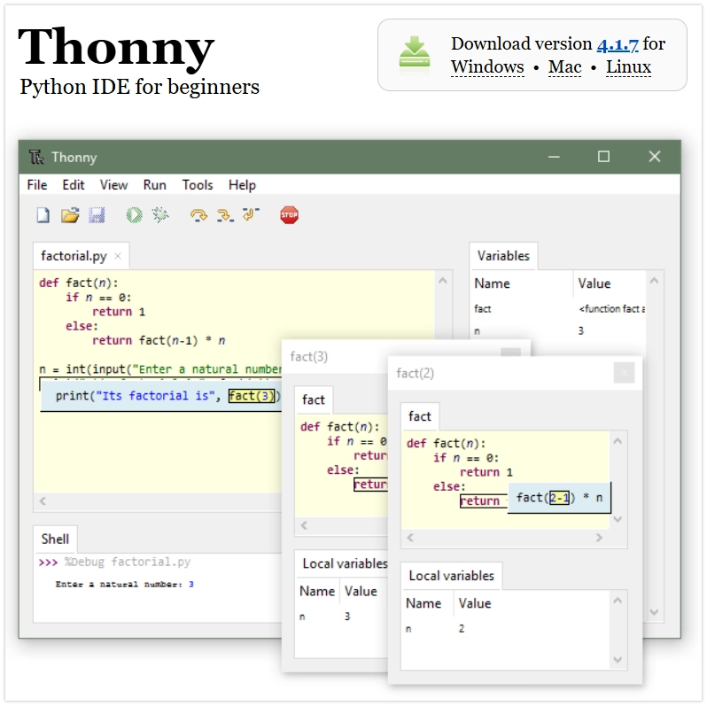](https://thonny.org/)

### 2.2 Flash MicroPython Firmware

MicroPython needs to run on its firmware, so you need to flash the corresponding firmware before first use. Please refer to the following flashing methods.

- Via ThonnyVia Thonny (Custom Firmware)Quick Web FlashingVia Espressif Flash Download Tool

Note

This method is simple and suitable for most scenarios. Thonny will automatically download the firmware.

**Connect Development Board**: Connect the ESP32 Development Board to the computer via a USB data cable.

Information

If you encounter connection timeout or flashing failure in subsequent steps, please try manually entering download mode: hold down the **BOOT** button, plug in the USB cable at the same time, and then release **BOOT** button.

-

**Configure Interpreter**: Open Thonny, click the interpreter status box in the bottom-right corner of the window (initially it may show 'Local Python'), then select `Hello, ESP32!`。

 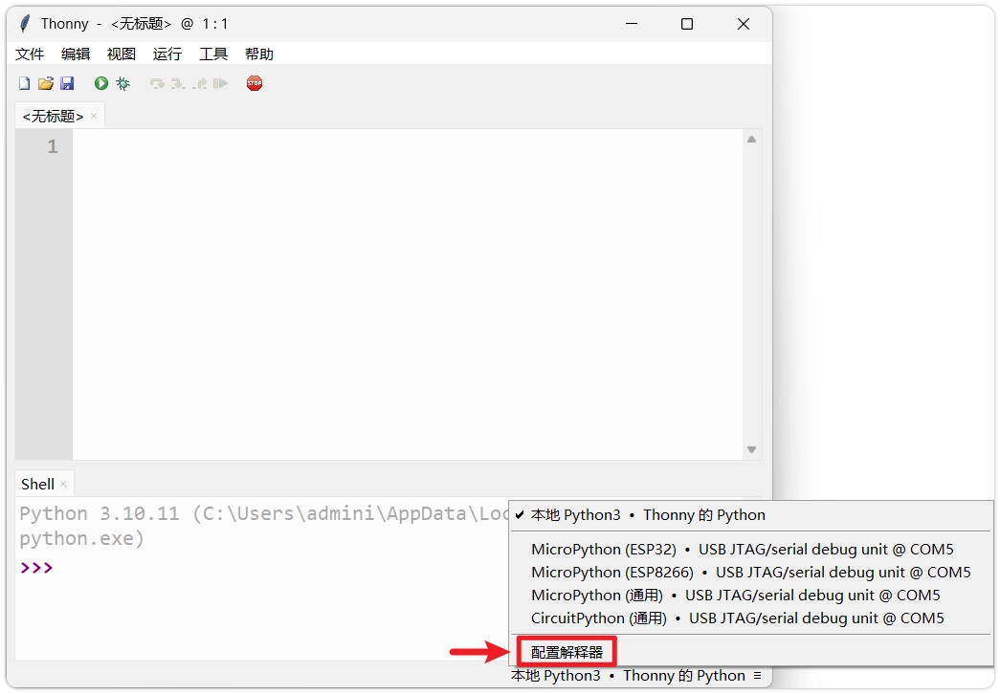

-

**Open Firmware Flashing Tool**: In the popup window, select `Hello, ESP32!`, and the port corresponding to the Development Board, then click the `Hello, ESP32!` link.

 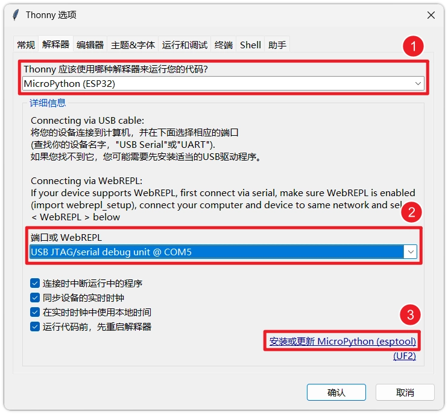

-

**Select Firmware**: In `Hello, ESP32!` window, configure the following parameters:

Information

If the interface options are grayed out and unselectable, please wait for Thonny to update the firmware list online. If the firmware list cannot be refreshed, please use  installation method.

 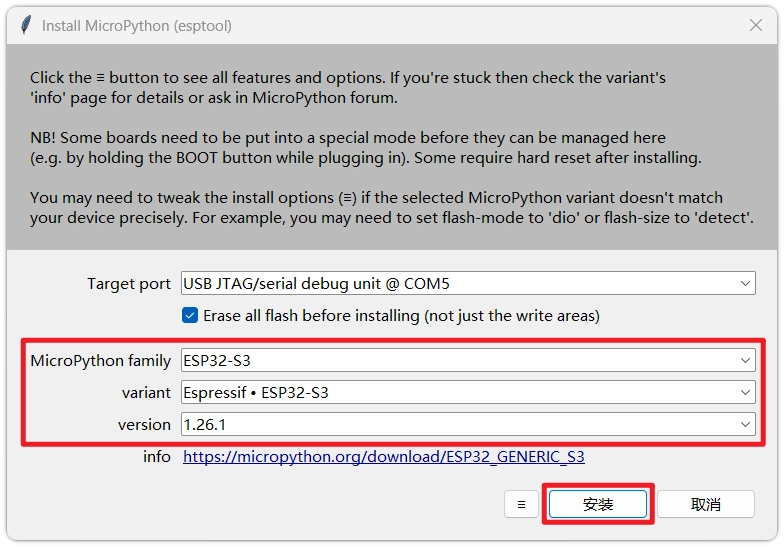

**Target port**: Select the port corresponding to the ESP32 device (if unsure, you can unplug and replug the device to observe which port disappears and reappears).
- **MicroPython family**: Select the chip model based on your actual hardware.
- **variant**: Select the generic `Hello, ESP32!`。
- **version**: It is recommended to select the latest stable version.

-

**Start Flashing**: Click `Hello, ESP32!`. Thonny will automatically erase the flash and flash the new MicroPython firmware. Wait for the progress bar to complete until `Hello, ESP32!` prompt appears.

 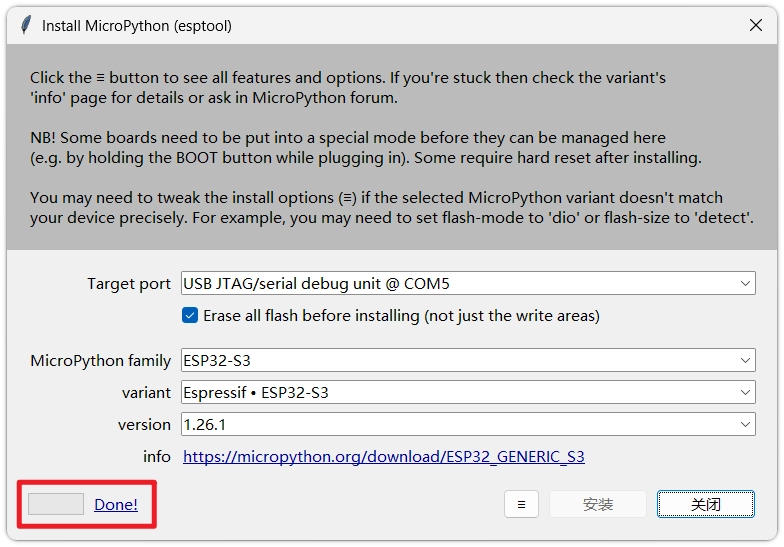

Note

When you need to flash a specific version of firmware (such as an older or beta version), you can flash local firmware through Thonny.

-

**Download Firmware**: Go to [MicroPython official website firmware download page](https://micropython.org/download/?port=esp32). Select the latest stable version corresponding to the ESP32 chip model (such as ESP32, ESP32-S2, ESP32-S3) `Hello, ESP32!` firmware and download it locally.

 

 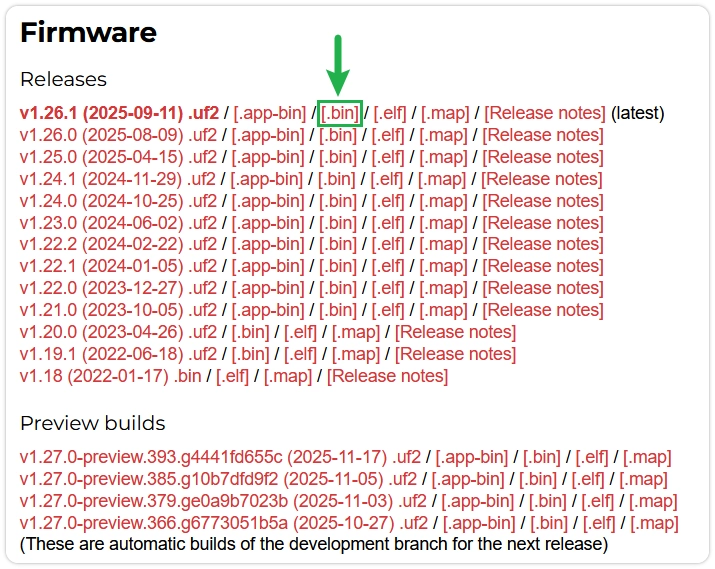

-

**Connect Development Board**: Connect the ESP32 Development Board to the computer via a USB data cable.

Information

If you encounter connection timeout or flashing failure in subsequent steps, please try manually entering download mode: hold down the **BOOT** button, plug in the USB cable at the same time, and then release **BOOT** button.

-

**Configure Interpreter**: Open Thonny, click the interpreter status box in the bottom-right corner of the window (initially it may show 'Local Python'), then select `Hello, ESP32!`。

 

-

**Open Firmware Flashing Tool**: In the popup window, select `Hello, ESP32!`, and the port corresponding to the Development Board, then click the `Hello, ESP32!` link.

 

-

**Select Local Firmware**: In `Hello, ESP32!` window, click the bottom-right `Hello, ESP32!` button, then click `Hello, ESP32!` Select the local firmware file.

 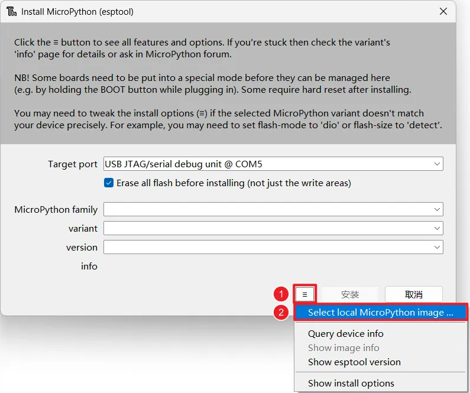

-

**Start Flashing**: Click `Hello, ESP32!`. Thonny will automatically erase the flash and flash the new MicroPython firmware. Wait for the progress bar to complete until `Hello, ESP32!` prompt appears.

 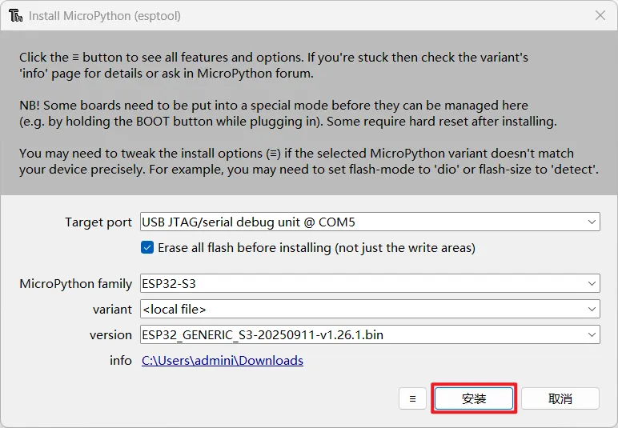

 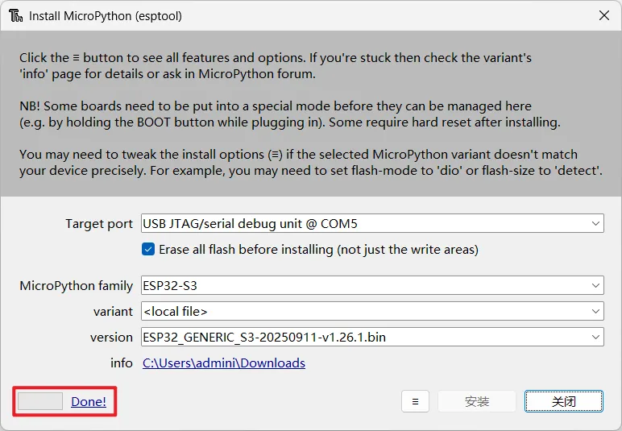

Note

Quickly flash MicroPython firmware using the following method, without installing any tools.**Please use Chrome or Edge browser to access this page.**
**This method currently only supports ESP32-S3, ESP32-C3, and ESP32-C6 Development Boards.**

Information

Please first manually put the Development Board into download mode: hold down the BOOT button on the Development Board, plug in the USB cable at the same time, and then release the BOOT button.

-

Click the button below to connect the device and start flashing MicroPython firmware.

Loading...

-

Select the corresponding serial port in the top-left corner of the browser.

 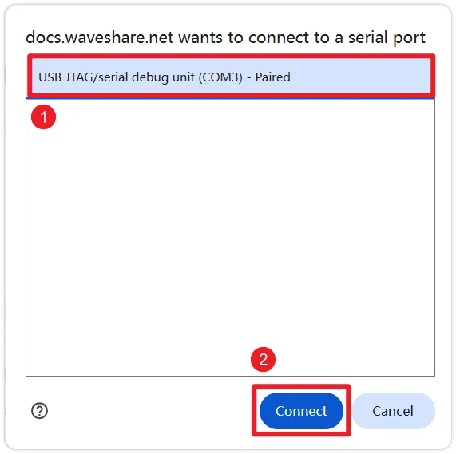

-

Click the "Install MicroPython firmware" button, and in the popup window, click the "Install" button again to confirm the firmware flashing.

 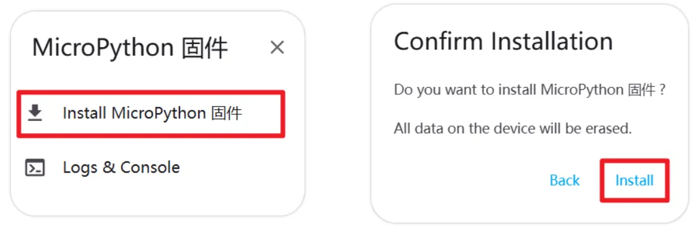

-

Wait for the flashing to complete until the "Installtion completed!" prompt appears. You can close the flashing window after it completes.

 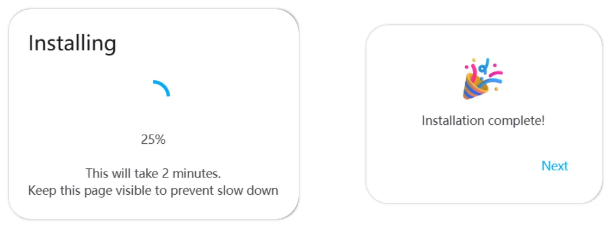

Note

When you only need to flash firmware, you can use Espressif's official flashing tool.

Information

If you encounter connection timeout or flashing failure in subsequent steps, please try manually entering download mode: hold down the **BOOT** button, plug in the USB cable at the same time, and then release **BOOT** button.

-

**Download Firmware**: Go to [MicroPython official website firmware download page](https://micropython.org/download/?port=esp32). Select the latest stable version corresponding to the ESP32 chip model (such as ESP32, ESP32-S2, ESP32-S3) `Hello, ESP32!` firmware and download it locally.

 

 

-

**Download Flashing Tool**: Download Espressif's official [Flash Download Tool](https://dl.espressif.com/public/flash_download_tool.zip)。

-

**Configure Tool**: Extract and run `Hello, ESP32!`。

 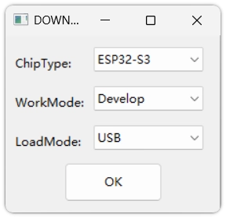

In `Hello, ESP32!` , select `Hello, ESP32!` (or the corresponding model).
- In `Hello, ESP32!` , select `Hello, ESP32!`。
- In `Hello, ESP32!` , select `Hello, ESP32!`。

For detailed descriptions of each option, please refer to:[Flash Download Tool User Guide](https://docs.espressif.com/projects/esp-test-tools/zh_CN/latest/esp32s3/production_stage/tools/flash_download_tool.html)

-

**Set Flashing File**:

 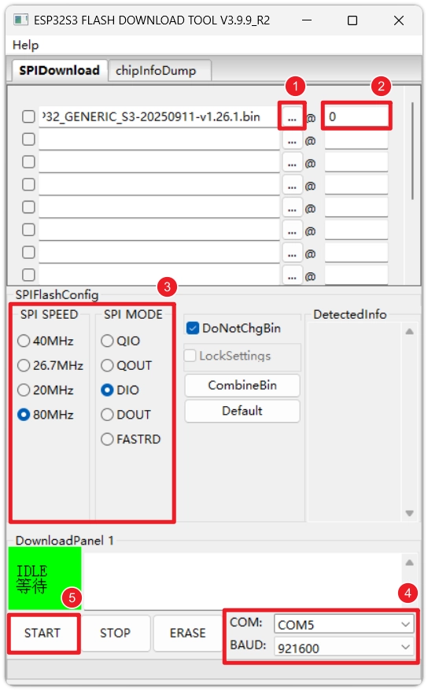

Click `Hello, ESP32!` button, and select the just downloaded `Hello, ESP32!` firmware file.

-

In the address (`Hello, ESP32!`) field, enter `Hello, ESP32!`。

Information

Please refer to the specific address description for the chip on the MicroPython official website download page (usually 0x1000 for the original ESP32, `Hello, ESP32!`, and 0x0 for S3/C3. `Hello, ESP32!`）

-

**Execute Flashing**: Select the correct `Hello, ESP32!` port, set `Hello, ESP32!` Baud rate (recommended `Hello, ESP32!` or higher to speed up), then click `Hello, ESP32!`. Wait until the bottom-right corner of the tool shows `Hello, ESP32!` which indicates that flashing is complete.

 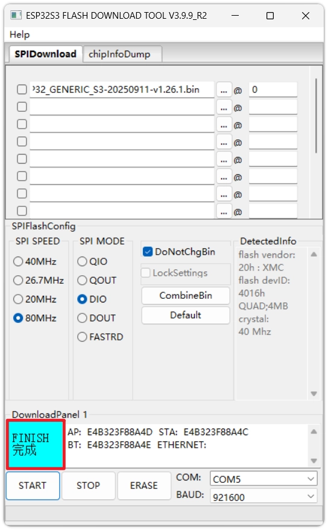

Warning

This method has many configuration options. Please make sure to confirm that the chip model, firmware file, and flashing address are correct. For daily development, Thonny is still recommended.

### 2.3 Verify Development Environment

After flashing is complete, next verify whether the environment configuration is successful.

-

**Reconnect Device**: Disconnect the ESP32 from the computer, then reconnect, and make sure the interpreter in the bottom-right corner of Thonny is set to `Hello, ESP32!` and the correct port.

Note Port Changes

After flashing the MicroPython firmware, the COM port number corresponding to the device may change (especially when using native USB interfaces like ESP32-S3/C3). If the connection fails, click the bottom-right corner to reselect the correct port.

 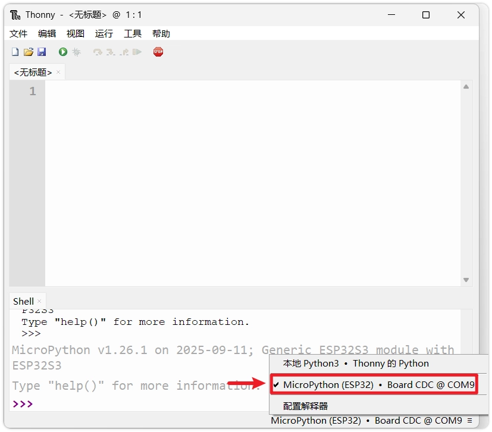

-

**Restart Interpreter**: If the bottom **Shell** window is unresponsive, you can click the red **Stop** button to restart the onboard interpreter.

 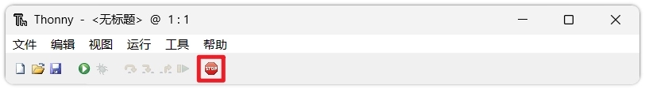

-

**Check Prompt**: After a successful connection, the Shell window should display MicroPython version information, Development Board information, and `Hello, ESP32!` prompt, which indicates that you have successfully entered the MicroPython REPL environment on the ESP32.

 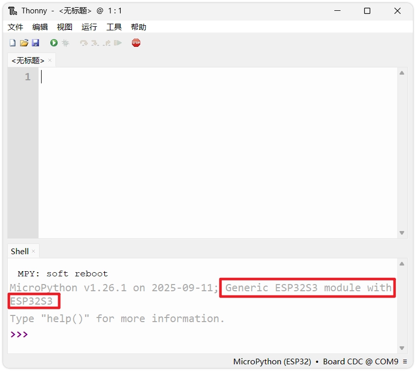

-

**Run Test Code**: In `Hello, ESP32!` prompt, enter the first line of MicroPython code, then press Enter:

```
print('Hello, ESP32!')
```

 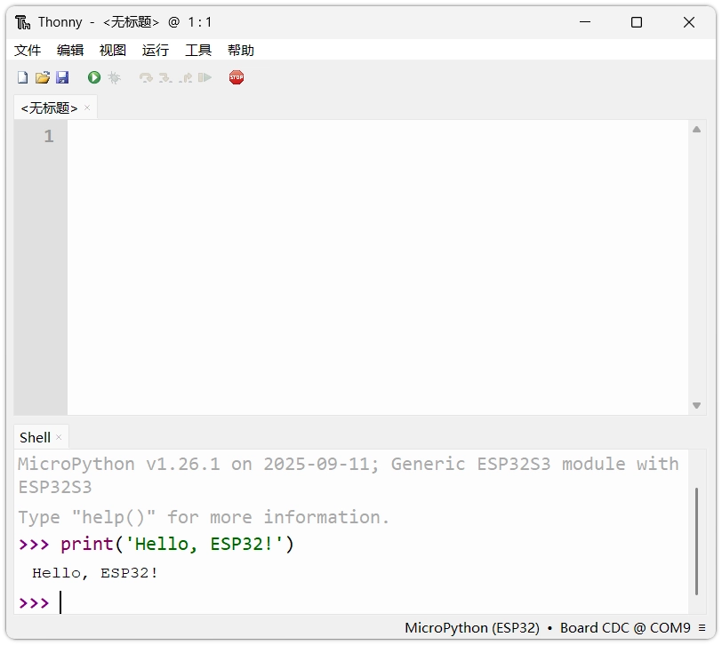

At this point, you should immediately see the ESP32 return `Hello, ESP32!` message.

At this point, the ESP32 MicroPython development environment has been set up, and the first line of code has been successfully executed.

## 3. Reference Links

- [MicroPython ESP32 Description (Github README)](https://github.com/micropython/micropython/blob/master/ports/esp32/README.md)
- [MicroPython Official Documentation](https://docs.micropython.org/en/latest/reference/index.html)
- [MicroPython GitHub Wiki](https://github.com/micropython/micropython/wiki)
- [Espressif Flash Download Tool Guide](https://docs.espressif.com/projects/esp-test-tools/zh_CN/latest/esp32s3/production_stage/tools/flash_download_tool.html)

