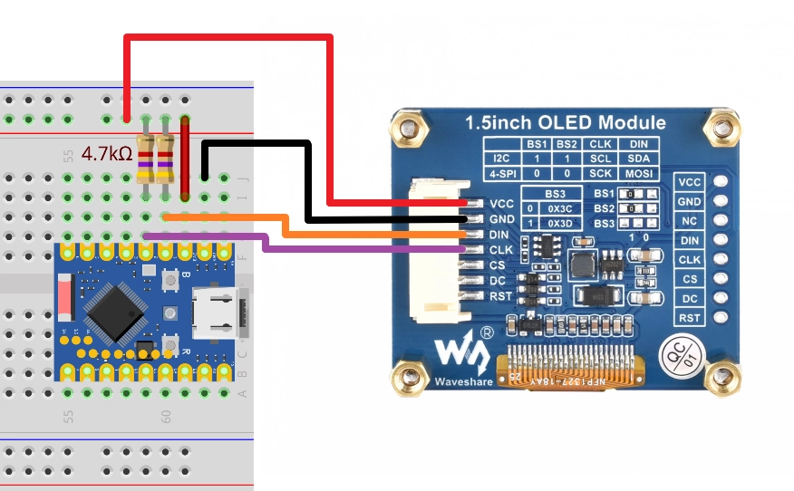
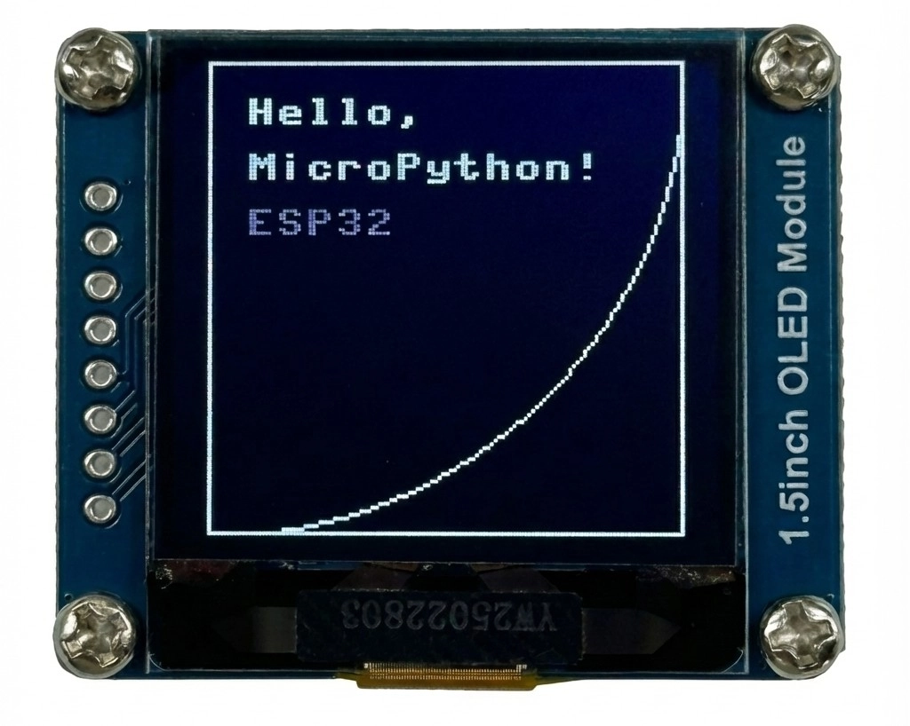

This page overview

# I2C communication

This section introduces the basic concepts of the I2C communication protocol and demonstrates how to use MicroPython's `machine.SoftI2C` class to scan I2C devices and drive OLED Displays.

**I2C（Inter-Integrated Circuit）**, also known as **I²C** Or **IIC**，is a widelyUseoftwo-wire serial communication protocol.I2C protocol allows between devicesViatwoSignal lineto communicate, oftenUsefor connectionSensors、Displays、Storagedevice/moduleetc.Peripheral。

I2C has/withYesthe followingFeatures:

-

**Two-wire communication**: Only requires two signal lines: SDA (data line) and SCL (clock line).

-

**Master-slave architecture**: Supports multiple masters (controllers) and slaves (targets) on the same bus.

Information

**[I²C specificationofseventh revision](https://www.nxp.com/docs/en/user-guide/UM10204.pdf)** has converted traditionalof “main/From (Master/Slave)” terminology updateIs “controller/target (Controller/Target)”。IsEnsureAndnow/presentYesCodeAndDocumentofcompatibility, thisTutorialsmayAccording tocontext mixingUsethese two expressions.

-

**Address addressing**: Each device has a unique 7-bit or 10-bit address.

-

**Synchronous communication**:ViaClock lineto synchronize, data transmission is more reliable.

---

The I2C bus contains the following signal lines:

- **SDA (Serial Data Line)**: Serial data line, used for data transmission
- **SCL (Serial Clock Line)**: Serial clock line, clock signal provided by the master device

When making actual hardware connections, all I2C devices also need to connect the ground wire (GND) to**ensure circuit commonGround**。

[SVG diagram]

Aboutpull-up resistor

I2C protocol specification requires SDA And SCL two lines mustYespull-up resistor. This is becauseIs I2C Bususe/adoptUseopen-drain (Open-Drain）circuit structure, device can onlySignal linepull toLowlogic level, but cannot activelyOutputHighlogic level. Pull-up resistorofas/workUseis exactlyInBuswhen idle, willSignal linepull back toHighlogic level,Ensurecommunication is normal.
**Cases where external pull-up resistors are added:**

- When making actual connections (especially when connecting external modules or for multi-board communication), it is recommended to connect a 4.7kΩ pull-up resistor from each of SDA and SCL to 3.3V to improve communication reliability.
- When the bus is long, there are many devices, or communication is unstable, external pull-up resistors must be used.

**Cases where external pull-up resistors can be omitted:**

- Many I2C modules (such as those used in this Tutorials ) has integrated pull-up resistors. When using such modules, they can usually be connected directly without adding external pull-up resistors.
- ESP32 GPIO supports internal weak pull-up, which may be sufficient for simple applications. However, the best practice is still to add external pull-up resistors to ensure stable communication.

If unsure whether the module includes pull-up resistors, it is recommended to check the module's schematic or datasheet.

## 1. I2C on ESP32

In MicroPython, I2C functionality is accessed through `machine.SoftI2C` in the module `machine.SoftI2C` class (hardware I2C) and `machine.SoftI2C` class (software I2C) to implement.

- **Hardware I2C (`machine.SoftI2C`)**: Uses the ESP32 chip's internal dedicated I2C hardware controller. It is faster and has lower CPU usage.**ESP32's hardware I2C supports mapping to any GPIO pin**。
- **Software I2C (`machine.SoftI2C`)**: Simulates I2C timing in software (bit-banging). Typically used only when hardware I2C Resources are insufficient.

**Recommended priorityUse Hardware I2C**. Since ESP32 supports pin matrix mapping, Software I2C is usually not needed.

## 2. Example 1: I2C Scanner

Connect new I2C ModuleWhen, get itsAddressIs the first step. ManyModuledoes not indicateAddress，OrAddresscanViajumper changes.I2C the scanner program canFastquickly detect and reportBuson theYesdeviceofAddress，is to perform I2C developmentAnddebugofimportantTool。

### 2.1 Build the circuit

Required components are:

-  * 1（can alsoReplace withother I2C Module）
- 4.7kΩ resistor * 2 (optional, can be omitted if the I2C module has built-in pull-up resistors)
- Breadboard * 1
- Wire
- ESP32 Development Boards

Connect the circuit according to the wiring diagram below:

ESP32-S3-Zero Pinfigure/diagram


 

Circuit diagram description

The 4.7kΩ pull-up resistors in the circuit diagram are the standard configuration for I2C. Since the one used in this Tutorials Built-in pull-up resistors are included; the circuit can still work normally without connecting these two resistors.

OLED moduleneedSwitchto I2C Interface

The Waveshare 1.5-inch OLED module ships with 4-wire SPI by default (BS1 and BS2 connected to GND), in which case I2C cannot detect the device. You need to follow  put/takeModuleback sideof BS1、BS2 resistor solder pad reconnected to VCC，Switchafter DIN that is SDA、CLK that is SCL，CS And DC Noneneeds connection, defaultAddressIs 0x3D。

|Development BoardPinOLED moduleDescription
|GPIO 1DIN(SDA)I2C data line. Connect a 4.7kΩ pull-up resistor to 3.3V as needed
|GPIO 2CLK(SCL)I2C clock line. Connect a 4.7kΩ pull-up resistor to 3.3V as needed
|3.3VVCCPower positive terminal
|GNDGNDPower negative terminal

### 2.2 Code

```
from machine import Pin, SoftI2C
# SoftI2C By CPU Analog
i2c = SoftI2C(scl=Pin(SCL_PIN), sda=Pin(SDA_PIN), freq=100000)
```

### 2.3 Code analysis

-

**`machine.SoftI2C`**:

`machine.SoftI2C`: specifiedUse I2C0 Hardwarecontroller.
- `machine.SoftI2C`, `machine.SoftI2C`: Specify the connected GPIO pin.
- `machine.SoftI2C`: Sets the communication frequency, typically 100000 (100kHz) or 400000 (400kHz).

-

**`machine.SoftI2C`**:

Scan all possible 7-bit addresses (0x08 to 0x77) on the I2C bus.
- Returns a list containing the addresses of all responding devices.

-

**`machine.SoftI2C`**:

Convert decimalAddressconversionIsHexadecimal string (For example `machine.SoftI2C`), this is the most common way to represent I2C addresses.

### 2.4 Run results

After running the code, the REPL will output the scanned device addresses. For example, for the Waveshare 1.5-inch OLED module, you will typically see the address `machine.SoftI2C`。

```
from machine import Pin, SoftI2C
# SoftI2C By CPU Analog
i2c = SoftI2C(scl=Pin(SCL_PIN), sda=Pin(SDA_PIN), freq=100000)
```

## 3. Example 2: Driving OLED Displays (SSD1327)

In practical applications, you typically don't need to write low-level I2C data transceiver code yourself; instead, you directly use libraries for specific hardware (provided by the community or manufacturers).

Tip

This code example depends on 。the/thisLibrarybased on community developers mcauser of [micropython-ssd1327](https://github.com/mcauser/micropython-ssd1327) Project.
Download link:
please put theLibraryIn `machine.SoftI2C` Upload the file to the root Table of Contents of the Development Board.

### 3.1 Prepare driver files

MicroPython Firmware usually does not have built-in specificDisplaysofDriver library。IsDrivenUse SSD1327 chipof OLED Screen, we need to manuallyAddDriver file.

Take from the downloaded library file `machine.SoftI2C` Upload to ESP deviceIn.

**Note: This file must be saved in the root Table of Contents of the ESP32's file system.**

### 3.2 Code

Ensure `machine.SoftI2C` After uploading to the Development Board, run the following code:

```
from machine import Pin, SoftI2C
# SoftI2C By CPU Analog
i2c = SoftI2C(scl=Pin(SCL_PIN), sda=Pin(SDA_PIN), freq=100000)
```

### 3.3 Code analysis

- **`machine.SoftI2C`**: Import driver library.
- **`machine.SoftI2C`**: Create the OLED object. You need to pass in the screen width, height, I2C object, and I2C address.
- **`machine.SoftI2C`**: Clear screen buffer.`machine.SoftI2C` represents black.
- **`machine.SoftI2C`**: Write text to the buffer. Note `machine.SoftI2C` ModuleBuilt-in a default font (8x8 pixel).

The first parameter is the text content to display.
- The second parameter is the x coordinate of the text.
- The third parameter is the y coordinate of the text.
- the fourthParameterisColorvalue.SSD1327 support 16-level grayscale（4-bit），therefore can be passed in 0-15 betweenofintegers to controlBrightness。15 Isbrightest,0 Isall/fullBlack。

- **About `machine.SoftI2C` Module**:

`machine.SoftI2C` The driver library is based on MicroPython's built-in `machine.SoftI2C`(Frame Buffer) module.`machine.SoftI2C` Provides a standard set of graphics drawing APIs, including drawing text, lines, rectangles, circles, and other basic shapes.
- In the code,`machine.SoftI2C` And `machine.SoftI2C` and other methods directly call `machine.SoftI2C` ofdrawingFunction。
- `machine.SoftI2C` Supporting multiple color formats and drawing operations, it is the standard tool for graphics display in MicroPython. For more drawing methods and detailed usage, please refer to [MicroPython framebuf official documentation](https://docs.micropython.org/en/latest/library/framebuf.html)。

- **`machine.SoftI2C`**: Send buffer data to the OLED screen to update the display content.**InCallthisMethodbefore, screen contentWill notchange.**

### 3.4 Run results

The OLED screen will light up, displaying 'Hello, MicroPython!' and 'ESP32', surrounded by a rectangular border.

 

## 4. constantSeeproblem/issueAndNotematters

### 4.1 Hardware I2C vs Software I2C

**Note:** ESP32's I2C pins support routing to any available pin through the GPIO matrix, so under normal circumstances**does not needUse `machine.SoftI2C`**, use directly `machine.SoftI2C` (Hardware I2C) That's it.

```
from machine import Pin, SoftI2C
# SoftI2C By CPU Analog
i2c = SoftI2C(scl=Pin(SCL_PIN), sda=Pin(SDA_PIN), freq=100000)
```

`machine.SoftI2C` Usage of and `machine.SoftI2C` identical, but it is simulated by the CPU, so it may not be as stable as hardware I2C under high-speed communication or high load.

### 4.2 About I2C Slave Mode

MicroPython's standard `machine.SoftI2C` And `machine.SoftI2C` ClassCurrently only supports**Host (controller) mode**, slave (target) mode is not supported.

## 5. Related links

- [MicroPython - I2C Document](https://docs.micropython.org/en/latest/library/machine.I2C.html)
- [MicroPython - ESP32 Reference - i2c](https://docs.micropython.org/en/latest/esp32/quickref.html#hardware-i2c-bus)
- 
- [MicroPython - framebuf library documentation](https://docs.micropython.org/en/latest/library/framebuf.html)

