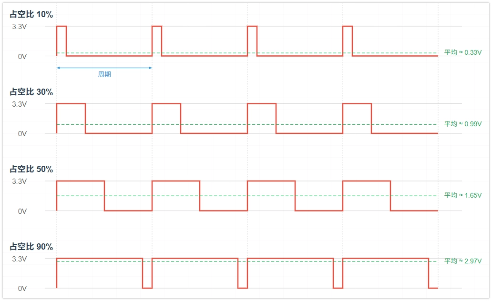
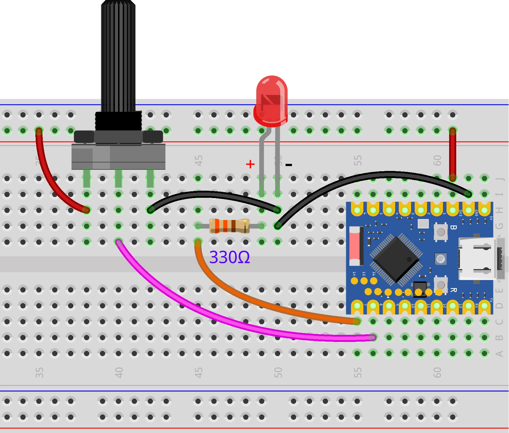

This page overview

# Pulse Width Modulation (PWM)

this section introducesPulse Width Modulation (PWM) ofbasic concepts, and demonstrate how toUse MicroPython control ESP32 of PWM Functionto adjust LED ofBrightnessand implement breathing light effect.

## 1. What is PWM?

**PWM (Pulse Width Modulation)** is a kind ofDigital signalModulation technology,Usefor "analog"Continuous changeofvoltage.

when you need to control the deviceOutputof“intensity" (For exampleadjust LED BrightnessOrmotor speed), not just simpleofopen/on/in the off state,**PWM (Pulse Width Modulation)** technology is an effective solution.

PWM Signalis essentially stillDigital signal，onlyYes HIGH And LOW Two states, butViacontrolHighLogic level durationofTime ratio, can achieveClassQuasi-analogOutputofeffect.



Core concepts of PWM include:

-

**Duty Cycle:** The percentage of time the signal is HIGH during one PWM period. The duty cycle directly affects the average output power or intensity.

different duty cycles produce differentofAverage voltage effect:

**Duty cycle 0%**: Average voltage ≈ 0V
- **Duty cycle 25%**: Average voltage ≈ 0.825V (3.3V * 0.25)
- **Duty cycle 50%**: Average voltage ≈ 1.65V (3.3V * 0.50)
- **Duty cycle 75%**: Average voltage ≈ 2.475V (3.3V * 0.75)
- **Duty cycle 100%**: Average voltage ≈ 3.3V

-

**Frequency (Frequency):** PWM SignalRepeat a complete cycle every secondofnumber of times, the unit is Hertz (Hz)。SelectsuitableofFrequencyforApplicationcrucial:for LED Dimming,Frequencyneed sufficientHighto avoid the human eye perceiving flicker; for motor control,FrequencyWill affect efficiencyAndnoise.

## 2. ESP32 on/upof PWM implement

ESP32 integrates a dedicated hardware module for generating PWM signals:

- **LEDC (LED Control) peripheral:** ESP32 ofmainly PWM Generator. Although the nameIs LED Control, but can produceGeneralof PWM Signal。According tospecificChip Model，haveYes 6 to 16 independent channels,FrequencyRange 1Hz-40MHz。

In MicroPython, this function is through `PWM.duty_u16()` class for encapsulation and invocation.

## 3. Build the circuit

Required components are:

- LED * 1
- 330Ω resistor * 1
- Breadboard * 1
- Wire
- ESP32 Development Boards

Connect the circuit according to the wiring diagram below:

ESP32-S3-Zero Pinfigure/diagram


 

## 4. REPL interaction

Enter the following commands line by line in REPL for testing:

-

**Import library and initialize PWM object**:

```
import time
from machine import Pin, PWM, ADC
# 5000 Hz is a smooth enough frequency for LED dimming
FREQUENCY = 5000
# definePin
LED_PIN = 7  # LED connectionofPin
POT_PIN = 8  # Pin connected to potentiometer
# Create a PWM object, associated with GPIO 7
led_pwm = PWM(Pin(LED_PIN), freq=FREQUENCY, duty_u16=0)
# Initialize ADC (potentiometer)
pot = ADC(Pin(POT_PIN))
while True:
    # Read potentiometerofAnalog value
    # read_u16() returns an integer between 0 and 65535, scaled from the raw value
    pot_value = pot.read_u16()
    # Settings LED Brightness
    # ADC reading range (0-65535) is consistent with the PWM setting value range (0-65535)
    # Can directly use the readofassign the value to PWM
    led_pwm.duty_u16(pot_value)
    time.sleep_ms(20)
```

View the default PWM parameters: default frequency is 5000Hz, duty cycle is 32768 (approximately 50%):

```
import time
from machine import Pin, PWM, ADC
# 5000 Hz is a smooth enough frequency for LED dimming
FREQUENCY = 5000
# definePin
LED_PIN = 7  # LED connectionofPin
POT_PIN = 8  # Pin connected to potentiometer
# Create a PWM object, associated with GPIO 7
led_pwm = PWM(Pin(LED_PIN), freq=FREQUENCY, duty_u16=0)
# Initialize ADC (potentiometer)
pot = ADC(Pin(POT_PIN))
while True:
    # Read potentiometerofAnalog value
    # read_u16() returns an integer between 0 and 65535, scaled from the raw value
    pot_value = pot.read_u16()
    # Settings LED Brightness
    # ADC reading range (0-65535) is consistent with the PWM setting value range (0-65535)
    # Can directly use the readofassign the value to PWM
    led_pwm.duty_u16(pot_value)
    time.sleep_ms(20)
```

can also be done via `PWM.duty_u16()` And `PWM.duty_u16()` method to get the current PWM parameters.

-

**Set frequency**:
Set the frequency to 10Hz. The LED blinking can be observed.

```
import time
from machine import Pin, PWM, ADC
# 5000 Hz is a smooth enough frequency for LED dimming
FREQUENCY = 5000
# definePin
LED_PIN = 7  # LED connectionofPin
POT_PIN = 8  # Pin connected to potentiometer
# Create a PWM object, associated with GPIO 7
led_pwm = PWM(Pin(LED_PIN), freq=FREQUENCY, duty_u16=0)
# Initialize ADC (potentiometer)
pot = ADC(Pin(POT_PIN))
while True:
    # Read potentiometerofAnalog value
    # read_u16() returns an integer between 0 and 65535, scaled from the raw value
    pot_value = pot.read_u16()
    # Settings LED Brightness
    # ADC reading range (0-65535) is consistent with the PWM setting value range (0-65535)
    # Can directly use the readofassign the value to PWM
    led_pwm.duty_u16(pot_value)
    time.sleep_ms(20)
```

Set the frequency to 5000Hz. Due to the persistence of vision effect, stable LED brightness can be observed.

```
import time
from machine import Pin, PWM, ADC
# 5000 Hz is a smooth enough frequency for LED dimming
FREQUENCY = 5000
# definePin
LED_PIN = 7  # LED connectionofPin
POT_PIN = 8  # Pin connected to potentiometer
# Create a PWM object, associated with GPIO 7
led_pwm = PWM(Pin(LED_PIN), freq=FREQUENCY, duty_u16=0)
# Initialize ADC (potentiometer)
pot = ADC(Pin(POT_PIN))
while True:
    # Read potentiometerofAnalog value
    # read_u16() returns an integer between 0 and 65535, scaled from the raw value
    pot_value = pot.read_u16()
    # Settings LED Brightness
    # ADC reading range (0-65535) is consistent with the PWM setting value range (0-65535)
    # Can directly use the readofassign the value to PWM
    led_pwm.duty_u16(pot_value)
    time.sleep_ms(20)
```

-

**Set duty cycle**:

Use `PWM.duty_u16()` method to set brightness. The range is 0 to 65535.

Set to maximum brightness (65535):

```
import time
from machine import Pin, PWM, ADC
# 5000 Hz is a smooth enough frequency for LED dimming
FREQUENCY = 5000
# definePin
LED_PIN = 7  # LED connectionofPin
POT_PIN = 8  # Pin connected to potentiometer
# Create a PWM object, associated with GPIO 7
led_pwm = PWM(Pin(LED_PIN), freq=FREQUENCY, duty_u16=0)
# Initialize ADC (potentiometer)
pot = ADC(Pin(POT_PIN))
while True:
    # Read potentiometerofAnalog value
    # read_u16() returns an integer between 0 and 65535, scaled from the raw value
    pot_value = pot.read_u16()
    # Settings LED Brightness
    # ADC reading range (0-65535) is consistent with the PWM setting value range (0-65535)
    # Can directly use the readofassign the value to PWM
    led_pwm.duty_u16(pot_value)
    time.sleep_ms(20)
```

-

Set to dim (1000):

```
import time
from machine import Pin, PWM, ADC
# 5000 Hz is a smooth enough frequency for LED dimming
FREQUENCY = 5000
# definePin
LED_PIN = 7  # LED connectionofPin
POT_PIN = 8  # Pin connected to potentiometer
# Create a PWM object, associated with GPIO 7
led_pwm = PWM(Pin(LED_PIN), freq=FREQUENCY, duty_u16=0)
# Initialize ADC (potentiometer)
pot = ADC(Pin(POT_PIN))
while True:
    # Read potentiometerofAnalog value
    # read_u16() returns an integer between 0 and 65535, scaled from the raw value
    pot_value = pot.read_u16()
    # Settings LED Brightness
    # ADC reading range (0-65535) is consistent with the PWM setting value range (0-65535)
    # Can directly use the readofassign the value to PWM
    led_pwm.duty_u16(pot_value)
    time.sleep_ms(20)
```

-

close LED (0):

```
import time
from machine import Pin, PWM, ADC
# 5000 Hz is a smooth enough frequency for LED dimming
FREQUENCY = 5000
# definePin
LED_PIN = 7  # LED connectionofPin
POT_PIN = 8  # Pin connected to potentiometer
# Create a PWM object, associated with GPIO 7
led_pwm = PWM(Pin(LED_PIN), freq=FREQUENCY, duty_u16=0)
# Initialize ADC (potentiometer)
pot = ADC(Pin(POT_PIN))
while True:
    # Read potentiometerofAnalog value
    # read_u16() returns an integer between 0 and 65535, scaled from the raw value
    pot_value = pot.read_u16()
    # Settings LED Brightness
    # ADC reading range (0-65535) is consistent with the PWM setting value range (0-65535)
    # Can directly use the readofassign the value to PWM
    led_pwm.duty_u16(pot_value)
    time.sleep_ms(20)
```

Use `PWM.duty_u16()` MethodSettingsBrightness。Range is 0 to 1023。

-

Set to maximum brightness (1023):

```
import time
from machine import Pin, PWM, ADC
# 5000 Hz is a smooth enough frequency for LED dimming
FREQUENCY = 5000
# definePin
LED_PIN = 7  # LED connectionofPin
POT_PIN = 8  # Pin connected to potentiometer
# Create a PWM object, associated with GPIO 7
led_pwm = PWM(Pin(LED_PIN), freq=FREQUENCY, duty_u16=0)
# Initialize ADC (potentiometer)
pot = ADC(Pin(POT_PIN))
while True:
    # Read potentiometerofAnalog value
    # read_u16() returns an integer between 0 and 65535, scaled from the raw value
    pot_value = pot.read_u16()
    # Settings LED Brightness
    # ADC reading range (0-65535) is consistent with the PWM setting value range (0-65535)
    # Can directly use the readofassign the value to PWM
    led_pwm.duty_u16(pot_value)
    time.sleep_ms(20)
```

-

Set to medium brightness (512):

```
import time
from machine import Pin, PWM, ADC
# 5000 Hz is a smooth enough frequency for LED dimming
FREQUENCY = 5000
# definePin
LED_PIN = 7  # LED connectionofPin
POT_PIN = 8  # Pin connected to potentiometer
# Create a PWM object, associated with GPIO 7
led_pwm = PWM(Pin(LED_PIN), freq=FREQUENCY, duty_u16=0)
# Initialize ADC (potentiometer)
pot = ADC(Pin(POT_PIN))
while True:
    # Read potentiometerofAnalog value
    # read_u16() returns an integer between 0 and 65535, scaled from the raw value
    pot_value = pot.read_u16()
    # Settings LED Brightness
    # ADC reading range (0-65535) is consistent with the PWM setting value range (0-65535)
    # Can directly use the readofassign the value to PWM
    led_pwm.duty_u16(pot_value)
    time.sleep_ms(20)
```

-

Set to off (0):

```
import time
from machine import Pin, PWM, ADC
# 5000 Hz is a smooth enough frequency for LED dimming
FREQUENCY = 5000
# definePin
LED_PIN = 7  # LED connectionofPin
POT_PIN = 8  # Pin connected to potentiometer
# Create a PWM object, associated with GPIO 7
led_pwm = PWM(Pin(LED_PIN), freq=FREQUENCY, duty_u16=0)
# Initialize ADC (potentiometer)
pot = ADC(Pin(POT_PIN))
while True:
    # Read potentiometerofAnalog value
    # read_u16() returns an integer between 0 and 65535, scaled from the raw value
    pot_value = pot.read_u16()
    # Settings LED Brightness
    # ADC reading range (0-65535) is consistent with the PWM setting value range (0-65535)
    # Can directly use the readofassign the value to PWM
    led_pwm.duty_u16(pot_value)
    time.sleep_ms(20)
```

## 5. Example: LED breathing light

The following code will implement a "breathing light" effect: the LED brightness will gradually increase from off to maximum brightness, then gradually decrease from maximum brightness to off, repeating in a cycle.

```
import time
from machine import Pin, PWM, ADC
# 5000 Hz is a smooth enough frequency for LED dimming
FREQUENCY = 5000
# definePin
LED_PIN = 7  # LED connectionofPin
POT_PIN = 8  # Pin connected to potentiometer
# Create a PWM object, associated with GPIO 7
led_pwm = PWM(Pin(LED_PIN), freq=FREQUENCY, duty_u16=0)
# Initialize ADC (potentiometer)
pot = ADC(Pin(POT_PIN))
while True:
    # Read potentiometerofAnalog value
    # read_u16() returns an integer between 0 and 65535, scaled from the raw value
    pot_value = pot.read_u16()
    # Settings LED Brightness
    # ADC reading range (0-65535) is consistent with the PWM setting value range (0-65535)
    # Can directly use the readofassign the value to PWM
    led_pwm.duty_u16(pot_value)
    time.sleep_ms(20)
```

**Code analysis**

-

**`PWM.duty_u16()`**:
Instantiates a PWM object. MicroPython automatically assigns an available internal ESP32 LEDC channel to the pin.

-

**`PWM.duty_u16()`**:
This is the key function for controlling brightness.

Here `PWM.duty_u16()` Represents "unsigned 16-bit integer".
- NoneRegardless of the underlyingofHardwareTimerResolutionIs how much (ESP32 usually configured withIs 13 bitOr 14 bit),MicroPython Will automatically 0-65535 ofInputvalue scaled and mapped toHardwareActually supportsofwithin the range.
- `PWM.duty_u16()` Corresponds to 0% duty cycle.
- `PWM.duty_u16()` Corresponding 100% duty cycle.

-

**`PWM.duty_u16()` Loop**:
Via `PWM.duty_u16()` Loop coordination `PWM.duty_u16()`, achieving linear and smooth brightness transitions. Adjusting the step size (e.g., `PWM.duty_u16()`) or delay time (e.g. `PWM.duty_u16()` ms) can change the breathing LED rhythm.

## 6. Extension

Try to implement: control the brightness of the LED by adjusting the potentiometer knob, so that the knob position corresponds to the LED brightness

**Wiring diagram:**
 

**Code:**

```
import time
from machine import Pin, PWM, ADC
# 5000 Hz is a smooth enough frequency for LED dimming
FREQUENCY = 5000
# definePin
LED_PIN = 7  # LED connectionofPin
POT_PIN = 8  # Pin connected to potentiometer
# Create a PWM object, associated with GPIO 7
led_pwm = PWM(Pin(LED_PIN), freq=FREQUENCY, duty_u16=0)
# Initialize ADC (potentiometer)
pot = ADC(Pin(POT_PIN))
while True:
    # Read potentiometerofAnalog value
    # read_u16() returns an integer between 0 and 65535, scaled from the raw value
    pot_value = pot.read_u16()
    # Settings LED Brightness
    # ADC reading range (0-65535) is consistent with the PWM setting value range (0-65535)
    # Can directly use the readofassign the value to PWM
    led_pwm.duty_u16(pot_value)
    time.sleep_ms(20)
```

**Code analysis:**

- **unifiedof 16 bitInterface (`PWM.duty_u16()`)**:
The design of MicroPython is reflected here. MicroPython provides `PWM.duty_u16()` interface, which returns a uniform 16-bit value (0-65535), regardless of whether the underlying ADC is 10-bit, 12-bit, or any other bit width. This makes the code more portable.

`PWM.duty_u16()` Read analog voltage (0V-3.3V) as a 16-bit integer (0-65535).
- `PWM.duty_u16()` Accepts a 16-bit integer (0-65535) to set the duty cycle.
- Therefore, we can directly pass the ADC reading to PWM.

## 7. Related links

- [MicroPython - ESP32 Quick Reference - PWM](https://docs.micropython.org/en/latest/esp32/quickref.html#pwm-pulse-width-modulation)
- [MicroPython - ESP32 PWM Tutorials](https://docs.micropython.org/en/latest/esp32/tutorial/pwm.html#esp32-pwm)
- [MicroPython - machine.PWM](https://docs.micropython.org/en/latest/library/machine.PWM.html)
- [MicroPython - esp32 machine_pwm.c](https://github.com/micropython/micropython/blob/master/ports/esp32/machine_pwm.c)

