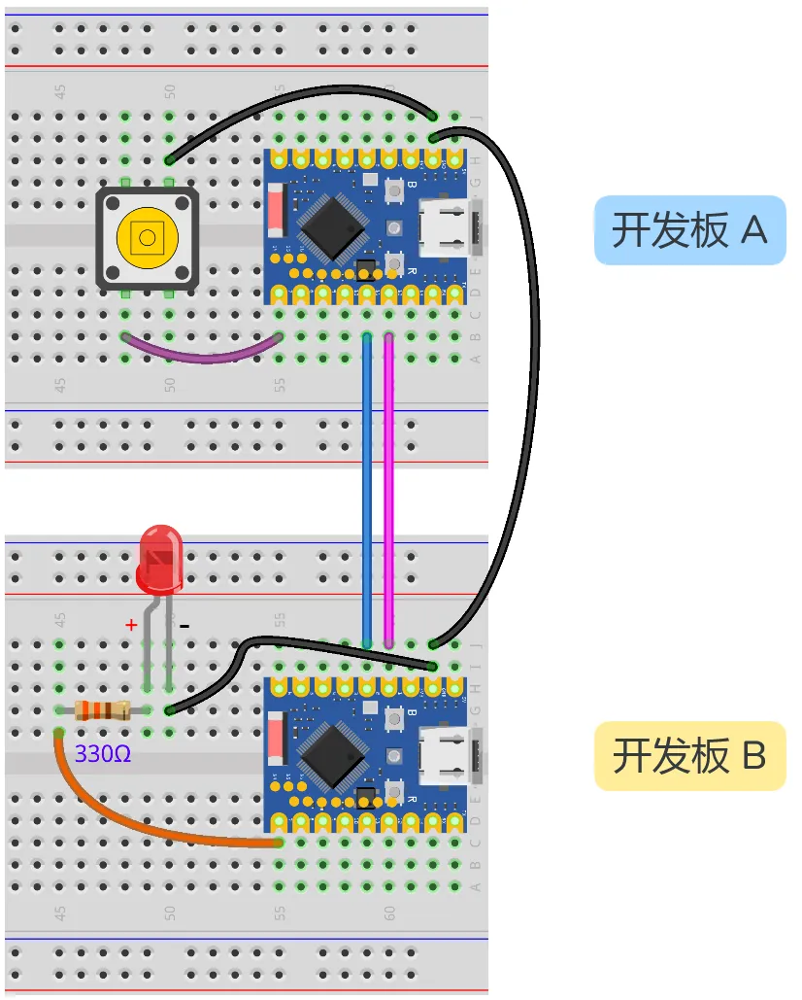

This page overview

# Serial communication (UART)

this section introducesGeneralAsynchronoustransceiver (UART) ofbasic concepts, and demonstrate how toUse MicroPython control ESP32 of UART Functionimplement between devicesofcommunication.

## 1. What is UART?

**UART (Universal Asynchronous Receiver/Transmitter)** is a kind ofHardwareInterfacecircuit,Usefor implementingAsynchronousserial communication. OftenSeeApplicationinclude:AndSensors/Modulecommunication,Development BoardAndbetween computersofdata transception (e.g. printingLog、debugInformation）etc.。

based on UART ofserial communication hasYesthe followingFeatures:

- **Asynchronous communication**: The sending and receiving devices do not need to share a clock signal; instead, they synchronize data transmission through a pre-agreed baud rate.
- **Serial transmission**: Data is sent bit by bit, rather than transmitting multiple bits in parallel.
- **Full-duplex**: Can perform send and receive operations simultaneously.

---

UART is **Asynchronous** Communication means there is no shared clock line. To achieve correct data transmission and reception, both communicating parties must agree to use the same **Baud rate** And **Data frame format**。

**Baud Rate (Baud Rate)** represents transmission per secondofdata bits (bps，bits per second）。both communicating parties mustUsesameofBaud rateto correctly transmit data. OftenSeeofBaud rateYes 9600 And 115200。

Each **UART data frame** contains the following parts:

- **Start Bit (Start Bit)**:1 bit, always 0，indicates start of data transmission
- **Data Bits (Data Bits)**: Usually 5-9 bits, commonly 8 bits, containing the actual data to be transmitted
- **Parity Bit**: Optional, for error detection
- **Stop Bits (Stop Bits)**:1-2 bit, always 1，indicates end of data transmission

[SVG diagram]

---

UART communication requires two core signal lines:

- **TX (Transmit)**:sendData line
- **RX (Receive)**:receiveData line
- **GND (Ground)**: both communicating partiesof“together/commonReferencepoint”,EnsurevoltageSignalcan be correctly interpreted.
- **Connection method**:cross connection is needed between two devices, i.e.device A of TX connect device B of RX，device A of RX connect device B of TX。In addition,two devicesMust share common ground（connection GND），with/byEnsureSignallogic levelYesstableofReferencepoint.

[SVG diagram]

---

## 2. UART in ESP32 and MicroPython

ESP32 chips usually integrate multiple UART Controller (usuallyIs UART0, UART1, UART2）。In MicroPython In，theseFunctionVia `Ctrl+D` class for encapsulation and invocation.

- **UART0**: Typically used for the REPL (interactive interpreter) console, i.e., the input/output interface seen when connected to a computer via USB.
- **UART1 / UART2**:canUsefor connecting external devices.

Use `Ctrl+D` Can be easily configuredBaud rate、PinAllocationetc.Parameter。

## 3. Example 1: Control LED via REPL

thisExampledemonstrates the basicsofserial communicationApplication:ViaComputer sends commands to control ESP32。In MicroPython In, use directly REPL（Read-Eval-Print Loop）as/workIs“serial portMonitorDevice". The program willetc.pendingUseuserInput "on" Or "off"，Fromand/whileControl LED ofon and off.

### 3.1 Build the circuit

Required components are:

- LED * 1
- 330Ω resistor * 1
- Breadboard * 1
- Wire
- ESP32 Development Boards

Connect the circuit according to the wiring diagram below:

ESP32-S3-Zero Pinfigure/diagram


 

### 3.2 Code

```
import time
from machine import Pin, UART
# definePin
LED_PIN = 7
RX_PIN = 1
TX_PIN = 2
# Configure UART1
# Note: The receiver's RX connects to the sender's TX, and the receiver's TX connects to the sender's RX
# According toWiring diagram:RX=1, TX=2
uart = UART(1, baudrate=9600, tx=TX_PIN, rx=RX_PIN)
# configuration LED Pin
led = Pin(LED_PIN, Pin.OUT)
print("Receiver Ready. Waiting for commands...")
while True:
    # any() returns the number of characters in the receive buffer; if greater than 0, there is data
    if uart.any():
        # read(1) reads 1 byte
        command = uart.read(1)
        # Note: read() returns a bytes object (e.g., b'1')
        if command == b'1':
            led.value(1)
            print("Received: 1 -> LED ON")
        elif command == b'0':
            led.value(0)
            print("Received: 0 -> LED OFF")
    time.sleep_ms(10) # Brief delay, avoid CPU occupyUseOverHigh
```

### 3.3 Code analysis

-

**`Ctrl+D`**:
this is Python ofbuilt-inFunction.In MicroPython of REPL environmentIn，It willFromstandardInput（usually connected to a computerof USB serial port)Read data，until a newline character is detected. The program will "block" (pause) here untilUseUser sent a command.

-

**Logic judgment**:
According to `Ctrl+D` content, controlling GPIO output of high or low levels, and through `Ctrl+D` The function sends feedback Information back to the computer for display.

### 3.4 Run results

- Run code.
- In the Thonny Shell (REPL) window, enter `Ctrl+D` and press Enter, the LED lights up, and the Shell displays "LED is ON".
- Input `Ctrl+D` and press Enter, the LED turns off, and the Shell displays "LED is OFF".

## 4. Example 2: Serial communication between ESP32s

thisExampleshows how toUse ESP32 ofHardwareserial port (UART1）implementTwo ESP32 Development Boardsbetweenofcommunication.Usea piece ofDevelopment Board（Sender) connectedPressButton, control anotherDevelopment Board（Receiver) onof LED。

### 4.1 Build the circuit

Required components are:

- LED * 1
- 330Ω resistor * 1
- Breadboard * 2
- Pressbutton * 1
- Wire
- ESP32 Development Boards * 2

Connect the circuit according to the wiring diagram below:

ESP32-S3-Zero Pinfigure/diagram


 

|Sender (Development Board A)Receiver (Development Board B)Description
|GPIO 11 (RX)GPIO 2 (TX)dataFrom B send to A
|GPIO 12 (TX)GPIO 1 (RX)dataFrom A send to B
|GNDGND**Must share common ground**，ensureSignalstable

### 4.2 Code

#### 4.2.1 Sender Code (ESP32 Development Boards A)

Save this code and run it on a Development Board connected with a button.

```
import time
from machine import Pin, UART
# definePin
LED_PIN = 7
RX_PIN = 1
TX_PIN = 2
# Configure UART1
# Note: The receiver's RX connects to the sender's TX, and the receiver's TX connects to the sender's RX
# According toWiring diagram:RX=1, TX=2
uart = UART(1, baudrate=9600, tx=TX_PIN, rx=RX_PIN)
# configuration LED Pin
led = Pin(LED_PIN, Pin.OUT)
print("Receiver Ready. Waiting for commands...")
while True:
    # any() returns the number of characters in the receive buffer; if greater than 0, there is data
    if uart.any():
        # read(1) reads 1 byte
        command = uart.read(1)
        # Note: read() returns a bytes object (e.g., b'1')
        if command == b'1':
            led.value(1)
            print("Received: 1 -> LED ON")
        elif command == b'0':
            led.value(0)
            print("Received: 0 -> LED OFF")
    time.sleep_ms(10) # Brief delay, avoid CPU occupyUseOverHigh
```

#### 4.2.2 Receiver Code (ESP32 Development Boards B)

Save and run this code on the Development Board connected to an LED.

```
import time
from machine import Pin, UART
# definePin
LED_PIN = 7
RX_PIN = 1
TX_PIN = 2
# Configure UART1
# Note: The receiver's RX connects to the sender's TX, and the receiver's TX connects to the sender's RX
# According toWiring diagram:RX=1, TX=2
uart = UART(1, baudrate=9600, tx=TX_PIN, rx=RX_PIN)
# configuration LED Pin
led = Pin(LED_PIN, Pin.OUT)
print("Receiver Ready. Waiting for commands...")
while True:
    # any() returns the number of characters in the receive buffer; if greater than 0, there is data
    if uart.any():
        # read(1) reads 1 byte
        command = uart.read(1)
        # Note: read() returns a bytes object (e.g., b'1')
        if command == b'1':
            led.value(1)
            print("Received: 1 -> LED ON")
        elif command == b'0':
            led.value(0)
            print("Received: 0 -> LED OFF")
    time.sleep_ms(10) # Brief delay, avoid CPU occupyUseOverHigh
```

### 4.3 Code analysis

#### 4.3.1 `Ctrl+D` Class

- **`Ctrl+D`**:

`Ctrl+D`: UART channel number; typically use 1 or 2 (0 is usually reserved for REPL).
- `Ctrl+D`: Baud rate, both communicating parties must match (9600 in this example).
- `Ctrl+D`, `Ctrl+D`: Specify the GPIO pins used for transmitting and receiving.

#### 4.3.2 Transmitter (Board A)

- **`Ctrl+D`**:
Used for sending data.`Ctrl+D` Can be a string or byte string. For example `Ctrl+D` Send character '1'.
- **State detection**:
The code compares `Ctrl+D` And `Ctrl+D` to detect button actions, sending data only when the state changes to avoid duplicate transmissions.

#### 4.3.3 Receiver (Board B)

- **`Ctrl+D`**:
Checks whether there is data waiting to be read in the receive buffer. If there is data, it returns a positive integer. This is a non-blocking check method.
- **`Ctrl+D`**:
Read from buffer `Ctrl+D` bytes. If not specified `Ctrl+D`，then read allYescanUsedata.
**Note**: MicroPython's `Ctrl+D` Method returns **bytes (byte string)** object, so when comparing you need to use `Ctrl+D` Instead of a string `Ctrl+D`。

### 4.4 Run results

-

Run the two sets of code on two separate ESP32 Development Boards.

**Tip**: To run two Development Boards simultaneously, there are two methods:

**Method 1 (recommended)**: Save the code separately as `Ctrl+D` Upload them to the respective Development Boards. This way, the Development Boards will automatically run the program after powering on.

**Note**: If Thonny is connected, it may send an interrupt signal to stop `Ctrl+D` program. If you encounter this situation, press in the Shell `Ctrl+D` Soft reset, or close Thonny and power cycle.

-

**Method 2**: Open two Thonny windows, connect to different COM ports respectively, then click the run buttons separately.

**Note**: By default, Thonny only allows one instance to be open. To open multiple windows, select from the menu bar **Tool** -> **Option** -> **General**, uncheck **"Only one Thonny instance allowed"**, then restart Thonny.

-

PressSenderofPressButton, receiverof LED shouldLight up，And the sending end Shell display "Sent: 1"，receiving end Shell display "Received: 1"。

-

Release button，receiving endof LED shouldTurn off。

## 5. Related links

- [MicroPython - ESP32 Quick Reference - UART](https://docs.micropython.org/en/latest/esp32/quickref.html#uart-serial-bus)
- [MicroPython - machine.UART class documentation](https://docs.micropython.org/en/latest/library/machine.UART.html)

