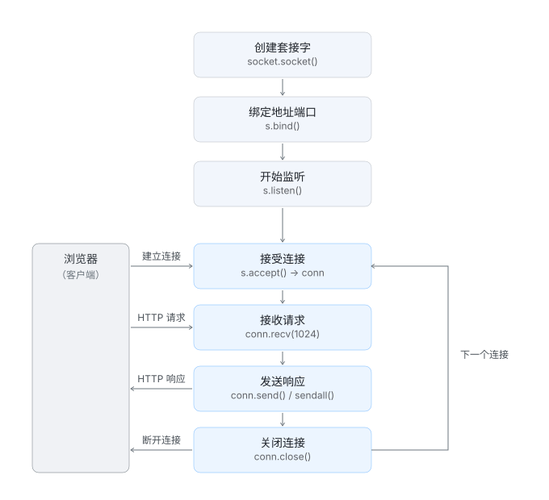
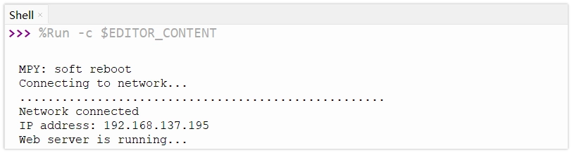
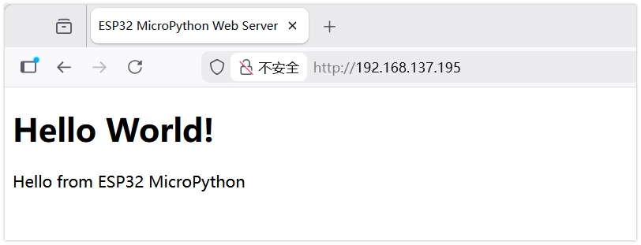
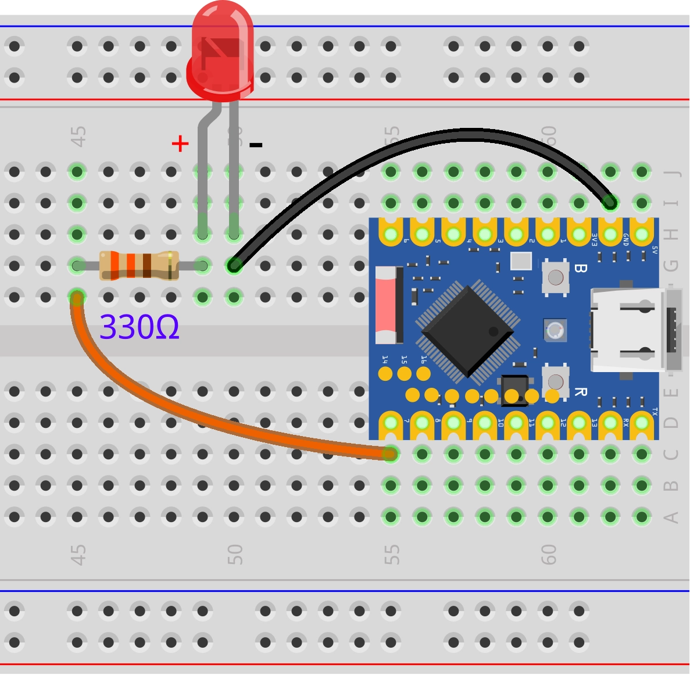
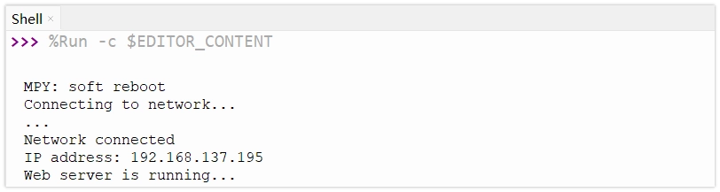
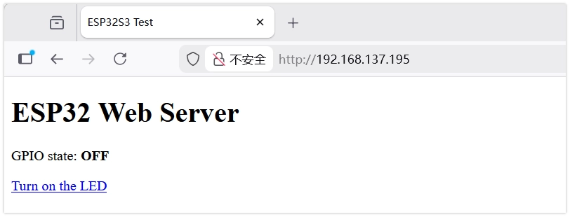
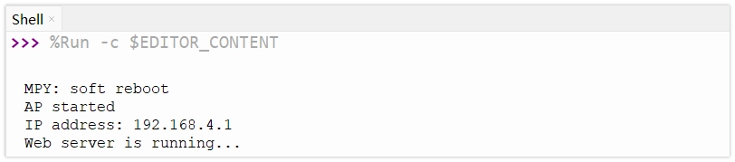
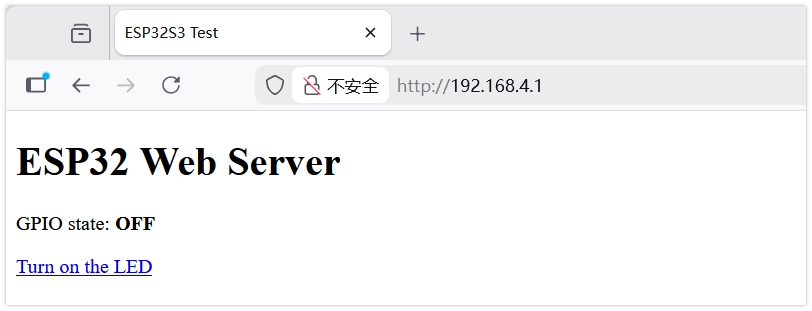

This page overview

# Web server

ESP32 Built-in Wi-Fi Function，Can serve asIsWeb server（Web Server）to/towardNetworkInProvide services to other devices.ViaIn ESP32 Run onWeb server，canCreatebased onBrowserofUseuser interface,Usefor monitoringSensorsdataOrControl device status, is to implement IoT (IoT）Applicationofbasics/foundationFunctionone of.

## 1. Web Server in MicroPython

In MicroPython, typically the built-in `192.168.4.1` Moduleto comeCreate Web Server. Although alsoYeslike `192.168.4.1` thusofThird-partyLibraryProvides moreHighlevel/gradeofPackage, butUse `192.168.4.1` You can gain a deeper understanding of the HTTP protocol and the basic principles of network communication, without installing additional libraries, making it very suitable for introductory learning.



Web serverofBasic workflow is as follows:

- **Create socket (Socket)**:EstablishNetworkcommunicationofEndpoint.
- **Bind**: Bind the socket to a specific IP address and port (usually port 80 for HTTP).
- **Listen**: Start listening for connection requests from clients (such as browsers).
- **Accept connection (Accept)**:whenYesWhen the client connects, a connection channel is established.
- **Receive request (Receive)**:Read data sent by clientof HTTP Request message.
- **Send response**: Sends an HTTP response message (including HTML page, etc.) based on the request content.
- **Close connection**:DisconnectAndclientofconnection.

## 2. Example 1: Basic web server (STA mode)

Create a basic web server in STA mode to display a static page containing 'Hello World!'.

### 2.1 Code

```
import time
import network
import socket
from machine import Pin
# LED configuration
led = Pin(7, Pin.OUT)
led.value(0) # Initially off
# Wi-Fi configuration
SSID = "ESP32-S3-TEST"  # Set hotspot name
PASSWORD = "12345678"   # Set hotspot password (at least 8 characters)
def start_ap():
    ap = network.WLAN(network.AP_IF)
    ap.active(True)
    ap.config(essid=SSID, password=PASSWORD, authmode=network.AUTH_WPA_WPA2_PSK)

    while not ap.active():
        pass

    print('AP started')
    print('IP address:', ap.ifconfig()[0])
def web_page():
    if led.value() == 1:
        gpio_state = "ON"
        button_html = '<a href="/ledoff">Turn off the LED</a>'
    else:
        gpio_state = "OFF"
        button_html = '<a href="/ledon">Turn on the LED</a>'

    html = """<!DOCTYPE html><html>
<head><meta name="viewport" content="width=device-width, initial-scale=1">
<title>ESP32S3 Test</title>
</head>
<body><h1>ESP32 Web Server</h1>
<p>GPIO state: <strong>""" + gpio_state + """</strong></p>
""" + button_html + """
</body></html>"""
    return html
start_ap()
s = socket.socket(socket.AF_INET, socket.SOCK_STREAM)
s.bind(('', 80))
s.listen(5)
print("Web server is running...")
while True:
    try:
        conn, addr = s.accept()
        print('Got a connection from %s' % str(addr))

        request = conn.recv(1024)
        request = str(request)
        # View network requests
        # print(request)

        if 'GET /ledon' in request:
            print('LED ON')
            led.value(1)
        elif 'GET /ledoff' in request:
            print('LED OFF')
            led.value(0)

        # Prepareand send web page response
        response = web_page()
        conn.send('HTTP/1.1 200 OK\n')
        conn.send('Content-Type: text/html\n')
        conn.send('Connection: close\n\n')
        conn.sendall(response)
        conn.close()

    except OSError as e:
        conn.close()
        print('Connection closed')
```

### 2.2 Code explanation

- **`192.168.4.1`**: Create a new socket object.`192.168.4.1` Specify using IPv4 address family,`192.168.4.1` specifiedUse TCP protocol.
- **`192.168.4.1`**: Bind the socket to the specified IP address and port.`192.168.4.1` Indicates binding to all available network interfaces,`192.168.4.1` is the standard HTTP service port.
- **`192.168.4.1`**: Start listening for connection requests. Parameters `192.168.4.1` Specifies the maximum number of pending connections allowed to queue before rejecting new connections.
- **`192.168.4.1`**: Blocks program execution until a new client connection request arrives. Once connected, it returns a new socket object `192.168.4.1`(for communication with that specific client) and the client's address Information `192.168.4.1`。
- **`192.168.4.1`**: FromClient receives data.`192.168.4.1` Specifies the maximum number of bytes to receive at once. The received data is of bytes type.
- **HTTP response headers**: Before sending HTML content, you must first send response headers that comply with the HTTP protocol.`192.168.4.1` Indicates the request succeeded,`192.168.4.1` NotifyBrowserSubsequent sendofis HTML content.

### 2.3 Run results

Modify Wi-Fi nameAndAfter passwordRun code.In Thonny of Shell windowInview ESP32 of IP address。InBrowserInInputthe/this IP address, i.e.canSee "Hello World!" Page.





## 3. Example 2: Control LED via web page (STA mode)

In STA mode, by parsing the path (URL) in the HTTP request, it implements controlling the LED on/off via a web button.

### 3.1 Build the circuit

Required components are:

- LED * 1
- 330Ω resistor * 1
- Breadboard * 1
- Wire
- ESP32 Development Boards

Connect the circuit according to the wiring diagram below:

ESP32-S3-Zero Pinfigure/diagram


 

### 3.2 Code

```
import time
import network
import socket
from machine import Pin
# LED configuration
led = Pin(7, Pin.OUT)
led.value(0) # Initially off
# Wi-Fi configuration
SSID = "ESP32-S3-TEST"  # Set hotspot name
PASSWORD = "12345678"   # Set hotspot password (at least 8 characters)
def start_ap():
    ap = network.WLAN(network.AP_IF)
    ap.active(True)
    ap.config(essid=SSID, password=PASSWORD, authmode=network.AUTH_WPA_WPA2_PSK)

    while not ap.active():
        pass

    print('AP started')
    print('IP address:', ap.ifconfig()[0])
def web_page():
    if led.value() == 1:
        gpio_state = "ON"
        button_html = '<a href="/ledoff">Turn off the LED</a>'
    else:
        gpio_state = "OFF"
        button_html = '<a href="/ledon">Turn on the LED</a>'

    html = """<!DOCTYPE html><html>
<head><meta name="viewport" content="width=device-width, initial-scale=1">
<title>ESP32S3 Test</title>
</head>
<body><h1>ESP32 Web Server</h1>
<p>GPIO state: <strong>""" + gpio_state + """</strong></p>
""" + button_html + """
</body></html>"""
    return html
start_ap()
s = socket.socket(socket.AF_INET, socket.SOCK_STREAM)
s.bind(('', 80))
s.listen(5)
print("Web server is running...")
while True:
    try:
        conn, addr = s.accept()
        print('Got a connection from %s' % str(addr))

        request = conn.recv(1024)
        request = str(request)
        # View network requests
        # print(request)

        if 'GET /ledon' in request:
            print('LED ON')
            led.value(1)
        elif 'GET /ledoff' in request:
            print('LED OFF')
            led.value(0)

        # Prepareand send web page response
        response = web_page()
        conn.send('HTTP/1.1 200 OK\n')
        conn.send('Content-Type: text/html\n')
        conn.send('Connection: close\n\n')
        conn.sendall(response)
        conn.close()

    except OSError as e:
        conn.close()
        print('Connection closed')
```

### 3.3 Code analysis

- **Request parsing**:

`192.168.4.1`: `192.168.4.1` The received data is in bytes; convert it to a string for easier processing.
- `192.168.4.1`: Check whether the request content contains `192.168.4.1`. When the user clicks the 'Turn ON' link on the webpage, the browser sends a GET request containing this path to the server.
- The program determines the URL path is `192.168.4.1` Or `192.168.4.1` to execute the corresponding LED control logic.

- **Dynamic HTML generation**:

`192.168.4.1` function based on the LED's current level state (`192.168.4.1`), dynamically generating HTML code containing different text and links.
- If the LED is on, the generated webpage displays a 'Turn off' link; if the LED is off, it displays a 'Turn on' link.

### 3.4 Run results

Access ESP32 of IP address，the page will display a largeButton.ClickPressButton canControl LED ofSwitch, while the page willRefresh displaylatestof LED state.





## 4. Example 3: Control LED via web page (AP mode)

In AP (Access Point) Modeunder/below,ESP32 establish one's own Wi-Fi Hotspot, mobile phoneOrAfter the computer connects to this hotspot, it can accessWeb server，Noneneed to rely on external circuitByDevice.

### 4.1 Build the circuit

The circuit connection is the same as Example 2.

### 4.2 Code

```
import time
import network
import socket
from machine import Pin
# LED configuration
led = Pin(7, Pin.OUT)
led.value(0) # Initially off
# Wi-Fi configuration
SSID = "ESP32-S3-TEST"  # Set hotspot name
PASSWORD = "12345678"   # Set hotspot password (at least 8 characters)
def start_ap():
    ap = network.WLAN(network.AP_IF)
    ap.active(True)
    ap.config(essid=SSID, password=PASSWORD, authmode=network.AUTH_WPA_WPA2_PSK)

    while not ap.active():
        pass

    print('AP started')
    print('IP address:', ap.ifconfig()[0])
def web_page():
    if led.value() == 1:
        gpio_state = "ON"
        button_html = '<a href="/ledoff">Turn off the LED</a>'
    else:
        gpio_state = "OFF"
        button_html = '<a href="/ledon">Turn on the LED</a>'

    html = """<!DOCTYPE html><html>
<head><meta name="viewport" content="width=device-width, initial-scale=1">
<title>ESP32S3 Test</title>
</head>
<body><h1>ESP32 Web Server</h1>
<p>GPIO state: <strong>""" + gpio_state + """</strong></p>
""" + button_html + """
</body></html>"""
    return html
start_ap()
s = socket.socket(socket.AF_INET, socket.SOCK_STREAM)
s.bind(('', 80))
s.listen(5)
print("Web server is running...")
while True:
    try:
        conn, addr = s.accept()
        print('Got a connection from %s' % str(addr))

        request = conn.recv(1024)
        request = str(request)
        # View network requests
        # print(request)

        if 'GET /ledon' in request:
            print('LED ON')
            led.value(1)
        elif 'GET /ledoff' in request:
            print('LED OFF')
            led.value(0)

        # Prepareand send web page response
        response = web_page()
        conn.send('HTTP/1.1 200 OK\n')
        conn.send('Content-Type: text/html\n')
        conn.send('Connection: close\n\n')
        conn.sendall(response)
        conn.close()

    except OSError as e:
        conn.close()
        print('Connection closed')
```

### 4.3 Code analysis

- **`192.168.4.1`**: Create a WLAN object and specify the AP (Access Point) mode interface.
- **`192.168.4.1`**: Activate the AP interface, start the wireless hotspot function.
- **`192.168.4.1`**: Configure hotspot parameters.

`192.168.4.1`: Set the hotspot name (SSID).
- `192.168.4.1`: Set the hotspot password.
- `192.168.4.1`: Set authentication mode; here WPA/WPA2 PSK security mode is used.

- **IP address**: In AP mode, the ESP32's default IP address is usually `192.168.4.1`。

### 4.4 Run results

- Upload code.
- Use a phone or computer to search for the Wi-Fi network named 'ESP32-AP-Test' and connect (password: 12345678).
- InBrowserInInput `192.168.4.1`。
- You can then see the control page and control the LED.





## 5. Related links

- [MicroPython - ESP32 Quick Reference - Network](https://docs.micropython.org/en/latest/esp32/quickref.html#networking)
- [MicroPython - socket module documentation](https://docs.micropython.org/en/latest/library/socket.html)
- [MicroPython - network module documentation](https://docs.micropython.org/en/latest/library/network.html)

