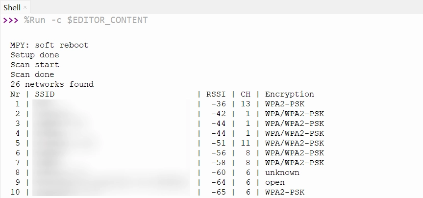
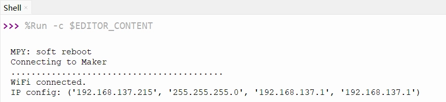
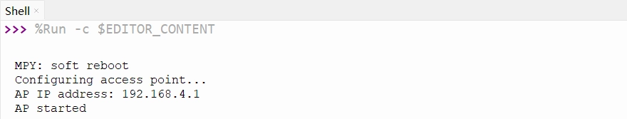

This page overview

# Wi-Fi basics/foundationUsemethod

this lesson introduces ESP32 MicroPython of Wi-Fi basics/foundationUsemethod, including scanning WiFi、connect specified WiFi、CreatehotspotAndconfigure static IP etc.Function。

ESP32 series chips have built-in powerfulofNoneline connectionFunction。most ESP32 chip integrates Wi-Fi, this makes it very suitableUsefor IoT (IoT) Project.partModelIssatisfy/meetCostOrspecificApplicationScenarioofRequirement，not integrated Wi-Fi Function。various modelsspecificofsupport status can be found in the officialof [ESP32 product overview](https://products.espressif.com/api/user/file/Espressif_SoC_Product_Portfolio.pdf) Document.

ESP32 can operate in multiple Wi-Fi modes:

- **STA Mode (Station)**:ESP32 Connect to a router or hotspot as a client.
- **AP mode (Access Point)**:ESP32 Create a hotspot, other devices can connect to it.
- **AP+STA mode**: Act simultaneously as a client connecting to a network and as a hotspot for other devices.

This Tutorials introduces the basic usage of ESP32 Wi-Fi in the MicroPython environment through the following examples:

- [Example 1: Scan WiFi](#wifi-scan)
- [Example 2: Connect to a specified Wi-Fi (STA mode)](#wifi-sta)
- [Example 3: Create a Wi-Fi hotspot (AP mode)](#wifi-ap)
- [Example 4: Configure static IP](#wifi-static-ip)

## 1. Example 1: Scan WiFi

This example demonstrates how to scan surrounding Wi-Fi networks and display their detailed Information, including network name, signal strength, channel, and encryption type.

### 1.1 Code

```
import network
SSID = "ESP32-S3-TEST"  # Set hotspot name
PASSWORD = "12345678"   # Set hotspot password (at least 8 characters)
STATIC_IP = "192.168.5.1"       # set static IP address
SUBNET = "255.255.255.0" # Set subnet mask
GATEWAY = "192.168.5.1"  # Set gateway
DNS = "192.168.5.1"      # Set DNS server
# Create a WLAN object, set to AP mode
ap = network.WLAN(network.AP_IF)
ap.active(True)
print("Configuring access point...")
# Configure static IP after activating the interface
ap.ifconfig((STATIC_IP, SUBNET, GATEWAY, DNS))
# Configure and create hotspot
ap.config(essid=SSID, password=PASSWORD)
print(f"AP IP address: {ap.ifconfig()[0]}")
print("AP started")
```

### 1.2 Code explanation

- `ap.ifconfig((STATIC_IP, SUBNET, GATEWAY, DNS))`: Create a WLAN network interface object, parameter `ap.ifconfig((STATIC_IP, SUBNET, GATEWAY, DNS))` indicates the station (Station) Mode。
- `ap.ifconfig((STATIC_IP, SUBNET, GATEWAY, DNS))`: Activate the WLAN interface. Before performing any Wi-Fi operations, the interface must be activated first.
- `ap.ifconfig((STATIC_IP, SUBNET, GATEWAY, DNS))`: executeNetworkScan. TheMethodWill block execution until scanningComplete，Returnone containing allYesDiscoveryNetworkInformationofList.EachNetworkInformationis atuple, formatIs `ap.ifconfig((STATIC_IP, SUBNET, GATEWAY, DNS))`。
- **tuple elementsDescription**:

`ap.ifconfig((STATIC_IP, SUBNET, GATEWAY, DNS))`: Network name, bytes type, need to use `ap.ifconfig((STATIC_IP, SUBNET, GATEWAY, DNS))` DecodeIsstring.
- `ap.ifconfig((STATIC_IP, SUBNET, GATEWAY, DNS))`: circuit/routeBydevice/moduleof MAC Address，byteClassmodel.
- `ap.ifconfig((STATIC_IP, SUBNET, GATEWAY, DNS))`:Wi-Fi Channel number.
- `ap.ifconfig((STATIC_IP, SUBNET, GATEWAY, DNS))`: Received Signal Strength Indicator, in dBm. This value is negative; the closer to 0, the stronger the signal.
- `ap.ifconfig((STATIC_IP, SUBNET, GATEWAY, DNS))`: EncryptionClasstype, integer value.
- `ap.ifconfig((STATIC_IP, SUBNET, GATEWAY, DNS))`: Whether it is a hidden network, boolean.

- `ap.ifconfig((STATIC_IP, SUBNET, GATEWAY, DNS))`: Helper function that converts numeric security types to human-readable strings.

Tip

A soft reset typically does not reset the Wi-Fi hardware state. If you need to fully reset Wi-Fi, it is recommended to explicitly call in code `ap.ifconfig((STATIC_IP, SUBNET, GATEWAY, DNS))` OrPerform a hard reboot.

### 1.3 Run results

After running the code, the Shell will display the list of detected available Wi-Fi networks; the output will be similar to:



## 2. Example 2: Connect to a specified Wi-Fi (STA mode)

ESP32 connects to the specified Wi-Fi network, obtains an IP address, and maintains the connection.

### 2.1 Code

```
import network
SSID = "ESP32-S3-TEST"  # Set hotspot name
PASSWORD = "12345678"   # Set hotspot password (at least 8 characters)
STATIC_IP = "192.168.5.1"       # set static IP address
SUBNET = "255.255.255.0" # Set subnet mask
GATEWAY = "192.168.5.1"  # Set gateway
DNS = "192.168.5.1"      # Set DNS server
# Create a WLAN object, set to AP mode
ap = network.WLAN(network.AP_IF)
ap.active(True)
print("Configuring access point...")
# Configure static IP after activating the interface
ap.ifconfig((STATIC_IP, SUBNET, GATEWAY, DNS))
# Configure and create hotspot
ap.config(essid=SSID, password=PASSWORD)
print(f"AP IP address: {ap.ifconfig()[0]}")
print("AP started")
```

### 2.2 Code explanation

- `ap.ifconfig((STATIC_IP, SUBNET, GATEWAY, DNS))`: Starts the connection process. This is an asynchronous function that returns immediately, while the connection proceeds in the background.
- `ap.ifconfig((STATIC_IP, SUBNET, GATEWAY, DNS))`: Returns the current Wi-Fi connection status. Returns `ap.ifconfig((STATIC_IP, SUBNET, GATEWAY, DNS))` indicates successful connection,`ap.ifconfig((STATIC_IP, SUBNET, GATEWAY, DNS))` Indicates not connected.`ap.ifconfig((STATIC_IP, SUBNET, GATEWAY, DNS))` The loop waits for connection to complete by polling this status.
- `ap.ifconfig((STATIC_IP, SUBNET, GATEWAY, DNS))`: Get network interface configuration Information, returning a tuple containing 4 elements:`ap.ifconfig((STATIC_IP, SUBNET, GATEWAY, DNS))`。

`ap.ifconfig((STATIC_IP, SUBNET, GATEWAY, DNS))`: Get the assigned IP address.

### 2.3 Run results

Change the code's `ap.ifconfig((STATIC_IP, SUBNET, GATEWAY, DNS))` And `ap.ifconfig((STATIC_IP, SUBNET, GATEWAY, DNS))` Modify to the actual Wi-Fi Information and run. The Shell will display the connection process and print the obtained IP address upon success:


## 3. Example 3: Create a Wi-Fi hotspot (AP mode)

ESP32 creates a Wi-Fi hotspot that other devices can connect to.

### 3.1 Code

```
import network
SSID = "ESP32-S3-TEST"  # Set hotspot name
PASSWORD = "12345678"   # Set hotspot password (at least 8 characters)
STATIC_IP = "192.168.5.1"       # set static IP address
SUBNET = "255.255.255.0" # Set subnet mask
GATEWAY = "192.168.5.1"  # Set gateway
DNS = "192.168.5.1"      # Set DNS server
# Create a WLAN object, set to AP mode
ap = network.WLAN(network.AP_IF)
ap.active(True)
print("Configuring access point...")
# Configure static IP after activating the interface
ap.ifconfig((STATIC_IP, SUBNET, GATEWAY, DNS))
# Configure and create hotspot
ap.config(essid=SSID, password=PASSWORD)
print(f"AP IP address: {ap.ifconfig()[0]}")
print("AP started")
```

### 3.2 Code explanation

- `ap.ifconfig((STATIC_IP, SUBNET, GATEWAY, DNS))`: Create a WLAN network interface object, parameter `ap.ifconfig((STATIC_IP, SUBNET, GATEWAY, DNS))` Indicates Access Point (AP) mode.
- `ap.ifconfig((STATIC_IP, SUBNET, GATEWAY, DNS))`: configuration AP ofParameter。`ap.ifconfig((STATIC_IP, SUBNET, GATEWAY, DNS))` Parameter to set hotspot name,`ap.ifconfig((STATIC_IP, SUBNET, GATEWAY, DNS))` Parameter sets password (at least 8 characters).

### 3.3 Run results

after the program runs,ESP32 willCreatea nameIs "ESP32-S3-TEST" of Wi-Fi Hotspot.Shell Will print out AP of IP address:


## 4. Example 4: Configure static IP

In specific application scenarios, setting a fixed IP address for the ESP32 (rather than dynamically obtaining one via DHCP) is a common requirement, making the device accessible reliably.

### 4.1 STA Mode:configure static IP

based onExample 2, Addstatic IP configuration:

```
import network
SSID = "ESP32-S3-TEST"  # Set hotspot name
PASSWORD = "12345678"   # Set hotspot password (at least 8 characters)
STATIC_IP = "192.168.5.1"       # set static IP address
SUBNET = "255.255.255.0" # Set subnet mask
GATEWAY = "192.168.5.1"  # Set gateway
DNS = "192.168.5.1"      # Set DNS server
# Create a WLAN object, set to AP mode
ap = network.WLAN(network.AP_IF)
ap.active(True)
print("Configuring access point...")
# Configure static IP after activating the interface
ap.ifconfig((STATIC_IP, SUBNET, GATEWAY, DNS))
# Configure and create hotspot
ap.config(essid=SSID, password=PASSWORD)
print(f"AP IP address: {ap.ifconfig()[0]}")
print("AP started")
```

**Code explanation**

-

`ap.ifconfig((STATIC_IP, SUBNET, GATEWAY, DNS))`: Configures the static IP of the network interface. The parameter is a tuple of 4 strings representing the IP address, subnet mask, gateway, and DNS server.

Note

Please ensure that the set IP address, gateway, and subnet mask match your local network environment, and that the IP is not occupied by other devices.

Tip

It is recommended to configure a static IP before connecting to Wi-Fi to ensure the device establishes a connection using the specified network configuration.

### 4.2 AP Mode:configure static IP

Based on Example 3, set a custom IP address for the hotspot:

```
import network
SSID = "ESP32-S3-TEST"  # Set hotspot name
PASSWORD = "12345678"   # Set hotspot password (at least 8 characters)
STATIC_IP = "192.168.5.1"       # set static IP address
SUBNET = "255.255.255.0" # Set subnet mask
GATEWAY = "192.168.5.1"  # Set gateway
DNS = "192.168.5.1"      # Set DNS server
# Create a WLAN object, set to AP mode
ap = network.WLAN(network.AP_IF)
ap.active(True)
print("Configuring access point...")
# Configure static IP after activating the interface
ap.ifconfig((STATIC_IP, SUBNET, GATEWAY, DNS))
# Configure and create hotspot
ap.config(essid=SSID, password=PASSWORD)
print(f"AP IP address: {ap.ifconfig()[0]}")
print("AP started")
```

**Code explanation**

- `ap.ifconfig((STATIC_IP, SUBNET, GATEWAY, DNS))`: After activating the AP interface, use this method to configure custom IP address, subnet mask, gateway, and DNS server.

## 6. Related links

- [MicroPython - ESP32 Quick Reference - Network](https://docs.micropython.org/en/latest/esp32/quickref.html#networking)
- [MicroPython - network module](https://docs.micropython.org/en/latest/library/network.html)
- [MicroPython - network.WLAN](https://docs.micropython.org/en/latest/library/network.WLAN.html)

