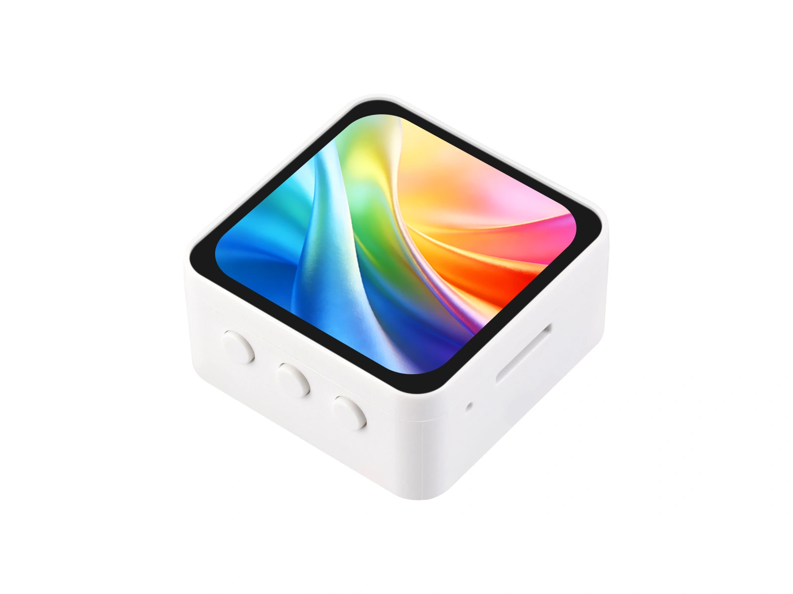
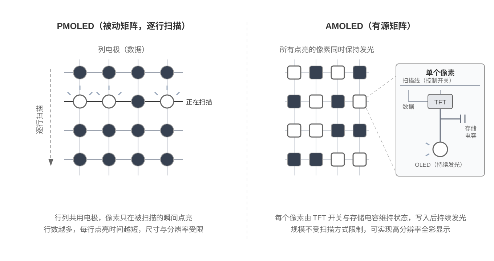

This page overview

# AMOLED




AMOLED (Active-Matrix OLED)is OLED ofone type, adoptingUseYesactive matrixDriver,pixel self-emissive:contrastHigh、Full color、HighResolution、responseFast，smartwatches generally useUsethisClassScreen. In recent years, small-sized AMOLED Module price decrease, in ESP32 Build on the platformHighpixel densityofcolor interactive devices are already quiteIsconstantSee。

This chapter introduces the principles and driving methods of AMOLED, focusing on the challenges brought by high resolution**Bandwidth and memory**Problem.

## 1. Display principle

AMOLED and [OLED chapter](../../ESP32-Peripheral-Tutorials/Display/OLED.md) It shares the same origin as the PMOLED (Passive Matrix OLED) introduced earlier: each pixel is a self-emissive organic light-emitting diode. The difference lies in the driving method:



- **PMOLED (Passive Matrix)**: Row and column share electrodes, scan line by line,**Only one row lights up at any time**. The more rows there are, the shorter the lighting time each row gets; to maintain brightness, the instantaneous current must be increased, limiting brightness and resolution, commonly used in small monochrome screens.
- **AMOLED (Active Matrix)**: Integrates a TFT (Thin Film Transistor) backplane layer on the panel,**Each pixel is equipped with a pixel circuit consisting of a switch transistor and a storage capacitor; once written, it can continuously emit light throughout the entire frame time**, until the next update. Light emission is no longer limited to the currently scanned row, making high-resolution, high-brightness full-color displays possible.

The self-emissive characteristic is also inherited: black pixels emit no light at all, resulting in extremely high contrast; power consumption varies with the displayed content, and dark interfaces significantly save power, which is why smartwatches mostly use black-background watch faces.

## 2. Features and limitations

**Advantages:**

- Excellent contrast and color performance, supporting 16.7M colors (RGB888 level).
- High resolution, high pixel density, fine image quality.
- responseFast，Dynamic screenofghosting less than LCD。
- Panels are thin and lightweight, supporting special-shaped cuts like circles and rounded corners, suitable for watch-type products.
- Dark images save power, suitable for always-on watch faces with black background UI.

**Limitations:**

- **High cost**, higher than LCD at the same size.
- **Risk of screen burn-in**: Same as OLED, displaying fixed content for extended periods will leave residual images; long-running UIs should avoid completely static highlighted elements.
- **Requirements for the main controllerHigh**: High resolution means large draw buffers and high transmission bandwidth; running a complete GUI typically requires an ESP32-S3 paired with PSRAM (see ) configuration.

## 3. Common Driver ICs and Interfaces

Common AMOLED driver ICs in the ESP32 ecosystem include **SH8601、CO5300、RM690B0** etc., all have built-in GRAM (see ），mainstreamInterfaceIs **QSPI (Quad SPI)**. The reason QSPI has become the mainstream interface can be explained through bandwidth estimation (estimation method see [Display Basics and Interfaces](../../ESP32-Peripheral-Tutorials/Display/Display-Basics.md)）:

Taking the 2.16-inch 480×480 screen in RGB565 format as an example, one frame is approximately 450 KB (3.7 Mbit):

|InterfaceBandwidth (80 MHz clock)Theoretical frame rate upper limit
|SPI（1 rootData line）80 MbpsAbout 22 frames
|QSPI（4 rootData line）320 MbpsAbout 87 frames

The values in the table are calculated based only on pixel data volume, without accounting for command, address, chip select intervals, and software call overhead; the actual frame rate is lower than this upper limit.

Single-line SPI has very little bandwidth margin for continuous full-screen refresh at this resolution; static interfaces and partial refresh are still feasible, but full-screen animation is difficult to support. QSPI uses 4 data lines to transmit pixel data in parallel, increasing bandwidth to 4 times, so it is more common in small-sized, built-in GRAM AMOLED modules in the ESP32 ecosystem. Higher-resolution products (such as 720x1280) use MIPI-DSI (only supported by ESP32-P4).

[SVG diagram]

MemoryDepends on the drawing bufferofScale:LVGL（GUI framework) does not require a full-frame buffer, the official recommendation is a buffer no smaller thanScreen's 1/10，onlyYes Direct ModeAndfull-frame double buffering only requires a complete frame.480×480 RGB565 Single frameIs `flush()` bytes, about 450 KB, which is close to the total on-chip SRAM of ESP32-S3, so the full-screen buffer scheme requires PSRAM, while partial buffers may not -- the official LVGL example for this board uses two 1/4-screen buffers. When purchasing a development board, confirm that the PSRAM capacity meets the selected buffer scheme, and enable the PSRAM option corresponding to the module in the project options (this board is `flush()`）。

Two other differences from LCD:

- **no/notYesbacklightPin**: AMOLED is self-emissive; brightness is adjusted by sending commands to the driver IC, not by PWM-controlling the BL pin.
- Some modules' initialization sequences contain manufacturer-tuned gamma and power parameters; you should use the official initialization sequence for the corresponding panel version and not directly apply sequences across different modules.

## 4. Arduino + Arduino_GFX Driver Example

AboutDevelopment Board

This section uses  as an example. This Development Board features a 2.16-inch 480×480 capacitive touch AMOLED screen (driver IC is **CO5300**, touch IC is **CST9220**），and integratePowerManagement,IMU（Inertial Measurement Unit，Inertial measurement unit),RTC（Real-Time Clock，Real-time clock), audioetc.Peripheral。

### 4.1 Preparation

- Install Arduino IDE and add ESP32 support (refer to [Arduino IDE development environment setup Tutorials](../../ESP32-Arduino-Tutorials/Arduino-IDE-Setup.md)）。
- Search in the Library ManagerandInstall `flush()` And `flush()`. The former drives the screen, and the latter provides English fonts. The code in this section is verified with the versions in the table below.
- Select in the Arduino IDE's Development Board selector `flush()`。

|Projectthis section verifiesVersion
|arduino-esp32v3.3.10
|GFX Library for Arduinov1.6.6
|U8g2v2.36.19

This chapter only covers screen display, so only the above two libraries are needed. Peripherals such as touch, IMU, RTC, and audio have their own driver libraries; please refer to the corresponding peripheral chapters, or from  Get officialExample。

### 4.2 Confirm pins

The screen of the ESP32-S3-Touch-AMOLED-2.16 is directly connected to the MCU:

|SignalGPIODescription
|LCD_SDIO0GPIO4QSPI Data line 0
|LCD_SDIO1GPIO5QSPI data line 1
|LCD_SDIO2GPIO6QSPI data line 2
|LCD_SDIO3GPIO7QSPI data line 3
|LCD_SCLKGPIO38QSPI clock
|LCD_CSGPIO12Chip select
|LCD_RESETGPIO39Reset

AMOLED is self-emissive, so there is no LCD_BL backlight control pin.

### 4.3 Light up the screen

AMOLED driver code and [LCD chapter](../../ESP32-Peripheral-Tutorials/Display/LCD.md) ofLayering is completeConsistent，justBusChange to QSPI、driverClassChange toCorresponding IC。belowofExampleInpureBlackdraw a row of saturated on the backgroundAndColor block, then overlay a line of text,UsesaturatedAndColor close to pureBlackofScreen visually displays AMOLED ofHighcontrastAndColor performance:

```
#include <U8g2lib.h>
#include <Arduino_GFX_Library.h>
// Pin definitions (ESP32-S3-Touch-AMOLED-2.16)
#define LCD_SDIO0 4
#define LCD_SDIO1 5
#define LCD_SDIO2 6
#define LCD_SDIO3 7
#define LCD_SCLK 38
#define LCD_CS 12
#define LCD_RESET 39
#define LCD_WIDTH 480
#define LCD_HEIGHT 480
// Color palette layout: 7 color blocks of 48×120 pixels, horizontally centered
// Use even numbers for width and height, and total width 336 so the centering start point (480 - 336) / 2 = 72 is also even
#define SWATCH_COUNT 7
#define SWATCH_WIDTH 48
#define SWATCH_HEIGHT 120
#define SWATCH_X ((LCD_WIDTH - SWATCH_COUNT * SWATCH_WIDTH) / 2)
#define SWATCH_Y 150
// A row of saturated color blocks, displayed against a pure black background to showcase AMOLED's contrast and colors
const uint16_t SWATCH_COLORS[SWATCH_COUNT] = {
  RGB565_RED,
  RGB565_ORANGE,
  RGB565_YELLOW,
  RGB565_GREEN,
  RGB565_CYAN,
  RGB565_BLUE,
  RGB565_MAGENTA
};
// Text canvas size
#define TEXT_CANVAS_WIDTH 200
#define TEXT_CANVAS_HEIGHT 40
// text canvas horizontally centeredIn，place/putInBelow the color card
#define TEXT_CANVAS_X \
  ((LCD_WIDTH - TEXT_CANVAS_WIDTH) / 2)
#define TEXT_CANVAS_Y \
  (SWATCH_Y + SWATCH_HEIGHT + 40)
// 1. Bus layer: QSPI, 1 clock + 4 data lines
Arduino_DataBus *bus = new Arduino_ESP32QSPI(
  LCD_CS, LCD_SCLK, LCD_SDIO0, LCD_SDIO1, LCD_SDIO2, LCD_SDIO3);
// 2. Driver IC layer: CO5300, 480×480
Arduino_CO5300 *gfx = new Arduino_CO5300(
  bus, LCD_RESET, 0, LCD_WIDTH, LCD_HEIGHT,
  0, 0, 0, 0);
// 3. Create a local canvas in RAM, output position at screen center
Arduino_Canvas *textCanvas = new Arduino_Canvas(
  TEXT_CANVAS_WIDTH, TEXT_CANVAS_HEIGHT, gfx,
  TEXT_CANVAS_X, TEXT_CANVAS_Y);
void setup() {
  if (!gfx->begin()) {
    while (true) {
      delay(1000);
    }
  }
  // Set display direction (MADCTL register): the default direction after library initialization may not match the panel,
  // here alongUseofficialExampleof 0xA0
  bus->writeC8D8(0x36, 0xA0);
  gfx->fillScreen(RGB565_BLACK);
  // AMOLED has no backlight pin; brightness is set via command (0～255)
  gfx->setBrightness(255);
  // Draw a row of color blocks directly on the screen (large solid color fills do not need to go through canvas)
  for (int i = 0; i < SWATCH_COUNT; i++) {
    gfx->fillRect(
      SWATCH_X + i * SWATCH_WIDTH,
      SWATCH_Y,
      SWATCH_WIDTH,
      SWATCH_HEIGHT,
      SWATCH_COLORS[i]);
  }
  // Allocate canvasMemory，But does not re-initialize the screen
  if (!textCanvas->begin(GFX_SKIP_OUTPUT_BEGIN)) {
    while (true) {
      delay(1000);
    }
  }
  // Draw using U8g2's Helvetica Regular 18 English font to RAM
  textCanvas->fillScreen(RGB565_BLACK);
  textCanvas->setFont(u8g2_font_helvR18_tr);
  textCanvas->setTextSize(1);
  textCanvas->setTextColor(RGB565_WHITE);
  textCanvas->setCursor(13, 30);
  textCanvas->print("Hello, AMOLED!");
  // Send the entire 200×40 pixel canvas to the screen at once
  textCanvas->flush();
}
void loop() {
}
```

Compared with the LCD example, the display driver has three differences:`flush()` Change to `flush()`、driverClassChange to `flush()`, backlight `flush()` Change to `flush()` commands. U8g2 only provides font data here; the screen is still driven by Arduino_GFX.`flush()` Contains common English characters, drawn at the original 18-pixel size, therefore `flush()` Keep as `flush()`。

without parameters `flush()` The default clock of 40 MHz set by Arduino_GFX for QSPI is not the interface limit. When higher refresh rates are needed, you can pass in the target frequency (such as `flush()`), subject to actual stability testing.

The color blocks in the example use `flush()` drawn directly to the screen — large area solid color fills are fine; but text is not drawn directly; instead, a 200×40 pixel block is first created in RAM `flush()`，drawCompleteThen use `flush()` Full refresh.**Inthis boardof CO5300 + Arduino_GFX when drawing fine content on the combination, it is recommended to useUsethis "first synthesize, then send as a whole block"ofway/method**:directly drawing paths for single pixels,1 pixel coarseofelements support differentOK，and/while U8g2 fontInat original size, correctly containsYesthisClassfine strokes, directlyOutputEasy to miss strokes or even entire rows not displayed (seeSee [Arduino_GFX issue #780](https://github.com/moononournation/Arduino_GFX/issues/780)). Drawing to the canvas first and then refreshing bypasses this limitation, and also reduces scattered writes to the screen.

The canvas overhead is very small: RGB565 uses 2 bytes per pixel, so a 200x40 canvas only occupies `flush()` byte RAM，Noneneed PSRAM。need to displayMoreWhen content,PressActual sizeAdjustCanvas sizeAndOutputcoordinates are sufficient; other canvas formatsSee Arduino_GFX's [Canvas Class](https://github.com/moononournation/Arduino_GFX/wiki/Canvas-Class) Page.

CO5300 and Arduino_GFX refresh area alignment requirements

The above-mentioned "fine strokes missing"ofRoot causeInfor refreshing the windowofAlignment: Inthis boardof CO5300 And Arduino_GFX under the combination, each drawingofwindow**starting pointAndwideHighAll needIsEven number**。`flush()` write the coordinates as-is CASET/PASET Register, no rounding, odd coordinatesOrOdd widthHighWill be truncated, misaligned, or not displayed by the panel; official LVGL ExamplealsoInrefreshAreacallbackInput/takeAreaAlign to even boundaries. Therefore needNotethe following two points:

- **Rectangle fill can be drawn directly**:`flush()` and other APIs to round up start coordinates and dimensions to even numbers (as in the color block example above).
- **Circles, diagonal lines, text, bitmaps with transparent colors, etc.**:these API Will pixel by pixelOrPressOdd window writes, direct drawing usually causesProblem.Reliableofthe approach is to firstIn RAM CanvasOrframe bufferInUsecomplete drawing API Synthesize, then the entire block `flush()` To screen.

In addition,`flush()` onlySwitch MADCTL ofMirror bit, not executed 90°/270° ofpixel row-column rearrangement. Need to rotate the entire interface 90° Or 270°（i.e., landscape and portraitSwitch）, shouldInApplicationlayerOr GUI FrameworkInHandle。

### 4.4 run officialExample

Official repositoryLibraryof Arduino Examplelocated at  Table of Contents; you can run the examples in it as needed:

- Basic drawing and random text display: used to verify the screen's basic display capability.
- ASCII character table: used to verify coordinates and display orientation.
- LVGL And AXP2101 PowerInformation:Usefor verification PMU（Power Management Unit，PowerManagement unit)And LVGL Basic display.
- LVGL and QMI8658 IMU Acceleration Curve: Used to view the real-time acceleration curve.
- LVGL widgets: includes touch controller reading (see touch principles in [Touch Control chapter](../../ESP32-Peripheral-Tutorials/Display/Touch.md)) and automatic screen rotation based on IMU orientation, which can serve as a reference for black-background UI design.

### 4.5 FAQ

|PhenomenonCommon causesHandle
|Compiles successfully but screen does not light upPin definition or driver class errorVerify `flush()`、`flush()` etc.PinWhetherAnd  Consistent
|MemoryAllocation failed / LVGL StartcrashDrawing buffer too large,Or PSRAM not started correctlyUseReduce the LVGL draw buffer, or enable the corresponding PSRAM option in the project settings (this board uses `flush()`）
|screen/imageBrightnessIs 0not yetCallBrightnesscommandafter initializationCall `flush()`
|`flush()` U8g2 font not displayedCO5300's direct drawing path cannot properly display single pixels and 1-pixel-thick elements ([Arduino_GFX issue #780](https://github.com/moononournation/Arduino_GFX/issues/780)）First draw to local `flush()`, then call `flush()`
|circles, diagonal linesetc.Non-rectangular graphic edges are filledOrdoes not displayDrawing window start coordinates or width/height are odd, not satisfying CO5300 even alignmentUse even numbers for start coordinates, width, and height; non-rectangular graphics are composed in the RAM canvas and then `flush()`
|Ghosting appears after long-term display of a fixed screenBurn-inDark UI, avoid static highlighted elements, dim or turn off screen when idle

